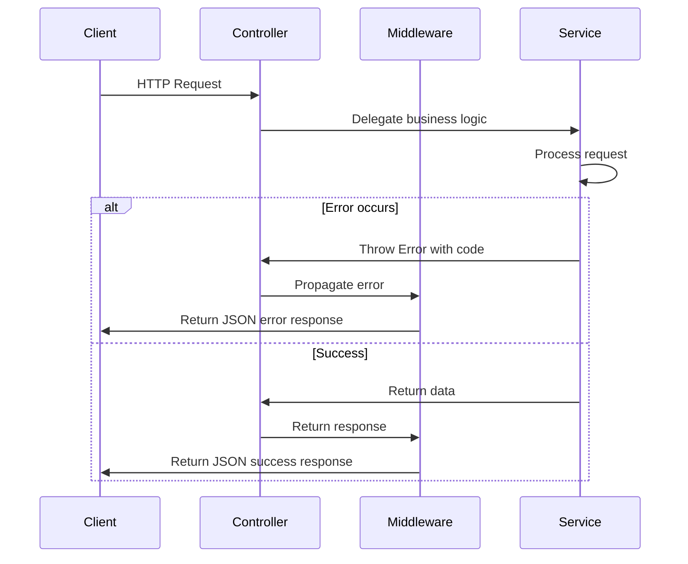
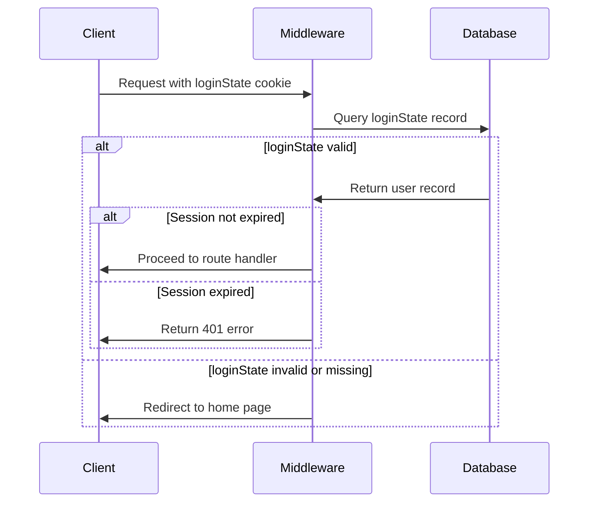

# API Reference

<cite>
**Referenced Files in This Document**   
- [home.ts](file://src/controller/home.ts)
- [login.ts](file://src/controller/login.ts)
- [register.ts](file://src/controller/register.ts)
- [goods.ts](file://src/controller/goods.ts)
- [proxy.ts](file://src/controller/proxy.ts)
- [loginStateCheck.ts](file://src/middleware/loginStateCheck.ts)
- [errorCatch.ts](file://src/middleware/errorCatch.ts)
- [errorCode.ts](file://src/errorCode.ts)
- [login.ts](file://src/service/login.ts)
- [register.ts](file://src/service/register.ts)
- [goods.ts](file://src/service/goods.ts)
- [hunterRouteService.ts](file://src/service/hunterRouteService.ts)
- [proxy.ts](file://src/service/proxy.ts)
- [types.ts](file://src/types.ts)
- [const.ts](file://src/const.ts)
</cite>

## Table of Contents
1. [Introduction](#introduction)
2. [Authentication Endpoints](#authentication-endpoints)
3. [Goods Monitoring Endpoints](#goods-monitoring-endpoints)
4. [Proxy Endpoints](#proxy-endpoints)
5. [Home Endpoint](#home-endpoint)
6. [Error Handling](#error-handling)
7. [Authentication and Middleware](#authentication-and-middleware)
8. [Security Practices](#security-practices)
9. [Request and Response Formats](#request-and-response-formats)
10. [Adding New Endpoints](#adding-new-endpoints)

## Introduction

The goods_hunter application provides a RESTful API for monitoring goods across multiple e-commerce platforms including Mercari, Yahoo Auctions, and Surugaya. The API supports user authentication, goods monitoring task management, and proxy services for image retrieval. This documentation details all public HTTP endpoints, their parameters, authentication requirements, and response formats.

The API follows a controller-service pattern where controllers handle HTTP requests and delegate business logic to service classes. Authentication is enforced via middleware for protected endpoints. All responses follow a standardized format with error codes defined in the errorCode.ts file.

**Section sources**
- [home.ts](file://src/controller/home.ts#L1-L27)
- [login.ts](file://src/controller/login.ts#L1-L38)
- [register.ts](file://src/controller/register.ts#L1-L44)

## Authentication Endpoints

### POST /login

Authenticates a user and sets a login state cookie.

**Request Parameters**
- Body:
  - `email` (string, required): User's email address
  - `password` (string, required): User's password

**Authentication**: None (public endpoint)

**Response**: Sets a `loginState` cookie on success. No JSON response body.

**Error Codes**
- `040001`: Invalid request body (missing email or password)
- `030301`: Wrong email or password

**curl Example**
```bash
curl -X POST http://localhost:3000/login \
  -H "Content-Type: application/json" \
  -d '{"email": "user@example.com", "password": "password123"}'
```

**Section sources**
- [login.ts](file://src/controller/login.ts#L1-L38)
- [loginService.ts](file://src/service/login.ts#L1-L48)

### POST /register

Initiates user registration by sending a verification email.

**Request Parameters**
- Body:
  - `email` (string, required): User's email address
  - `password` (string, required): User's password

**Authentication**: None (public endpoint)

**Response**: Sends a verification email to the system owner with a confirmation link.

**Error Codes**
- `040001`: Invalid request body (missing email or password)

**curl Example**
```bash
curl -X POST http://localhost:3000/register \
  -H "Content-Type: application/json" \
  -d '{"email": "newuser@example.com", "password": "password123"}'
```

### GET /register/confirm

Confirms user registration with a verification code.

**Request Parameters**
- Query:
  - `code` (string, required): Verification code sent via email

**Authentication**: None (public endpoint)

**Response**: Completes registration and sends welcome email to user.

**Error Codes**
- `040001`: Invalid request body (missing code)
- `030402`: Invalid verification code
- `030401`: User already exists

**curl Example**
```bash
curl -X GET "http://localhost:3000/register/confirm?code=uuid-here"
```

**Section sources**
- [register.ts](file://src/controller/register.ts#L1-L44)
- [registerService.ts](file://src/service/register.ts#L1-L77)

## Goods Monitoring Endpoints

These endpoints require authentication via the `loginState` cookie and are protected by the `loginStateCheck` middleware.

### POST /goods/registerGoodsWatcher

Creates a new goods monitoring task.

**Request Parameters**
- Body:
  - `type` (string, required): Platform type ("Mercari", "Yahoo", or "Surugaya")
  - `schedule` (string, required): CRON expression for monitoring frequency
  - `freezeStart` (string, optional): HH:MM format for daily freeze start time
  - `freezeEnd` (string, optional): HH:MM format for daily freeze end time
  - `searchCondition` (object, required): Search parameters including `keyword`

**Authentication**: Required (via loginState cookie)

**Response**: 200 on success

**Validation Rules**
- `type` must be one of the values in CONST.HUNTERTYPE
- `schedule` must be a valid CRON expression
- `freezeStart` and `freezeEnd` must be valid time strings (HH:MM format)
- `searchCondition.keyword` is required

**Error Codes**
- `040001`: Invalid request body
- `030503`: Task permission denied (user doesn't own task)
- `030502`: Task not found

**curl Example**
```bash
curl -X POST http://localhost:3000/goods/registerGoodsWatcher \
  -H "Content-Type: application/json" \
  -d '{
    "type": "Mercari",
    "schedule": "0 */30 * * * *",
    "searchCondition": {
      "keyword": "anime figure"
    },
    "freezeStart": "02:00",
    "freezeEnd": "06:00"
  }'
```

**Section sources**
- [goods.ts](file://src/controller/goods.ts#L33-L74)
- [hunterRouteService.ts](file://src/service/hunterRouteService.ts#L114-L141)

### GET /goods/unregisterGoodsWatcher

Deletes a goods monitoring task.

**Request Parameters**
- Query:
  - `id` (string, required): Task ID to delete
  - `type` (string, required): Platform type ("Mercari", "Yahoo", or "Surugaya")

**Authentication**: Required (via loginState cookie)

**Response**: 200 on success

**Error Codes**
- `040001`: Invalid request body (missing id or invalid type)
- `030502`: Task not found
- `030503`: Task permission denied

**curl Example**
```bash
curl -X GET "http://localhost:3000/goods/unregisterGoodsWatcher?id=task123&type=Mercari"
```

**Section sources**
- [goods.ts](file://src/controller/goods.ts#L76-L86)
- [goods.ts](file://src/service/goods.ts#L37-L54)

### GET /goods/listGoodsWatcher

Retrieves all monitoring tasks for the authenticated user.

**Request Parameters**: None

**Authentication**: Required (via loginState cookie)

**Response**: Array of task objects with details including ID, type, schedule, and search conditions.

**Error Codes**: None (returns empty array if no tasks exist)

**curl Example**
```bash
curl -X GET http://localhost:3000/goods/listGoodsWatcher
```

**Section sources**
- [goods.ts](file://src/controller/goods.ts#L88-L93)
- [goods.ts](file://src/service/goods.ts#L57-L62)

### POST /goods/updateGoodsWatcher

Updates an existing monitoring task.

**Request Parameters**
- Body:
  - `id` (string, required): Task ID to update
  - `type` (string, required): Platform type
  - `searchCondition` (object, required): Updated search parameters
  - `schedule` (string, required): Updated CRON expression
  - `freezeStart` (string, optional): Updated freeze start time
  - `freezeEnd` (string, optional): Updated freeze end time

**Authentication**: Required (via loginState cookie)

**Response**: 200 on success

**Error Codes**
- `040001`: Invalid request body
- `030201`: CRON job not found

**curl Example**
```bash
curl -X POST http://localhost:3000/goods/updateGoodsWatcher \
  -H "Content-Type: application/json" \
  -d '{
    "id": "task123",
    "type": "Mercari",
    "searchCondition": {
      "keyword": "rare collectible"
    },
    "schedule": "0 */15 * * * *",
    "freezeStart": "03:00",
    "freezeEnd": "07:00"
  }'
```

**Section sources**
- [goods.ts](file://src/controller/goods.ts#L117-L147)
- [hunterRouteService.ts](file://src/service/hunterRouteService.ts#L83-L99)

### GET /goods/ignoreGood

Adds a good to the user's ignore list.

**Request Parameters**
- Query:
  - `iv` (string, required): Initialization vector for decryption
  - `message` (string, required): Encrypted message containing good ID
  - `digest` (string, required): Message authentication code

**Authentication**: Required (via loginState cookie)

**Response**: 200 on success

**Error Codes**
- `040001`: Invalid request body (missing parameters)
- `030601`: Message corrupted
- `030602`: Message already consumed

**curl Example**
```bash
curl -X GET "http://localhost:3000/goods/ignoreGood?iv=abc123&message=encrypted&digest=hash123"
```

**Section sources**
- [goods.ts](file://src/controller/goods.ts#L95-L106)
- [hunterRouteService.ts](file://src/service/hunterRouteService.ts#L64-L71)

### POST /goods/cancelGoodIgnore

Removes a good from the user's ignore list.

**Request Parameters**
- Body:
  - `digest` (string, required): Message authentication code
  - `data` (object, required):
    - `iv` (string, required): Initialization vector
    - `message` (string, required): Encrypted message

**Authentication**: Required (via loginState cookie)

**Response**: 200 on success

**Error Codes**
- `040001`: Invalid request body
- `030601`: Message corrupted
- `030602`: Message already consumed

**curl Example**
```bash
curl -X POST http://localhost:3000/goods/cancelGoodIgnore \
  -H "Content-Type: application/json" \
  -d '{
    "digest": "hash123",
    "data": {
      "iv": "abc123",
      "message": "encrypted"
    }
  }'
```

**Section sources**
- [goods.ts](file://src/controller/goods.ts#L108-L115)
- [hunterRouteService.ts](file://src/service/hunterRouteService.ts#L73-L81)

## Proxy Endpoints

### GET /proxy/getImage

Retrieves an image through a proxy service with decryption.

**Request Parameters**
- Query:
  - `iv` (string, required): Initialization vector for decryption
  - `message` (string, required): Encrypted image URL
  - `digest` (string, required): Message authentication code

**Authentication**: None (public endpoint)

**Response**: Image data with Content-Type: image/webp

**Error Codes**
- `040001`: Invalid request body (missing parameters)
- `030701`: Invalid image URL

**curl Example**
```bash
curl -X GET "http://localhost:3000/proxy/getImage?iv=abc123&message=encrypted&digest=hash123"
```

**Section sources**
- [proxy.ts](file://src/controller/proxy.ts#L12-L16)
- [proxy.ts](file://src/service/proxy.ts#L22-L27)

## Home Endpoint

### GET /

Serves the home page (login/dashboard).

**Request Parameters**: None

**Authentication**: None (public endpoint)

**Response**: HTML page with login form

**curl Example**
```bash
curl http://localhost:3000/
```

**Section sources**
- [home.ts](file://src/controller/home.ts#L16-L25)

## Error Handling

The API uses a standardized error response format with numeric error codes. All errors are handled by the `errorCatch` middleware which transforms thrown errors into appropriate HTTP responses.



**Diagram sources**
- [errorCatch.ts](file://src/middleware/errorCatch.ts#L1-L51)
- [login.ts](file://src/controller/login.ts#L1-L38)

**Section sources**
- [errorCatch.ts](file://src/middleware/errorCatch.ts#L1-L51)
- [errorCode.ts](file://src/errorCode.ts#L1-L75)

## Authentication and Middleware

The API uses cookie-based authentication with the `loginStateCheck` middleware protecting most endpoints.



**Diagram sources**
- [loginStateCheck.ts](file://src/middleware/loginStateCheck.ts#L1-L54)
- [loginService.ts](file://src/service/login.ts#L20-L35)

**Section sources**
- [loginStateCheck.ts](file://src/middleware/loginStateCheck.ts#L1-L54)
- [login.ts](file://src/controller/login.ts#L22-L36)

## Security Practices

The application implements several security measures:

1. **Password Hashing**: Passwords are hashed using SHA-256 before storage
2. **Session Management**: Login states are stored in the database with expiration times (1 week)
3. **Input Validation**: All request parameters are validated before processing
4. **CSRF Protection**: Sensitive operations require proper authentication state
5. **Message Integrity**: Encrypted messages include digest verification
6. **Rate Limiting**: Not explicitly implemented in current codebase

The registration process uses a two-step verification with temporary codes stored in Redis (12-hour expiration).

**Section sources**
- [loginService.ts](file://src/service/login.ts#L20-L35)
- [registerService.ts](file://src/service/register.ts#L38-L46)
- [cipher.ts](file://src/service/cipher.ts)

## Request and Response Formats

### Success Response Format
```json
{
  "code": "200",
  "data": { /* response data */ }
}
```

### Error Response Format
```json
{
  "code": "010102",
  "msg": "Optional error message"
}
```

### Error Code Structure
Error codes follow a 6-digit pattern: `TTSSXX` where:
- `TT` = Type (01: middleware, 02: controller, 03: service, 04: common, 05: misc, 06: manager)
- `SS` = Subsystem
- `XX` = Specific error

**Section sources**
- [errorCatch.ts](file://src/middleware/errorCatch.ts#L34-L44)
- [errorCode.ts](file://src/errorCode.ts#L1-L75)
- [types.ts](file://src/types.ts#L1-L51)

## Adding New Endpoints

To add new endpoints following the existing patterns:

1. Create a new controller class in the `src/controller` directory
2. Use MidwayJS decorators (`@Provide`, `@Controller`, `@Get`, `@Post`, etc.)
3. Inject required services using `@Inject`
4. Apply appropriate middleware (e.g., `loginStateCheck` for protected routes)
5. Validate request parameters and throw appropriate error codes
6. Delegate business logic to service classes
7. Add corresponding service methods if needed

Example controller structure:
```typescript
@Provide()
@Controller("/new-feature", { middleware: ["loginStateCheck"] })
export class NewFeatureController {
  @Inject()
  service: NewFeatureService;

  @Inject()
  ctx: Context;

  @Get("/")
  async getList() {
    return await this.service.getList(this.ctx.user.email);
  }
}
```

**Section sources**
- [home.ts](file://src/controller/home.ts)
- [login.ts](file://src/controller/login.ts)
- [goods.ts](file://src/controller/goods.ts)
- [middleware](file://src/middleware)
- [service](file://src/service)