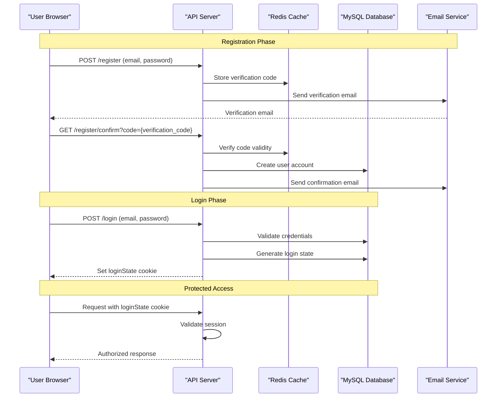
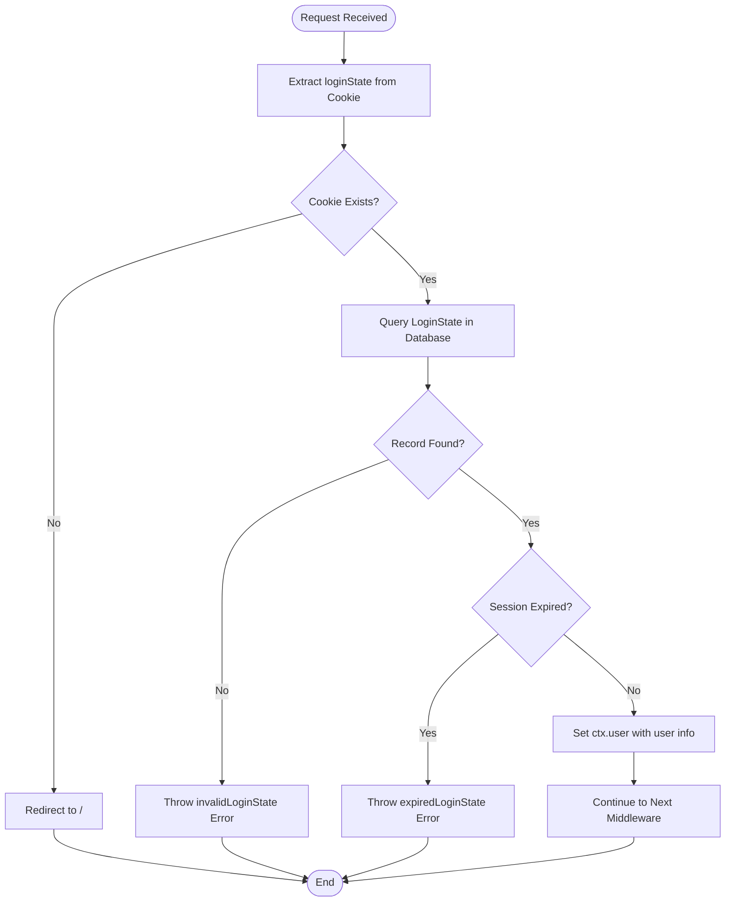
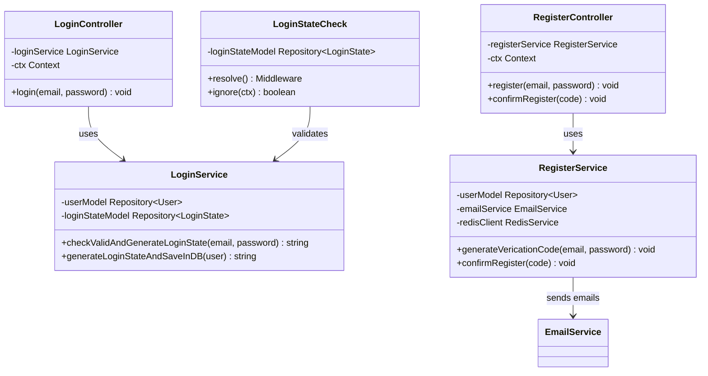

# Authentication API

<cite>
**Referenced Files in This Document**
- [src/controller/login.ts](file://src/controller/login.ts)
- [src/controller/register.ts](file://src/controller/register.ts)
- [src/service/login.ts](file://src/service/login.ts)
- [src/service/register.ts](file://src/service/register.ts)
- [src/middleware/loginStateCheck.ts](file://src/middleware/loginStateCheck.ts)
- [src/errorCode.ts](file://src/errorCode.ts)
- [src/model/user.ts](file://src/model/user.ts)
- [src/model/loginState.ts](file://src/model/loginState.ts)
- [src/types.ts](file://src/types.ts)
- [src/const.ts](file://src/const.ts)
- [src/service/email.ts](file://src/service/email.ts)
- [src/config/config.default.ts](file://src/config/config.default.ts)
</cite>

## Table of Contents
1. [Introduction](#introduction)
2. [Authentication Flow Overview](#authentication-flow-overview)
3. [Registration Endpoints](#registration-endpoints)
4. [Login Endpoints](#login-endpoints)
5. [Session Management](#session-management)
6. [Security Considerations](#security-considerations)
7. [Error Codes](#error-codes)
8. [Integration Examples](#integration-examples)

## Introduction

The goods_hunter application provides a comprehensive authentication system built on a RESTful API architecture. The authentication flow follows a secure registration-verification-login pattern with session-based authentication using cookies. The system integrates with Redis for temporary verification codes and MySQL for persistent user data storage.

## Authentication Flow Overview

The authentication system operates through a three-stage process:



**Diagram sources**
- [src/controller/register.ts](file://src/controller/register.ts#L23-L43)
- [src/controller/login.ts](file://src/controller/login.ts#L22-L36)
- [src/middleware/loginStateCheck.ts](file://src/middleware/loginStateCheck.ts#L25-L50)

## Registration Endpoints

### POST /register

Creates a new user account with email verification.

#### Request
- **Method**: `POST`
- **URL**: `/register`
- **Content-Type**: `application/json`

#### Request Body
| Parameter | Type | Required | Description |
|-----------|------|----------|-------------|
| `email` | string | Yes | User's email address (must be unique) |
| `password` | string | Yes | User's password (will be hashed with SHA256) |

#### Response
- **Status**: `200 OK`
- **Body**: Empty response (success)
- **Headers**: Sets `Set-Cookie: loginState=<uuid>` on successful login

#### Error Responses
| Status | Error Code | Description |
|--------|------------|-------------|
| 400 | `040001` | Invalid request body (missing email or password) |
| 400 | `030401` | User already exists |
| 400 | `030402` | Invalid verification code |

#### Security Features
- Passwords are hashed using SHA256 before storage
- Verification codes expire after 12 hours
- Email verification prevents account creation without valid email ownership

**Section sources**
- [src/controller/register.ts](file://src/controller/register.ts#L23-L33)
- [src/service/register.ts](file://src/service/register.ts#L38-L46)

### GET /register/confirm

Confirms user registration using a verification code.

#### Request
- **Method**: `GET`
- **URL**: `/register/confirm?code={verification_code}`
- **Content-Type**: `application/json`

#### Query Parameters
| Parameter | Type | Required | Description |
|-----------|------|----------|-------------|
| `code` | string | Yes | Verification code sent to user's email |

#### Response
- **Status**: `200 OK`
- **Body**: Empty response (success)
- **Headers**: Sends confirmation email to user

#### Error Responses
| Status | Error Code | Description |
|--------|------------|-------------|
| 400 | `040001` | Invalid request body (missing code) |
| 400 | `030402` | Invalid verification code |
| 400 | `030401` | User already exists |

**Section sources**
- [src/controller/register.ts](file://src/controller/register.ts#L35-L43)
- [src/service/register.ts](file://src/service/register.ts#L48-L73)

## Login Endpoints

### POST /login

Authenticates a user and generates a session cookie.

#### Request
- **Method**: `POST`
- **URL**: `/login`
- **Content-Type**: `application/json`

#### Request Body
| Parameter | Type | Required | Description |
|-----------|------|----------|-------------|
| `email` | string | Yes | User's email address |
| `password` | string | Yes | User's password |

#### Response
- **Status**: `200 OK`
- **Body**: Empty response
- **Headers**: Sets `Set-Cookie: loginState=<uuid>` with session token

#### Error Responses
| Status | Error Code | Description |
|--------|------------|-------------|
| 400 | `040001` | Invalid request body (missing email or password) |
| 400 | `030301` | Wrong email or password combination |

#### Session Behavior
- Session expires after 1 week
- Session tokens are UUID-based
- Sessions are stored in database with expiration tracking

**Section sources**
- [src/controller/login.ts](file://src/controller/login.ts#L22-L36)
- [src/service/login.ts](file://src/service/login.ts#L20-L35)

## Session Management

### Login State Middleware

The `loginStateCheck` middleware validates user sessions for protected routes.

#### Validation Process


**Diagram sources**
- [src/middleware/loginStateCheck.ts](file://src/middleware/loginStateCheck.ts#L25-L50)

#### Protected Routes
The middleware automatically protects the following routes:
- `/ignoreGood` - Ignores specific goods
- `/cancelGoodIgnore` - Cancels ignored goods
- `/proxy` - Proxy requests for external APIs

#### Session Validation Results
| Validation Result | Error Code | Description |
|-------------------|------------|-------------|
| Missing cookie | `010101` | No loginState cookie present |
| Invalid token | `010102` | Session token not found in database |
| Expired session | `010103` | Session has exceeded 1-week limit |

**Section sources**
- [src/middleware/loginStateCheck.ts](file://src/middleware/loginStateCheck.ts#L21-L50)

## Security Considerations

### Password Security
- **Hashing**: Passwords are hashed using SHA256 before storage
- **Salt**: Currently uses plain SHA256 (TODO: Implement HMAC with salt)
- **Storage**: Hashed passwords stored in MySQL database
- **Transmission**: No explicit HTTPS enforcement in configuration

### Session Security
- **Expiration**: Sessions expire after 1 week
- **Token Generation**: UUID v4 random tokens
- **Storage**: Sessions stored in database with expiration timestamps
- **Validation**: Database-backed session validation prevents token replay attacks

### Email Verification
- **Temporary Storage**: Verification codes stored in Redis with 12-hour TTL
- **Confirmation**: Users must click link in email to complete registration
- **Rate Limiting**: Not explicitly implemented (TODO: Add rate limiting)

### CSRF Protection
- **Current Status**: CSRF protection disabled in configuration
- **Recommendation**: Enable CSRF protection for production deployments
- **Alternative**: Session-based authentication reduces CSRF risk

### Database Security
- **ORM**: Uses TypeORM with parameterized queries
- **Relations**: Properly configured entity relationships
- **Transactions**: Not implemented yet (TODO: Add transaction support)

**Section sources**
- [src/service/login.ts](file://src/service/login.ts#L20-L35)
- [src/service/register.ts](file://src/service/register.ts#L54-L66)
- [src/config/config.default.ts](file://src/config/config.default.ts#L36-L38)

## Error Codes

### Authentication-Specific Error Codes

| Endpoint | Error Code | HTTP Status | Description |
|----------|------------|-------------|-------------|
| `/register` | `030401` | 400 | User already exists |
| `/register` | `030402` | 400 | Invalid verification code |
| `/login` | `030301` | 400 | Wrong email or password |
| `/loginStateCheck` | `010101` | 400 | Missing login state |
| `/loginStateCheck` | `010102` | 400 | Invalid login state |
| `/loginStateCheck` | `010103` | 400 | Expired login state |
| Common | `040001` | 400 | Invalid request body |

### Error Code Structure
- **Format**: `{type}{controller/service}{specific}`
- **Type**: `01` (middleware), `02` (controller), `03` (service), `04` (common)
- **Example**: `030401` = Service + Register + User Already Exists

**Section sources**
- [src/errorCode.ts](file://src/errorCode.ts#L37-L72)

## Integration Examples

### Registration Workflow

```bash
# Step 1: Register new user
curl -X POST http://localhost:7001/register \
  -H "Content-Type: application/json" \
  -d '{"email":"user@example.com","password":"securePassword123"}'

# Step 2: Confirm registration via email link
curl -X GET "http://localhost:7001/register/confirm?code=your-verification-code"
```

### Login Workflow

```bash
# Login with credentials
curl -X POST http://localhost:7001/login \
  -H "Content-Type: application/json" \
  -d '{"email":"user@example.com","password":"securePassword123"}' \
  --cookie-jar cookies.txt

# Subsequent requests with session cookie
curl -X GET http://localhost:7001/protected-resource \
  -b cookies.txt
```

### Error Handling Example

```bash
# Attempt to login with incorrect credentials
curl -X POST http://localhost:7001/login \
  -H "Content-Type: application/json" \
  -d '{"email":"wrong@example.com","password":"wrongpass"}' \
  -i

# Response:
# HTTP/1.1 400 Bad Request
# Content-Type: application/json
# 
# {"error":"030301","message":"Wrong email or password"}
```

### Service Integration

The authentication system integrates with the following services:



**Diagram sources**
- [src/controller/login.ts](file://src/controller/login.ts#L14-L37)
- [src/controller/register.ts](file://src/controller/register.ts#L14-L44)
- [src/service/login.ts](file://src/service/login.ts#L12-L47)
- [src/service/register.ts](file://src/service/register.ts#L13-L77)
- [src/middleware/loginStateCheck.ts](file://src/middleware/loginStateCheck.ts#L13-L54)

**Section sources**
- [src/controller/login.ts](file://src/controller/login.ts#L1-L38)
- [src/controller/register.ts](file://src/controller/register.ts#L1-L44)
- [src/service/login.ts](file://src/service/login.ts#L1-L48)
- [src/service/register.ts](file://src/service/register.ts#L1-L77)