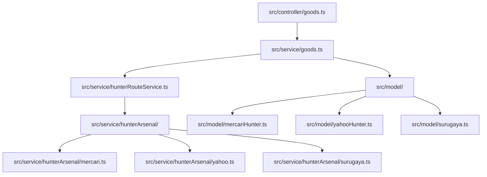
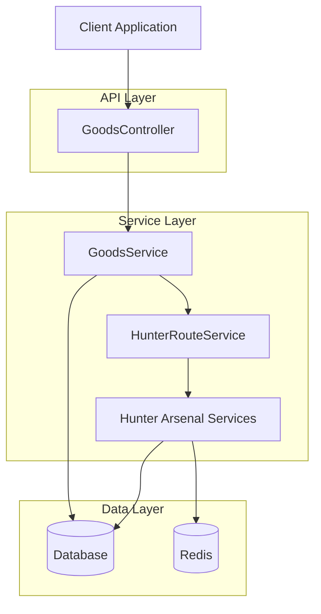
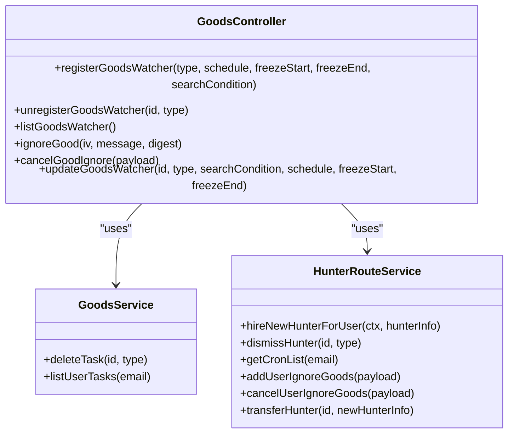
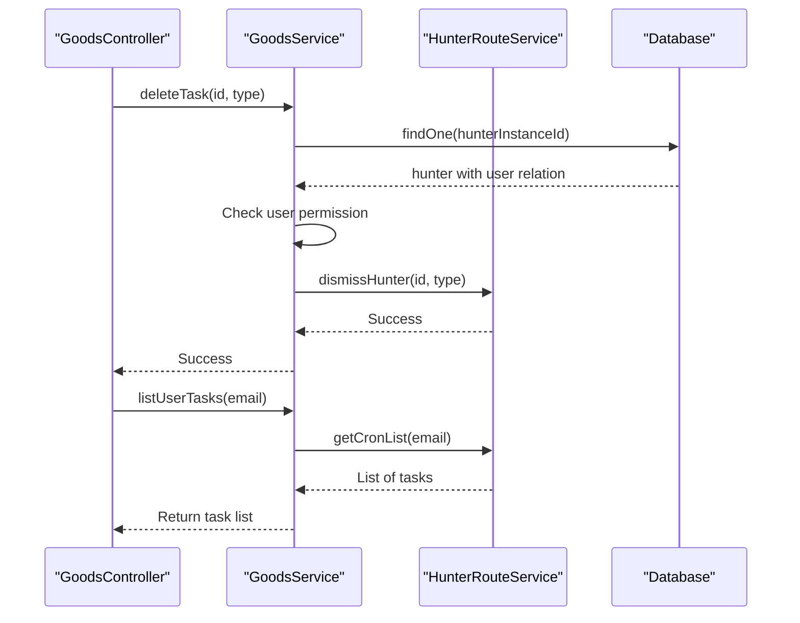
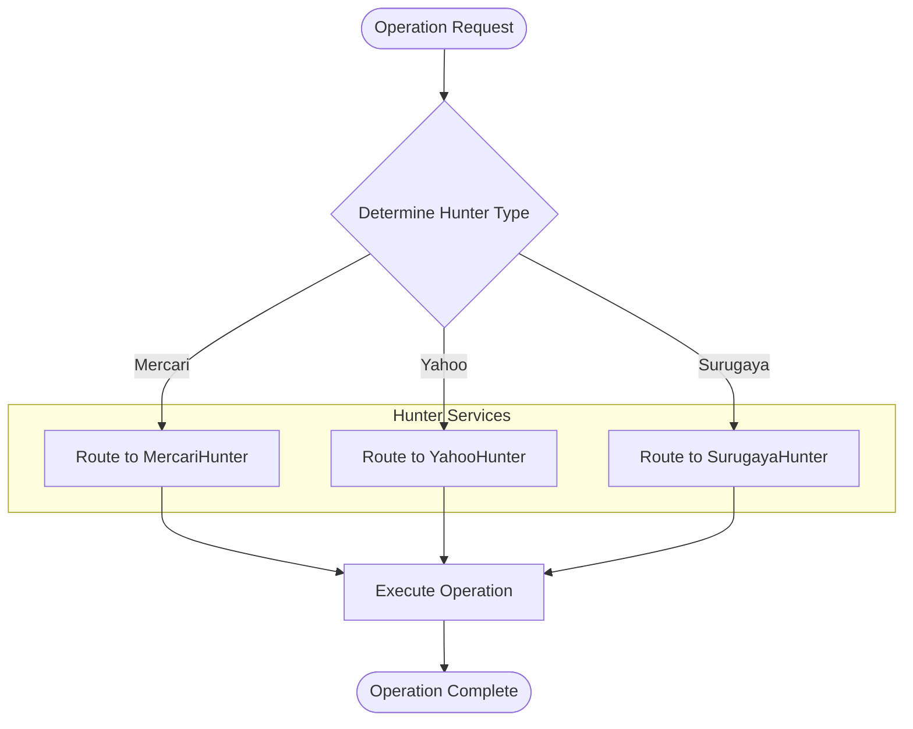
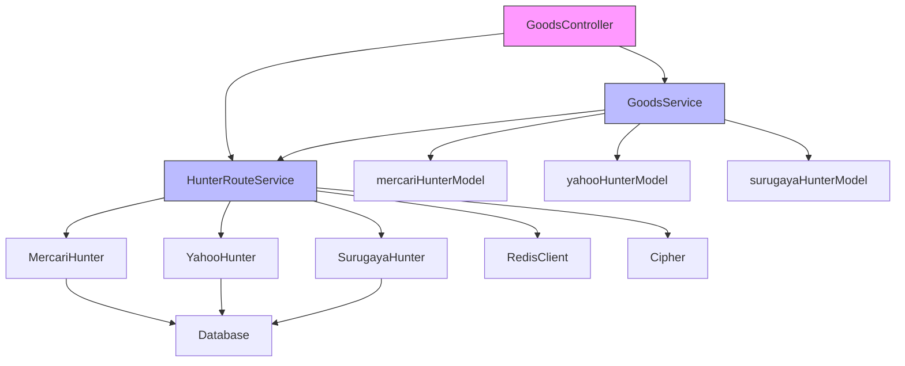

# Goods Monitoring API

<cite>
**Referenced Files in This Document**   
- [goods.ts](file://src/controller/goods.ts)
- [goods.ts](file://src/service/goods.ts)
- [hunterRouteService.ts](file://src/service/hunterRouteService.ts)
- [types.ts](file://src/types.ts)
- [errorCode.ts](file://src/errorCode.ts)
- [const.ts](file://src/const.ts)
- [types.ts](file://src/api/site/types.ts)
- [mercariHunter.ts](file://src/model/mercariHunter.ts)
- [yahooHunter.ts](file://src/model/yahooHunter.ts)
- [surugaya.ts](file://src/model/surugaya.ts)
- [types.ts](file://src/model/types.ts)
- [base.ts](file://src/service/hunterArsenal/base.ts)
</cite>

## Table of Contents
1. [Introduction](#introduction)
2. [Project Structure](#project-structure)
3. [Core Components](#core-components)
4. [Architecture Overview](#architecture-overview)
5. [Detailed Component Analysis](#detailed-component-analysis)
6. [Dependency Analysis](#dependency-analysis)
7. [Performance Considerations](#performance-considerations)
8. [Troubleshooting Guide](#troubleshooting-guide)
9. [Conclusion](#conclusion)

## Introduction
This document provides comprehensive API documentation for the goods monitoring functionality in the Goods Hunter application. The system enables users to create, manage, and monitor search tasks across multiple e-commerce platforms including Mercari, Surugaya, and Yahoo Auctions. The API supports creating monitoring tasks with customizable schedules, search conditions, and time-based freezing ranges. This documentation covers all endpoints, request/response formats, error cases, and the underlying data flow from API to service to database.

## Project Structure
The goods monitoring functionality is organized across several key directories in the project structure:
- `src/controller/`: Contains the `goods.ts` controller that exposes the API endpoints
- `src/service/`: Houses the business logic in `goods.ts`, `hunterRouteService.ts`, and hunter arsenal services
- `src/model/`: Contains database entity models for different marketplace hunters
- `src/api/site/`: Defines site-specific types and search conditions
- `src/types.ts`: Central location for shared type definitions
- `src/const.ts`: Defines constants including supported hunter types

**Diagram sources**
- [goods.ts](file://src/controller/goods.ts)
- [goods.ts](file://src/service/goods.ts)
- [hunterRouteService.ts](file://src/service/hunterRouteService.ts)

**Section sources**
- [goods.ts](file://src/controller/goods.ts)
- [goods.ts](file://src/service/goods.ts)
- [hunterRouteService.ts](file://src/service/hunterRouteService.ts)

## Core Components
The goods monitoring system consists of several core components that work together to provide the monitoring functionality. The `GoodsController` handles HTTP requests and delegates to the `GoodsService` for business logic. The `GoodsService` interacts with the `HunterRouteService` which routes requests to specific hunter services based on the marketplace type. Each hunter service manages cron jobs and database operations for its respective marketplace. The system uses Redis for managing ignored items and TypeORM for database persistence.

**Section sources**
- [goods.ts](file://src/controller/goods.ts)
- [goods.ts](file://src/service/goods.ts)
- [hunterRouteService.ts](file://src/service/hunterRouteService.ts)

## Architecture Overview
The goods monitoring architecture follows a layered pattern with clear separation of concerns. The API layer handles HTTP requests, the service layer contains business logic, and the data layer manages persistence. The system uses a routing service to delegate operations to specific hunter implementations based on the marketplace type. All operations are protected by authentication middleware that verifies user login state.

**Diagram sources**
- [goods.ts](file://src/controller/goods.ts)
- [goods.ts](file://src/service/goods.ts)
- [hunterRouteService.ts](file://src/service/hunterRouteService.ts)

## Detailed Component Analysis

### Goods Controller Analysis
The `GoodsController` exposes REST endpoints for managing goods monitoring tasks. It uses MidwayJS decorators to define routes and inject dependencies. The controller handles five main operations: creating, listing, deleting, updating, and managing ignored items.

#### API Endpoints Class Diagram

**Diagram sources**
- [goods.ts](file://src/controller/goods.ts#L21-L147)
- [goods.ts](file://src/service/goods.ts#L16-L62)
- [hunterRouteService.ts](file://src/service/hunterRouteService.ts#L31-L141)

### Goods Service Analysis
The `GoodsService` provides business logic for goods monitoring operations. It acts as an intermediary between the controller and the hunter route service, handling user permission checks and database operations.

#### Goods Service Sequence Diagram

**Diagram sources**
- [goods.ts](file://src/service/goods.ts#L37-L61)
- [hunterRouteService.ts](file://src/service/hunterRouteService.ts#L56-L60)

### Hunter Route Service Analysis
The `HunterRouteService` is responsible for routing operations to the appropriate hunter service based on the marketplace type. It maintains a registry of active cron jobs and delegates operations to specific hunter implementations.

#### Hunter Route Service Flowchart

**Diagram sources**
- [hunterRouteService.ts](file://src/service/hunterRouteService.ts#L83-L111)
- [base.ts](file://src/service/hunterArsenal/base.ts#L16-L87)

## Dependency Analysis
The goods monitoring system has a well-defined dependency structure with clear boundaries between components. The controller depends on the service layer, which in turn depends on data access components and external services.

**Diagram sources**
- [goods.ts](file://src/controller/goods.ts)
- [goods.ts](file://src/service/goods.ts)
- [hunterRouteService.ts](file://src/service/hunterRouteService.ts)

**Section sources**
- [goods.ts](file://src/controller/goods.ts)
- [goods.ts](file://src/service/goods.ts)
- [hunterRouteService.ts](file://src/service/hunterRouteService.ts)

## Performance Considerations
The goods monitoring system is designed with performance in mind. Cron jobs are managed in memory with periodic health checks to ensure they remain active. Database operations are optimized with proper indexing on key fields like `hunterInstanceId` and user email. The use of Redis for managing ignored items provides fast lookup times. The system validates input parameters early to prevent unnecessary processing of invalid requests. For high-volume scenarios, consider distributing cron job management across multiple instances using a shared Redis store.

## Troubleshooting Guide
This section documents common issues and their solutions when working with the goods monitoring API.

### Common Error Cases
| Error Code | Error Message | Cause | Solution |
|----------|-------------|------|----------|
| 040001 | invalidRequestBody | Invalid request parameters | Verify all required fields are present and properly formatted |
| 020101 | invalidHunterType | Unsupported marketplace type | Use one of: Mercari, Yahoo, Surugaya |
| 030502 | taskNotFound | Task ID does not exist | Verify the task ID is correct and belongs to the user |
| 030503 | taskPermissionDenied | User does not own the task | Ensure the user owns the task they're trying to modify |

### Validation Issues
- **Cron Schedule**: Must be a valid cron expression. Use standard cron format like "0 */30 * * * *" for every 30 minutes
- **Freezing Range**: Must be in HH:MM format with hours 00-23 and minutes 00-59
- **Search Condition**: Must include a keyword parameter
- **Type Parameter**: Must be one of the supported marketplace types

**Section sources**
- [errorCode.ts](file://src/errorCode.ts#L52-L60)
- [goods.ts](file://src/controller/goods.ts#L46-L60)
- [const.ts](file://src/const.ts#L3)

## Conclusion
The goods monitoring API provides a robust system for tracking items across multiple Japanese e-commerce platforms. The architecture follows clean separation of concerns with well-defined components for handling HTTP requests, business logic, and data persistence. The system supports creating, listing, updating, and deleting monitoring tasks with flexible scheduling and search parameters. Error handling is comprehensive with specific error codes for different failure scenarios. The use of Redis for managing ignored items and TypeORM for database operations ensures reliable performance. Developers can extend the system by adding new hunter services for additional marketplaces following the existing pattern.