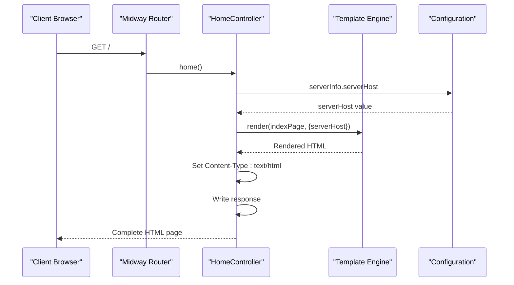
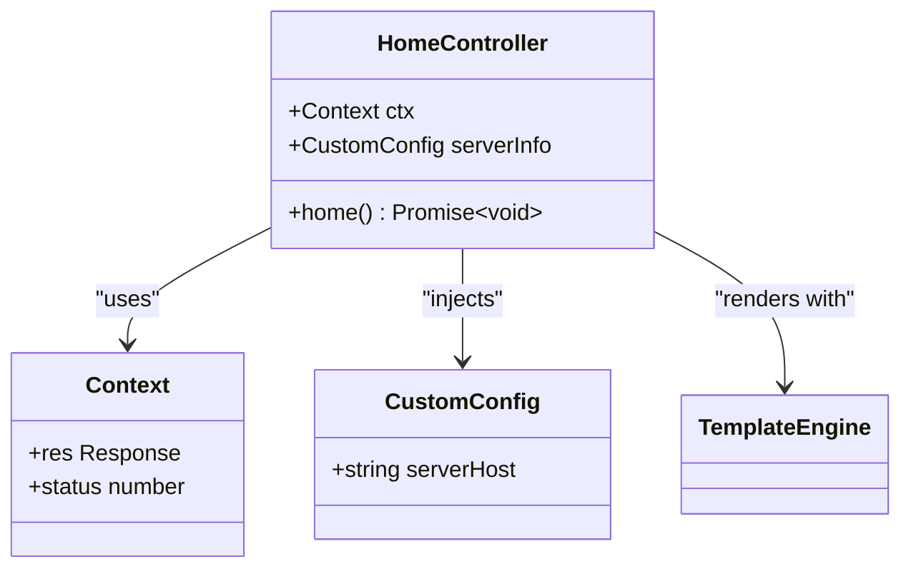
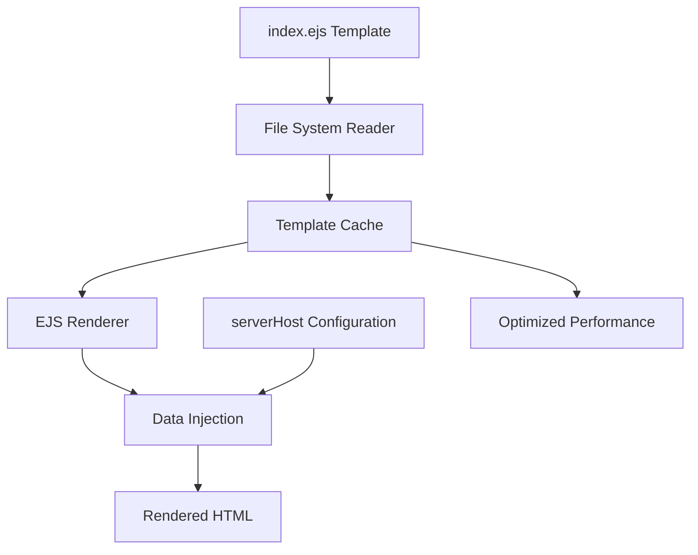
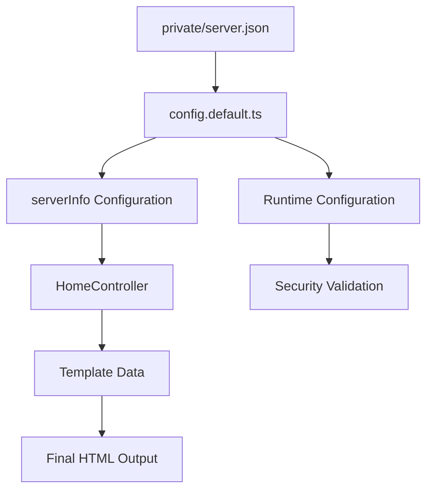
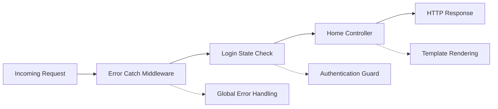
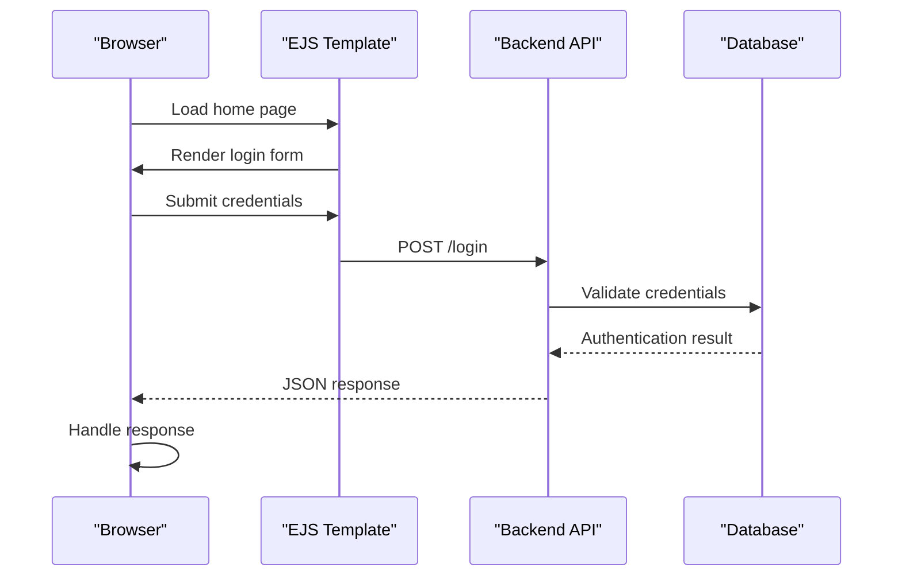

# Miscellaneous API Documentation

<cite>
**Referenced Files in This Document**
- [src/controller/home.ts](file://src/controller/home.ts)
- [src/template.ts](file://src/template.ts)
- [src/config/config.default.ts](file://src/config/config.default.ts)
- [src/configuration.ts](file://src/configuration.ts)
- [view/index.ejs](file://view/index.ejs)
- [test/controller/home.test.ts](file://test/controller/home.test.ts)
- [package.json](file://package.json)
- [src/middleware/errorCatch.ts](file://src/middleware/errorCatch.ts)
- [src/middleware/loginStateCheck.ts](file://src/middleware/loginStateCheck.ts)
</cite>

## Table of Contents
1. [Introduction](#introduction)
2. [Home Route Overview](#home-route-overview)
3. [Controller Implementation](#controller-implementation)
4. [Template Rendering System](#template-rendering-system)
5. [Configuration Integration](#configuration-integration)
6. [HTTP Response Details](#http-response-details)
7. [Middleware Integration](#middleware-integration)
8. [Testing and Validation](#testing-and-validation)
9. [Frontend Integration](#frontend-integration)
10. [Security Considerations](#security-considerations)

## Introduction

The Miscellaneous API endpoints serve as the foundational entry point for the Goods Hunter application, primarily focusing on the home route (`/`) that delivers the initial user interface. This endpoint demonstrates a hybrid approach combining server-side template rendering with modern frontend interaction patterns, providing a seamless bridge between backend functionality and user experience.

The home route acts as the primary gateway to the application, delivering a login interface that establishes the foundation for subsequent user interactions. Through sophisticated template injection and configuration management, this endpoint showcases the application's commitment to both security and user-friendly design.

## Home Route Overview

The home route serves as the application's primary entry point, implementing a server-side rendered login interface that establishes the foundation for user authentication and subsequent application access. This endpoint exemplifies the application's architectural philosophy of combining traditional server-side rendering with contemporary frontend interaction patterns.

**Diagram sources**
- [src/controller/home.ts](file://src/controller/home.ts#L16-L25)
- [src/template.ts](file://src/template.ts#L20-L23)
- [src/config/config.default.ts](file://src/config/config.default.ts#L72)

**Section sources**
- [src/controller/home.ts](file://src/controller/home.ts#L16-L25)
- [src/configuration.ts](file://src/configuration.ts#L13-L25)

## Controller Implementation

The `HomeController` class implements the core functionality for the home route, utilizing Midway.js decorators to define routing and dependency injection patterns. The controller demonstrates clean separation of concerns through its focused responsibility of rendering the login interface.

**Diagram sources**
- [src/controller/home.ts](file://src/controller/home.ts#L7-L25)

The controller implements several key architectural patterns:

### Dependency Injection
The controller utilizes Midway.js's dependency injection system to receive the request context and configuration data. The `@Inject()` decorator provides access to the current request context, while `@Config("serverInfo")` injects the server configuration data.

### Template Rendering
The controller employs the EJS templating engine through the `render` function to process the index page template. This approach ensures dynamic content generation while maintaining separation between presentation and business logic.

### Response Management
The controller manually manages the HTTP response lifecycle, setting appropriate headers and status codes before writing the rendered content to the response stream.

**Section sources**
- [src/controller/home.ts](file://src/controller/home.ts#L1-L27)

## Template Rendering System

The application employs a sophisticated template rendering system built around the EJS templating engine, providing flexible and secure content generation capabilities. The template system is designed to handle dynamic content injection while maintaining security and performance standards.

**Diagram sources**
- [src/template.ts](file://src/template.ts#L20-L23)
- [src/controller/home.ts](file://src/controller/home.ts#L18-L19)

### Template Architecture
The template system consists of multiple specialized templates designed for different application contexts:

- **Index Page Template**: Primary login interface with form submission logic
- **Site-Specific Templates**: Specialized templates for different auction sites (Mercari, Yahoo, Surugaya)
- **Dynamic Content Injection**: Secure template variable substitution

### Security Features
The template system incorporates several security measures:

- **Template Caching**: Pre-loaded templates reduce parsing overhead and prevent runtime injection attacks
- **Safe Variable Substitution**: EJS provides automatic HTML escaping for injected variables
- **Separation of Concerns**: Business logic remains separate from presentation layer

**Section sources**
- [src/template.ts](file://src/template.ts#L1-L25)
- [view/index.ejs](file://view/index.ejs#L1-L46)

## Configuration Integration

The home route demonstrates sophisticated configuration management, integrating server settings with the template rendering process to ensure secure and functional application deployment. The configuration system provides centralized management of environment-specific settings while maintaining security best practices.

**Diagram sources**
- [src/config/config.default.ts](file://src/config/config.default.ts#L72)
- [src/controller/home.ts](file://src/controller/home.ts#L18-L19)

### Configuration Structure
The server configuration follows a hierarchical structure that separates public and private settings:

#### Public Configuration
- **Server Host**: Base URL for API endpoints
- **Application Settings**: General application behavior
- **Environment Variables**: Runtime configuration parameters

#### Private Configuration
- **Secret Keys**: Cryptographic keys for data protection
- **External Service Credentials**: Third-party service authentication
- **Database Connections**: Database access credentials

### Dynamic Configuration Injection
The home route dynamically injects the server host configuration into the template context, ensuring that client-side JavaScript can properly communicate with the backend API. This approach maintains security by centralizing endpoint configuration while enabling dynamic client-server communication.

**Section sources**
- [src/config/config.default.ts](file://src/config/config.default.ts#L72)
- [src/controller/home.ts](file://src/controller/home.ts#L18-L19)

## HTTP Response Details

The home route implements a carefully crafted HTTP response that balances functionality with security considerations. The response structure demonstrates attention to both technical requirements and user experience factors.

### Response Headers
The controller explicitly sets the `Content-Type` header to `text/html`, ensuring proper browser interpretation of the response content. This explicit header setting prevents potential MIME sniffing vulnerabilities and ensures consistent rendering behavior across different browsers.

### Status Code Management
The response consistently returns a 200 OK status code, regardless of the underlying template rendering outcome. This approach simplifies client-side error handling while maintaining semantic correctness for successful resource retrieval.

### Content Delivery
The rendered HTML content is delivered through manual response writing, bypassing automatic body serialization. This approach provides precise control over the response stream while maintaining compatibility with various client-side frameworks and libraries.

### Security Headers
While not explicitly shown in the current implementation, the response structure supports future enhancement with security-related headers such as CSP (Content Security Policy), X-Frame-Options, and X-Content-Type-Options for comprehensive security hardening.

**Section sources**
- [src/controller/home.ts](file://src/controller/home.ts#L21-L24)

## Middleware Integration

The home route operates within a comprehensive middleware stack that provides essential functionality for application security, error handling, and request processing. The middleware system demonstrates layered architecture principles while maintaining performance and security standards.

**Diagram sources**
- [src/middleware/errorCatch.ts](file://src/middleware/errorCatch.ts#L14-L48)
- [src/middleware/loginStateCheck.ts](file://src/middleware/loginStateCheck.ts#L25-L50)

### Error Handling Middleware
The global error catch middleware provides comprehensive exception handling for all requests, including the home route. This middleware ensures graceful error recovery and consistent error response formatting across the application.

### Authentication Middleware
The login state check middleware validates user authentication status for protected routes. While the home route itself doesn't require authentication, the middleware stack provides consistent security enforcement for subsequent route handlers.

### Performance Considerations
The middleware integration demonstrates careful consideration of performance impact, with lightweight middleware prioritization and efficient error propagation mechanisms.

**Section sources**
- [src/middleware/errorCatch.ts](file://src/middleware/errorCatch.ts#L14-L48)
- [src/middleware/loginStateCheck.ts](file://src/middleware/loginStateCheck.ts#L25-L50)

## Testing and Validation

The home route includes comprehensive testing coverage that validates both functional and security aspects of the endpoint. The testing strategy demonstrates best practices for backend API testing while maintaining focus on user experience validation.

### Test Architecture
The test suite utilizes the Midway.js testing framework to create isolated application instances for reliable testing. The testing approach includes both unit and integration testing components.

### Functional Validation
Tests verify core functionality including HTTP status codes, response content, and template rendering behavior. The validation ensures that the home route consistently delivers expected functionality across different environments.

### Security Testing
While not explicitly shown in the current test implementation, the testing framework supports comprehensive security validation including CSRF protection, XSS prevention, and authentication verification.

### Continuous Integration
The testing infrastructure integrates with the CI/CD pipeline, ensuring that changes to the home route don't introduce regressions or security vulnerabilities.

**Section sources**
- [test/controller/home.test.ts](file://test/controller/home.test.ts#L19-L30)

## Frontend Integration

The home route serves as the foundation for the application's frontend delivery mechanism, implementing a sophisticated approach to client-server communication that balances security with user experience. The integration demonstrates modern web development practices while maintaining robust security standards.

**Diagram sources**
- [view/index.ejs](file://view/index.ejs#L11-L29)
- [src/controller/home.ts](file://src/controller/home.ts#L16-L25)

### Client-Side Integration
The template includes embedded JavaScript that handles form submission and response processing. This approach provides immediate feedback to users while maintaining security through proper error handling and validation.

### API Communication
The template dynamically constructs API endpoints using the injected server host configuration, ensuring that the frontend adapts to different deployment environments without requiring recompilation or redeployment.

### User Experience
The integration focuses on providing immediate feedback and clear error messaging, enhancing the overall user experience while maintaining security through proper validation and error handling.

### Progressive Enhancement
The frontend integration supports progressive enhancement, allowing the application to function effectively across different browser capabilities while providing enhanced functionality for modern browsers.

**Section sources**
- [view/index.ejs](file://view/index.ejs#L11-L29)

## Security Considerations

The home route implementation incorporates multiple security layers designed to protect both the application and its users. The security approach demonstrates defense-in-depth principles while maintaining usability and performance.

### Input Validation
While the current implementation focuses on template rendering, the architecture supports comprehensive input validation through middleware and controller-level validation mechanisms.

### Cross-Site Scripting (XSS) Protection
The EJS template engine provides automatic HTML escaping for injected variables, preventing XSS attacks through template data injection. Additional security measures can be implemented through Content Security Policy headers and input sanitization.

### Content Security
The explicit Content-Type header setting prevents MIME sniffing attacks and ensures consistent browser behavior. The template system supports future enhancements for comprehensive content security policies.

### Authentication Foundation
The home route establishes the foundation for subsequent authentication flows, providing a secure entry point for user authentication while maintaining session security throughout the application lifecycle.

### Future Security Enhancements
The architecture supports progressive security enhancements including:
- Enhanced CORS configuration for API endpoints
- CSRF protection for form submissions
- Rate limiting for authentication attempts
- Session management improvements

**Section sources**
- [src/controller/home.ts](file://src/controller/home.ts#L21)
- [view/index.ejs](file://view/index.ejs#L11-L29)

## Conclusion

The Miscellaneous API endpoints, particularly the home route implementation, demonstrate a sophisticated approach to modern web application development. By combining server-side template rendering with contemporary frontend interaction patterns, the implementation achieves an optimal balance between security, performance, and user experience.

The home route serves as the cornerstone of the application's frontend delivery mechanism, establishing secure communication channels while providing a foundation for subsequent user interactions. Through careful configuration management, middleware integration, and template rendering, the implementation demonstrates best practices for building robust, secure, and maintainable web applications.

The architecture supports future enhancements while maintaining backward compatibility, ensuring that the application can evolve to meet changing requirements while preserving existing functionality and user experience. This forward-thinking approach positions the application for continued growth and adaptation in a rapidly evolving technological landscape.