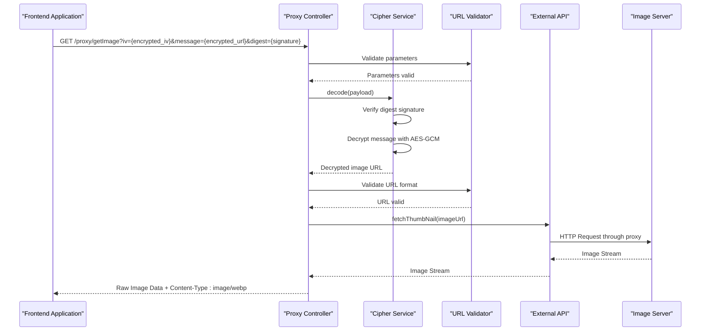
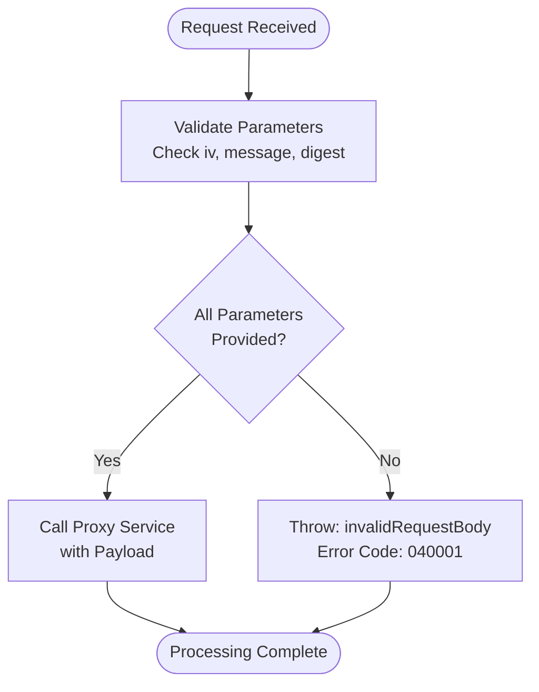
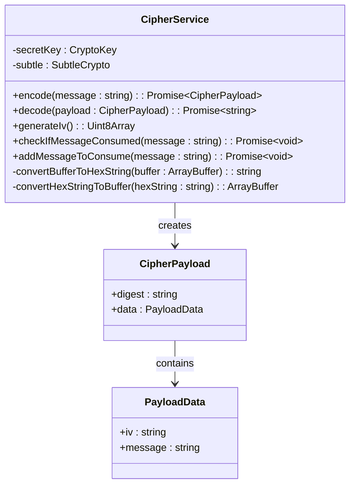
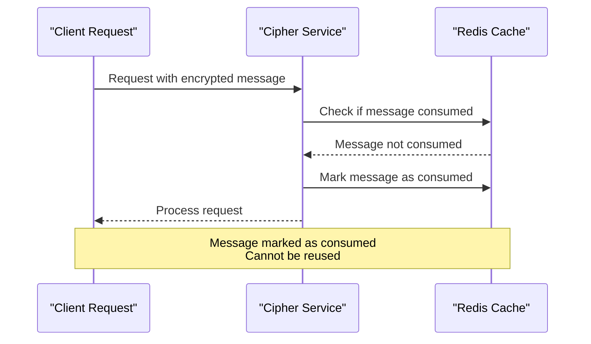
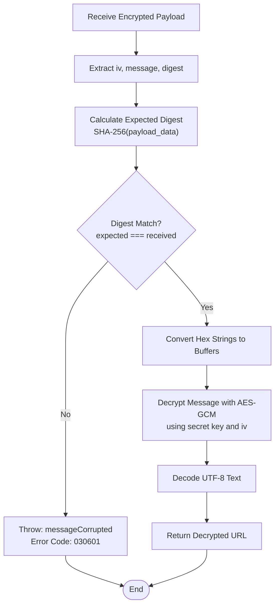
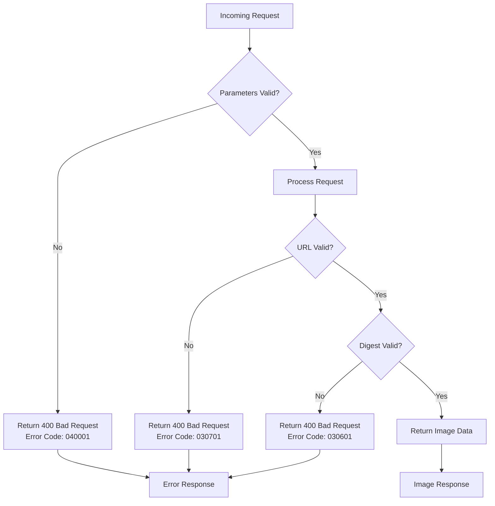
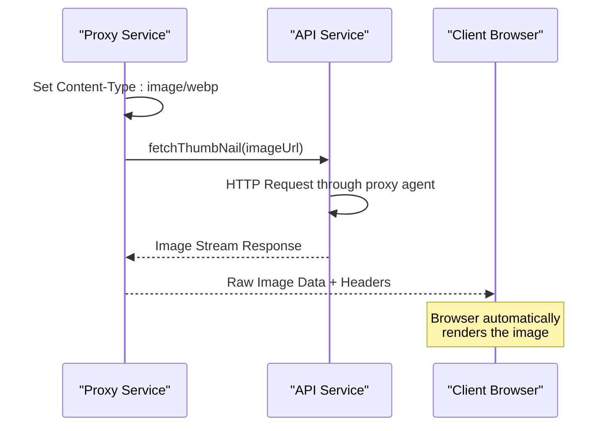
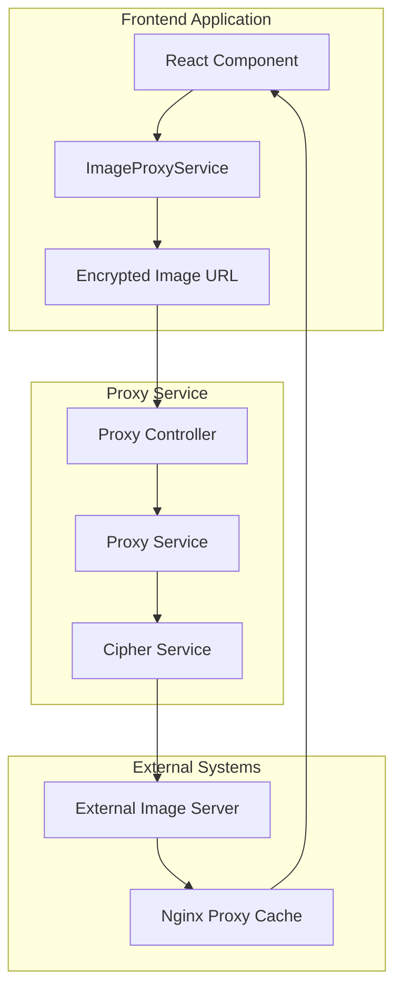

# Proxy API Documentation

<cite>
**Referenced Files in This Document**
- [src/controller/proxy.ts](file://src/controller/proxy.ts)
- [src/service/proxy.ts](file://src/service/proxy.ts)
- [src/service/cipher.ts](file://src/service/cipher.ts)
- [src/errorCode.ts](file://src/errorCode.ts)
- [src/types.ts](file://src/types.ts)
- [src/utils/isValidUrl.ts](file://src/utils/isValidUrl.ts)
- [src/api/site/base.ts](file://src/api/site/base.ts)
- [src/api/request/index.ts](file://src/api/request/index.ts)
- [src/const.ts](file://src/const.ts)
- [src/config/config.default.ts](file://src/config/config.default.ts)
- [src/api/const.ts](file://src/api/const.ts)
</cite>

## Table of Contents
1. [Introduction](#introduction)
2. [API Endpoint Overview](#api-endpoint-overview)
3. [Endpoint Specification](#endpoint-specification)
4. [Security Architecture](#security-architecture)
5. [Decryption Flow](#decryption-flow)
6. [Error Handling](#error-handling)
7. [Response Format](#response-format)
8. [Usage Examples](#usage-examples)
9. [Frontend Integration](#frontend-integration)
10. [Security Considerations](#security-considerations)
11. [Troubleshooting](#troubleshooting)

## Introduction

The Proxy API serves as a secure gateway for retrieving external images through the backend, designed to bypass Cross-Origin Resource Sharing (CORS) restrictions and geographic limitations. This service encrypts image URLs using AES-GCM encryption and validates requests through cryptographic signatures, ensuring secure and authorized access to external image resources.

The primary use case is to enable frontend applications to display images hosted on external domains that may have restrictive CORS policies or geographic access controls. By routing image requests through this proxy service, the application maintains security while providing seamless image loading capabilities.

## API Endpoint Overview

The proxy service exposes a single endpoint that handles encrypted image URL requests and returns the actual image data. The service operates as a stateless proxy that decrypts incoming requests, validates the image URLs, and retrieves the images through a secure proxy mechanism.



**Diagram sources**
- [src/controller/proxy.ts](file://src/controller/proxy.ts#L12-L16)
- [src/service/proxy.ts](file://src/service/proxy.ts#L22-L28)
- [src/service/cipher.ts](file://src/service/cipher.ts#L92-L115)

## Endpoint Specification

### Base URL
```
GET /proxy/getImage
```

### Query Parameters

| Parameter | Type | Required | Description |
|-----------|------|----------|-------------|
| `iv` | string | Yes | Initialization vector in hexadecimal format used for AES-GCM decryption |
| `message` | string | Yes | Encrypted image URL in hexadecimal format |
| `digest` | string | Yes | SHA-256 signature of the encrypted payload for integrity verification |

### Parameter Details

**iv (Initialization Vector)**:
- Hexadecimal string representing the AES-GCM initialization vector
- Generated randomly for each encryption operation
- Used to ensure cryptographic uniqueness for each encrypted message

**message (Encrypted Message)**:
- Hexadecimal representation of the encrypted image URL
- Contains the actual external image URL encrypted using AES-GCM with the configured secret key
- Must be properly formatted hexadecimal string

**digest (Digital Signature)**:
- SHA-256 hash of the encrypted payload data
- Used to verify the integrity and authenticity of the encrypted message
- Prevents tampering and ensures the message hasn't been altered during transmission

### Request Validation

The endpoint performs strict parameter validation before processing the request:



**Diagram sources**
- [src/controller/proxy.ts](file://src/controller/proxy.ts#L13-L15)

**Section sources**
- [src/controller/proxy.ts](file://src/controller/proxy.ts#L12-L16)

## Security Architecture

The proxy service implements a multi-layered security approach combining encryption, digital signatures, and access controls to ensure secure image retrieval.

### Encryption Layer

The service uses AES-GCM (Advanced Encryption Standard - Galois/Counter Mode) for symmetric encryption:



**Diagram sources**
- [src/service/cipher.ts](file://src/service/cipher.ts#L11-L117)
- [src/types.ts](file://src/types.ts#L43-L49)

### Digital Signature Verification

Each encrypted payload includes a SHA-256 digest that serves as a digital signature:

1. **Payload Structure**: `{ digest, data: { iv, message } }`
2. **Signature Generation**: SHA-256 hash of the serialized payload data
3. **Verification Process**: Recalculate digest and compare with received digest
4. **Tamper Detection**: Any modification to the payload will cause digest mismatch

### Message Consumption Control

The service implements one-time message consumption to prevent replay attacks:



**Diagram sources**
- [src/service/cipher.ts](file://src/service/cipher.ts#L60-L67)
- [src/const.ts](file://src/const.ts#L5)

**Section sources**
- [src/service/cipher.ts](file://src/service/cipher.ts#L11-L117)
- [src/const.ts](file://src/const.ts#L5)

## Decryption Flow

The decryption process follows a secure, validated approach to ensure only authorized and unmodified requests are processed.

### Decryption Process Flow



**Diagram sources**
- [src/service/cipher.ts](file://src/service/cipher.ts#L92-L115)

### Step-by-Step Decryption Process

1. **Payload Validation**: Verify all required fields are present
2. **Digest Verification**: Recalculate SHA-256 digest of payload data
3. **Buffer Conversion**: Transform hexadecimal strings to binary buffers
4. **AES-GCM Decryption**: Decrypt the message using the secret key and IV
5. **Text Decoding**: Convert decrypted bytes to UTF-8 string
6. **URL Validation**: Ensure the decrypted URL is properly formatted

**Section sources**
- [src/service/cipher.ts](file://src/service/cipher.ts#L92-L115)

## Error Handling

The proxy service implements comprehensive error handling with specific error codes and meaningful error messages for different failure scenarios.

### Error Categories

| Error Type | Error Code | Description | Resolution |
|------------|------------|-------------|------------|
| Invalid Request Body | 040001 | Missing required parameters (iv, message, digest) | Provide all three required query parameters |
| Invalid Image URL | 030701 | Decrypted URL fails validation | Verify the encrypted URL is valid |
| Message Corrupted | 030601 | Digest verification failed | Re-encrypt the message with correct parameters |
| Message Consumed | 030602 | Message has already been used | Generate a new encrypted message |

### Error Response Flow



**Diagram sources**
- [src/controller/proxy.ts](file://src/controller/proxy.ts#L13-L15)
- [src/service/proxy.ts](file://src/service/proxy.ts#L25)
- [src/service/cipher.ts](file://src/service/cipher.ts#L102)

**Section sources**
- [src/errorCode.ts](file://src/errorCode.ts#L52-L68)

## Response Format

The proxy service returns raw image data with appropriate HTTP headers to ensure proper browser rendering and caching behavior.

### HTTP Response Structure

| Header | Value | Purpose |
|--------|-------|---------|
| Content-Type | image/webp | Specifies the image format for proper browser rendering |
| Cache-Control | varies | Configured by Nginx proxy cache settings |
| Content-Length | varies | Indicates the size of the image data |

### Response Processing



**Diagram sources**
- [src/service/proxy.ts](file://src/service/proxy.ts#L26-L28)
- [src/api/site/base.ts](file://src/api/site/base.ts#L19-L26)

### Image Format Support

The service currently supports WebP format but can be extended to support other formats by modifying the Content-Type header. The actual format depends on the external image server's response.

**Section sources**
- [src/service/proxy.ts](file://src/service/proxy.ts#L26-L28)
- [src/api/site/base.ts](file://src/api/site/base.ts#L19-L26)

## Usage Examples

### Basic cURL Example

```bash
# Encrypt an image URL using the client-side encryption library
# Then make the request to the proxy service

curl -X GET \
  "http://localhost:7001/proxy/getImage?iv=abcdef1234567890&message=deadbeef1234567890&digest=sha256signature" \
  -H "Accept: image/webp" \
  --output image.webp
```

### JavaScript Implementation Example

```javascript
// Client-side encryption example
async function getProxiedImage(encryptedUrl) {
    const response = await fetch(`/proxy/getImage?${encryptedUrl}`);
    
    if (!response.ok) {
        throw new Error(`HTTP error! status: ${response.status}`);
    }
    
    return response.blob(); // Returns image as Blob for display
}
```

### Frontend Integration Pattern

```javascript
// Typical frontend usage pattern
class ImageProxyService {
    static async loadImage(encryptedParams) {
        try {
            const response = await fetch(
                `/proxy/getImage?${new URLSearchParams(encryptedParams)}`
            );
            
            if (!response.ok) {
                throw new Error(`Failed to load image: ${response.statusText}`);
            }
            
            return response.blob();
        } catch (error) {
            console.error('Image proxy error:', error);
            throw error;
        }
    }
}
```

## Frontend Integration

The proxy service is designed to integrate seamlessly with frontend applications that need to display external images while maintaining security and bypassing CORS restrictions.

### Integration Architecture



**Diagram sources**
- [src/controller/proxy.ts](file://src/controller/proxy.ts#L1-L19)
- [src/service/proxy.ts](file://src/service/proxy.ts#L1-L31)

### Component Usage Patterns

Frontend components typically use the proxy service through dedicated image loading utilities that handle encryption, error handling, and loading states:

1. **Image Loading Components**: Wrap image URLs with encryption and proxy requests
2. **Lazy Loading**: Load images only when they become visible in the viewport
3. **Fallback Images**: Provide placeholder images while waiting for the actual image
4. **Error Boundaries**: Handle proxy failures gracefully

**Section sources**
- [src/controller/proxy.ts](file://src/controller/proxy.ts#L1-L19)
- [src/service/proxy.ts](file://src/service/proxy.ts#L1-L31)

## Security Considerations

The proxy service implements several security measures to protect against various attack vectors and ensure secure image retrieval.

### Cryptographic Security

1. **AES-GCM Encryption**: Uses industry-standard AES-GCM for confidentiality and authenticity
2. **Random IV Generation**: Each encryption uses a cryptographically secure random initialization vector
3. **Key Management**: Secret key stored in JWK format and loaded from secure configuration
4. **Digest Verification**: SHA-256 signatures prevent tampering and ensure message integrity

### Access Control Measures

1. **One-Time Consumption**: Messages can only be used once, preventing replay attacks
2. **Parameter Validation**: Strict validation of all request parameters
3. **URL Validation**: Ensures decrypted URLs are properly formatted and safe
4. **Rate Limiting**: Built-in timeouts and retry mechanisms prevent abuse

### Network Security

1. **HTTPS Proxy**: All external requests go through HTTPS proxy agents
2. **Timeout Protection**: Requests timeout after 5 seconds to prevent hanging
3. **Proxy Caching**: Nginx caching reduces load and improves performance
4. **Secure Headers**: Proper Content-Type headers for browser security

### Threat Mitigation

| Threat | Mitigation | Implementation |
|--------|------------|----------------|
| Replay Attacks | Message consumption tracking | Redis-based message tracking |
| Tampering | Digital signatures | SHA-256 digest verification |
| Information Disclosure | Parameter validation | Strict input sanitization |
| Denial of Service | Request timeouts | 5-second timeout limit |
| CORS Violations | Backend proxy | Server-side image fetching |

**Section sources**
- [src/service/cipher.ts](file://src/service/cipher.ts#L25-L28)
- [src/service/cipher.ts](file://src/service/cipher.ts#L60-L67)
- [src/api/request/index.ts](file://src/api/request/index.ts#L25-L36)

## Troubleshooting

Common issues and their solutions when working with the proxy service.

### Common Error Scenarios

#### Invalid Request Body (040001)
**Cause**: Missing required query parameters (iv, message, or digest)
**Solution**: Ensure all three parameters are included in the request
**Example**: `GET /proxy/getImage?iv=abc&message=def&digest=ghi`

#### Invalid Image URL (030701)
**Cause**: Decrypted URL fails validation checks
**Solution**: Verify the encrypted URL is a valid web URL format
**Debugging**: Check if the original URL was properly encrypted

#### Message Corrupted (030601)
**Cause**: Digest verification failed, indicating potential tampering
**Solution**: Regenerate the encrypted message with correct parameters
**Debugging**: Verify encryption key and parameters haven't changed

#### Message Consumed (030602)
**Cause**: Message has already been used and marked as consumed
**Solution**: Generate a new encrypted message for subsequent requests

### Debugging Steps

1. **Verify Parameters**: Check that all required parameters are present
2. **Validate Encryption**: Ensure the encryption process is working correctly
3. **Check Message Status**: Verify the message hasn't been previously consumed
4. **Test URL Format**: Confirm the decrypted URL is a valid web address
5. **Monitor Network**: Check for network connectivity issues

### Performance Optimization

1. **Caching**: Leverage Nginx proxy caching for improved performance
2. **Connection Pooling**: Use persistent connections for external requests
3. **Compression**: Enable compression for smaller payload sizes
4. **Timeout Tuning**: Adjust timeout values based on network conditions

**Section sources**
- [src/errorCode.ts](file://src/errorCode.ts#L52-L68)
- [src/service/proxy.ts](file://src/service/proxy.ts#L25)
- [src/service/cipher.ts](file://src/service/cipher.ts#L60-L67)