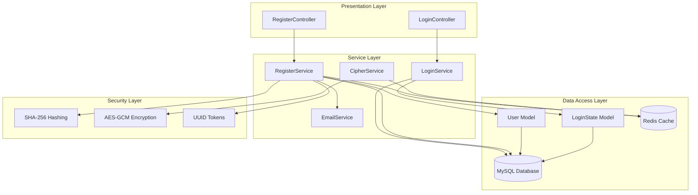
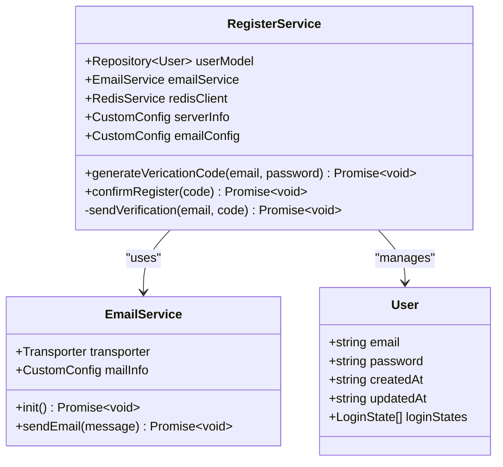
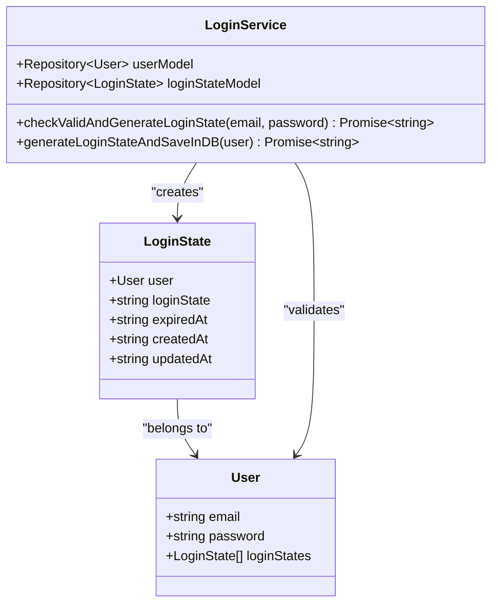
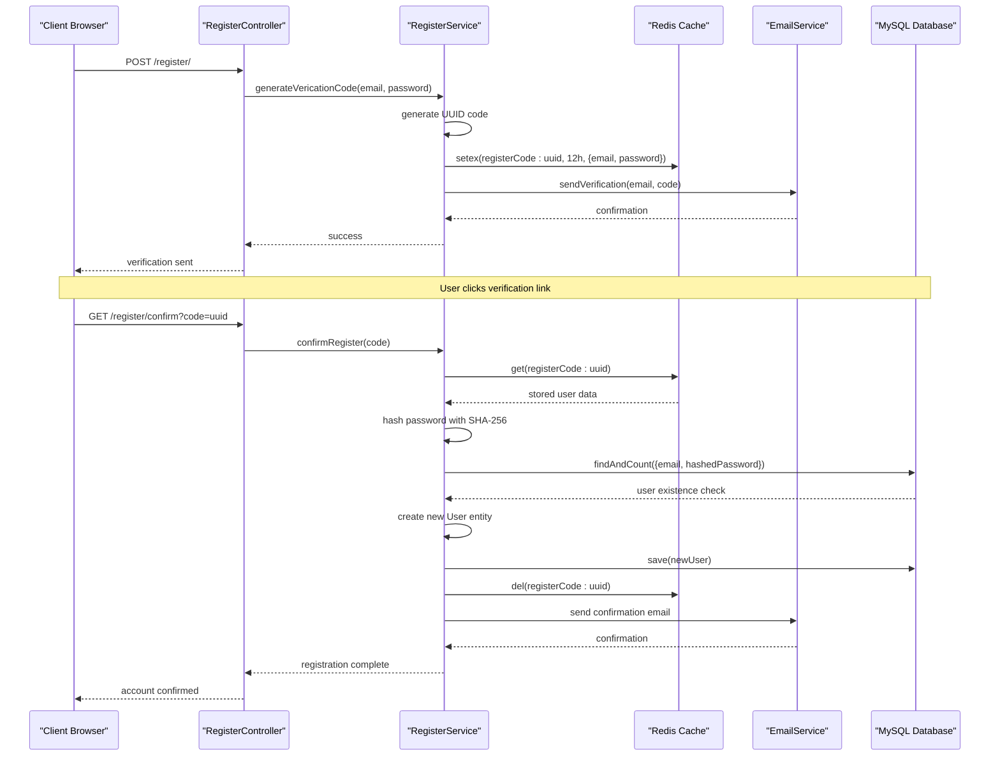
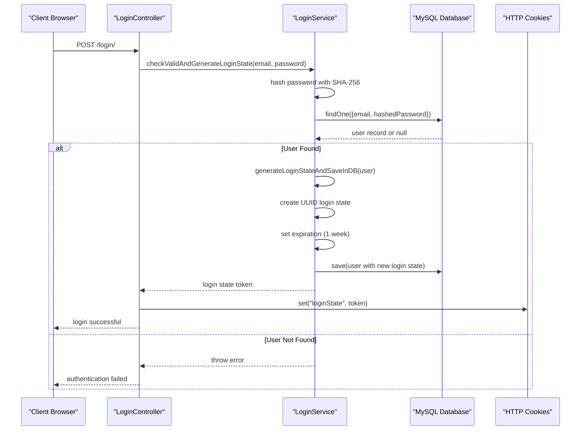
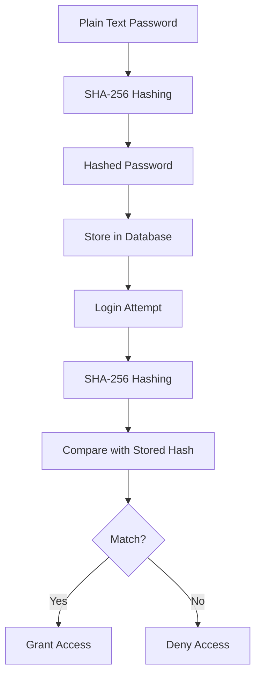
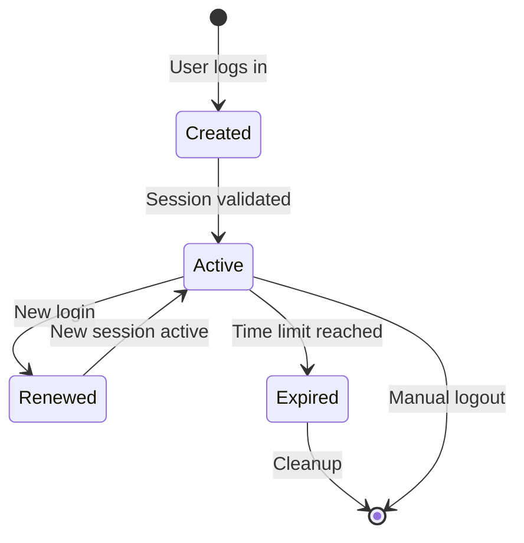
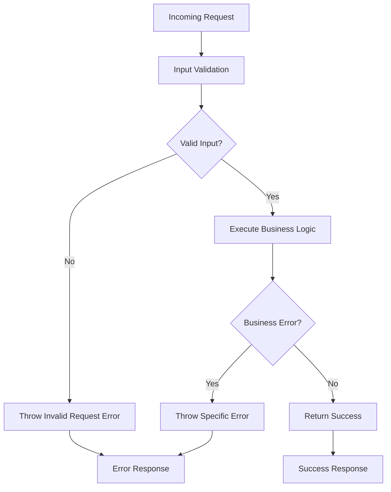
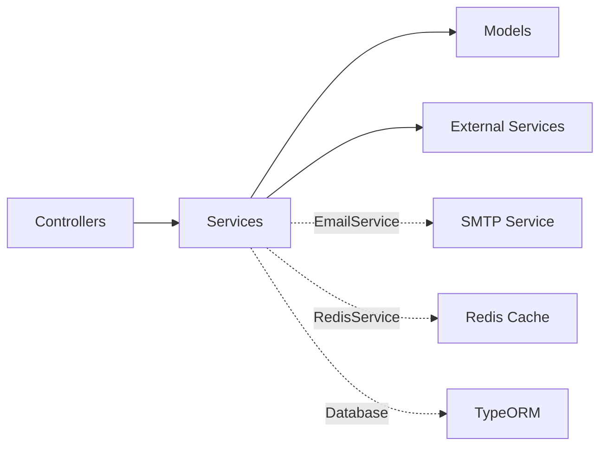

# Authentication Service

<cite>
**Referenced Files in This Document**
- [src/service/register.ts](file://src/service/register.ts)
- [src/service/email.ts](file://src/service/email.ts)
- [src/service/cipher.ts](file://src/service/cipher.ts)
- [src/service/login.ts](file://src/service/login.ts)
- [src/controller/register.ts](file://src/controller/register.ts)
- [src/controller/login.ts](file://src/controller/login.ts)
- [src/middleware/loginStateCheck.ts](file://src/middleware/loginStateCheck.ts)
- [src/model/user.ts](file://src/model/user.ts)
- [src/model/loginState.ts](file://src/model/loginState.ts)
- [src/const.ts](file://src/const.ts)
- [src/errorCode.ts](file://src/errorCode.ts)
- [src/utils/databaseTransactionWrapper.ts](file://src/utils/databaseTransactionWrapper.ts)
- [src/config/config.default.ts](file://src/config/config.default.ts)
</cite>

## Table of Contents
1. [Introduction](#introduction)
2. [System Architecture](#system-architecture)
3. [Core Components](#core-components)
4. [Registration Process](#registration-process)
5. [Login Process](#login-process)
6. [Security Implementation](#security-implementation)
7. [Session Management](#session-management)
8. [Error Handling](#error-handling)
9. [Integration Patterns](#integration-patterns)
10. [Common Issues and Solutions](#common-issues-and-solutions)
11. [Best Practices](#best-practices)
12. [Conclusion](#conclusion)

## Introduction

The authentication service in the Goods Hunter application provides a comprehensive user authentication system with secure registration, login, and session management capabilities. Built on a microservices architecture using Midway.js framework, it implements industry-standard security practices including SHA-256 password hashing, Redis-based verification tokens, and AES-GCM encryption for secure payload handling.

The system consists of multiple interconnected components that work together to provide a seamless authentication experience while maintaining high security standards. It integrates with TypeORM for database operations, Redis for caching and temporary storage, and SMTP for email notifications.

## System Architecture

The authentication service follows a layered architecture pattern with clear separation of concerns:

**Diagram sources**
- [src/controller/register.ts](file://src/controller/register.ts#L1-L44)
- [src/controller/login.ts](file://src/controller/login.ts#L1-L38)
- [src/service/register.ts](file://src/service/register.ts#L1-L77)
- [src/service/login.ts](file://src/service/login.ts#L1-L48)
- [src/service/email.ts](file://src/service/email.ts#L1-L30)
- [src/service/cipher.ts](file://src/service/cipher.ts#L1-L117)

## Core Components

### RegisterService

The RegisterService handles the complete user registration workflow, including verification code generation and account confirmation. It manages the interaction between user data storage and email verification processes.

**Diagram sources**
- [src/service/register.ts](file://src/service/register.ts#L13-L77)
- [src/service/email.ts](file://src/service/email.ts#L6-L30)
- [src/model/user.ts](file://src/model/user.ts#L14-L42)

### LoginService

The LoginService manages user authentication and session creation, implementing secure password verification and login state generation.

**Diagram sources**
- [src/service/login.ts](file://src/service/login.ts#L12-L48)
- [src/model/loginState.ts](file://src/model/loginState.ts#L5-L22)
- [src/model/user.ts](file://src/model/user.ts#L14-L42)

### EmailService

The EmailService provides SMTP-based email functionality for verification and notification purposes.

### CipherService

The CipherService implements AES-GCM encryption for secure payload handling, including message consumption tracking to prevent replay attacks.

**Section sources**
- [src/service/register.ts](file://src/service/register.ts#L13-L77)
- [src/service/login.ts](file://src/service/login.ts#L12-L48)
- [src/service/email.ts](file://src/service/email.ts#L6-L30)
- [src/service/cipher.ts](file://src/service/cipher.ts#L11-L117)

## Registration Process

The registration process involves multiple steps with careful security measures to ensure user data protection and prevent abuse.

### Registration Workflow

**Diagram sources**
- [src/controller/register.ts](file://src/controller/register.ts#L23-L43)
- [src/service/register.ts](file://src/service/register.ts#L38-L73)
- [src/service/email.ts](file://src/service/email.ts#L22-L27)

### Verification Code Generation

The verification code generation process creates temporary, time-limited tokens stored in Redis:

- **Token Duration**: 12 hours expiration
- **Storage Format**: JSON string containing email and password
- **Security Measures**: UUID-based unique identifiers
- **Temporary Storage**: Redis with automatic expiration

### Account Confirmation Process

The confirmation process validates the verification code and creates a new user account:

1. **Code Validation**: Checks Redis for valid, unexpired code
2. **Password Hashing**: Uses SHA-256 for password security
3. **Duplicate Prevention**: Validates against existing user records
4. **Database Transaction**: Ensures atomic operation completion
5. **Cleanup**: Removes verification code from Redis

**Section sources**
- [src/controller/register.ts](file://src/controller/register.ts#L23-L43)
- [src/service/register.ts](file://src/service/register.ts#L38-L73)
- [src/const.ts](file://src/const.ts#L1-L12)

## Login Process

The login process provides secure user authentication with session management and automatic session renewal.

### Login Workflow

**Diagram sources**
- [src/controller/login.ts](file://src/controller/login.ts#L22-L36)
- [src/service/login.ts](file://src/service/login.ts#L20-L46)

### Session State Management

The login service implements robust session management:

- **Token Generation**: UUID-based unique session identifiers
- **Expiration Control**: 1-week session duration
- **Automatic Renewal**: New tokens generated on successful login
- **Database Persistence**: Session states stored with user relationships

**Section sources**
- [src/controller/login.ts](file://src/controller/login.ts#L22-L36)
- [src/service/login.ts](file://src/service/login.ts#L20-L46)

## Security Implementation

The authentication service implements multiple layers of security to protect user data and prevent unauthorized access.

### Password Hashing

Password security is implemented using SHA-256 hashing:

**Diagram sources**
- [src/service/login.ts](file://src/service/login.ts#L21-L32)
- [src/service/register.ts](file://src/service/register.ts#L54-L55)

### Encryption Utilities

The CipherService provides AES-GCM encryption for secure payload handling:

- **Encryption Algorithm**: AES-GCM (Authenticated Encryption)
- **Key Management**: JWK (JSON Web Key) format
- **Initialization Vector**: Random IV generation for each encryption
- **Message Consumption**: Redis-based tracking to prevent replay attacks

### Token Security

Verification tokens implement several security measures:

- **UUID Generation**: Cryptographically secure random identifiers
- **Time-based Expiration**: Automatic cleanup after 12 hours
- **Redis Storage**: Fast, temporary storage with automatic expiration
- **Single-use**: Tokens are deleted after successful confirmation

**Section sources**
- [src/service/cipher.ts](file://src/service/cipher.ts#L11-L117)
- [src/service/register.ts](file://src/service/register.ts#L54-L55)

## Session Management

The session management system uses LoginState entities to track user authentication sessions with comprehensive lifecycle management.

### LoginState Entity

The LoginState entity defines the session structure:

| Field | Type | Description | Constraints |
|-------|------|-------------|-------------|
| loginState | varchar | Unique session identifier | Primary key, auto-generated |
| expiredAt | datetime | Session expiration timestamp | Not null |
| createdAt | datetime | Session creation timestamp | Auto-generated |
| updatedAt | datetime | Session update timestamp | Auto-generated |

### Session Lifecycle

**Diagram sources**
- [src/model/loginState.ts](file://src/model/loginState.ts#L5-L22)
- [src/service/login.ts](file://src/service/login.ts#L37-L46)

### Middleware Integration

The LoginStateCheck middleware validates session authenticity:

- **Cookie Extraction**: Retrieves loginState from HTTP cookies
- **Database Validation**: Verifies session existence and validity
- **Expiration Check**: Ensures session hasn't expired
- **User Context**: Attaches user information to request context

**Section sources**
- [src/model/loginState.ts](file://src/model/loginState.ts#L5-L22)
- [src/middleware/loginStateCheck.ts](file://src/middleware/loginStateCheck.ts#L13-L54)

## Error Handling

The authentication service implements comprehensive error handling with structured error codes and meaningful error messages.

### Error Code Structure

The error system uses a hierarchical numbering scheme:

| Category | Service | Code | Description |
|----------|---------|------|-------------|
| Register | RegisterService | 040401 | User already exists |
| Register | RegisterService | 040402 | Invalid verification code |
| Login | LoginService | 030301 | Wrong email or password |
| Common | Common | 040001 | Invalid request body |

### Error Handling Patterns

**Diagram sources**
- [src/errorCode.ts](file://src/errorCode.ts#L37-L75)

**Section sources**
- [src/errorCode.ts](file://src/errorCode.ts#L37-L75)

## Integration Patterns

The authentication service demonstrates several integration patterns that ensure loose coupling and high maintainability.

### Service Communication

Services communicate through well-defined interfaces:

**Diagram sources**
- [src/controller/register.ts](file://src/controller/register.ts#L14-L22)
- [src/controller/login.ts](file://src/controller/login.ts#L13-L21)
- [src/service/register.ts](file://src/service/register.ts#L18-L22)

### Dependency Injection

The system uses Midway.js dependency injection for loose coupling:

- **Service Registration**: Automatic service discovery and instantiation
- **Interface Abstraction**: Services depend on interfaces, not concrete implementations
- **Configuration Injection**: Environment-specific configuration injection
- **Lifecycle Management**: Automatic initialization and cleanup

### Database Transactions

The system implements transaction safety for critical operations:

- **Atomic Operations**: User creation and verification code deletion occur atomically
- **Rollback Safety**: Failed operations automatically roll back changes
- **Consistency Guarantees**: Database integrity maintained during concurrent operations

**Section sources**
- [src/utils/databaseTransactionWrapper.ts](file://src/utils/databaseTransactionWrapper.ts#L15-L51)
- [src/service/register.ts](file://src/service/register.ts#L65-L66)

## Common Issues and Solutions

### Expired Verification Links

**Problem**: Users receive emails with expired verification links.

**Solution**: The system implements automatic cleanup of expired verification codes in Redis with 12-hour TTL. If a user attempts to use an expired link, they receive a specific error message indicating the verification code has expired.

### Duplicate Registrations

**Problem**: Users attempt to register with existing email addresses.

**Solution**: The registration process performs a database check before creating new accounts. If a user with the same email already exists, the system throws a "user already exists" error.

### Session Timeout Issues

**Problem**: Users experience unexpected logout due to session expiration.

**Solution**: The system generates new session tokens on each successful login, extending the session duration. Users remain logged in as long as they continue to authenticate.

### Email Delivery Failures

**Problem**: Verification emails fail to deliver.

**Solution**: The EmailService implements retry mechanisms and provides detailed error reporting. Configuration errors are caught during service initialization.

### Security Vulnerabilities

**Problem**: Potential security risks in password handling or token generation.

**Solution**: The system uses industry-standard cryptographic practices:
- SHA-256 for password hashing
- AES-GCM for payload encryption
- UUID for secure token generation
- Redis-based temporary storage with automatic cleanup

## Best Practices

### Security Best Practices

1. **Password Protection**: Always hash passwords using strong algorithms (SHA-256)
2. **Token Security**: Use cryptographically secure random tokens
3. **Temporary Storage**: Store sensitive data temporarily with appropriate expiration
4. **Input Validation**: Validate all user inputs before processing
5. **Error Handling**: Provide meaningful error messages without exposing sensitive information

### Performance Best Practices

1. **Caching Strategy**: Use Redis for temporary data storage and caching
2. **Database Optimization**: Implement proper indexing and query optimization
3. **Connection Pooling**: Utilize connection pooling for database and Redis connections
4. **Async Operations**: Use asynchronous operations for I/O-bound tasks
5. **Resource Management**: Properly manage resource allocation and cleanup

### Maintainability Best Practices

1. **Separation of Concerns**: Separate business logic, data access, and presentation layers
2. **Dependency Injection**: Use DI containers for loose coupling
3. **Error Codes**: Implement structured error code systems
4. **Logging**: Add comprehensive logging for debugging and monitoring
5. **Testing**: Implement unit and integration tests for critical components

### Scalability Best Practices

1. **Stateless Design**: Design services to be stateless where possible
2. **Horizontal Scaling**: Use distributed systems for horizontal scaling
3. **Load Balancing**: Implement load balancing for high availability
4. **Database Sharding**: Consider database sharding for large datasets
5. **Monitoring**: Implement comprehensive monitoring and alerting

## Conclusion

The authentication service in the Goods Hunter application demonstrates a comprehensive approach to user authentication with strong security measures, robust error handling, and scalable architecture. The system successfully implements industry-standard practices including SHA-256 password hashing, Redis-based verification tokens, and AES-GCM encryption for secure payload handling.

Key strengths of the implementation include:

- **Security Focus**: Multiple layers of security with proper cryptographic practices
- **Reliability**: Comprehensive error handling and transaction safety
- **Scalability**: Well-designed architecture supporting future growth
- **Maintainability**: Clean separation of concerns and dependency injection
- **Usability**: Clear error messages and intuitive user workflows

The service provides a solid foundation for user authentication while maintaining flexibility for future enhancements and modifications. The modular design ensures that individual components can be improved or replaced without affecting the overall system architecture.

For developers working with this authentication service, the clear separation of concerns, comprehensive error handling, and well-documented interfaces make it easy to understand, modify, and extend according to specific requirements.