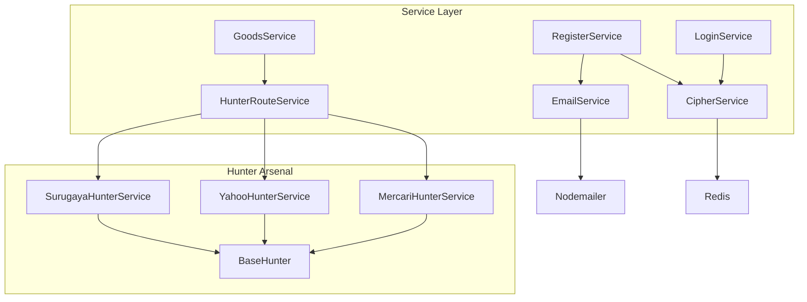
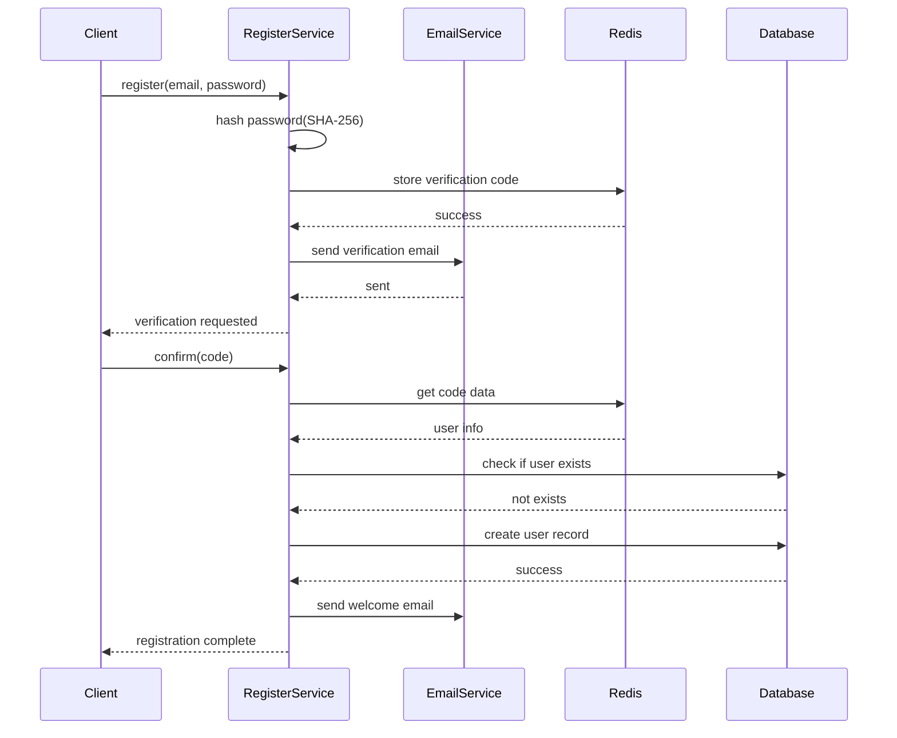
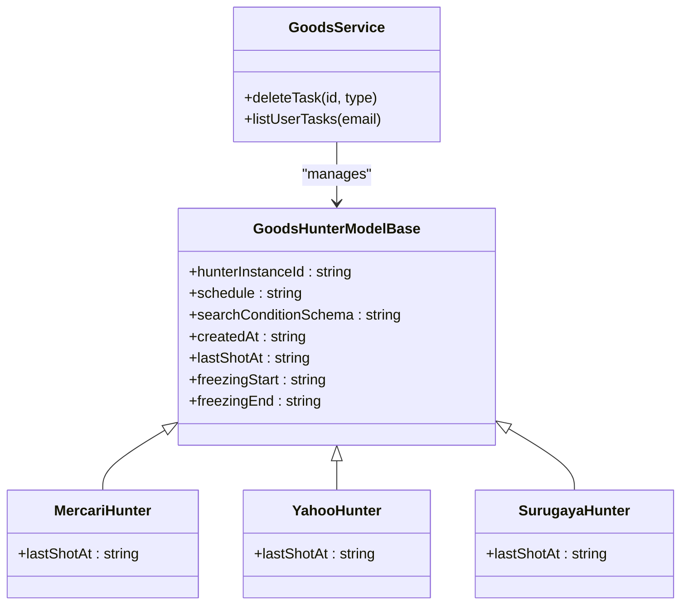
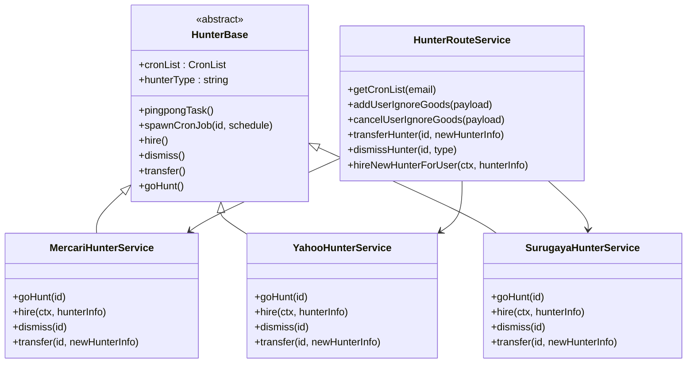
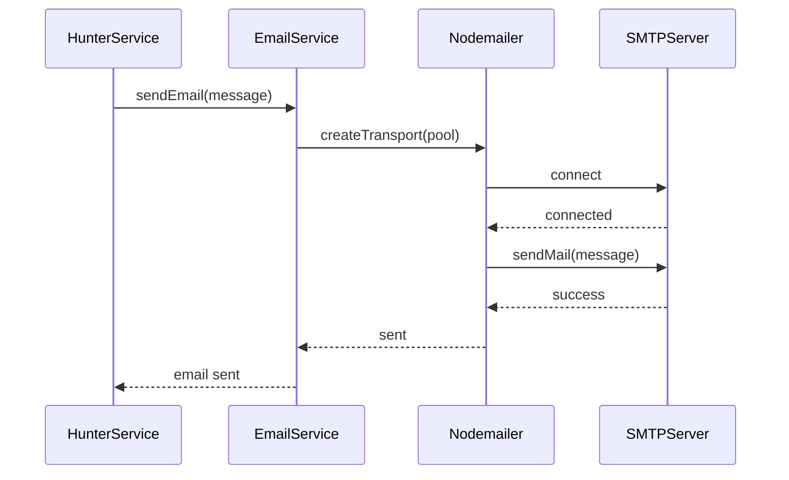
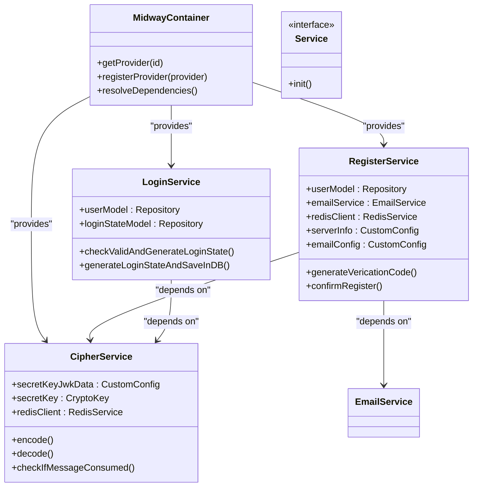
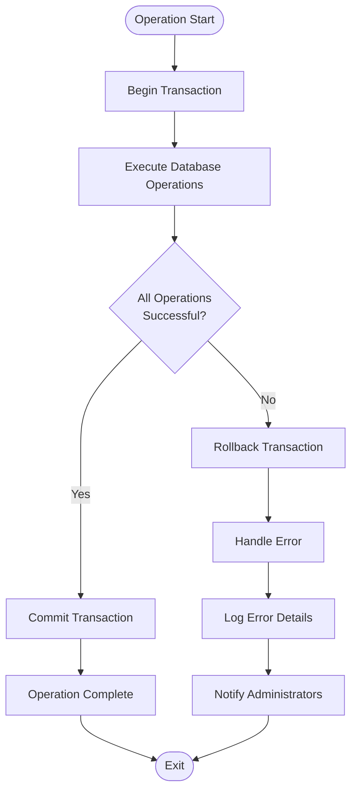
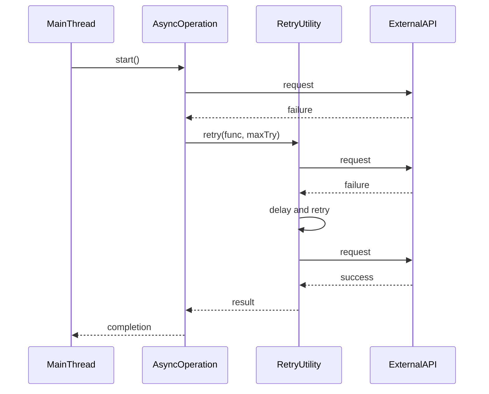

# Business Logic Layer

<cite>
**Referenced Files in This Document**   
- [cipher.ts](file://src/service/cipher.ts)
- [email.ts](file://src/service/email.ts)
- [goods.ts](file://src/service/goods.ts)
- [login.ts](file://src/service/login.ts)
- [register.ts](file://src/service/register.ts)
- [hunterArsenal/base.ts](file://src/service/hunterArsenal/base.ts)
- [hunterArsenal/mercari.ts](file://src/service/hunterArsenal/mercari.ts)
- [hunterArsenal/surugaya.ts](file://src/service/hunterArsenal/surugaya.ts)
- [hunterArsenal/yahoo.ts](file://src/service/hunterArsenal/yahoo.ts)
- [hunterRouteService.ts](file://src/service/hunterRouteService.ts)
- [databaseTransactionWrapper.ts](file://src/utils/databaseTransactionWrapper.ts)
- [doThisUntilResolve.ts](file://src/utils/doThisUntilResolve.ts)
- [user.ts](file://src/model/user.ts)
</cite>

## Table of Contents
1. [Service Layer Architecture](#service-layer-architecture)
2. [Authentication Services](#authentication-services)
3. [Goods Monitoring and Task Management](#goods-monitoring-and-task-management)
4. [Hunter Arsenal Strategy Pattern](#hunter-arsenal-strategy-pattern)
5. [Email Notification System](#email-notification-system)
6. [Proxy Handling and External Integration](#proxy-handling-and-external-integration)
7. [Service Pattern and Dependency Injection](#service-pattern-and-dependency-injection)
8. [Error Handling and Transaction Safety](#error-handling-and-transaction-safety)
9. [Asynchronous Processing and Utilities](#asynchronous-processing-and-utilities)

## Service Layer Architecture

The service layer in the goods_hunter application implements a comprehensive business logic system that orchestrates various core functionalities including authentication, goods monitoring, marketplace scraping, email notifications, and proxy handling. The architecture follows the Service pattern with dependency injection through Midway.js, enabling clean separation of concerns and modular design.

The services are organized into distinct modules within the `src/service` directory, each responsible for specific business capabilities. The core services include authentication (login, registration), goods monitoring, hunter arsenal (marketplace-specific scrapers), email notifications, and proxy management. These services interact with models for data persistence and API clients for external integrations.

**Diagram sources**
- [login.ts](file://src/service/login.ts)
- [register.ts](file://src/service/register.ts)
- [goods.ts](file://src/service/goods.ts)
- [email.ts](file://src/service/email.ts)
- [hunterRouteService.ts](file://src/service/hunterRouteService.ts)
- [cipher.ts](file://src/service/cipher.ts)
- [hunterArsenal/base.ts](file://src/service/hunterArsenal/base.ts)
- [hunterArsenal/mercari.ts](file://src/service/hunterArsenal/mercari.ts)
- [hunterArsenal/yahoo.ts](file://src/service/hunterArsenal/yahoo.ts)
- [hunterArsenal/surugaya.ts](file://src/service/hunterArsenal/surugaya.ts)

**Section sources**
- [src/service](file://src/service)
- [src/utils](file://src/utils)

## Authentication Services

The authentication system in goods_hunter consists of two primary services: login and registration. These services handle user authentication with secure password hashing and session management. The registration process includes email verification through Nodemailer, ensuring only valid users can access the system.

The `RegisterService` implements a multi-step registration flow that begins with password hashing using SHA-256, storing verification codes in Redis with expiration, and sending confirmation emails. Upon verification, the user account is created in the database with hashed credentials. The `LoginService` validates user credentials against the stored hash and generates time-limited login states that are stored in the database.

**Diagram sources**
- [register.ts](file://src/service/register.ts)
- [login.ts](file://src/service/login.ts)
- [email.ts](file://src/service/email.ts)
- [cipher.ts](file://src/service/cipher.ts)

**Section sources**
- [register.ts](file://src/service/register.ts#L1-L77)
- [login.ts](file://src/service/login.ts#L1-L48)

## Goods Monitoring and Task Management

The goods monitoring system enables users to create tasks for tracking items on various marketplaces. The `GoodsService` provides core functionality for managing these monitoring tasks, including task creation, deletion, and status management. Each task is associated with a specific marketplace (Mercari, Yahoo, or Surugaya) and contains search criteria for identifying relevant items.

Tasks are implemented as cron jobs that execute at scheduled intervals to check for new items matching the user's criteria. The system maintains task state in both the database and in-memory cron job registry, ensuring persistence across application restarts. Users can manage their tasks through the service layer, with proper permission checks to prevent unauthorized access to other users' monitoring tasks.

**Diagram sources**
- [goods.ts](file://src/service/goods.ts)
- [model/mercariHunter.ts](file://src/model/mercariHunter.ts)
- [model/yahooHunter.ts](file://src/model/yahooHunter.ts)
- [model/surugaya.ts](file://src/model/surugaya.ts)

**Section sources**
- [goods.ts](file://src/service/goods.ts#L1-L66)

## Hunter Arsenal Strategy Pattern

The hunter arsenal implements a sophisticated strategy pattern for marketplace-specific scraping operations. At the core of this pattern is the `HunterBase` abstract class in `base.ts`, which defines common behavior and interfaces for all marketplace hunters. This base class provides shared functionality including cron job management, ping-pong health checks, and dependency injection of common services.

Concrete implementations for Mercari, Yahoo, and Surugaya extend the base class, providing site-specific logic for fetching goods lists, parsing responses, and handling marketplace-specific requirements. Each concrete hunter service is decorated with Midway.js decorators for dependency injection and singleton scope, ensuring proper lifecycle management.

The strategy pattern enables the application to handle multiple marketplaces with a consistent interface while allowing for specialized behavior where needed. The `HunterRouteService` acts as a facade that routes requests to the appropriate hunter service based on the marketplace type, abstracting the complexity from higher-level components.

**Diagram sources**
- [hunterArsenal/base.ts](file://src/service/hunterArsenal/base.ts)
- [hunterArsenal/mercari.ts](file://src/service/hunterArsenal/mercari.ts)
- [hunterArsenal/yahoo.ts](file://src/service/hunterArsenal/yahoo.ts)
- [hunterArsenal/surugaya.ts](file://src/service/hunterArsenal/surugaya.ts)
- [hunterRouteService.ts](file://src/service/hunterRouteService.ts)

**Section sources**
- [hunterArsenal/base.ts](file://src/service/hunterArsenal/base.ts#L1-L88)
- [hunterArsenal/mercari.ts](file://src/service/hunterArsenal/mercari.ts#L1-L339)
- [hunterArsenal/yahoo.ts](file://src/service/hunterArsenal/yahoo.ts#L1-L363)
- [hunterArsenal/surugaya.ts](file://src/service/hunterArsenal/surugaya.ts#L1-L345)

## Email Notification System

The email notification system is implemented through the `EmailService` class, which provides a wrapper around Nodemailer for sending transactional emails. The service is configured with SMTP settings from the application configuration and uses connection pooling for efficient email delivery.

Emails are sent at various points in the application workflow, including user registration confirmation, welcome messages, and goods update notifications. The system uses EJS templates to generate HTML email content, ensuring consistent formatting and branding. Each marketplace hunter service injects the email service to notify users when new items matching their criteria are found.

The email service follows the singleton pattern, ensuring that a single connection pool is shared across the application. This approach reduces the overhead of establishing new connections for each email and improves overall performance.

**Diagram sources**
- [email.ts](file://src/service/email.ts)
- [hunterArsenal/mercari.ts](file://src/service/hunterArsenal/mercari.ts)
- [hunterArsenal/yahoo.ts](file://src/service/hunterArsenal/yahoo.ts)
- [hunterArsenal/surugaya.ts](file://src/service/hunterArsenal/surugaya.ts)

**Section sources**
- [email.ts](file://src/service/email.ts#L1-L30)

## Proxy Handling and External Integration

The application handles external integrations through dedicated API clients in the `src/api/site` directory. These clients abstract the details of communicating with external marketplaces, providing a consistent interface for the hunter services. While proxy handling configuration is not explicitly visible in the provided code, the architecture supports integration with proxy services through configuration.

The marketplace API clients (Mercari, Yahoo, Surugaya) handle HTTP requests to their respective platforms, parsing responses and handling errors. These clients are injected into the corresponding hunter services, enabling them to fetch goods lists based on user-defined search criteria. The clients are designed to handle marketplace-specific authentication requirements, such as Yahoo's cookie-based authentication.

The system also uses Redis for various purposes including storing verification codes, tracking ignored goods, and maintaining cipher trash bins to prevent message replay attacks. This distributed state management enables the application to scale horizontally while maintaining consistency.

**Section sources**
- [api/site/mercari/index.ts](file://src/api/site/mercari/index.ts)
- [api/site/yahoo/index.ts](file://src/api/site/yahoo/index.ts)
- [api/site/surugaya/index.ts](file://src/api/site/surugaya/index.ts)
- [service/cipher.ts](file://src/service/cipher.ts)

## Service Pattern and Dependency Injection

The goods_hunter application extensively uses the Service pattern with dependency injection through Midway.js. Each service is decorated with `@Provide()` and appropriate scope decorators, making them available for injection into other components. The dependency injection container manages the lifecycle of services, ensuring proper initialization and disposal.

Services declare their dependencies using the `@Inject()` decorator, which the container resolves at runtime. This approach promotes loose coupling and makes the code more testable, as dependencies can be easily mocked or replaced. The application uses singleton scope for most services, ensuring a single instance is shared across the application.

The `databaseTransactionWrapper` utility is injected into hunter services to provide transactional safety when updating database records. This wrapper ensures that related database operations are executed within a single transaction, maintaining data consistency even in the event of errors.

**Diagram sources**
- [login.ts](file://src/service/login.ts)
- [register.ts](file://src/service/register.ts)
- [cipher.ts](file://src/service/cipher.ts)
- [email.ts](file://src/service/email.ts)
- [databaseTransactionWrapper.ts](file://src/utils/databaseTransactionWrapper.ts)

**Section sources**
- [login.ts](file://src/service/login.ts#L1-L48)
- [register.ts](file://src/service/register.ts#L1-L77)
- [cipher.ts](file://src/service/cipher.ts#L1-L117)
- [databaseTransactionWrapper.ts](file://src/utils/databaseTransactionWrapper.ts#L1-L51)

## Error Handling and Transaction Safety

The application implements comprehensive error handling and transaction safety mechanisms to ensure data integrity and reliability. Each service method includes appropriate error handling, with specific error codes defined in the `errorCode` module. Errors are thrown as JavaScript Error objects with descriptive messages, enabling consistent error handling across the application.

The `databaseTransactionWrapper` utility provides transactional safety for database operations, ensuring that related changes are committed atomically. This is particularly important for operations like hiring a new hunter, where both database persistence and cron job creation must succeed together. If any part of the transaction fails, all changes are rolled back, preventing partial updates.

The cipher service implements message integrity checks using SHA-256 hashing, preventing tampering with encrypted payloads. It also maintains a "trash bin" in Redis to track consumed messages, preventing replay attacks. This security-focused error handling ensures that sensitive operations cannot be repeated or manipulated.

**Diagram sources**
- [databaseTransactionWrapper.ts](file://src/utils/databaseTransactionWrapper.ts)
- [cipher.ts](file://src/service/cipher.ts)
- [register.ts](file://src/service/register.ts)
- [errorCode.ts](file://src/errorCode.ts)

**Section sources**
- [databaseTransactionWrapper.ts](file://src/utils/databaseTransactionWrapper.ts#L1-L51)
- [cipher.ts](file://src/service/cipher.ts#L1-L117)

## Asynchronous Processing and Utilities

The application leverages asynchronous processing patterns extensively to handle I/O operations efficiently. All service methods return Promises, enabling non-blocking execution and allowing the application to handle multiple requests concurrently. The hunter services use cron jobs to schedule periodic monitoring tasks, with each job executing asynchronously when triggered.

The `doThisUntilResolve` utility implements a retry mechanism for operations that may fail due to transient issues. This function recursively calls the provided function until it succeeds or reaches the maximum number of attempts, making it ideal for handling flaky external API calls or temporary network issues.

The application also uses Promise.all() to parallelize independent operations, such as initializing multiple hunter services at startup. This approach maximizes throughput and reduces overall execution time. Event-driven patterns are used for cron job execution, with callbacks triggered at scheduled intervals to perform monitoring tasks.

**Diagram sources**
- [doThisUntilResolve.ts](file://src/utils/doThisUntilResolve.ts)
- [hunterArsenal/mercari.ts](file://src/service/hunterArsenal/mercari.ts)
- [hunterArsenal/yahoo.ts](file://src/service/hunterArsenal/yahoo.ts)
- [hunterArsenal/surugaya.ts](file://src/service/hunterArsenal/surugaya.ts)

**Section sources**
- [doThisUntilResolve.ts](file://src/utils/doThisUntilResolve.ts#L1-L18)