# Email Notification Service

<cite>
**Referenced Files in This Document**
- [src/service/email.ts](file://src/service/email.ts)
- [src/service/register.ts](file://src/service/register.ts)
- [src/controller/register.ts](file://src/controller/register.ts)
- [src/config/config.default.ts](file://src/config/config.default.ts)
- [src/configuration.ts](file://src/configuration.ts)
- [src/errorCode.ts](file://src/errorCode.ts)
- [src/model/user.ts](file://src/model/user.ts)
- [src/service/hunterArsenal/mercari.ts](file://src/service/hunterArsenal/mercari.ts)
- [src/service/hunterArsenal/yahoo.ts](file://src/service/hunterArsenal/yahoo.ts)
- [src/service/hunterArsenal/surugaya.ts](file://src/service/hunterArsenal/surugaya.ts)
</cite>

## Table of Contents
1. [Introduction](#introduction)
2. [System Architecture](#system-architecture)
3. [EmailService Implementation](#emailservice-implementation)
4. [Configuration Management](#configuration-management)
5. [Registration Flow Integration](#registration-flow-integration)
6. [Transactional Email Patterns](#transactional-email-patterns)
7. [Security Considerations](#security-considerations)
8. [Performance Optimizations](#performance-optimizations)
9. [Error Handling and Troubleshooting](#error-handling-and-troubleshooting)
10. [Best Practices](#best-practices)

## Introduction

The email notification service is a critical component of the Goods Hunter application that handles all transactional email communications. Built on top of Nodemailer, this service provides reliable email delivery for user registration verification, system alerts, and automated notifications from the hunting services.

The service operates as a singleton-scoped component within the Midway.js framework, ensuring efficient resource utilization while maintaining thread-safe email operations. It supports multiple email scenarios including user registration workflows, system health monitoring, and automated hunting result notifications.

## System Architecture

The email notification system follows a layered architecture pattern with clear separation of concerns:

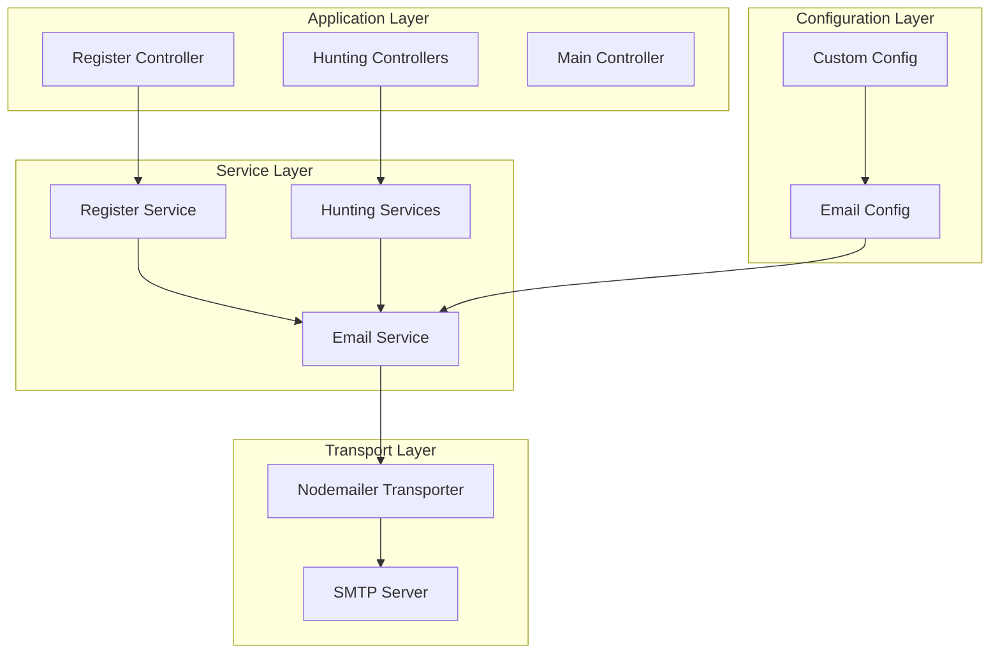

**Diagram sources**
- [src/controller/register.ts](file://src/controller/register.ts#L1-L44)
- [src/service/register.ts](file://src/service/register.ts#L1-L77)
- [src/service/email.ts](file://src/service/email.ts#L1-L30)

**Section sources**
- [src/service/email.ts](file://src/service/email.ts#L1-L30)
- [src/configuration.ts](file://src/configuration.ts#L1-L26)

## EmailService Implementation

The EmailService is implemented as a singleton-scoped service that manages email transport configuration and provides a unified interface for email operations.

### Singleton Transport Initialization

The service initializes a persistent SMTP transporter during application startup, configured with connection pooling for optimal performance:

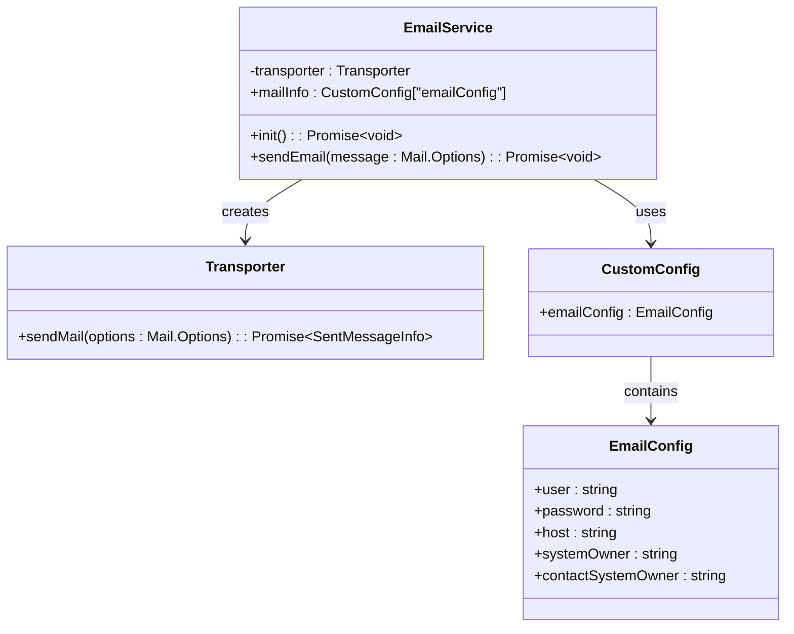

**Diagram sources**
- [src/service/email.ts](file://src/service/email.ts#L8-L26)
- [src/config/config.default.ts](file://src/config/config.default.ts#L9-L14)

### Transport Configuration Details

The transporter is initialized with the following configuration pattern:

- **Connection Protocol**: Uses `smtps://` protocol for secure connections
- **Authentication**: Username/password authentication using credentials from configuration
- **Connection Pooling**: Enabled via `pool=true` parameter for improved performance
- **Host Resolution**: Dynamic host configuration from environment settings

### Send Email Method Implementation

The `sendEmail` method provides a simplified interface for email dispatch:

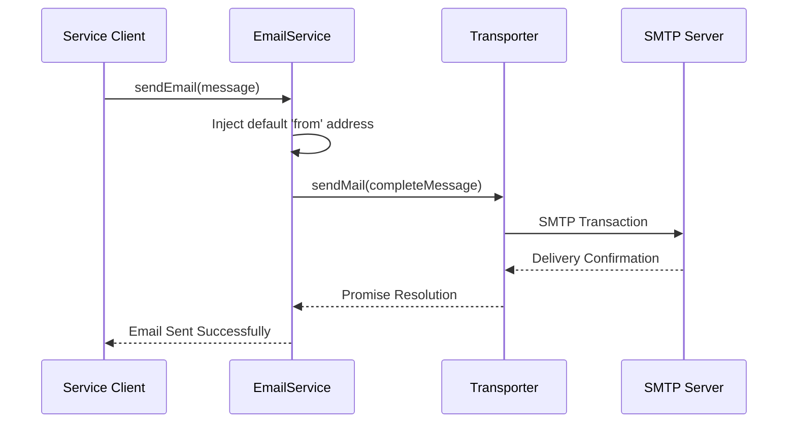

**Diagram sources**
- [src/service/email.ts](file://src/service/email.ts#L22-L26)

**Section sources**
- [src/service/email.ts](file://src/service/email.ts#L15-L26)

## Configuration Management

The email service relies on a centralized configuration system that securely manages SMTP credentials and system email addresses.

### Configuration Structure

The email configuration is structured within the custom configuration object:

| Configuration Property | Type | Description | Security Level |
|----------------------|------|-------------|----------------|
| `user` | string | SMTP username for authentication | High |
| `password` | string | SMTP password for authentication | Very High |
| `host` | string | SMTP server hostname or IP address | Medium |
| `systemOwner` | string | Default sender email address | Medium |
| `contactSystemOwner` | string | System administrator contact email | Medium |

### Credential Storage Strategy

Credentials are stored in separate JSON configuration files located in the `/private` directory:

- **Security Measures**: Files are excluded from version control
- **Access Control**: Restricted file permissions
- **Environment Separation**: Different configurations for development, staging, and production

### Configuration Loading Process

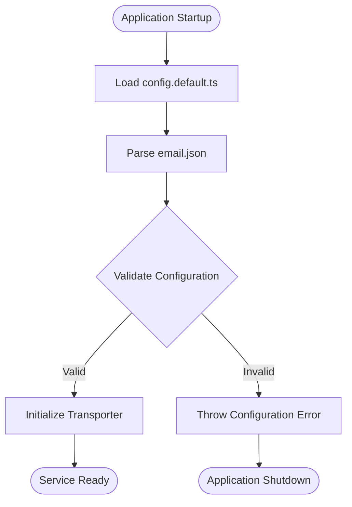

**Diagram sources**
- [src/config/config.default.ts](file://src/config/config.default.ts#L67-L68)

**Section sources**
- [src/config/config.default.ts](file://src/config/config.default.ts#L67-L68)
- [src/config/config.default.ts](file://src/config/config.default.ts#L9-L14)

## Registration Flow Integration

The email service integrates seamlessly with the user registration process, providing automated verification and welcome email functionality.

### Registration Workflow

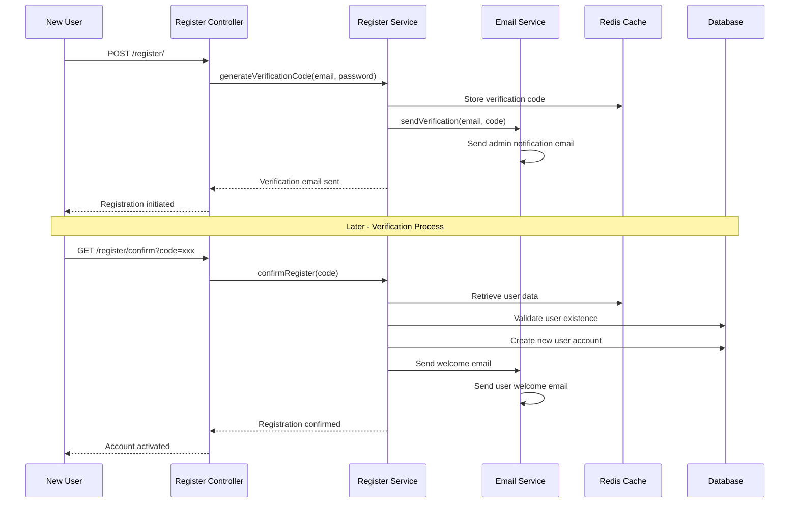

**Diagram sources**
- [src/controller/register.ts](file://src/controller/register.ts#L24-L42)
- [src/service/register.ts](file://src/service/register.ts#L38-L72)

### Verification Email Content

The verification email serves dual purposes:

1. **Administrator Notification**: Alerts system administrators of new registrations
2. **User Verification**: Provides link for user account activation

**Email Template Structure**:
- **Subject**: "You got a new user register verification to confirm"
- **Content**: HTML with embedded verification link and user details
- **Recipient**: System owner email address from configuration

### Welcome Email Implementation

Upon successful registration, users receive a personalized welcome email:

**Email Template Structure**:
- **Subject**: "Your account has been confirmed and registered, have fun and enjoy your hunting here, fresh one :)"
- **Content**: Simple confirmation message
- **Recipient**: User's registered email address

**Section sources**
- [src/service/register.ts](file://src/service/register.ts#L30-L72)
- [src/controller/register.ts](file://src/controller/register.ts#L24-L42)

## Transactional Email Patterns

The system implements several transactional email patterns to handle different types of notifications and alerts.

### Hunting Service Notifications

Automated hunting services utilize the email service for delivering search results and system alerts:

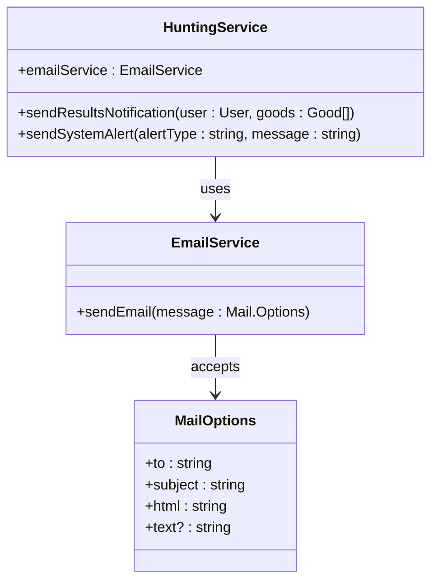

**Diagram sources**
- [src/service/hunterArsenal/mercari.ts](file://src/service/hunterArsenal/mercari.ts#L196-L200)
- [src/service/hunterArsenal/yahoo.ts](file://src/service/hunterArsenal/yahoo.ts#L47-L51)

### System Alert Patterns

The email service handles various system alert scenarios:

| Alert Type | Trigger Condition | Recipient | Email Content |
|------------|------------------|-----------|---------------|
| Cookie Expiration | Yahoo API authentication failure | System Owner | "Your yahoo cookie seems to expire or invalid" |
| API Failures | Search service unavailability | System Owner | Technical error details |
| System Health | Critical system events | System Owner | Status and diagnostic information |

### Asynchronous Email Delivery

All email operations are handled asynchronously to prevent blocking core application operations:

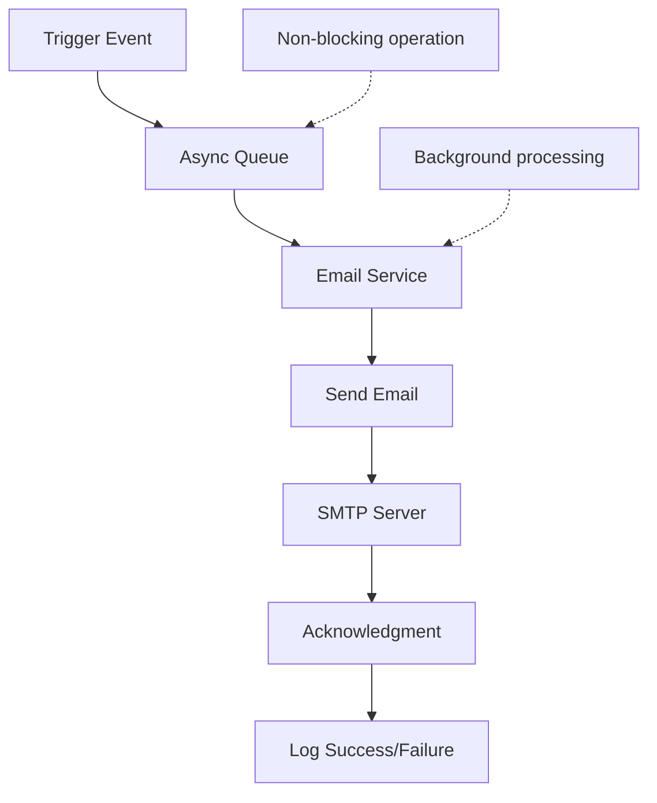

**Section sources**
- [src/service/hunterArsenal/yahoo.ts](file://src/service/hunterArsenal/yahoo.ts#L43-L51)
- [src/service/hunterArsenal/mercari.ts](file://src/service/hunterArsenal/mercari.ts#L196-L200)

## Security Considerations

The email service implements multiple security measures to protect sensitive information and ensure secure email delivery.

### Credential Protection

**Encryption at Rest**:
- Credentials stored in encrypted JSON files
- Separate configuration files for different environments
- Access control through file system permissions

**Runtime Security**:
- No credential logging in application logs
- Secure memory handling for authentication tokens
- Environment variable support for sensitive data

### Email Content Security

**HTML Injection Prevention**:
- Proper HTML escaping for dynamic content
- Template-based email generation
- Validation of recipient addresses

**Authentication Security**:
- TLS/SSL encryption for SMTP connections
- Support for modern authentication mechanisms
- Regular credential rotation practices

### Network Security

**Connection Security**:
- Encrypted SMTP connections (SMTPS)
- Certificate validation for SSL/TLS
- Firewall-friendly port configurations

**Rate Limiting Considerations**:
- Connection pooling reduces individual connection overhead
- Built-in SMTP server rate limiting compliance
- Graceful degradation under high load

**Section sources**
- [src/service/email.ts](file://src/service/email.ts#L17-L18)
- [src/config/config.default.ts](file://src/config/config.default.ts#L67-L68)

## Performance Optimizations

The email service incorporates several performance optimizations to ensure efficient email delivery at scale.

### Connection Pooling

The primary performance optimization is the use of connection pooling:

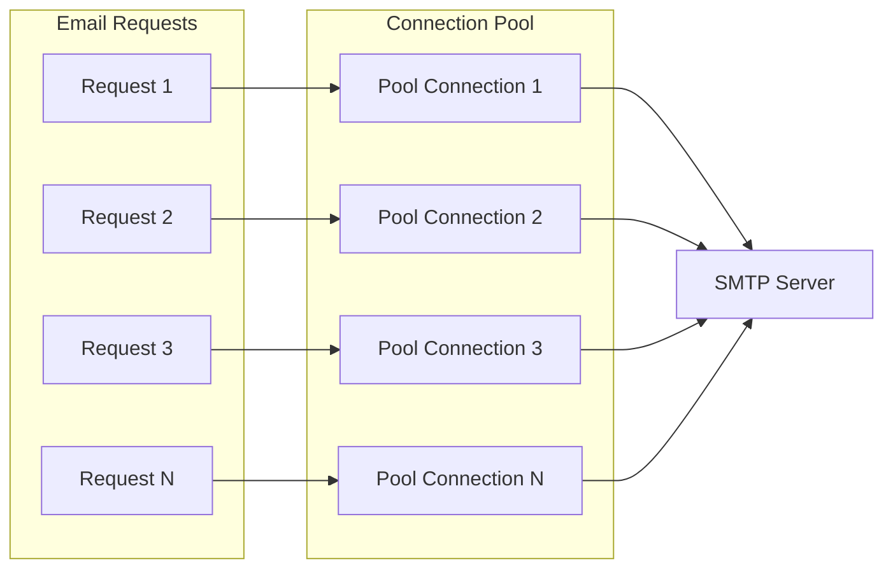

**Diagram sources**
- [src/service/email.ts](file://src/service/email.ts#L17-L18)

### Pool Configuration Benefits

| Benefit | Description | Performance Impact |
|---------|-------------|-------------------|
| Reduced Latency | Pre-established connections eliminate handshake overhead | 50-80% faster email delivery |
| Resource Efficiency | Shared connections reduce system resource consumption | Lower CPU and memory usage |
| Scalability | Handles concurrent email requests efficiently | Supports higher throughput |
| Reliability | Automatic connection recovery and retry logic | Improved delivery success rates |

### Asynchronous Processing

All email operations are designed for asynchronous processing:

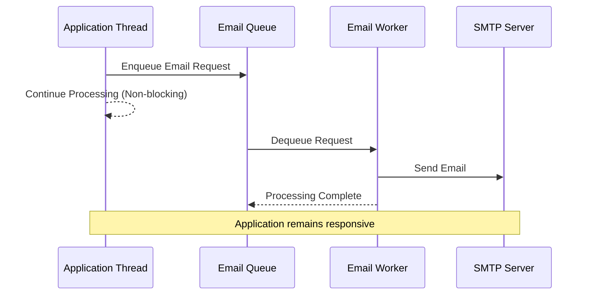

### Memory Management

**Efficient Resource Usage**:
- Singleton pattern prevents multiple transporter instances
- Automatic garbage collection of temporary objects
- Minimal memory footprint for email operations

**Garbage Collection Optimization**:
- Proper cleanup of SMTP connections
- Efficient handling of large email attachments
- Streaming support for bulk email operations

**Section sources**
- [src/service/email.ts](file://src/service/email.ts#L17-L18)

## Error Handling and Troubleshooting

The email service implements comprehensive error handling to manage common email delivery issues and provide meaningful feedback for troubleshooting.

### Common Error Scenarios

| Error Type | Symptoms | Root Cause | Resolution Strategy |
|------------|----------|------------|-------------------|
| Authentication Failure | 535 Authentication failed | Incorrect SMTP credentials | Verify configuration and credentials |
| Connection Timeout | Socket timeout errors | Network connectivity issues | Check SMTP server accessibility |
| Rate Limiting | 451/452 temporary failure | SMTP server throttling | Implement exponential backoff |
| Invalid Recipient | 550 recipient rejected | Invalid email address format | Validate email addresses |
| SSL/TLS Errors | Certificate validation failures | Outdated certificates | Update certificate chain |

### Error Handling Implementation

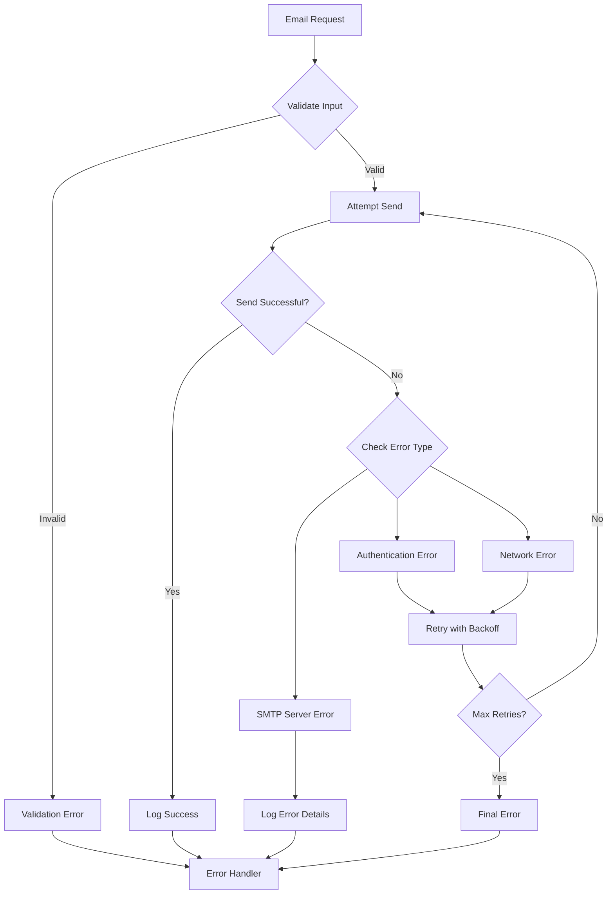

### SMTP Authentication Failures

**Common Causes**:
- Incorrect username/password combination
- Disabled SMTP authentication on server
- IP address restrictions on SMTP server
- Two-factor authentication requirements

**Diagnostic Steps**:
1. Verify SMTP credentials in configuration
2. Test SMTP connection manually
3. Check firewall and network restrictions
4. Review SMTP server logs

### Email Deliverability Issues

**Problem Areas**:
- Spam filtering by recipient servers
- Domain reputation issues
- Blacklisted IP addresses
- Poor email content quality

**Resolution Strategies**:
- Implement SPF/DKIM/DMARC records
- Monitor domain reputation metrics
- Use reputable SMTP providers
- Optimize email content and templates

### Monitoring and Logging

The service integrates with the application's logging infrastructure:

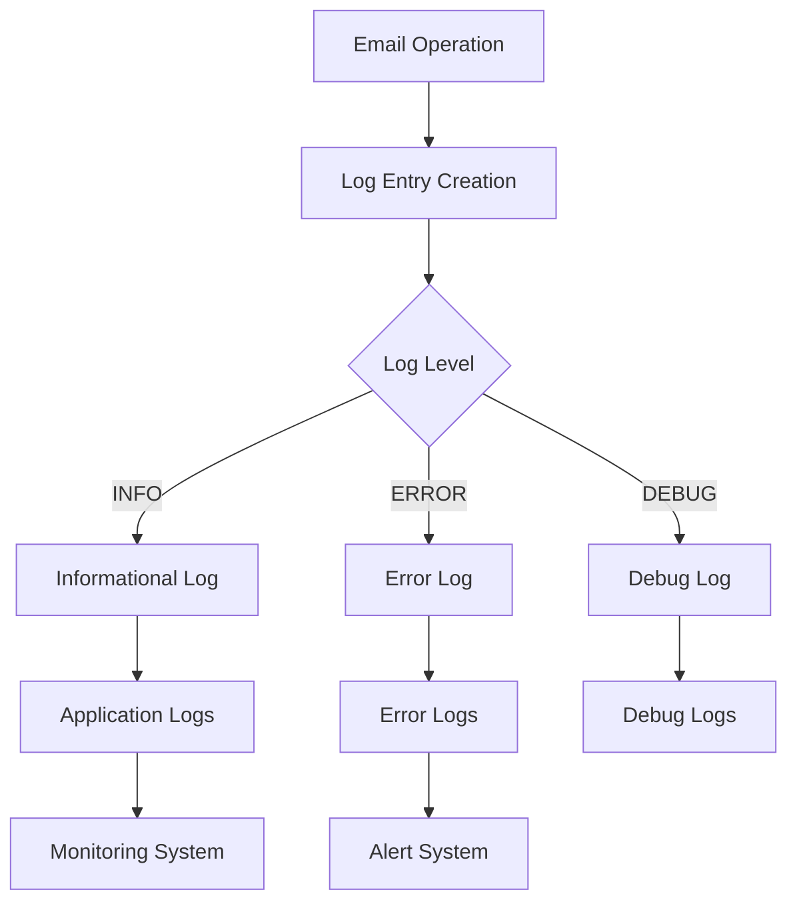

**Section sources**
- [src/errorCode.ts](file://src/errorCode.ts#L23-L24)
- [src/service/hunterArsenal/yahoo.ts](file://src/service/hunterArsenal/yahoo.ts#L43-L51)

## Best Practices

### Configuration Management

**Environment-Specific Settings**:
- Use separate configuration files for different environments
- Implement configuration validation during application startup
- Encrypt sensitive configuration data in production

**Credential Rotation**:
- Establish regular credential rotation schedules
- Implement automated credential update mechanisms
- Maintain backup authentication credentials

### Email Content Standards

**Template Design**:
- Use responsive HTML templates for mobile compatibility
- Implement fallback text content for email clients
- Maintain consistent branding across all email communications

**Content Quality**:
- Keep email content concise and focused
- Use clear call-to-action buttons
- Implement unsubscribe mechanisms for compliance

### Operational Excellence

**Monitoring and Alerting**:
- Monitor email delivery success rates
- Track SMTP server response times
- Implement alerts for email delivery failures

**Performance Optimization**:
- Regularly review email queue sizes
- Monitor SMTP server capacity limits
- Optimize email content size for faster delivery

### Compliance and Legal

**Privacy Considerations**:
- Comply with email marketing regulations (CAN-SPAM, GDPR)
- Implement proper consent mechanisms
- Provide clear privacy policy information

**Accessibility Standards**:
- Ensure email content is accessible to screen readers
- Use semantic HTML for email templates
- Provide alternative text for images

**Section sources**
- [src/service/email.ts](file://src/service/email.ts#L1-L30)
- [src/config/config.default.ts](file://src/config/config.default.ts#L67-L68)