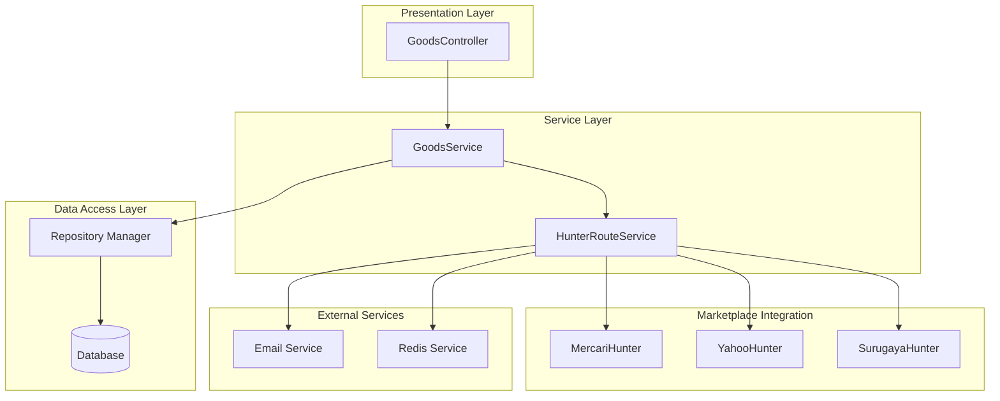
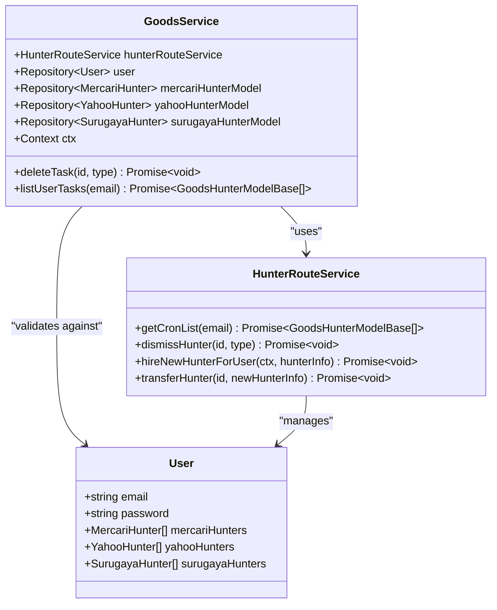
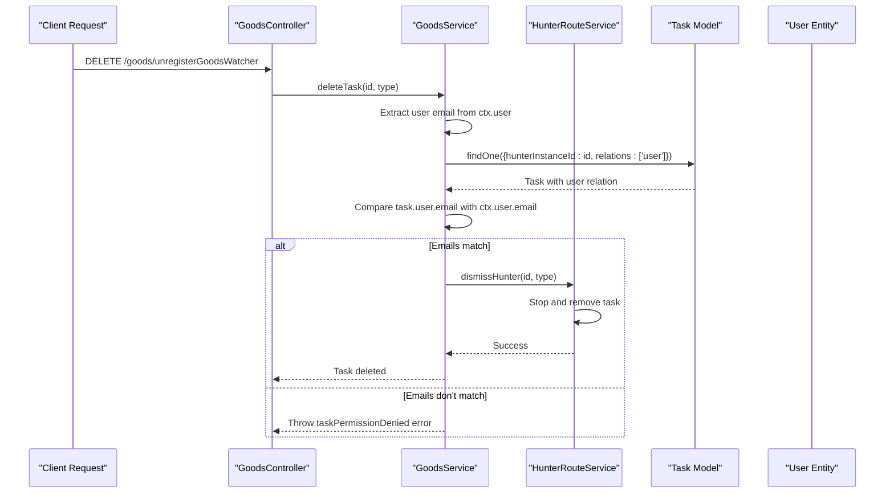
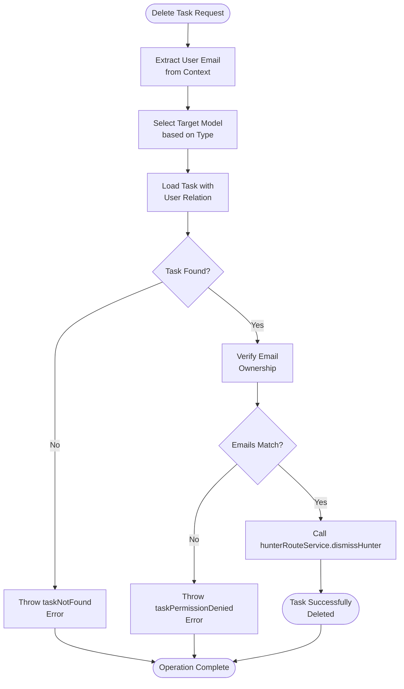
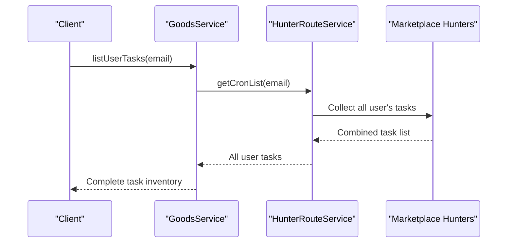
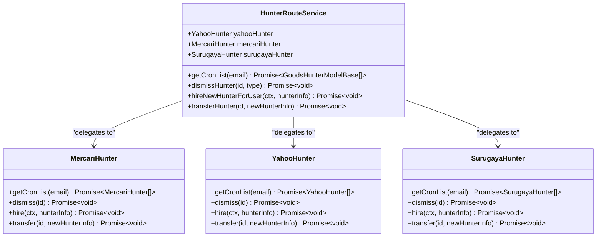
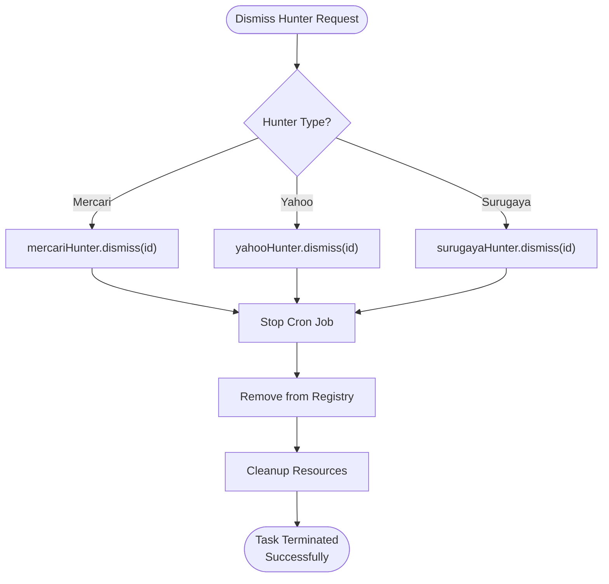
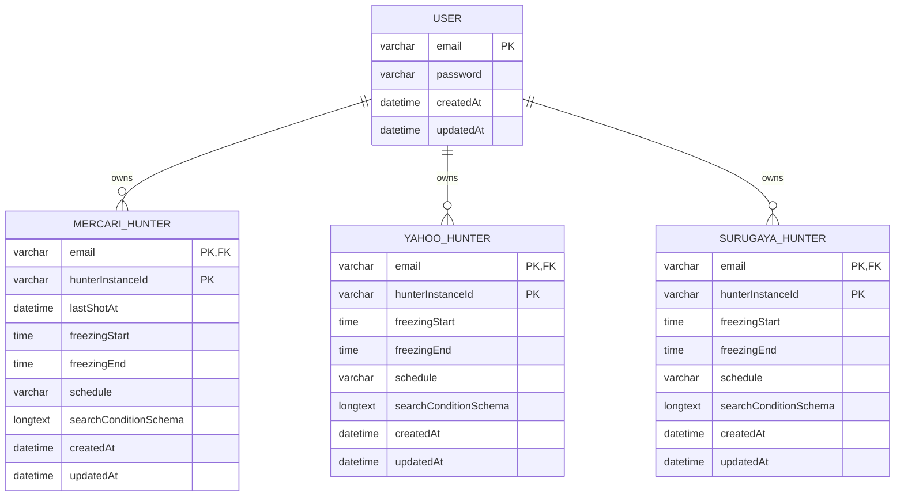
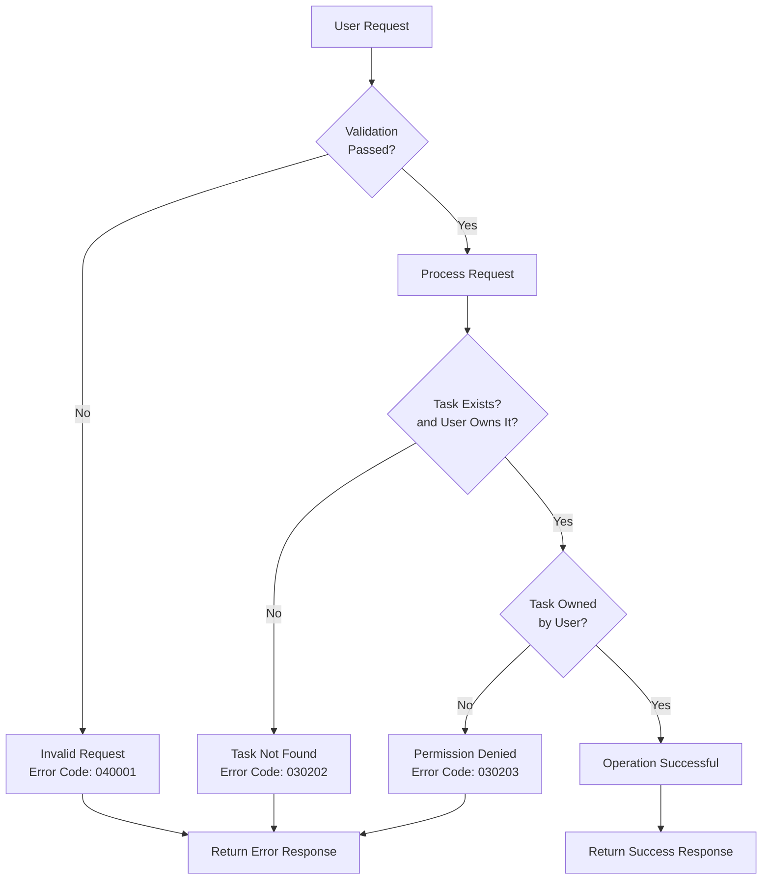
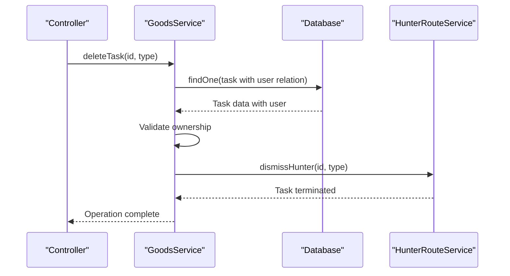

# Goods Monitoring Service

<cite>
**Referenced Files in This Document**
- [src/service/goods.ts](file://src/service/goods.ts)
- [src/service/hunterRouteService.ts](file://src/service/hunterRouteService.ts)
- [src/model/user.ts](file://src/model/user.ts)
- [src/controller/goods.ts](file://src/controller/goods.ts)
- [src/model/types.ts](file://src/model/types.ts)
- [src/types.ts](file://src/types.ts)
- [src/model/mercariHunter.ts](file://src/model/mercariHunter.ts)
- [src/model/yahooHunter.ts](file://src/model/yahooHunter.ts)
- [src/errorCode.ts](file://src/errorCode.ts)
- [src/const.ts](file://src/const.ts)
- [src/service/hunterArsenal/base.ts](file://src/service/hunterArsenal/base.ts)
- [src/utils/databaseTransactionWrapper.ts](file://src/utils/databaseTransactionWrapper.ts)
</cite>

## Table of Contents
1. [Introduction](#introduction)
2. [System Architecture](#system-architecture)
3. [Core Components](#core-components)
4. [Authorization and Security](#authorization-and-security)
5. [Task Management Operations](#task-management-operations)
6. [Integration with HunterRouteService](#integration-with-hunterrouteservice)
7. [Database Model Relationships](#database-model-relationships)
8. [Error Handling and Validation](#error-handling-and-validation)
9. [Performance Considerations](#performance-considerations)
10. [Common Issues and Troubleshooting](#common-issues-and-troubleshooting)
11. [Best Practices](#best-practices)
12. [Conclusion](#conclusion)

## Introduction

The Goods Monitoring Service is a sophisticated component of the goods-hunter web application that manages user tasks for monitoring products across multiple marketplaces including Mercari, Yahoo Auctions, and Suruga-ya. This service provides centralized task orchestration, authorization enforcement, and seamless integration with marketplace APIs to deliver real-time product monitoring capabilities.

The service operates as a critical middleware layer that coordinates between user requests, task management, and marketplace surveillance systems. It ensures secure access to monitoring tasks while maintaining high performance through efficient database queries and asynchronous operation handling.

## System Architecture

The Goods Monitoring Service follows a layered architecture pattern with clear separation of concerns:

**Diagram sources**
- [src/controller/goods.ts](file://src/controller/goods.ts#L1-L153)
- [src/service/goods.ts](file://src/service/goods.ts#L1-L66)
- [src/service/hunterRouteService.ts](file://src/service/hunterRouteService.ts#L1-L145)

## Core Components

### GoodsService - Central Task Manager

The GoodsService serves as the primary orchestrator for all monitoring tasks, providing two main operations: task deletion and task listing.

**Diagram sources**
- [src/service/goods.ts](file://src/service/goods.ts#L15-L66)
- [src/service/hunterRouteService.ts](file://src/service/hunterRouteService.ts#L31-L145)
- [src/model/user.ts](file://src/model/user.ts#L14-L42)

### HunterRouteService - Task Orchestration Hub

The HunterRouteService acts as a centralized coordinator for all marketplace monitoring tasks, managing the lifecycle of hunters across different platforms.

**Section sources**
- [src/service/goods.ts](file://src/service/goods.ts#L15-L66)
- [src/service/hunterRouteService.ts](file://src/service/hunterRouteService.ts#L31-L145)

## Authorization and Security

### Email-Based Ownership Validation

The GoodsService implements strict authorization logic to ensure users can only modify their own monitoring tasks. This is achieved through email ownership verification:

**Diagram sources**
- [src/service/goods.ts](file://src/service/goods.ts#L37-L54)
- [src/controller/goods.ts](file://src/controller/goods.ts#L76-L85)

### Permission Enforcement Mechanism

The authorization logic follows these critical steps:

1. **User Context Extraction**: Retrieves the authenticated user's email from the request context
2. **Task Retrieval**: Fetches the target monitoring task with eager loading of associated user entity
3. **Ownership Verification**: Compares the task's user email with the requesting user's email
4. **Access Control**: Grants or denies access based on email matching

**Section sources**
- [src/service/goods.ts](file://src/service/goods.ts#L37-L54)
- [src/errorCode.ts](file://src/errorCode.ts#L58-L60)

## Task Management Operations

### Delete Task Operation

The `deleteTask` method demonstrates sophisticated task termination with safety checks:

**Diagram sources**
- [src/service/goods.ts](file://src/service/goods.ts#L37-L54)

### List User Tasks Operation

The `listUserTasks` method provides comprehensive task visibility:

**Diagram sources**
- [src/service/goods.ts](file://src/service/goods.ts#L57-L62)
- [src/service/hunterRouteService.ts](file://src/service/hunterRouteService.ts#L56-L61)

**Section sources**
- [src/service/goods.ts](file://src/service/goods.ts#L37-L62)

## Integration with HunterRouteService

### Centralized Task Orchestration

The HunterRouteService provides unified task management across all supported marketplaces:

**Diagram sources**
- [src/service/hunterRouteService.ts](file://src/service/hunterRouteService.ts#L31-L145)
- [src/service/hunterArsenal/base.ts](file://src/service/hunterArsenal/base.ts#L16-L88)

### Safe Task Termination with dismissHunter

The `dismissHunter` method ensures safe termination of active monitoring instances:

**Diagram sources**
- [src/service/hunterRouteService.ts](file://src/service/hunterRouteService.ts#L101-L111)

**Section sources**
- [src/service/hunterRouteService.ts](file://src/service/hunterRouteService.ts#L56-L145)

## Database Model Relationships

### Entity Relationship Architecture

The system employs a sophisticated ORM-based relationship model that ensures data integrity and enables efficient querying:

**Diagram sources**
- [src/model/user.ts](file://src/model/user.ts#L14-L42)
- [src/model/mercariHunter.ts](file://src/model/mercariHunter.ts#L7-L42)
- [src/model/yahooHunter.ts](file://src/model/yahooHunter.ts#L8-L43)

### Repository Pattern Implementation

Each marketplace hunter type is managed through dedicated repositories that provide type-safe database operations:

| Repository | Purpose | Key Operations |
|------------|---------|----------------|
| `mercariHunterModel` | Manage Mercari monitoring tasks | CRUD operations, search conditions, freezing ranges |
| `yahooHunterModel` | Manage Yahoo Auction monitoring tasks | Full task lifecycle, auction record tracking |
| `surugayaHunterModel` | Manage Surugaya monitoring tasks | Standard task management with marketplace specifics |

**Section sources**
- [src/model/user.ts](file://src/model/user.ts#L14-L42)
- [src/model/mercariHunter.ts](file://src/model/mercariHunter.ts#L7-L42)
- [src/model/yahooHunter.ts](file://src/model/yahooHunter.ts#L8-L43)

## Error Handling and Validation

### Comprehensive Error Management

The system implements structured error handling with specific error codes for different failure scenarios:

**Diagram sources**
- [src/service/goods.ts](file://src/service/goods.ts#L37-L54)
- [src/errorCode.ts](file://src/errorCode.ts#L58-L60)

### Validation Rules and Constraints

The system enforces several validation rules:

| Validation Type | Rule | Error Code |
|----------------|------|------------|
| Task Existence | Task must exist and belong to user | `030202` (taskNotFound) |
| Permission | User must own the task | `030203` (taskPermissionDenied) |
| Request Format | Proper request body structure | `040001` (invalidRequestBody) |
| Schedule Format | Valid cron schedule format | `040001` (invalidRequestBody) |
| Time Format | Proper freeze time format (HH:mm) | `040001` (invalidRequestBody) |

**Section sources**
- [src/errorCode.ts](file://src/errorCode.ts#L58-L60)
- [src/controller/goods.ts](file://src/controller/goods.ts#L33-L85)

## Performance Considerations

### Database Query Optimization

The system employs several optimization strategies for efficient database operations:

#### Eager Loading with Relations
The `findOne` operation with `relations: ["user"]` ensures that user data is loaded in a single query rather than requiring separate queries for each task.

#### Repository Pattern Benefits
- **Type Safety**: Compile-time type checking for database operations
- **Consistency**: Uniform API across different entity types
- **Testability**: Easy mocking and testing of database operations

#### Asynchronous Operation Handling
The service handles asynchronous operations efficiently through:

**Diagram sources**
- [src/service/goods.ts](file://src/service/goods.ts#L37-L54)

### Memory Management and Resource Cleanup

The system implements proper resource cleanup mechanisms:

- **Cron Job Management**: Automatic cleanup of terminated cron jobs
- **Connection Pooling**: Efficient database connection reuse
- **Memory Leak Prevention**: Proper event listener removal

**Section sources**
- [src/service/goods.ts](file://src/service/goods.ts#L37-L54)
- [src/service/hunterArsenal/base.ts](file://src/service/hunterArsenal/base.ts#L27-L41)

## Common Issues and Troubleshooting

### Permission-Related Issues

#### Problem: Task Permission Denied
**Symptoms**: User receives permission denied error when trying to delete a task
**Causes**:
- Task belongs to another user
- User context not properly set in request
- Email mismatch between task owner and authenticated user

**Solution**: Verify user authentication and ensure the task belongs to the currently authenticated user.

#### Problem: Task Not Found
**Symptoms**: User receives task not found error
**Causes**:
- Task ID doesn't exist in database
- Task was previously deleted
- Incorrect task type specification

**Solution**: Validate task ID and type combination before attempting deletion.

### Database-Related Issues

#### Problem: Slow Task Listing
**Symptoms**: Long response times when listing user tasks
**Causes**:
- Large number of tasks for user
- Inefficient database queries
- Missing database indexes

**Solution**: Implement pagination for task lists and ensure proper indexing on user email fields.

#### Problem: Transaction Failures
**Symptoms**: Partial updates or inconsistent data states
**Causes**:
- Database connection timeouts
- Concurrent modification conflicts
- Insufficient transaction isolation

**Solution**: Use the database transaction wrapper for atomic operations and implement retry logic.

### Integration Issues

#### Problem: Hunter Service Communication Failure
**Symptoms**: Tasks appear deleted in UI but still running
**Causes**:
- Hunter service unavailable
- Network connectivity issues
- Message queue failures

**Solution**: Implement health checks for hunter services and fallback mechanisms for critical operations.

**Section sources**
- [src/errorCode.ts](file://src/errorCode.ts#L58-L60)
- [src/service/goods.ts](file://src/service/goods.ts#L37-L54)

## Best Practices

### Security Best Practices

1. **Principle of Least Privilege**: Users can only access their own tasks
2. **Input Validation**: Comprehensive validation of all request parameters
3. **Error Information Sanitization**: Generic error messages prevent information leakage
4. **Audit Logging**: Track all task modifications for security monitoring

### Performance Best Practices

1. **Eager Loading**: Use relations judiciously to minimize database queries
2. **Asynchronous Operations**: Handle long-running operations asynchronously
3. **Resource Cleanup**: Properly dispose of resources and connections
4. **Caching Strategies**: Implement appropriate caching for frequently accessed data

### Development Best Practices

1. **Repository Pattern**: Maintain consistent data access patterns
2. **Error Handling**: Implement comprehensive error handling and logging
3. **Type Safety**: Leverage TypeScript for compile-time error detection
4. **Testing**: Implement unit tests for all service methods

### Operational Best Practices

1. **Monitoring**: Implement comprehensive monitoring and alerting
2. **Backup Strategies**: Regular backups of task configurations and user data
3. **Disaster Recovery**: Document and test disaster recovery procedures
4. **Capacity Planning**: Monitor resource usage and plan for growth

**Section sources**
- [src/service/goods.ts](file://src/service/goods.ts#L15-L66)
- [src/utils/databaseTransactionWrapper.ts](file://src/utils/databaseTransactionWrapper.ts#L15-L51)

## Conclusion

The Goods Monitoring Service represents a sophisticated and well-architected solution for managing user tasks across multiple marketplaces. Its design emphasizes security, performance, and maintainability through:

- **Robust Authorization**: Email-based ownership validation prevents unauthorized access
- **Centralized Orchestration**: HunterRouteService provides unified task management
- **Efficient Database Operations**: Repository pattern with optimized queries
- **Comprehensive Error Handling**: Structured error codes and validation
- **Scalable Architecture**: Modular design supporting future marketplace additions

The service successfully balances functionality with security, providing users with reliable monitoring capabilities while maintaining strict access controls. Its asynchronous operation handling and resource management ensure optimal performance under varying load conditions.

Future enhancements could include task scheduling optimization, improved caching strategies, and expanded marketplace integrations while maintaining the current security and performance standards.