# Hunter Arsenal Integration

<cite>
**Referenced Files in This Document**
- [hunterRouteService.ts](file://src/service/hunterRouteService.ts)
- [hunterArsenal/index.ts](file://src/service/hunterArsenal/index.ts)
- [hunterArsenal/base.ts](file://src/service/hunterArsenal/base.ts)
- [hunterArsenal/mercari.ts](file://src/service/hunterArsenal/mercari.ts)
- [hunterArsenal/surugaya.ts](file://src/service/hunterArsenal/surugaya.ts)
- [hunterArsenal/yahoo.ts](file://src/service/hunterArsenal/yahoo.ts)
- [types.ts](file://src/types.ts)
- [const.ts](file://src/const.ts)
- [cipher.ts](file://src/service/cipher.ts)
- [databaseTransactionWrapper.ts](file://src/utils/databaseTransactionWrapper.ts)
</cite>

## Table of Contents
1. [Introduction](#introduction)
2. [Architecture Overview](#architecture-overview)
3. [Hunter Route Service](#hunter-route-service)
4. [Hunter Arsenal Components](#hunter-arsenal-components)
5. [Type Guard Implementation](#type-guard-implementation)
6. [Redis Message Tracking](#redis-message-tracking)
7. [Lifecycle Management](#lifecycle-management)
8. [Error Handling and Resilience](#error-handling-and-resilience)
9. [Performance Considerations](#performance-considerations)
10. [Common Issues and Solutions](#common-issues-and-solutions)
11. [Best Practices](#best-practices)

## Introduction

The Hunter Arsenal Integration component serves as a sophisticated orchestration system for managing marketplace-specific hunting operations across multiple platforms including Mercari, Surugaya, and Yahoo Auctions. Built on the Midway.js framework, this system implements a strategy pattern architecture where each hunter type encapsulates its own scheduling and scraping logic while being managed centrally through the HunterRouteService.

The system provides robust lifecycle management capabilities including hiring new hunters, dismissing existing ones, and transferring hunters between users. It leverages dependency injection for flexible platform-specific implementations and employs Redis for message deduplication and state persistence.

## Architecture Overview

The hunter arsenal follows a layered architecture with clear separation of concerns:

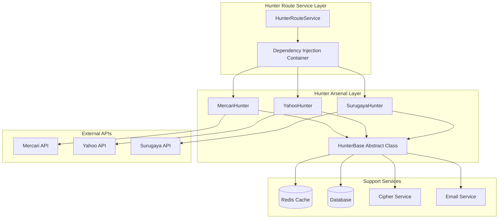

**Diagram sources**
- [hunterRouteService.ts](file://src/service/hunterRouteService.ts#L31-L145)
- [hunterArsenal/base.ts](file://src/service/hunterArsenal/base.ts#L16-L88)

**Section sources**
- [hunterRouteService.ts](file://src/service/hunterRouteService.ts#L1-L145)
- [hunterArsenal/base.ts](file://src/service/hunterArsenal/base.ts#L1-L88)

## Hunter Route Service

The HunterRouteService acts as the central orchestrator, implementing dependency injection to route operations based on hunter type. It maintains references to all platform-specific hunter implementations and provides unified interfaces for lifecycle management.

### Core Responsibilities

The HunterRouteService manages three primary operations:

1. **Hunter Lifecycle Operations**: Hire, dismiss, and transfer hunters across platforms
2. **Message Processing**: Handle user ignore goods operations with deduplication
3. **Cron Job Aggregation**: Collect and manage scheduled tasks from all hunter types

### Dependency Injection Pattern

The service utilizes Midway.js dependency injection to maintain loose coupling between components:

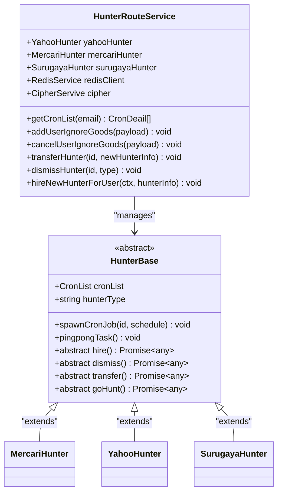

**Diagram sources**
- [hunterRouteService.ts](file://src/service/hunterRouteService.ts#L31-L145)
- [hunterArsenal/base.ts](file://src/service/hunterArsenal/base.ts#L16-L88)

**Section sources**
- [hunterRouteService.ts](file://src/service/hunterRouteService.ts#L31-L145)

## Hunter Arsenal Components

Each marketplace hunter implements the HunterBase abstract class, providing platform-specific logic while maintaining a consistent interface.

### Mercari Hunter Implementation

The Mercari hunter specializes in fetching and processing product listings from the Mercari marketplace:

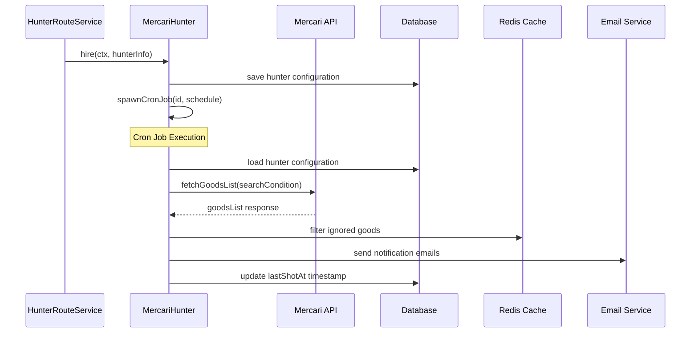

**Diagram sources**
- [hunterArsenal/mercari.ts](file://src/service/hunterArsenal/mercari.ts#L66-L98)
- [hunterArsenal/mercari.ts](file://src/service/hunterArsenal/mercari.ts#L102-L232)

### Surugaya Hunter Implementation

The Surugaya hunter focuses on auction-style listings with specialized price tracking:

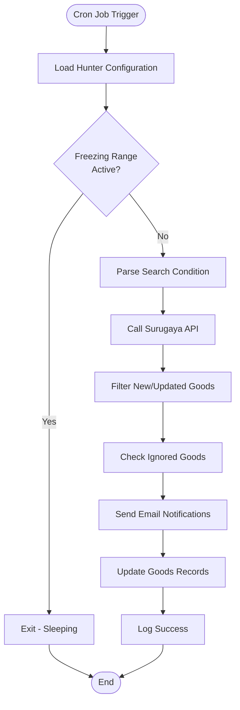

**Diagram sources**
- [hunterArsenal/surugaya.ts](file://src/service/hunterArsenal/surugaya.ts#L108-L237)

### Yahoo Hunter Implementation

The Yahoo hunter handles auction dynamics with cookie management and heartbeat monitoring:

The Yahoo hunter includes additional features like cookie validation and automatic renewal notifications:

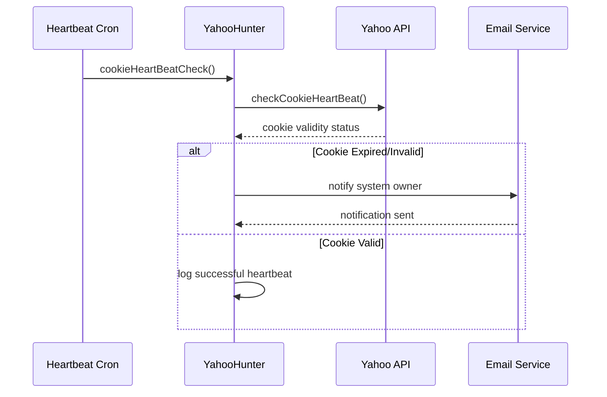

**Diagram sources**
- [hunterArsenal/yahoo.ts](file://src/service/hunterArsenal/yahoo.ts#L43-L53)

**Section sources**
- [hunterArsenal/mercari.ts](file://src/service/hunterArsenal/mercari.ts#L1-L339)
- [hunterArsenal/surugaya.ts](file://src/service/hunterArsenal/surugaya.ts#L1-L345)
- [hunterArsenal/yahoo.ts](file://src/service/hunterArsenal/yahoo.ts#L1-L363)

## Type Guard Implementation

The system employs sophisticated type guards (hunterCognition) to safely dispatch operations based on hunter type. This ensures type safety while maintaining flexibility in the strategy pattern implementation.

### Type Guard Function

The hunterCognition function provides runtime type checking with TypeScript type narrowing:

```typescript
// Type guard implementation pattern
function hunterCognition<T extends GoodsHunter>(
  hunterInfo: GoodsHunter,
  cognitionFunc: (info: typeof hunterInfo) => boolean
): hunterInfo is T {
  return cognitionFunc(hunterInfo);
}
```

### Usage Patterns

The type guards enable safe casting and operation dispatch:

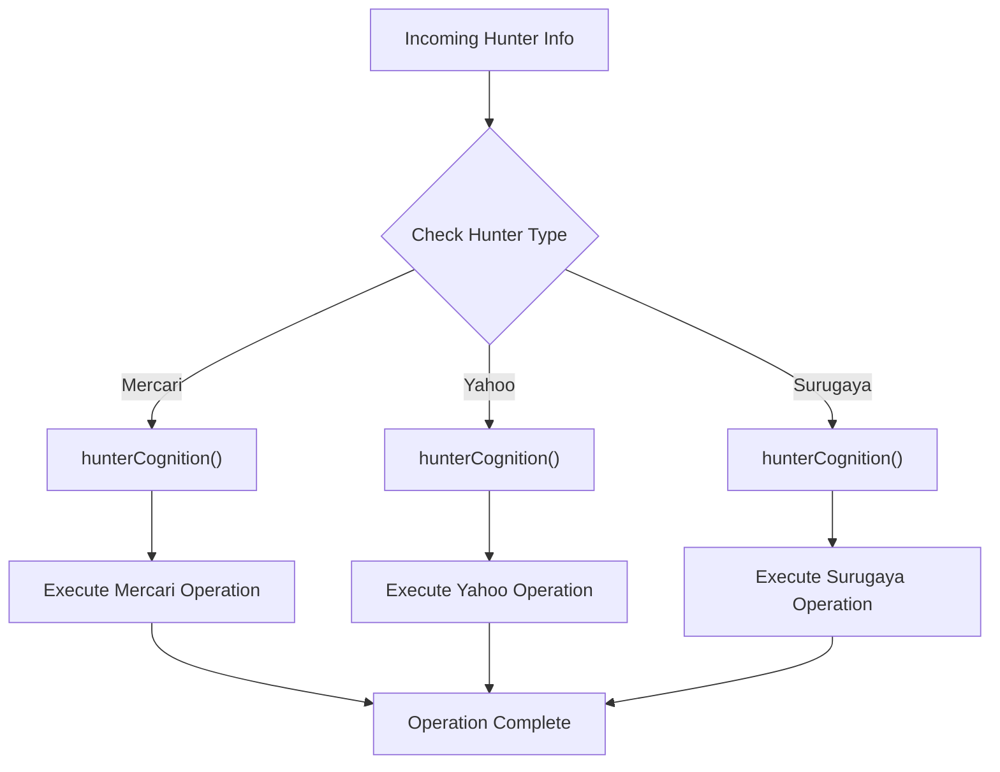

**Diagram sources**
- [hunterRouteService.ts](file://src/service/hunterRouteService.ts#L24-L29)
- [hunterRouteService.ts](file://src/service/hunterRouteService.ts#L114-L140)

**Section sources**
- [hunterRouteService.ts](file://src/service/hunterRouteService.ts#L24-L29)
- [hunterRouteService.ts](file://src/service/hunterRouteService.ts#L114-L140)

## Redis Message Tracking

Redis serves dual purposes in the system: caching frequently accessed data and preventing duplicate message processing through a dedicated consumption tracking mechanism.

### Message Consumption Prevention

The cipher service implements a distributed message deduplication system:

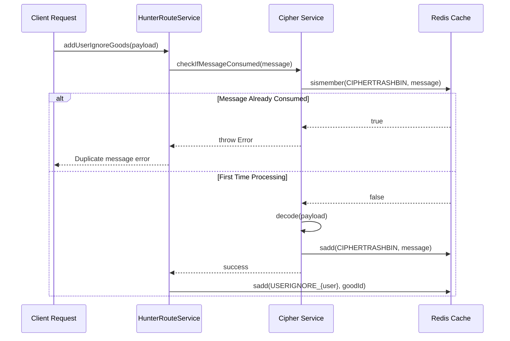

**Diagram sources**
- [hunterRouteService.ts](file://src/service/hunterRouteService.ts#L64-L70)
- [cipher.ts](file://src/service/cipher.ts#L64-L67)

### Redis Key Patterns

The system uses structured Redis keys for different purposes:

| Key Pattern | Purpose | Example |
|-------------|---------|---------|
| `USERIGNORE_{user}` | User-specific ignored goods | `USERIGNORE_user@example.com_12345` |
| `Surugaya_USERIGNORE_{user}` | Surugaya platform ignored goods | `Surugaya_USERIGNORE_user@example.com_67890` |
| `Yahoo_USERIGNORE_{user}` | Yahoo platform ignored goods | `Yahoo_USERIGNORE_user@example.com_abcde` |
| `CIPHERTRASHBIN` | Prevent duplicate message processing | Global deduplication |

**Section sources**
- [hunterRouteService.ts](file://src/service/hunterRouteService.ts#L64-L81)
- [cipher.ts](file://src/service/cipher.ts#L60-L67)

## Lifecycle Management

The system provides comprehensive lifecycle management for hunters across all supported platforms, ensuring proper resource allocation and cleanup.

### Hire New Hunter

The hire process involves database persistence, cron job creation, and immediate activation:

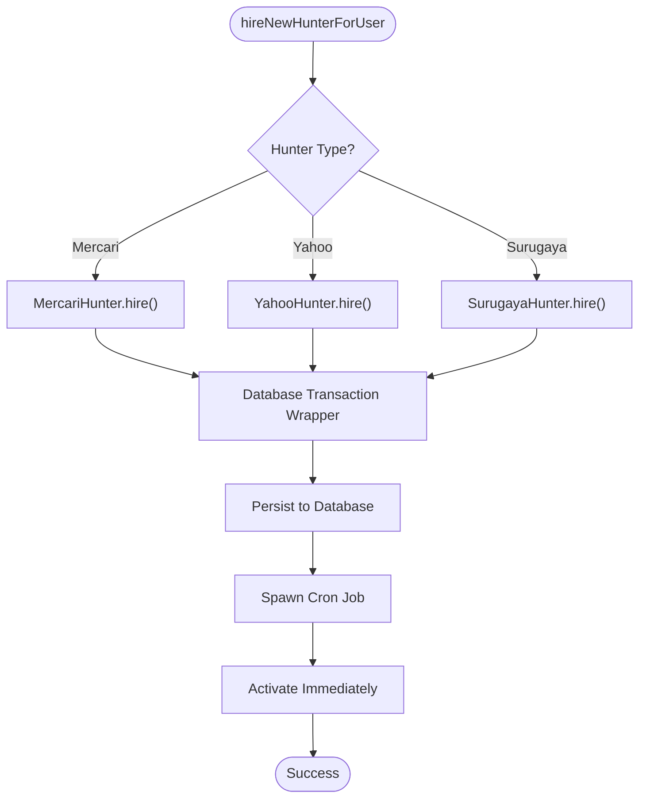

**Diagram sources**
- [hunterRouteService.ts](file://src/service/hunterRouteService.ts#L114-L140)
- [hunterArsenal/mercari.ts](file://src/service/hunterArsenal/mercari.ts#L66-L98)

### Dismiss Hunter

The dismissal process ensures graceful shutdown with cleanup:

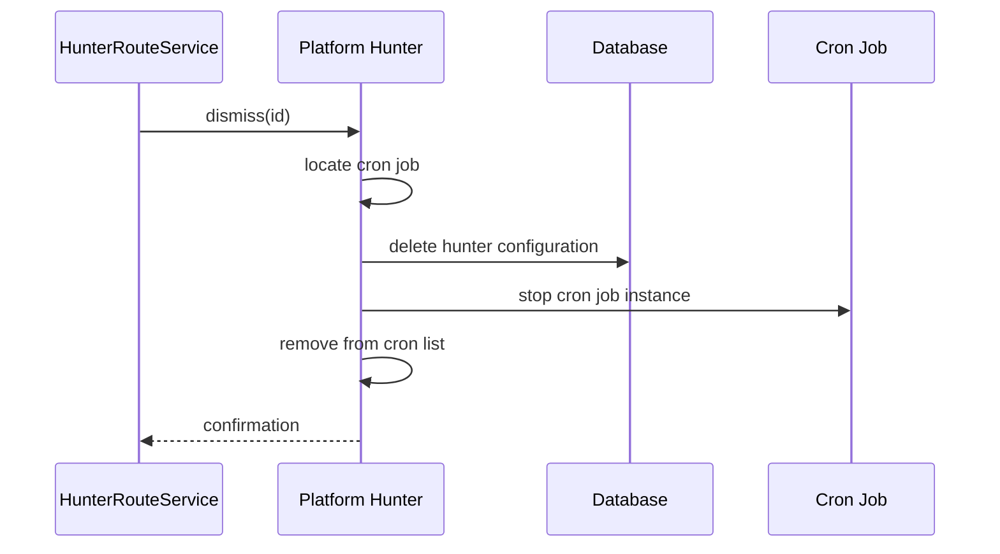

**Diagram sources**
- [hunterArsenal/mercari.ts](file://src/service/hunterArsenal/mercari.ts#L235-L243)
- [hunterArsenal/surugaya.ts](file://src/service/hunterArsenal/surugaya.ts#L240-L248)

### Transfer Hunter

The transfer operation enables moving hunters between users with configuration preservation:

The transfer process handles both configuration updates and cron job reallocation:

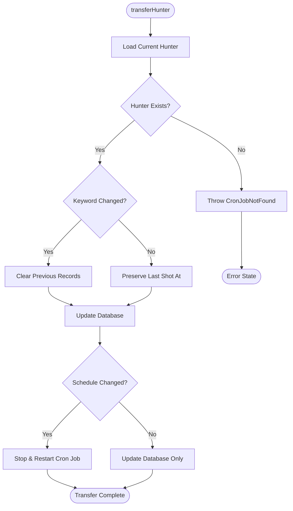

**Diagram sources**
- [hunterArsenal/mercari.ts](file://src/service/hunterArsenal/mercari.ts#L246-L303)
- [hunterArsenal/surugaya.ts](file://src/service/hunterArsenal/surugaya.ts#L251-L309)

**Section sources**
- [hunterRouteService.ts](file://src/service/hunterRouteService.ts#L83-L112)
- [hunterArsenal/mercari.ts](file://src/service/hunterArsenal/mercari.ts#L235-L303)

## Error Handling and Resilience

The system implements comprehensive error handling strategies to ensure reliability in long-running monitoring tasks.

### Database Transaction Management

The database transaction wrapper provides ACID guarantees for critical operations:

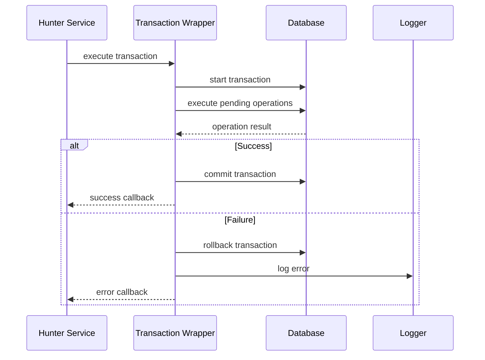

**Diagram sources**
- [databaseTransactionWrapper.ts](file://src/utils/databaseTransactionWrapper.ts#L15-L51)

### Cron Job Resilience

Each hunter implements automatic recovery mechanisms for failed cron jobs:

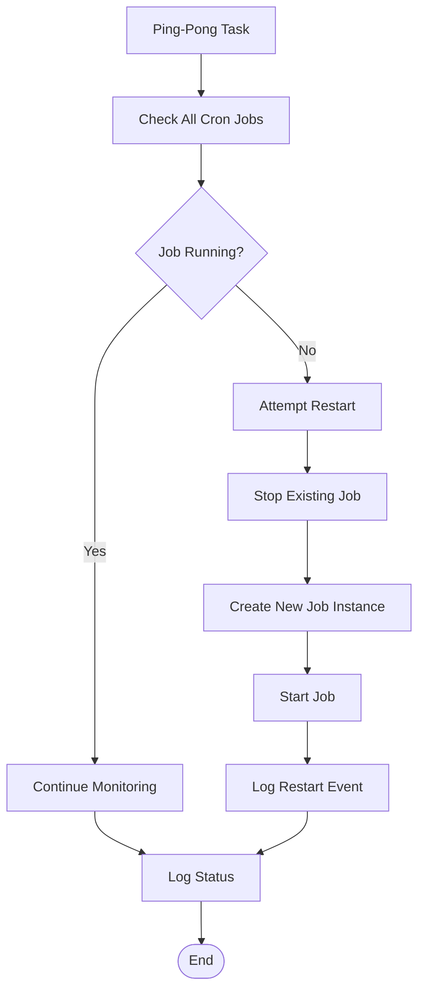

**Diagram sources**
- [hunterArsenal/base.ts](file://src/service/hunterArsenal/base.ts#L27-L41)

### Startup Failure Recovery

The system includes graceful degradation for startup failures:

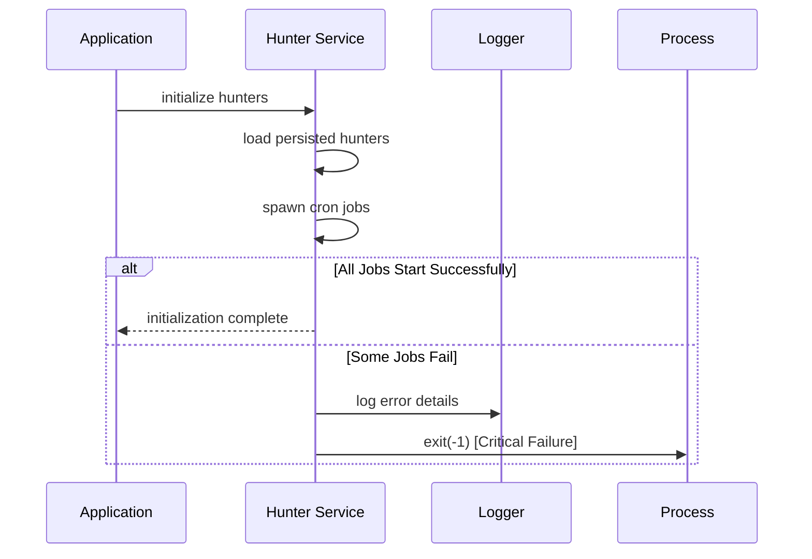

**Diagram sources**
- [hunterArsenal/mercari.ts](file://src/service/hunterArsenal/mercari.ts#L40-L63)
- [hunterArsenal/surugaya.ts](file://src/service/hunterArsenal/surugaya.ts#L47-L70)

**Section sources**
- [databaseTransactionWrapper.ts](file://src/utils/databaseTransactionWrapper.ts#L15-L51)
- [hunterArsenal/base.ts](file://src/service/hunterArsenal/base.ts#L27-L41)
- [hunterArsenal/mercari.ts](file://src/service/hunterArsenal/mercari.ts#L40-L63)

## Performance Considerations

Managing concurrent cron jobs efficiently requires careful consideration of resource utilization and scalability patterns.

### Concurrent Job Management

The system handles multiple concurrent jobs through several strategies:

1. **Job Isolation**: Each hunter operates independently with its own cron job instances
2. **Resource Pooling**: Shared services like Redis and database connections are pooled
3. **Memory Management**: Automatic cleanup prevents memory leaks in long-running processes

### Scalability Patterns

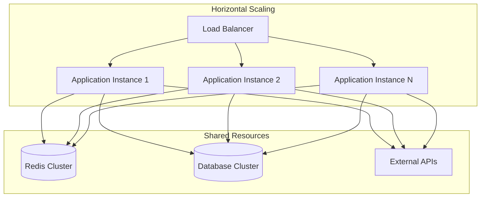

### Performance Monitoring

The system includes built-in performance monitoring through logging and heartbeat mechanisms:

| Monitorable Aspect | Implementation | Purpose |
|-------------------|----------------|---------|
| Cron Job Health | Ping-Pong Tasks | Detect crashed jobs |
| Memory Usage | Process Monitoring | Prevent memory leaks |
| Database Connections | Connection Pooling | Optimize resource usage |
| API Response Times | Logging | Track external dependencies |

**Section sources**
- [hunterArsenal/base.ts](file://src/service/hunterArsenal/base.ts#L27-L41)
- [hunterArsenal/mercari.ts](file://src/service/hunterArsenal/mercari.ts#L35-L37)

## Common Issues and Solutions

### Hunter Startup Failures

**Problem**: Hunters fail to start due to database connectivity or configuration issues.

**Solution**: The system implements graceful degradation with process exit on critical failures:

```typescript
.catch(reason => {
  this.logger.error("Oops....Something went wrong when waking up hunters:" + reason);
  process.exit(-1);
});
```

### Inconsistent State Across Services

**Problem**: Different hunter services may have inconsistent state after partial failures.

**Solution**: Database transactions ensure atomic updates across all services:

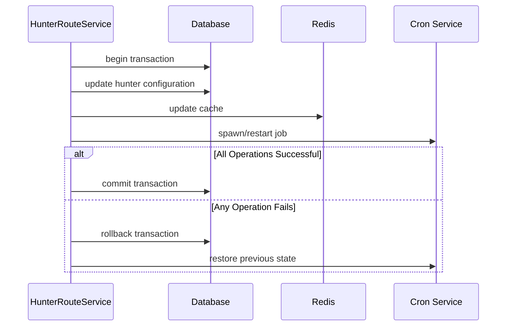

**Diagram sources**
- [databaseTransactionWrapper.ts](file://src/utils/databaseTransactionWrapper.ts#L28-L39)

### Duplicate Message Processing

**Problem**: Same message processed multiple times due to network issues or retries.

**Solution**: Redis-based deduplication prevents duplicate processing:

```typescript
async checkIfMessageConsumed(message: string): Promise<void> {
  const consumed = await this.redisClient.sismember(CONST.CIPHERTRASHBIN, message);
  if (consumed) throw new Error(errorCode.cipherService.messageConsumed);
}
```

**Section sources**
- [hunterArsenal/mercari.ts](file://src/service/hunterArsenal/mercari.ts#L40-L63)
- [cipher.ts](file://src/service/cipher.ts#L64-L67)

## Best Practices

### Error Resilience in Long-Running Tasks

1. **Implement Heartbeat Monitoring**: Regular health checks detect and recover from failures
2. **Use Transaction Wrappers**: Ensure atomic updates across multiple systems
3. **Graceful Degradation**: Allow partial failures without affecting overall system stability
4. **Comprehensive Logging**: Enable detailed tracing for debugging and monitoring

### Resource Management

1. **Connection Pooling**: Reuse database and Redis connections to minimize overhead
2. **Memory Cleanup**: Properly dispose of cron job instances and event listeners
3. **Rate Limiting**: Respect external API rate limits to prevent service disruption
4. **Monitoring Integration**: Implement metrics collection for operational insights

### Security Considerations

1. **Message Encryption**: Use AES-GCM encryption for sensitive data transmission
2. **Deduplication Prevention**: Prevent replay attacks through message tracking
3. **Access Control**: Implement proper authentication and authorization
4. **Audit Logging**: Maintain comprehensive logs for security auditing

### Testing Strategies

1. **Unit Testing**: Test individual hunter components in isolation
2. **Integration Testing**: Verify interactions between components
3. **Load Testing**: Validate performance under high concurrency
4. **Failure Simulation**: Test error handling and recovery mechanisms

The Hunter Arsenal Integration component demonstrates sophisticated orchestration capabilities while maintaining simplicity in client interfaces. Its modular design, comprehensive error handling, and performance optimizations make it suitable for production environments requiring reliable marketplace monitoring across multiple platforms.