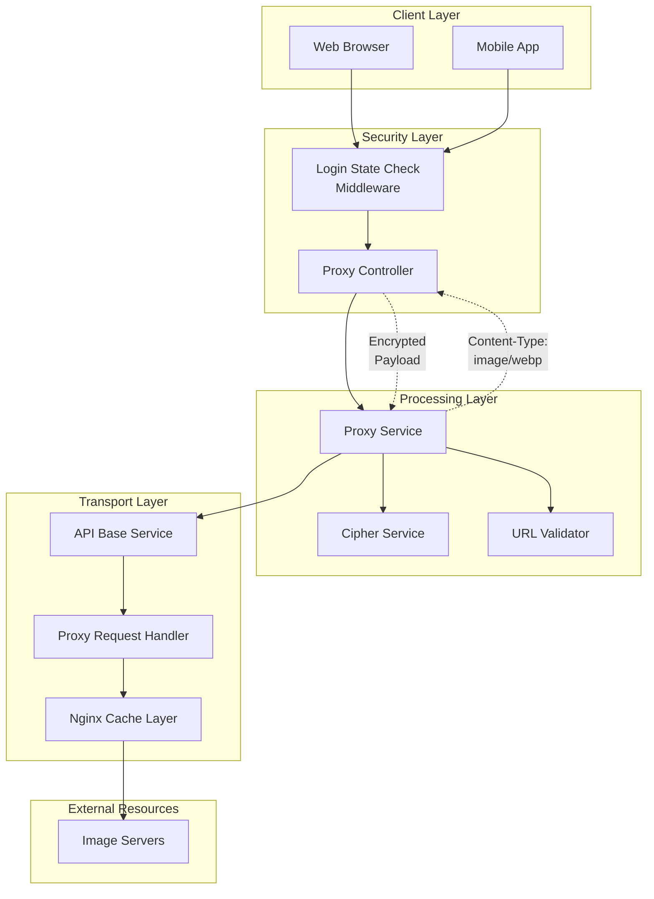
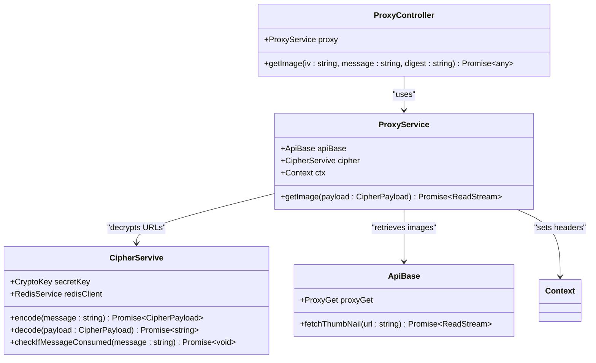
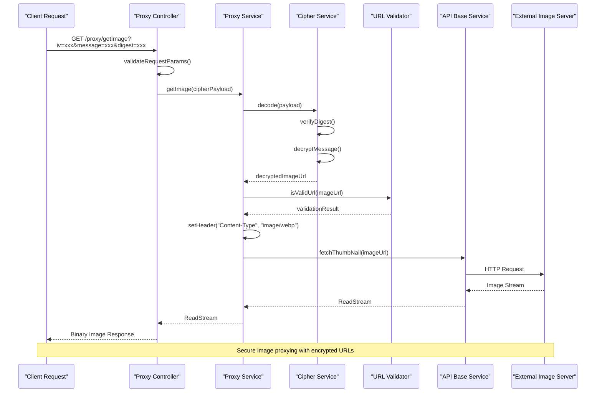
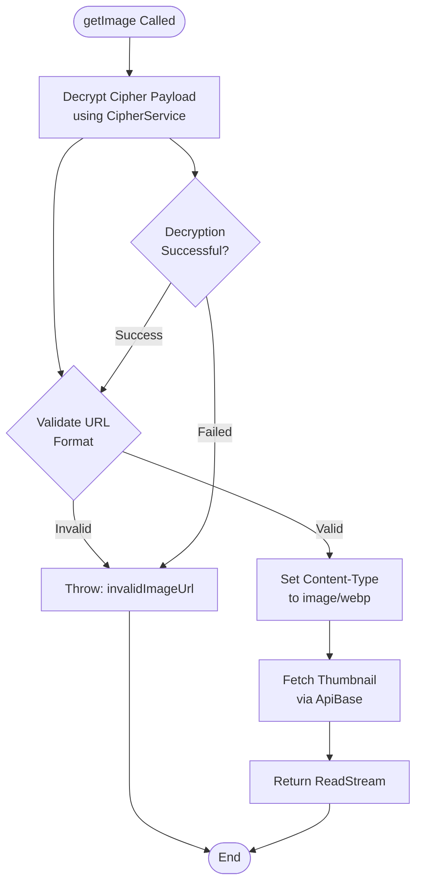
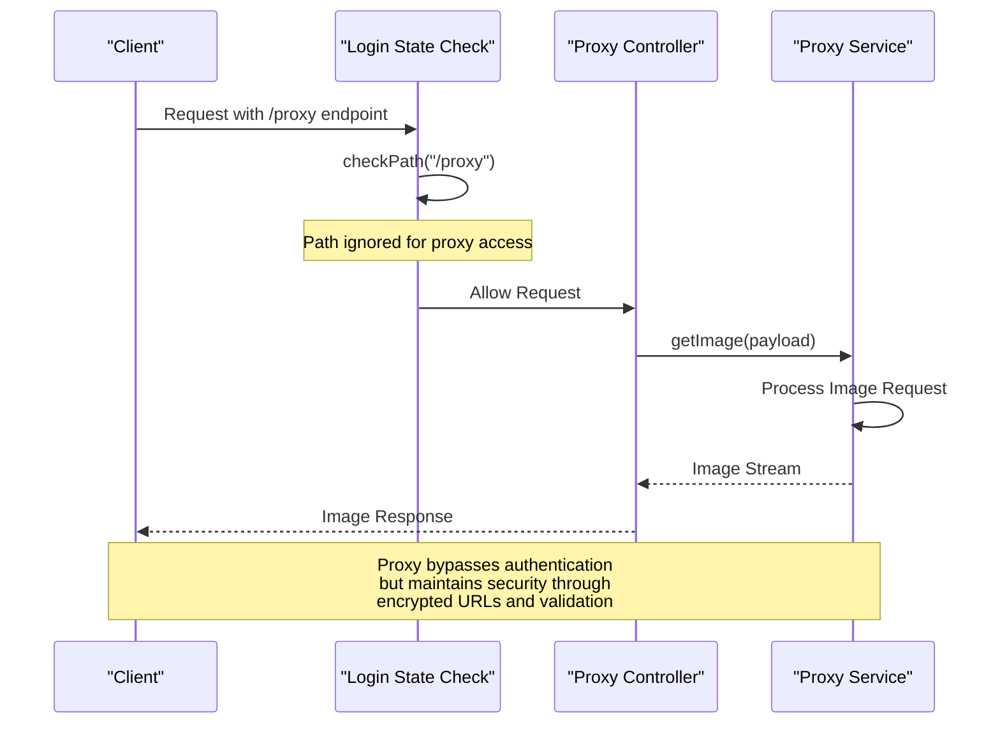
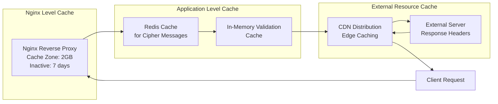

# Proxy Service

<cite>
**Referenced Files in This Document**
- [src/service/proxy.ts](file://src/service/proxy.ts)
- [src/controller/proxy.ts](file://src/controller/proxy.ts)
- [src/service/cipher.ts](file://src/service/cipher.ts)
- [src/utils/isValidUrl.ts](file://src/utils/isValidUrl.ts)
- [src/api/site/base.ts](file://src/api/site/base.ts)
- [src/api/request/index.ts](file://src/api/request/index.ts)
- [src/middleware/loginStateCheck.ts](file://src/middleware/loginStateCheck.ts)
- [src/types.ts](file://src/types.ts)
- [src/errorCode.ts](file://src/errorCode.ts)
- [src/const.ts](file://src/const.ts)
- [external/nginx.conf](file://external/nginx.conf)
</cite>

## Table of Contents
1. [Introduction](#introduction)
2. [System Architecture](#system-architecture)
3. [Core Components](#core-components)
4. [Security Implementation](#security-implementation)
5. [Workflow Analysis](#workflow-analysis)
6. [Integration with Middleware](#integration-with-middleware)
7. [Error Handling](#error-handling)
8. [Performance Considerations](#performance-considerations)
9. [Security Best Practices](#security-best-practices)
10. [Troubleshooting Guide](#troubleshooting-guide)
11. [Conclusion](#conclusion)

## Introduction

The Proxy Service is a sophisticated image proxying component designed to enable secure access to external image resources while protecting the original image sources from direct exposure. Built on the Midway.js framework, this service implements a multi-layered security architecture that combines URL encryption, strict validation, and controlled access patterns to prevent hotlinking and unauthorized access to external resources.

The proxy service operates as a critical security layer that intercepts requests for external images, decrypts encrypted URLs through the CipherService, validates the decrypted URLs against security policies, and then retrieves the images through a controlled API gateway. This approach ensures that original image URLs remain hidden from client-side access while maintaining efficient image delivery capabilities.

## System Architecture

The proxy service follows a layered architecture pattern that separates concerns between security, validation, and resource retrieval:

**Diagram sources**
- [src/controller/proxy.ts](file://src/controller/proxy.ts#L1-L20)
- [src/service/proxy.ts](file://src/service/proxy.ts#L1-L32)
- [src/service/cipher.ts](file://src/service/cipher.ts#L1-L117)
- [src/api/site/base.ts](file://src/api/site/base.ts#L1-L33)

**Section sources**
- [src/controller/proxy.ts](file://src/controller/proxy.ts#L1-L20)
- [src/service/proxy.ts](file://src/service/proxy.ts#L1-L32)
- [src/middleware/loginStateCheck.ts](file://src/middleware/loginStateCheck.ts#L1-L54)

## Core Components

### ProxyService

The ProxyService serves as the central orchestrator for the image proxying workflow. It integrates with multiple services to provide a secure and efficient image retrieval mechanism.

**Diagram sources**
- [src/service/proxy.ts](file://src/service/proxy.ts#L10-L31)
- [src/controller/proxy.ts](file://src/controller/proxy.ts#L6-L18)
- [src/service/cipher.ts](file://src/service/cipher.ts#L11-L117)
- [src/api/site/base.ts](file://src/api/site/base.ts#L8-L33)

### CipherService Integration

The CipherService provides cryptographic operations for URL encryption and decryption. It implements AES-GCM encryption with SHA-256 message authentication to ensure data integrity and confidentiality.

### URL Validation System

The URL validation system employs comprehensive checks to ensure that decrypted URLs meet security requirements before any external requests are made.

**Section sources**
- [src/service/proxy.ts](file://src/service/proxy.ts#L10-L31)
- [src/service/cipher.ts](file://src/service/cipher.ts#L11-L117)
- [src/utils/isValidUrl.ts](file://src/utils/isValidUrl.ts#L1-L18)

## Security Implementation

### Encryption and Decryption Workflow

The proxy service implements a robust encryption scheme that protects image URLs from direct exposure:

**Diagram sources**
- [src/controller/proxy.ts](file://src/controller/proxy.ts#L12-L15)
- [src/service/proxy.ts](file://src/service/proxy.ts#L22-L27)
- [src/service/cipher.ts](file://src/service/cipher.ts#L92-L115)

### Message Authentication

The CipherService implements SHA-256 message authentication to detect tampering and ensure message integrity. Each encrypted payload includes a digest that is verified during decryption.

### Anti-Hotlinking Protection

The proxy service prevents hotlinking by:

1. **Encrypted URLs**: Original image URLs are never exposed to clients
2. **Single-use Validation**: Encrypted messages are tracked and prevented from reuse
3. **Strict Validation**: Only URLs passing comprehensive validation are processed
4. **Access Control**: Middleware enforces authentication requirements

**Section sources**
- [src/service/cipher.ts](file://src/service/cipher.ts#L92-L115)
- [src/utils/isValidUrl.ts](file://src/utils/isValidUrl.ts#L1-L18)
- [src/middleware/loginStateCheck.ts](file://src/middleware/loginStateCheck.ts#L21-L23)

## Workflow Analysis

### getImage Method Implementation

The `getImage` method represents the core workflow of the proxy service, implementing a secure and efficient image retrieval process:

**Diagram sources**
- [src/service/proxy.ts](file://src/service/proxy.ts#L22-L27)

### Request Processing Pipeline

The complete request processing pipeline involves multiple validation and security checkpoints:

1. **Parameter Validation**: Ensures all required cipher parameters are present
2. **Payload Decryption**: Uses AES-GCM decryption with proper IV handling
3. **URL Format Validation**: Validates URL structure and protocol compliance
4. **Content-Type Setting**: Explicitly sets appropriate MIME type headers
5. **Resource Retrieval**: Delegates to API base service for external requests

**Section sources**
- [src/service/proxy.ts](file://src/service/proxy.ts#L22-L27)
- [src/controller/proxy.ts](file://src/controller/proxy.ts#L12-L15)

## Integration with Middleware

### Login State Middleware Integration

The proxy service integrates seamlessly with the login state middleware to enforce authentication requirements:

**Diagram sources**
- [src/middleware/loginStateCheck.ts](file://src/middleware/loginStateCheck.ts#L21-L23)
- [src/controller/proxy.ts](file://src/controller/proxy.ts#L12-L15)

### Path-Based Access Control

The middleware implements intelligent path-based access control that allows proxy requests while enforcing authentication for other endpoints. This design ensures that proxy functionality remains accessible while maintaining security boundaries.

**Section sources**
- [src/middleware/loginStateCheck.ts](file://src/middleware/loginStateCheck.ts#L21-L23)
- [src/controller/proxy.ts](file://src/controller/proxy.ts#L12-L15)

## Error Handling

### Comprehensive Error Management

The proxy service implements structured error handling across all layers:

| Error Type | Source | Description | Resolution |
|------------|--------|-------------|------------|
| `invalidRequestBody` | Controller | Missing or malformed cipher parameters | Verify all required parameters are present |
| `invalidImageUrl` | ProxyService | Decrypted URL fails validation | Check URL format and protocol compliance |
| `messageCorrupted` | CipherService | SHA-256 digest verification failed | Re-encrypt with proper key derivation |
| `messageConsumed` | CipherService | Attempted reuse of encrypted message | Generate new encrypted payload |

### Error Propagation Strategy

Errors are propagated consistently through the system with appropriate HTTP status codes and meaningful error messages. The service ensures that sensitive information is not leaked through error responses.

**Section sources**
- [src/errorCode.ts](file://src/errorCode.ts#L51-L71)
- [src/controller/proxy.ts](file://src/controller/proxy.ts#L13-L14)
- [src/service/proxy.ts](file://src/service/proxy.ts#L25-L26)

## Performance Considerations

### Caching Strategy

The proxy service benefits from multiple layers of caching optimization:

**Diagram sources**
- [external/nginx.conf](file://external/nginx.conf#L69-L80)
- [src/const.ts](file://src/const.ts#L5-L5)

### Performance Optimization Techniques

1. **Nginx Reverse Proxy Cache**: Implements 3-day cache for successful responses
2. **Redis Message Tracking**: Prevents replay attacks with efficient storage
3. **Connection Pooling**: Reuses HTTP connections for external requests
4. **Timeout Management**: 5-second timeouts prevent hanging requests
5. **Retry Logic**: Automatic retry mechanisms for transient failures

### Scalability Considerations

The proxy service is designed to handle high-volume image requests through:

- **Horizontal Scaling**: Stateless design allows multiple service instances
- **Load Balancing**: Nginx distributes requests across backend instances
- **Resource Limits**: Configurable timeouts and connection limits
- **Monitoring Integration**: Built-in logging for performance tracking

**Section sources**
- [external/nginx.conf](file://external/nginx.conf#L69-L80)
- [src/api/request/index.ts](file://src/api/request/index.ts#L25-L36)

## Security Best Practices

### SSRF Attack Prevention

The proxy service implements multiple defenses against Server-Side Request Forgery (SSRF) attacks:

1. **Strict URL Validation**: Comprehensive URL format checking
2. **Protocol Restrictions**: Enforces HTTPS and HTTP protocols only
3. **Host Validation**: Prevents access to internal network resources
4. **Timeout Enforcement**: Limits request duration to prevent hanging attacks

### Cryptographic Security

The service implements industry-standard cryptographic practices:

- **AES-GCM Encryption**: Provides both confidentiality and authenticity
- **SHA-256 Message Authentication**: Detects tampering and corruption
- **Random IV Generation**: Ensures unique ciphertext for identical plaintext
- **Secure Key Storage**: Uses JWK format for key management

### Access Control Measures

Multiple access control layers ensure secure operation:

- **Authentication Bypass**: Allows proxy access while maintaining security
- **Message Replay Protection**: Prevents reuse of encrypted payloads
- **Rate Limiting**: Implicit through timeout and retry mechanisms
- **Audit Logging**: Comprehensive logging for security monitoring

**Section sources**
- [src/service/cipher.ts](file://src/service/cipher.ts#L25-L28)
- [src/utils/isValidUrl.ts](file://src/utils/isValidUrl.ts#L1-L18)
- [src/middleware/loginStateCheck.ts](file://src/middleware/loginStateCheck.ts#L21-L23)

## Troubleshooting Guide

### Common Issues and Solutions

#### Invalid URL Format Errors

**Symptoms**: `invalidImageUrl` error responses
**Causes**: 
- Malformed decrypted URLs
- Unsupported protocols (ftp, mailto, etc.)
- URLs containing whitespace or special characters

**Solutions**:
- Verify URL decryption is successful
- Check URL encoding and escaping
- Ensure HTTPS or HTTP protocols only

#### Failed Decryption Attempts

**Symptoms**: `messageCorrupted` or decryption failures
**Causes**:
- Tampered cipher payloads
- Incorrect secret key configuration
- Message format inconsistencies

**Solutions**:
- Regenerate encrypted payloads
- Verify secret key JWK configuration
- Check payload structure integrity

#### Upstream Image Server Errors

**Symptoms**: Timeout or connection errors
**Causes**:
- External server unavailability
- Network connectivity issues
- Rate limiting or blocking

**Solutions**:
- Implement retry logic with exponential backoff
- Monitor external service health
- Configure appropriate timeout values

### Debugging Strategies

1. **Enable Detailed Logging**: Review application logs for error details
2. **Validate Cipher Payloads**: Test decryption with known good payloads
3. **Network Connectivity Testing**: Verify external server accessibility
4. **Performance Monitoring**: Track response times and error rates

**Section sources**
- [src/errorCode.ts](file://src/errorCode.ts#L66-L67)
- [src/service/cipher.ts](file://src/service/cipher.ts#L102-L104)
- [src/api/request/index.ts](file://src/api/request/index.ts#L25-L36)

## Conclusion

The Proxy Service represents a comprehensive solution for secure image proxying that balances functionality, security, and performance. Through its multi-layered architecture combining encryption, validation, and controlled access patterns, it effectively prevents hotlinking while maintaining efficient image delivery capabilities.

Key strengths of the implementation include:

- **Robust Security**: Multi-factor authentication and encryption prevent unauthorized access
- **Performance Optimization**: Multiple caching layers ensure fast response times
- **Error Resilience**: Comprehensive error handling and retry mechanisms
- **Scalable Design**: Stateless architecture supports horizontal scaling
- **Maintainable Code**: Clear separation of concerns and modular design

The service demonstrates best practices in secure web development, providing a model for implementing similar proxy functionality while maintaining high security standards and performance requirements. Its integration with modern infrastructure components like Nginx caching and Redis message tracking makes it suitable for production environments requiring both security and scalability.