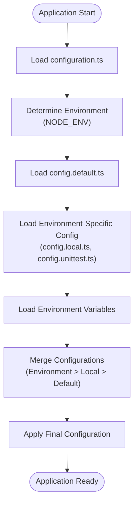
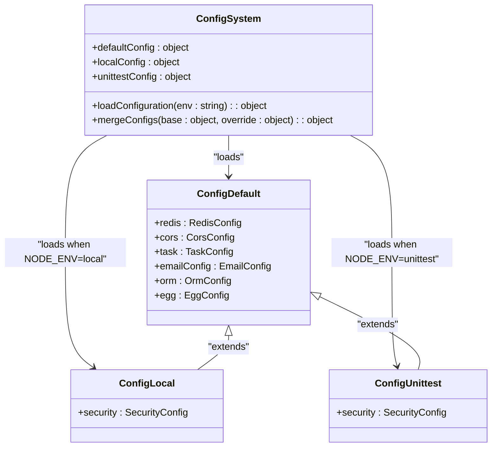
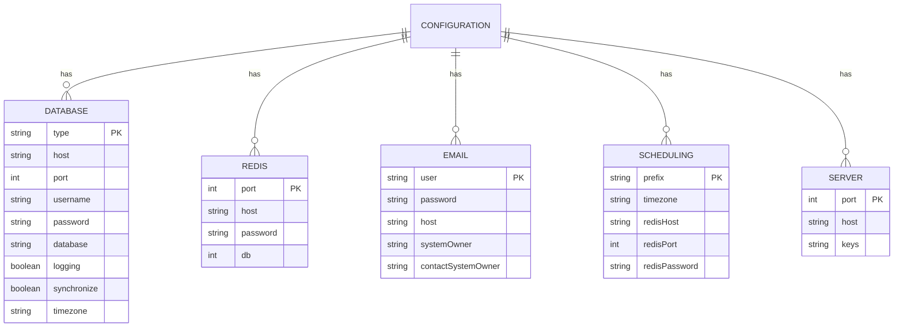
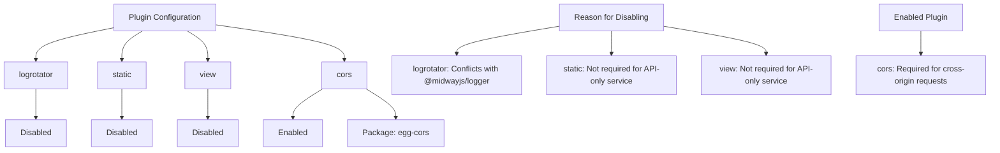
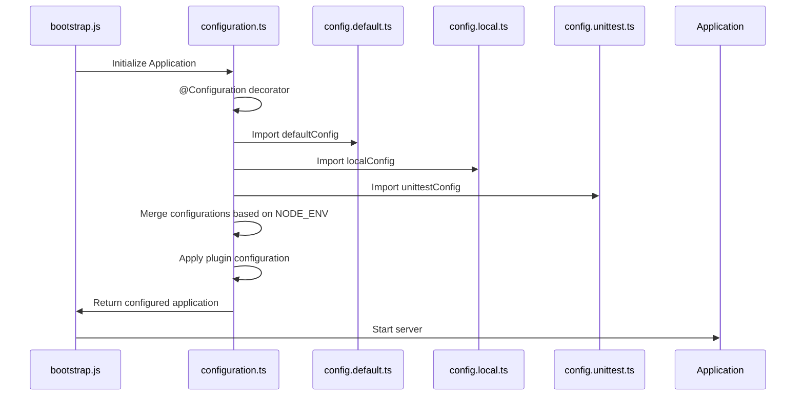
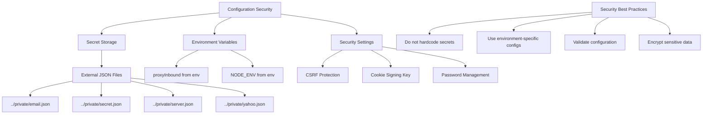
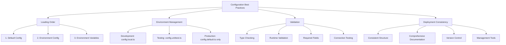
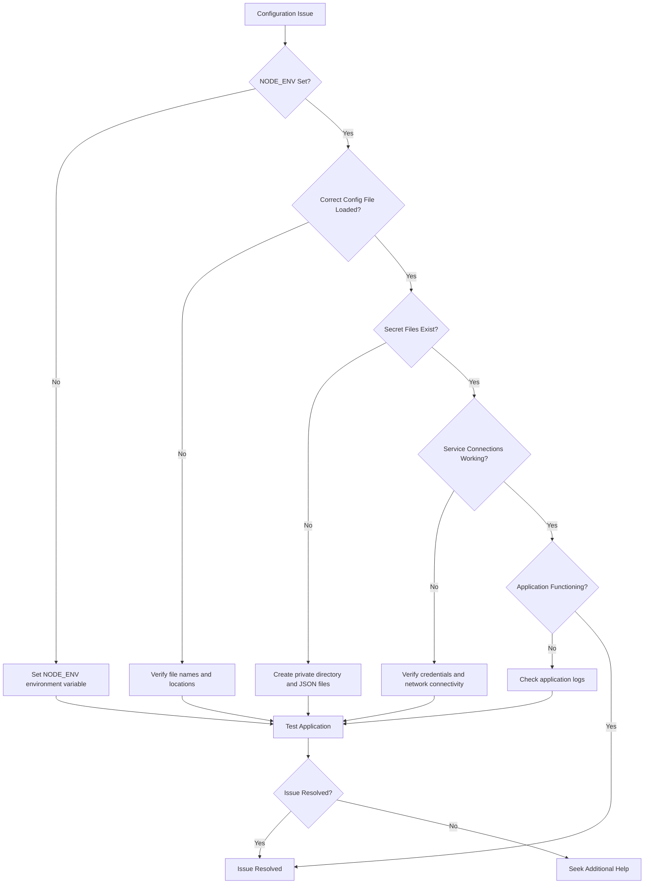

# Configuration System

<cite>
**Referenced Files in This Document**   
- [config.default.ts](file://src/config/config.default.ts)
- [config.local.ts](file://src/config/config.local.ts)
- [config.unittest.ts](file://src/config/config.unittest.ts)
- [plugin.ts](file://src/config/plugin.ts)
- [configuration.ts](file://src/configuration.ts)
- [bootstrap.js](file://bootstrap.js)
- [api/const.ts](file://src/api/const.ts)
</cite>

## Table of Contents
1. [Configuration System Overview](#configuration-system-overview)
2. [Configuration Loading Mechanism](#configuration-loading-mechanism)
3. [Environment-Specific Configuration Files](#environment-specific-configuration-files)
4. [Core Configuration Options](#core-configuration-options)
5. [Plugin Configuration](#plugin-configuration)
6. [Configuration Aggregation with configuration.ts](#configuration-aggregation-with-configurationts)
7. [Secure Configuration Practices](#secure-configuration-practices)
8. [Configuration Validation and Best Practices](#configuration-validation-and-best-practices)
9. [Debugging Configuration Issues](#debugging-configuration-issues)

## Configuration System Overview

The goods_hunter application utilizes Midway.js's robust configuration system, which extends the Egg.js framework's configuration capabilities. The system is designed to manage application settings across different environments (development, testing, production) through a hierarchical configuration loading mechanism. This approach allows for environment-specific overrides while maintaining a consistent base configuration.

The configuration system handles critical application aspects including database connections, Redis caching, email services, proxy settings, cron scheduling, and server port configuration. It follows a layered approach where default configurations are defined in config.default.ts, with environment-specific overrides provided in files like config.local.ts and config.unittest.ts.

**Section sources**
- [config.default.ts](file://src/config/config.default.ts#L1-L103)
- [configuration.ts](file://src/configuration.ts#L1-L26)

## Configuration Loading Mechanism

The Midway.js configuration system follows a specific loading order and merging strategy to ensure predictable configuration behavior across different environments. The loading process begins with the configuration.ts file, which serves as the entry point for the configuration system and defines which configuration files to load based on the current environment.

When the application starts, the configuration system loads files in the following priority order:
1. config.default.ts - Contains base configuration for all environments
2. Environment-specific configuration file (config.local.ts, config.unittest.ts, etc.) - Overrides default settings
3. Environment variables - Provide runtime configuration that can override file-based settings

The configuration loading is orchestrated through the @Configuration decorator in configuration.ts, which specifies the importConfigs array containing the default, local, and unittest configurations. The system automatically determines which environment-specific configuration to apply based on the NODE_ENV environment variable.

**Diagram sources**
- [configuration.ts](file://src/configuration.ts#L13-L19)
- [config.default.ts](file://src/config/config.default.ts#L21-L103)

**Section sources**
- [configuration.ts](file://src/configuration.ts#L13-L19)
- [config.default.ts](file://src/config/config.default.ts#L21-L103)

## Environment-Specific Configuration Files

The goods_hunter application implements a multi-file configuration strategy to support different deployment environments. This approach allows developers to maintain separate configuration sets for development, testing, and production scenarios while sharing common settings across environments.

### config.default.ts
This file contains the base configuration that applies to all environments. It defines default values for database connections, Redis settings, email configurations, and other core services. The file uses TypeScript types to ensure type safety and includes sensitive configuration data loaded from external JSON files in the private directory.

### config.local.ts
This environment-specific configuration file is designed for local development. It primarily disables CSRF protection to simplify development workflows, as noted in the file's comments. This override is intentional to accommodate developers who may not be familiar with CSRF token requirements in POST requests.

### config.unittest.ts
This configuration file is used during unit testing and, like config.local.ts, disables CSRF protection to facilitate testing of API endpoints without requiring authentication tokens.

The configuration system automatically selects the appropriate environment file based on the NODE_ENV environment variable, with the following mapping:
- NODE_ENV=local → config.local.ts
- NODE_ENV=unittest → config.unittest.ts
- Any other value → Only config.default.ts is loaded

**Diagram sources**
- [config.default.ts](file://src/config/config.default.ts#L1-L103)
- [config.local.ts](file://src/config/config.local.ts#L1-L10)
- [config.unittest.ts](file://src/config/config.unittest.ts#L1-L4)

**Section sources**
- [config.default.ts](file://src/config/config.default.ts#L1-L103)
- [config.local.ts](file://src/config/config.local.ts#L1-L10)
- [config.unittest.ts](file://src/config/config.unittest.ts#L1-L4)

## Core Configuration Options

The goods_hunter application's configuration system manages several critical services and components through well-defined configuration options. These settings control the application's connectivity to external services, scheduling behavior, and operational parameters.

### Database Configuration (MySQL)
The application uses TypeORM with MySQL as the primary database. Configuration is specified in the orm object within config.default.ts:
- **type**: "mysql" - Specifies the database type
- **host**: "127.0.0.1" - Database server address
- **port**: 3306 - MySQL port
- **username/password**: "honmameiko" - Database credentials
- **database**: "goods_hunter" - Target database name
- **synchronize**: true - Enables automatic schema synchronization
- **timezone**: "+08:00" - Sets the timezone for database operations

### Redis Configuration
Redis is used for caching and task scheduling with the following settings:
- **port**: 6379 - Redis server port
- **host**: "127.0.0.1" - Redis server address
- **password**: "honmameiko" - Authentication password
- **db**: 0 - Database index

### Email SMTP Configuration
Email services are configured through external JSON files loaded at runtime:
- Configuration is loaded from ../private/email.json
- Contains SMTP credentials including user, password, and host
- Includes system owner information for email notifications

### Proxy Settings
The application supports proxy configuration through environment variables:
- The proxyInbound constant in api/const.ts reads from the proxyInbound environment variable
- This allows dynamic proxy configuration without modifying code

### Cron Scheduling
Task scheduling is configured with:
- Redis connection settings for task persistence
- Prefix: "honmameiko-schedule" - Key prefix in Redis
- Timezone: "Asia/Shanghai" - Scheduling timezone
- Default job options for repeatable tasks

### Application Port
The server port is configured in two places:
- config.default.ts: config.egg.port = 7001
- bootstrap.js: WebFramework configured with port 7001
Both settings ensure the application runs on port 7001 by default.

**Diagram sources**
- [config.default.ts](file://src/config/config.default.ts#L40-L95)
- [bootstrap.js](file://bootstrap.js#L1-L8)
- [api/const.ts](file://src/api/const.ts#L1-L1)

**Section sources**
- [config.default.ts](file://src/config/config.default.ts#L40-L95)
- [bootstrap.js](file://bootstrap.js#L1-L8)
- [api/const.ts](file://src/api/const.ts#L1-L1)

## Plugin Configuration

The plugin.ts file controls the activation and deactivation of framework plugins in the goods_hunter application. This configuration is crucial for managing middleware and extensions that enhance the core functionality of the Egg.js framework.

The current plugin configuration includes:
- **logrotator**: Disabled (set to false) when using @midwayjs/logger
- **static**: Disabled (set to false) as static file serving is not required
- **view**: Disabled (set to false) as the application doesn't use server-side rendering
- **cors**: Enabled with the egg-cors package for cross-origin resource sharing

The plugin system follows Midway.js conventions, where plugins can be enabled or disabled globally or for specific environments. The configuration uses the EggPlugin interface to type-safely define plugin settings. Disabling certain plugins like logrotator when using @midwayjs/logger prevents conflicts between competing logging systems.

**Diagram sources**
- [plugin.ts](file://src/config/plugin.ts#L1-L11)

**Section sources**
- [plugin.ts](file://src/config/plugin.ts#L1-L11)

## Configuration Aggregation with configuration.ts

The configuration.ts file serves as the central configuration aggregator for the goods_hunter application. It uses the @Configuration decorator from Midway.js to define the application's configuration strategy and component imports.

Key aspects of the configuration aggregation include:
- **Imports Array**: Specifies the Midway.js components to be loaded, including web framework, axios, redis, task, and ORM modules
- **ImportConfigs Array**: Defines the configuration files to be loaded in priority order, with environment-specific overrides
- **ConflictCheck**: Enabled to prevent configuration conflicts between modules
- **Lifecycle Management**: Implements ILifeCycle interface with onReady hook for post-configuration initialization

The importConfigs property is particularly important as it explicitly maps the default, local, and unittest configurations, ensuring that the correct environment-specific settings are applied. This file acts as the orchestrator for the entire configuration system, determining which modules are available and how configurations are merged.

**Diagram sources**
- [configuration.ts](file://src/configuration.ts#L13-L19)
- [config.default.ts](file://src/config/config.default.ts#L21-L103)
- [config.local.ts](file://src/config/config.local.ts#L1-L10)
- [config.unittest.ts](file://src/config/config.unittest.ts#L1-L4)

**Section sources**
- [configuration.ts](file://src/configuration.ts#L13-L19)

## Secure Configuration Practices

The goods_hunter application implements several security best practices for configuration management, particularly for handling sensitive information. These practices help protect credentials and prevent accidental exposure of secrets.

### External Secret Management
The application follows the principle of not hardcoding sensitive information by storing secrets in external JSON files:
- Email credentials in ../private/email.json
- JWT secret key in ../private/secret.json
- Server information in ../private/server.json
- Yahoo Auction cookie in ../private/yahoo.json

These files are loaded at runtime using readFileSync, keeping sensitive data out of the main configuration files. This approach allows for different secret files to be used in different environments without changing the codebase.

### Environment Variable Usage
The application leverages environment variables for runtime configuration:
- proxyInbound setting read from process.env.proxyInbound
- NODE_ENV variable determines the active configuration profile

This enables deployment-specific settings without modifying configuration files.

### Security Configuration
The configuration system includes security-related settings:
- CSRF protection disabled in local and unittest environments for developer convenience
- Cookie signing key generated from application name with a timestamp
- Passwords set to "honmameiko" in default configuration (intended to be overridden)

### Recommended Security Improvements
While the current system implements good practices, additional security measures could include:
- Using environment variables for all sensitive data instead of JSON files
- Implementing configuration validation to ensure required settings are present
- Adding encryption for sensitive configuration files
- Using a secrets management service in production environments

**Diagram sources**
- [config.default.ts](file://src/config/config.default.ts#L68-L78)
- [api/const.ts](file://src/api/const.ts#L1-L1)

**Section sources**
- [config.default.ts](file://src/config/config.default.ts#L68-L78)
- [api/const.ts](file://src/api/const.ts#L1-L1)

## Configuration Validation and Best Practices

Effective configuration management in the goods_hunter application requires adherence to validation practices and deployment strategies that ensure consistency across environments.

### Configuration Loading Order
The system follows a specific precedence order:
1. Default configuration (highest priority for base settings)
2. Environment-specific configuration (overrides defaults)
3. Environment variables (highest priority, overrides all)

This hierarchy ensures that deployment-specific settings take precedence while maintaining a consistent base configuration.

### Environment Management Best Practices
For optimal configuration management:
- **Development**: Use config.local.ts with relaxed security settings
- **Testing**: Use config.unittest.ts with test-specific configurations
- **Production**: Rely solely on config.default.ts with secure settings

### Configuration Validation
While the current implementation lacks explicit validation, recommended practices include:
- Type checking through TypeScript interfaces
- Runtime validation of critical configuration values
- Required field checks for essential services
- Connection testing for database and external services

### Deployment Consistency
To ensure consistency across deployments:
- Use the same configuration structure across all environments
- Document all configuration options and their purposes
- Implement configuration versioning
- Use configuration management tools for production deployments

### Recommended Improvements
The configuration system could be enhanced by:
- Implementing a configuration validation schema
- Adding support for configuration profiles beyond local and unittest
- Using environment variables for all sensitive data
- Implementing configuration reloading without restart
- Adding configuration documentation generation

**Diagram sources**
- [configuration.ts](file://src/configuration.ts#L16-L17)
- [config.default.ts](file://src/config/config.default.ts#L21-L103)

**Section sources**
- [configuration.ts](file://src/configuration.ts#L16-L17)
- [config.default.ts](file://src/config/config.default.ts#L21-L103)

## Debugging Configuration Issues

When troubleshooting configuration problems in the goods_hunter application, several strategies and tools can help identify and resolve issues efficiently.

### Common Configuration Issues
- **Environment Not Detected**: Ensure NODE_ENV is properly set
- **Missing Configuration Files**: Verify config.local.ts and config.unittest.ts exist
- **Secret File Not Found**: Check that private directory and JSON files exist
- **Port Conflicts**: Verify the configured port (7001) is available
- **Database Connection Failures**: Confirm MySQL server is running and credentials are correct

### Debugging Strategies
1. **Check Environment Variables**: Verify NODE_ENV and other environment variables
2. **Review Configuration Loading**: Examine which configuration files are being loaded
3. **Validate File Paths**: Ensure relative paths to private configuration files are correct
4. **Test Service Connectivity**: Verify connections to MySQL, Redis, and SMTP servers

### Logging and Monitoring
The application can be enhanced with additional debugging capabilities:
- Add configuration dump logging in development mode
- Implement startup health checks for all configured services
- Create a diagnostic endpoint that reports configuration status
- Log which configuration profile is active at startup

### Troubleshooting Workflow

**Diagram sources**
- [configuration.ts](file://src/configuration.ts#L16-L17)
- [config.default.ts](file://src/config/config.default.ts#L21-L103)

**Section sources**
- [configuration.ts](file://src/configuration.ts#L16-L17)
- [config.default.ts](file://src/config/config.default.ts#L21-L103)