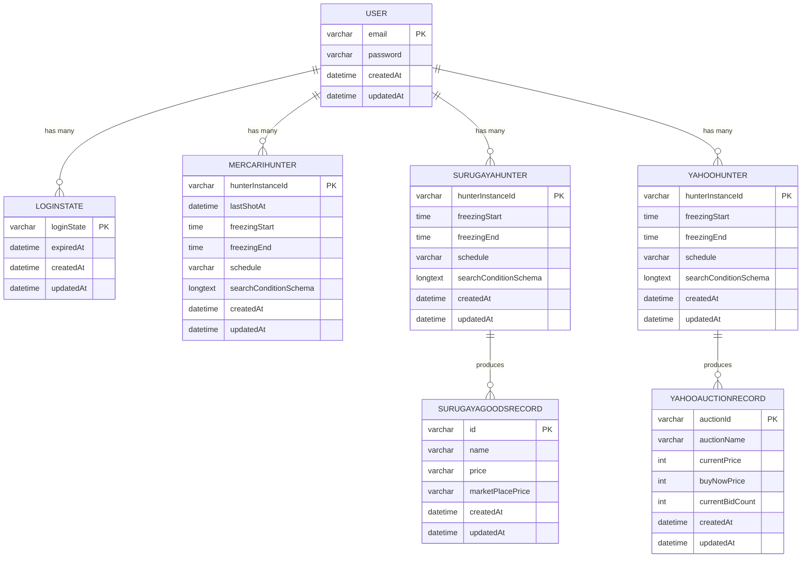
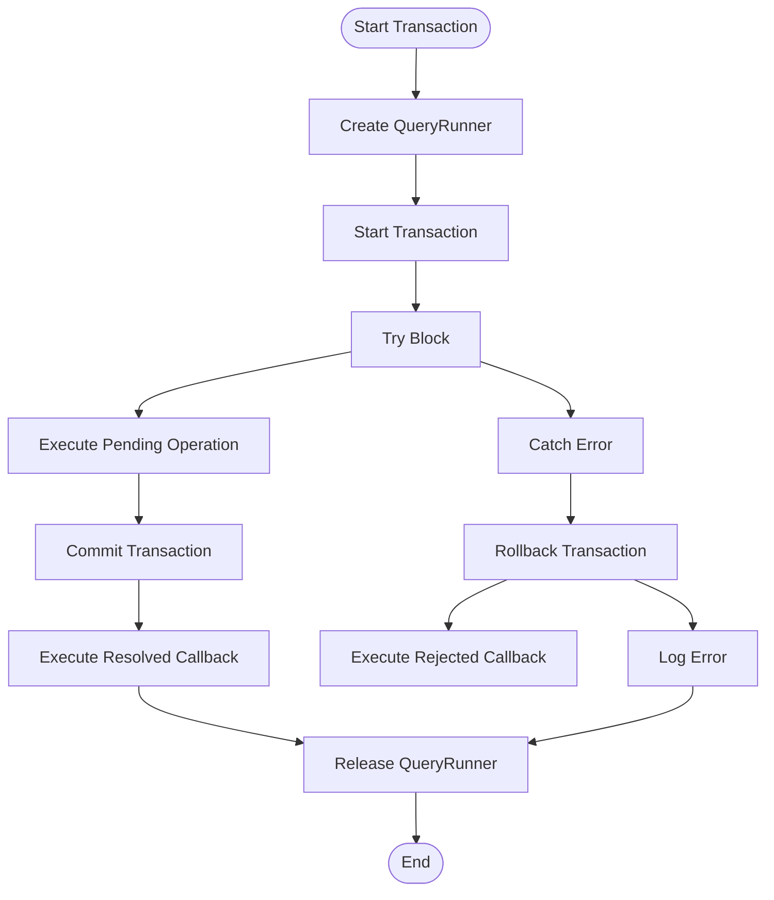

# Data Models & ORM Mapping

<cite>
**Referenced Files in This Document**   
- [user.ts](file://src/model/user.ts)
- [loginState.ts](file://src/model/loginState.ts)
- [mercariHunter.ts](file://src/model/mercariHunter.ts)
- [surugaya.ts](file://src/model/surugaya.ts)
- [yahooHunter.ts](file://src/model/yahooHunter.ts)
- [surugayaGoodsRecord.ts](file://src/model/surugayaGoodsRecord.ts)
- [yahooAuctionRecord.ts](file://src/model/yahooAuctionRecord.ts)
- [types.ts](file://src/model/types.ts)
- [databaseTransactionWrapper.ts](file://src/utils/databaseTransactionWrapper.ts)
- [config.default.ts](file://src/config/config.default.ts)
</cite>

## Table of Contents
1. [Introduction](#introduction)
2. [Core Data Models](#core-data-models)
3. [Entity Relationships](#entity-relationships)
4. [TypeORM Decorators and Configuration](#typeorm-decorators-and-configuration)
5. [Data Lifecycle and Retention](#data-lifecycle-and-retention)
6. [Performance Considerations](#performance-considerations)
7. [Transaction Management](#transaction-management)
8. [Conclusion](#conclusion)

## Introduction

The goods_hunter application utilizes TypeORM for object-relational mapping to manage its data persistence layer. This document provides comprehensive documentation of all TypeORM entities, detailing their structure, relationships, and operational characteristics. The system is configured to use MySQL as the database backend with automatic schema synchronization enabled in development environments.

The data model centers around user accounts that can create and manage multiple "Hunter" instances for different marketplaces (Mercari, Surugaya, Yahoo Auction). Each Hunter tracks search conditions and schedules for automated scraping, with results stored in corresponding Record entities. Session state is maintained through LoginState entities, enabling persistent user authentication.

**Section sources**
- [config.default.ts](file://src/config/config.default.ts#L85-L95)

## Core Data Models

### User Entity

The User entity represents application users with email-based authentication. It serves as the root entity in the data model hierarchy, establishing one-to-many relationships with all other major entities.

**Field Definitions:**
- `email`: Primary key, varchar, user's email address (unique identifier)
- `password`: varchar, hashed password (unique constraint enforced)
- `createdAt`: datetime, automatically populated on record creation
- `updatedAt`: datetime, automatically updated on record modifications

**Section sources**
- [user.ts](file://src/model/user.ts#L14-L39)

### LoginState Entity

The LoginState entity manages user session information, enabling persistent authentication across application sessions.

**Field Definitions:**
- `user`: Composite primary key, ManyToOne relationship with User
- `loginState`: Primary key, varchar, session token identifier
- `expiredAt`: datetime, determines session validity
- `createdAt`: datetime, record creation timestamp
- `updatedAt`: datetime, record modification timestamp

**Section sources**
- [loginState.ts](file://src/model/loginState.ts#L5-L21)

### Marketplace Hunter Entities

The application implements three marketplace-specific Hunter entities (MercariHunter, SurugayaHunter, YahooHunter) that share a common interface and structure for managing automated search operations.

**Common Field Definitions:**
- `user`: Composite primary key, ManyToOne relationship with User
- `hunterInstanceId`: Primary key, varchar, unique identifier for the Hunter instance
- `freezingStart`: time, beginning of daily operational freeze period
- `freezingEnd`: time, end of daily operational freeze period
- `schedule`: varchar, cron expression defining execution frequency
- `searchConditionSchema`: longtext, JSON-serialized search parameters
- `createdAt`: datetime, record creation timestamp
- `updatedAt`: datetime, record modification timestamp

**Marketplace-Specific Variations:**
- MercariHunter includes `lastShotAt` (datetime) to track the last execution time
- SurugayaHunter and YahooHunter do not have marketplace-specific field variations

**Section sources**
- [mercariHunter.ts](file://src/model/mercariHunter.ts#L6-L40)
- [surugaya.ts](file://src/model/surugaya.ts#L7-L39)
- [yahooHunter.ts](file://src/model/yahooHunter.ts#L7-L39)
- [types.ts](file://src/model/types.ts#L3-L19)

### Record Entities

Record entities store the results of scraping operations performed by Hunter instances.

#### SurugayaGoodsRecord

**Field Definitions:**
- `hunter`: Composite primary key, ManyToOne relationship with SurugayaHunter
- `id`: Primary key, varchar, marketplace item identifier
- `name`: varchar, item name (non-nullable)
- `price`: varchar, current price (nullable)
- `marketPlacePrice`: varchar, marketplace reference price (nullable)
- `createdAt`: datetime, record creation timestamp
- `updatedAt`: datetime, record modification timestamp

#### YahooAuctionRecord

**Field Definitions:**
- `hunter`: Composite primary key, ManyToOne relationship with YahooHunter
- `auctionId`: Primary key, varchar, auction identifier
- `auctionName`: varchar, auction title (non-nullable)
- `currentPrice`: int, current bidding price (non-nullable)
- `buyNowPrice`: int, immediate purchase price (nullable)
- `currentBidCount`: int, number of bids received (nullable)
- `createdAt`: datetime, record creation timestamp
- `updatedAt`: datetime, record modification timestamp

**Section sources**
- [surugayaGoodsRecord.ts](file://src/model/surugayaGoodsRecord.ts#L5-L27)
- [yahooAuctionRecord.ts](file://src/model/yahooAuctionRecord.ts#L5-L30)

## Entity Relationships

**Diagram sources**
- [user.ts](file://src/model/user.ts#L14-L39)
- [loginState.ts](file://src/model/loginState.ts#L5-L21)
- [mercariHunter.ts](file://src/model/mercariHunter.ts#L6-L40)
- [surugaya.ts](file://src/model/surugaya.ts#L7-L39)
- [yahooHunter.ts](file://src/model/yahooHunter.ts#L7-L39)
- [surugayaGoodsRecord.ts](file://src/model/surugayaGoodsRecord.ts#L5-L27)
- [yahooAuctionRecord.ts](file://src/model/yahooAuctionRecord.ts#L5-L30)

## TypeORM Decorators and Configuration

The application leverages TypeORM decorators to define entity structure and relationships:

- `@EntityModel()`: Declares a class as a TypeORM entity
- `@PrimaryColumn()`: Defines a primary key column with optional type specification
- `@Column()`: Defines a regular database column with optional type and configuration
- `@ManyToOne()`: Establishes a many-to-one relationship with another entity
- `@OneToMany()`: Establishes a one-to-many relationship with another entity
- `@CreateDateColumn()`: Automatically populates with creation timestamp
- `@UpdateDateColumn()`: Automatically updates with modification timestamp

The database configuration in `config.default.ts` specifies MySQL as the database type with the following parameters:
- Host: 127.0.0.1
- Port: 3306
- Username: honmameiko
- Password: honmameiko
- Database: goods_hunter
- Timezone: +08:00
- Synchronization: Enabled (automatically updates schema)

**Section sources**
- [user.ts](file://src/model/user.ts#L14-L39)
- [config.default.ts](file://src/config/config.default.ts#L85-L95)

## Data Lifecycle and Retention

### Creation Process
Entities are created through service layer operations that utilize TypeORM's repository pattern. User registration creates User entities, while Hunter instances are created when users configure marketplace searches. Record entities are created during automated scraping operations executed according to cron schedules.

### Update Process
Entity updates occur through both user interactions and automated processes:
- User-initiated updates to Hunter configurations
- Automated updates to Record entities during scraping operations
- Timestamp fields (`createdAt`, `updatedAt`) are automatically managed by TypeORM

### Deletion Process
Entities are removed through service operations:
- Hunter dismissal removes the Hunter instance and associated records
- User account deletion cascades to remove all related entities (LoginState, Hunters, Records)

### Cron Execution and Record Updates
Hunter instances execute according to their schedule configuration using cron jobs. During execution:
1. The Hunter queries the marketplace API
2. Results are processed and stored as Record entities
3. Existing records may be updated or new ones created
4. The Hunter's state is updated (e.g., `lastShotAt` for MercariHunter)

**Section sources**
- [surugaya.ts](file://src/service/hunterArsenal/surugaya.ts#L240-L343)
- [yahoo.ts](file://src/service/hunterArsenal/yahoo.ts#L296-L362)
- [mercari.ts](file://src/service/hunterArsenal/mercari.ts#L235-L272)

## Performance Considerations

### Indexing Strategy
The current model relies primarily on primary key indexes and unique constraints:
- User.email has a unique index
- Composite primary keys on relationship tables (e.g., LoginState.user + loginState)
- No explicit secondary indexes are defined in the model

For optimal query performance, consider adding indexes on frequently queried fields such as:
- Hunter schedule fields for cron job processing
- Record creation timestamps for time-based queries
- Marketplace identifiers for lookup operations

### Query Optimization
The service layer implements batch operations and relationship loading where appropriate. The use of TypeORM's `find`, `findOne`, and `delete` methods with appropriate where conditions helps optimize database operations.

**Section sources**
- [surugaya.ts](file://src/model/surugaya.ts#L7-L39)
- [user.ts](file://src/model/user.ts#L19-L20)

## Transaction Management

The application implements transaction management through the `databaseTransactionWrapper.ts` utility, which provides a consistent interface for database operations with rollback capabilities.

### Transaction Wrapper Implementation

**Diagram sources**
- [databaseTransactionWrapper.ts](file://src/utils/databaseTransactionWrapper.ts#L15-L41)

The transaction wrapper ensures data consistency during complex operations such as Hunter configuration updates. It follows the pattern:
1. Create a QueryRunner instance
2. Start a transaction
3. Execute the pending operation
4. Commit on success, with optional resolved callback
5. Rollback on error, with optional rejected callback
6. Release resources in finally block

This approach protects against data corruption during failures and ensures that related operations are atomic.

**Section sources**
- [databaseTransactionWrapper.ts](file://src/utils/databaseTransactionWrapper.ts#L15-L41)
- [mercari.ts](file://src/service/hunterArsenal/mercari.ts#L270-L272)

## Conclusion

The goods_hunter application implements a comprehensive data model using TypeORM to manage user accounts, marketplace search configurations, and scraped results. The entity relationships follow a clear hierarchy with User as the root entity, connected to various Hunter instances that in turn produce Record entities. The use of TypeORM decorators provides a clean separation between domain models and database schema.

Key strengths include:
- Consistent use of TypeORM patterns across all entities
- Proper timestamp management with CreateDateColumn and UpdateDateColumn
- Cascading relationships that maintain data integrity
- Transaction safety for critical operations

Potential improvements could include:
- Adding secondary indexes on frequently queried fields
- Implementing soft deletion for records to enable historical analysis
- Enhancing the retention policy with automated cleanup of old records

The current configuration with schema synchronization enabled is suitable for development but should be replaced with migration scripts in production environments to ensure controlled schema evolution.