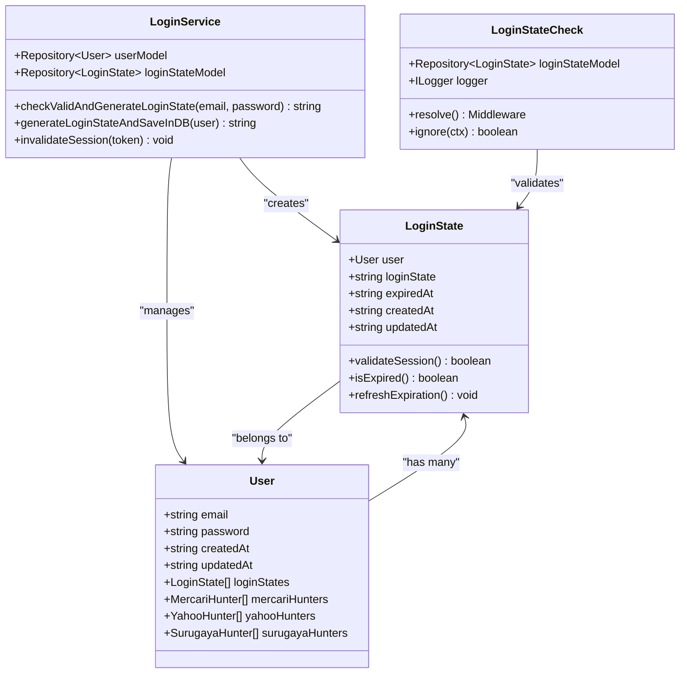
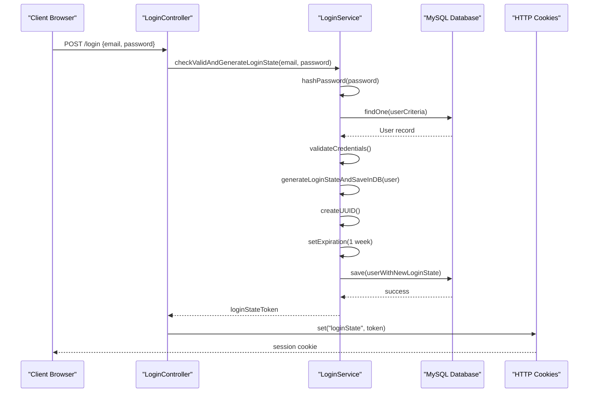
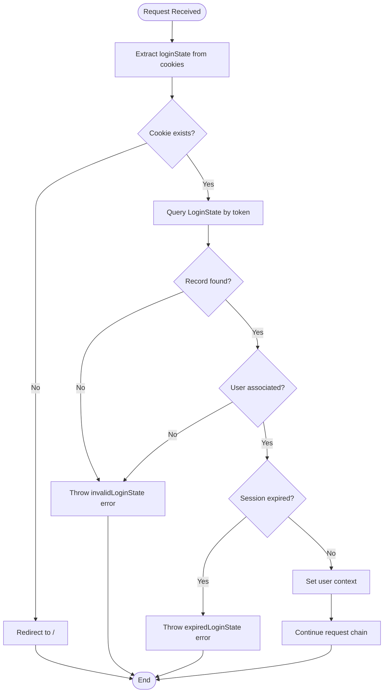

# Login State Model Documentation

<cite>
**Referenced Files in This Document**
- [loginState.ts](file://src/model/loginState.ts)
- [login.ts](file://src/service/login.ts)
- [loginStateCheck.ts](file://src/middleware/loginStateCheck.ts)
- [login.ts](file://src/controller/login.ts)
- [user.ts](file://src/model/user.ts)
- [types.ts](file://src/types.ts)
- [errorCode.ts](file://src/errorCode.ts)
- [config.default.ts](file://src/config/config.default.ts)
- [databaseTransactionWrapper.ts](file://src/utils/databaseTransactionWrapper.ts)
</cite>

## Table of Contents
1. [Introduction](#introduction)
2. [LoginState Model Architecture](#loginstate-model-architecture)
3. [Core Fields and Relationships](#core-fields-and-relationships)
4. [Session Management Workflow](#session-management-workflow)
5. [Security Implementation](#security-implementation)
6. [Performance Considerations](#performance-considerations)
7. [Integration Patterns](#integration-patterns)
8. [Error Handling and Validation](#error-handling-and-validation)
9. [Best Practices](#best-practices)
10. [Troubleshooting Guide](#troubleshooting-guide)

## Introduction

The LoginState model serves as the cornerstone of session tracking in the goods_hunter system, providing persistent authentication state management across HTTP requests. Built on TypeORM and integrated with Redis for distributed caching, this model enables secure, scalable user authentication while maintaining session validity through sophisticated TTL (Time-To-Live) management and automatic cleanup mechanisms.

The system implements a distributed session architecture where login tokens are stored in MySQL database with automatic expiration handling, complemented by Redis caching for high-performance read operations during authentication checks.

## LoginState Model Architecture

The LoginState model represents a many-to-one relationship with the User entity, establishing a hierarchical structure where each user can maintain multiple concurrent login sessions. This design enables session isolation while allowing users to maintain multiple simultaneous authentications across different devices or browsers.

**Diagram sources**
- [loginState.ts](file://src/model/loginState.ts#L5-L21)
- [user.ts](file://src/model/user.ts#L14-L41)
- [login.ts](file://src/service/login.ts#L12-L47)
- [loginStateCheck.ts](file://src/middleware/loginStateCheck.ts#L13-L53)

**Section sources**
- [loginState.ts](file://src/model/loginState.ts#L1-L22)
- [user.ts](file://src/model/user.ts#L1-L42)

## Core Fields and Relationships

### Primary Identifier Field

The `loginState` field serves as the primary identifier for session tokens, utilizing UUID v4 generation for cryptographic security and uniqueness guarantees. This field is configured as a primary column with varchar type, ensuring optimal indexing performance for session lookups.

### Expiration Management

The `expiredAt` datetime field implements precise session expiration tracking with millisecond granularity. Sessions are configured for a 1-week lifespan by default, with automatic timestamp formatting ensuring consistent datetime representation across the application stack.

### Timestamp Tracking

The model maintains comprehensive audit trails through `createdAt` and `updatedAt` fields, leveraging TypeORM's built-in decorators for automatic timestamp management. These fields enable session lifecycle monitoring and support for session analytics.

### Relationship Configuration

The @ManyToOne decorator establishes a primary key relationship with the User entity, enabling efficient foreign key constraints and cascading operations. The relationship is configured with `{ primary: true }` to integrate seamlessly with TypeORM's composite key handling.

**Section sources**
- [loginState.ts](file://src/model/loginState.ts#L7-L20)
- [login.ts](file://src/service/login.ts#L38-L45)

## Session Management Workflow

### Authentication Flow

The session creation process follows a secure, multi-stage workflow that ensures both user verification and session persistence:

**Diagram sources**
- [login.ts](file://src/controller/login.ts#L22-L36)
- [login.ts](file://src/service/login.ts#L20-L46)

### Session Validation Process

The middleware-based validation system implements real-time session verification with automatic failure handling:

**Diagram sources**
- [loginStateCheck.ts](file://src/middleware/loginStateCheck.ts#L25-L50)

**Section sources**
- [login.ts](file://src/controller/login.ts#L1-L38)
- [login.ts](file://src/service/login.ts#L1-L48)
- [loginStateCheck.ts](file://src/middleware/loginStateCheck.ts#L1-L54)

## Security Implementation

### Cryptographic Token Generation

The system employs UUID v4 generation for session tokens, providing cryptographically secure random identifiers with 122 bits of entropy. This approach prevents predictable token generation and mitigates brute force attacks.

### Password Hashing

Password verification utilizes SHA-256 hashing with cryptographic libraries, ensuring password security through industry-standard hashing algorithms. The hashed credentials are compared directly against stored digest values without exposing plaintext passwords.

### Session Isolation

Each login session operates independently, allowing users to maintain multiple concurrent authentications. This design supports scenarios such as mobile app usage alongside web browser access while maintaining strict session isolation.

### Automatic Cleanup Mechanisms

The system implements automatic session cleanup through database cascade operations and middleware validation. Expired sessions are automatically invalidated during subsequent authentication attempts, preventing accumulation of stale session data.

**Section sources**
- [login.ts](file://src/service/login.ts#L20-L35)
- [loginStateCheck.ts](file://src/middleware/loginStateCheck.ts#L42-L44)

## Performance Considerations

### Database Indexing Strategy

The LoginState model benefits from automatic indexing on the `loginState` field, enabling O(log n) lookup performance for session validation. Composite indexing with the user relationship ensures efficient join operations during authentication.

### Memory Optimization

Session data is loaded on-demand through TypeORM's lazy loading capabilities, minimizing memory footprint during authentication checks. The middleware validates sessions without loading unnecessary user data until explicitly required.

### Concurrency Handling

The system handles high-concurrency scenarios through database transaction management and proper connection pooling. The databaseTransactionWrapper utility ensures atomic operations during session creation and updates.

### Caching Integration

While the current implementation focuses on database persistence, the architecture supports Redis caching integration for frequently accessed session data. Future enhancements could implement Redis-based session caching with TTL synchronization.

**Section sources**
- [databaseTransactionWrapper.ts](file://src/utils/databaseTransactionWrapper.ts#L1-L51)
- [config.default.ts](file://src/config/config.default.ts#L40-L46)

## Integration Patterns

### Middleware Integration

The LoginStateCheck middleware integrates seamlessly with the application's request pipeline, providing transparent authentication enforcement across protected routes. The middleware automatically bypasses specific endpoints for administrative functions.

### Error Code Standardization

The system implements comprehensive error code management through the errorCode module, providing standardized error responses for various authentication failure scenarios including missing tokens, invalid sessions, and expired credentials.

### Type Safety

Strong typing through TypeScript interfaces ensures compile-time validation of user context data. The UserInfo interface provides minimal, secure user information exposure during authentication.

**Section sources**
- [loginStateCheck.ts](file://src/middleware/loginStateCheck.ts#L21-L23)
- [types.ts](file://src/types.ts#L5-L7)
- [errorCode.ts](file://src/errorCode.ts#L1-L75)

## Error Handling and Validation

### Comprehensive Validation

The authentication system implements multi-layered validation including cookie presence checking, database record verification, and expiration timestamp validation. Each validation stage provides specific error codes for debugging and monitoring.

### Graceful Degradation

Failed authentication attempts trigger appropriate error responses without exposing sensitive information. The system redirects unauthorized users to the homepage while maintaining security through proper error handling.

### Monitoring Integration

Error codes are structured for easy monitoring and alerting, with specific codes for different failure scenarios enabling targeted operational insights and troubleshooting.

**Section sources**
- [loginStateCheck.ts](file://src/middleware/loginStateCheck.ts#L27-L44)
- [errorCode.ts](file://src/errorCode.ts#L38-L46)

## Best Practices

### Session Lifecycle Management

Implement proper session lifecycle management by regularly reviewing and cleaning up expired sessions. Monitor session growth patterns to optimize TTL settings and prevent database bloat.

### Security Hardening

Consider implementing additional security measures such as IP address binding, device fingerprinting, and rate limiting for authentication endpoints to enhance session security.

### Performance Monitoring

Monitor authentication performance metrics including average response times, database query patterns, and cache hit rates to identify optimization opportunities.

### Scalability Planning

Plan for horizontal scaling by ensuring session data distribution strategies and implementing load balancing considerations for session-aware applications.

## Troubleshooting Guide

### Common Issues

**Session Not Found Errors**: Verify cookie transmission and ensure proper cookie domain configuration. Check database connectivity and session table integrity.

**Unexpected Expiration**: Review TTL configuration and database clock synchronization. Investigate potential timezone-related issues affecting datetime comparisons.

**Performance Degradation**: Analyze database query patterns and consider implementing Redis caching for frequently accessed session data.

### Debugging Strategies

Enable detailed logging through the ILogger interface to track session creation, validation, and cleanup operations. Monitor error patterns to identify systemic issues or attack vectors.

### Maintenance Procedures

Regular database maintenance should include index optimization and session cleanup procedures. Implement automated monitoring for session growth patterns and authentication success rates.

**Section sources**
- [loginStateCheck.ts](file://src/middleware/loginStateCheck.ts#L18-L19)
- [errorCode.ts](file://src/errorCode.ts#L38-L46)