# Marketplace Hunter Models

<cite>
**Referenced Files in This Document**   
- [types.ts](file://src/model/types.ts)
- [mercariHunter.ts](file://src/model/mercariHunter.ts)
- [surugaya.ts](file://src/model/surugaya.ts)
- [yahooHunter.ts](file://src/model/yahooHunter.ts)
- [user.ts](file://src/model/user.ts)
- [base.ts](file://src/service/hunterArsenal/base.ts)
- [mercari.ts](file://src/service/hunterArsenal/mercari.ts)
- [surugaya.ts](file://src/service/hunterArsenal/surugaya.ts)
- [yahoo.ts](file://src/service/hunterArsenal/yahoo.ts)
- [types.ts](file://src/types.ts)
- [const.ts](file://src/const.ts)
- [surugayaGoodsRecord.ts](file://src/model/surugayaGoodsRecord.ts)
- [yahooAuctionRecord.ts](file://src/model/yahooAuctionRecord.ts)
</cite>

## Table of Contents
1. [Introduction](#introduction)
2. [Core Hunter Models](#core-hunter-models)
3. [Base Interface and Type Definitions](#base-interface-and-type-definitions)
4. [User Association and Relationships](#user-association-and-relationships)
5. [Service Layer Implementation](#service-layer-implementation)
6. [Cron Job Scheduling and Execution](#cron-job-scheduling-and-execution)
7. [Search Condition Structure](#search-condition-structure)
8. [Data Persistence and TypeORM Decorators](#data-persistence-and-typeorm-decorators)
9. [Polymorphic Handling in Service Layer](#polymorphic-handling-in-service-layer)
10. [Real-World Configuration Examples](#real-world-configuration-examples)
11. [Configuration Propagation and Updates](#configuration-propagation-and-updates)
12. [Field-Level Descriptions and Constraints](#field-level-descriptions-and-constraints)

## Introduction
The Marketplace Hunter models in the Goods Hunter application represent specialized monitoring agents for different e-commerce platforms including Mercari, Surugaya, and Yahoo Auctions. These models enable users to set up automated monitoring of marketplace listings based on specific search criteria, with results delivered via email notifications. The system is designed with a modular architecture that allows for platform-specific configurations while maintaining a consistent interface across all hunter types.

**Section sources**
- [types.ts](file://src/model/types.ts#L3-L19)
- [const.ts](file://src/const.ts#L3)

## Core Hunter Models

### MercariHunter
The MercariHunter model is designed to monitor listings on the Mercari marketplace. It stores search conditions, scheduling information, and user association data necessary for automated monitoring.

**Section sources**
- [mercariHunter.ts](file://src/model/mercariHunter.ts#L7-L42)

### SurugayaHunter
The SurugayaHunter model monitors listings on the Surugaya marketplace, capturing search parameters and scheduling details for automated monitoring tasks.

**Section sources**
- [surugaya.ts](file://src/model/surugaya.ts#L8-L41)

### YahooHunter
The YahooHunter model handles monitoring of Yahoo Auctions listings, storing the necessary configuration for automated searches and notifications.

**Section sources**
- [yahooHunter.ts](file://src/model/yahooHunter.ts#L8-L43)

## Base Interface and Type Definitions

### GoodsHunterModelBase Interface
The `GoodsHunterModelBase` interface defines the common properties shared across all hunter models, establishing a consistent structure for marketplace monitoring configurations.

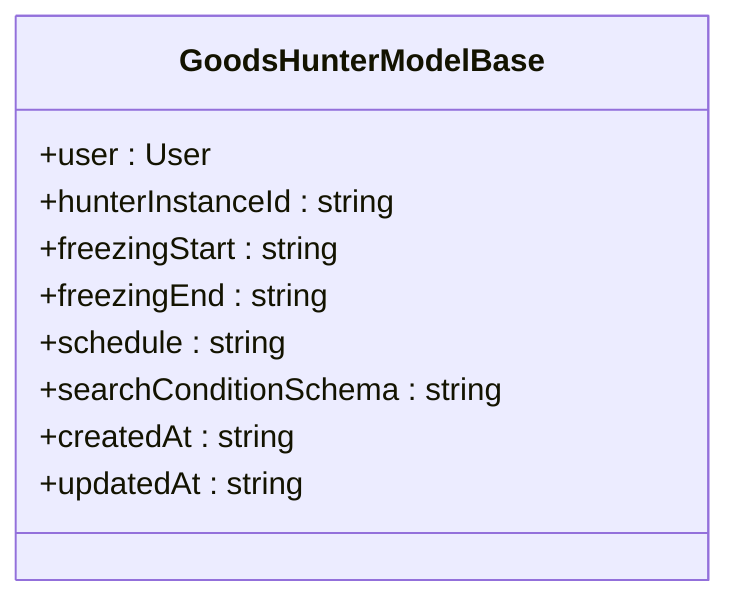

**Diagram sources**
- [types.ts](file://src/model/types.ts#L3-L19)

### GoodsHunter Type Interface
The `GoodsHunter` interface in the application types defines the structure for hunter configurations, extending basic properties with platform-specific requirements.

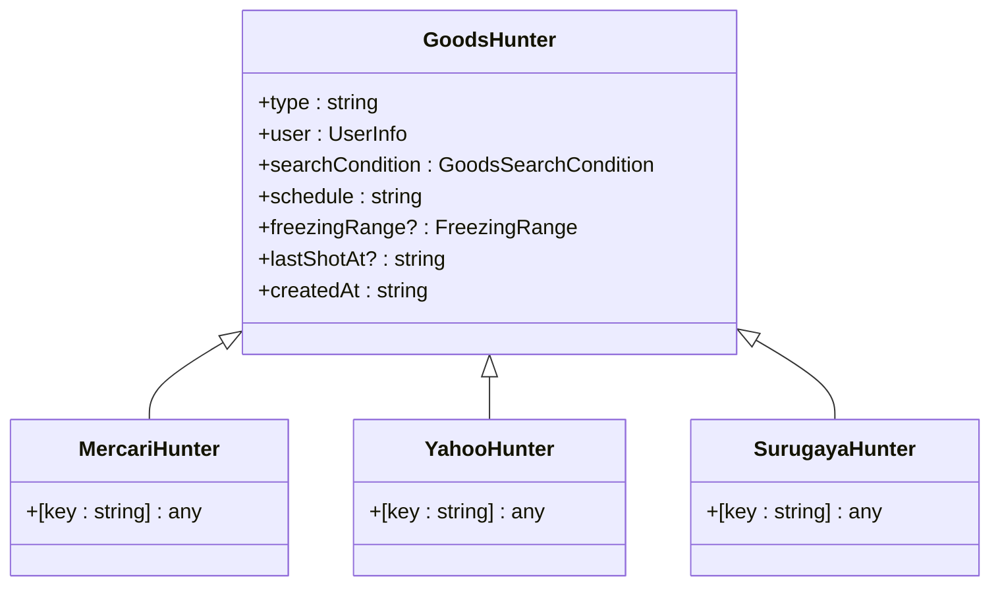

**Diagram sources**
- [types.ts](file://src/types.ts#L14-L34)

## User Association and Relationships

### User Entity Relationships
The User entity maintains one-to-many relationships with all hunter types, enabling a single user to manage multiple monitoring tasks across different marketplaces.

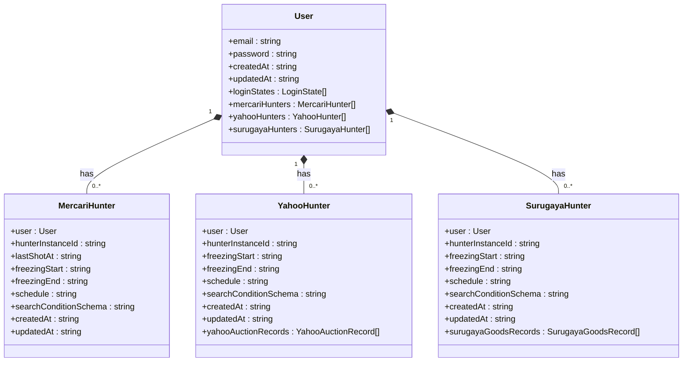

**Diagram sources**
- [user.ts](file://src/model/user.ts#L15-L39)
- [mercariHunter.ts](file://src/model/mercariHunter.ts#L7-L42)
- [yahooHunter.ts](file://src/model/yahooHunter.ts#L8-L43)
- [surugaya.ts](file://src/model/surugaya.ts#L8-L41)

### Data Record Relationships
Platform-specific hunter models maintain relationships with their respective data record entities to track historical listing information.

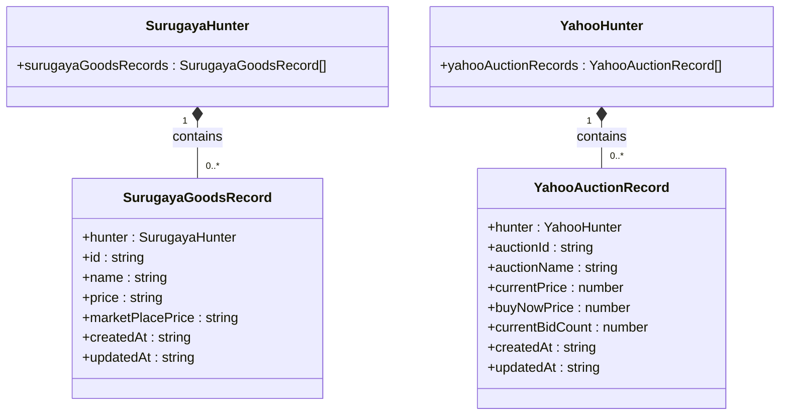

**Diagram sources**
- [surugaya.ts](file://src/model/surugaya.ts#L37-L39)
- [surugayaGoodsRecord.ts](file://src/model/surugayaGoodsRecord.ts#L6-L28)
- [yahooHunter.ts](file://src/model/yahooHunter.ts#L37-L39)
- [yahooAuctionRecord.ts](file://src/model/yahooAuctionRecord.ts#L6-L31)

## Service Layer Implementation

### Hunter Base Class
The `HunterBase` abstract class provides common functionality for all hunter services, including cron job management and monitoring capabilities.

```mermaid
classDiagram
class HunterBase {
-cronList : CronList
+hunterType : string
+pingpongTask() : Promise~void~
+spawnCronJob(id : string, schedule : string) : Promise~void~
+logger : ILogger
+emailService : EmailService
+serverInfo : CustomConfig["serverInfo"]
+cipher : CipherServive
+abstract hire(...any : any) : Promise~any~
+abstract dismiss(hunterInstanceId : string) : Promise~any~
+abstract transfer(id : string, newHunterInfo : any) : Promise~any~
+abstract goHunt(hunterInstanceId : string) : Promise~any~
}
class MercariHunterService {
+hunterType : "Mercari"
+mercariApi : MercariApi
+mercariHunterModel : Repository~MercariHunterModel~
+hire(ctx : Context, hunterInfo : MercariHuntetType) : Promise~void~
+goHunt(cronId : string) : Promise~void~
+dismiss(id : string) : Promise~void~
+transfer(id : string, newHunterInfo : Pick~MercariHuntetType, "freezingRange" | "user" | "schedule" | "type" | "searchCondition"~) : Promise~void~
+spawnCronJob(id : string, schedule : string) : Promise~void~
+getCronList(email : string) : Promise~MercariHunterModel[]~
}
class SurugayaHunterService {
+hunterType : "Surugaya"
+suruguyaApi : SurugayaApi
+surugayaHunterModel : Repository~SurugayaHunterModel~
+surugayaGoodsRecordModel : Repository~SurugayaGoodsRecord~
+mailInfo : CustomConfig["emailConfig"]
+hire(ctx : Context, hunterInfo : SurugayaHunterType) : Promise~void~
+goHunt(cronId : string) : Promise~void~
+dismiss(id : string) : Promise~void~
+transfer(id : string, newHunterInfo : Pick~SurugayaHunterType, "freezingRange" | "user" | "schedule" | "type" | "searchCondition"~) : Promise~void~
+spawnCronJob(id : string, schedule : string) : Promise~void~
+getCronList(email : string) : Promise~SurugayaHunterModel[]~
}
class YahooHunterService {
+hunterType : "Yahoo"
+yahooApi : YahooAuctionApi
+yahooHunterModel : Repository~YahooHunterModel~
+yahooAuctionRecordModel : Repository~YahooAuctionRecord~
+mailInfo : CustomConfig["emailConfig"]
+cookieHeartBeatCheck() : Promise~void~
+hire(ctx : Context, hunterInfo : YahooHunterType) : Promise~void~
+goHunt(cronId : string) : Promise~void~
+dismiss(id : string) : Promise~void~
+transfer(id : string, newHunterInfo : Pick~YahooHunterType, "freezingRange" | "user" | "schedule" | "type" | "searchCondition"~) : Promise~void~
+spawnCronJob(id : string, schedule : string) : Promise~void~
+getCronList(email : string) : Promise~YahooHunterModel[]~
}
HunterBase <|-- MercariHunterService
HunterBase <|-- SurugayaHunterService
HunterBase <|-- YahooHunterService
```

**Diagram sources**
- [base.ts](file://src/service/hunterArsenal/base.ts#L16-L88)
- [mercari.ts](file://src/service/hunterArsenal/mercari.ts#L25-L339)
- [surugaya.ts](file://src/service/hunterArsenal/surugaya.ts#L26-L345)
- [yahoo.ts](file://src/service/hunterArsenal/yahoo.ts#L27-L363)

### Service Initialization Flow
The initialization process for hunter services involves loading existing configurations from the database and setting up cron jobs for active monitoring tasks.

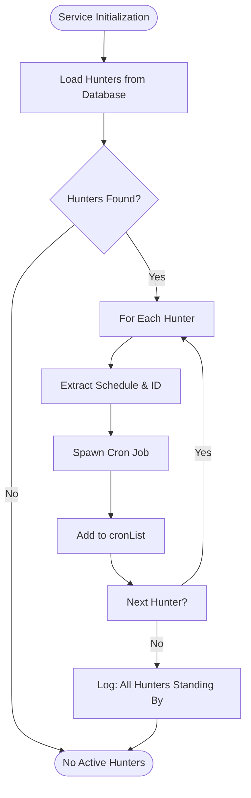

**Diagram sources**
- [mercari.ts](file://src/service/hunterArsenal/mercari.ts#L41-L64)
- [surugaya.ts](file://src/service/hunterArsenal/surugaya.ts#L47-L71)
- [yahoo.ts](file://src/service/hunterArsenal/yahoo.ts#L61-L85)

## Cron Job Scheduling and Execution

### Cron Job Management
The hunter services manage cron jobs through a centralized cronList object, enabling monitoring and control of active scraping tasks.

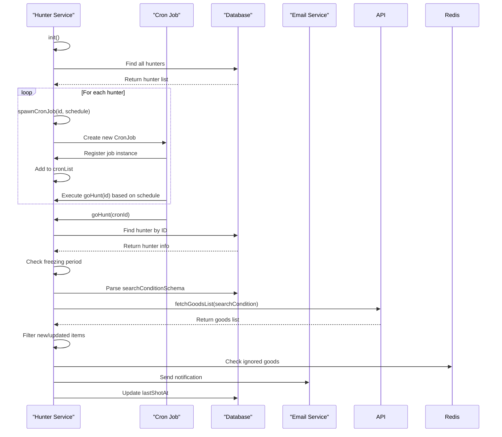

**Diagram sources**
- [base.ts](file://src/service/hunterArsenal/base.ts#L44-L66)
- [mercari.ts](file://src/service/hunterArsenal/mercari.ts#L102-L233)
- [surugaya.ts](file://src/service/hunterArsenal/surugaya.ts#L108-L238)
- [yahoo.ts](file://src/service/hunterArsenal/yahoo.ts#L123-L255)

### Self-Monitoring with Ping-Pong
Each hunter service implements a self-monitoring mechanism to detect and recover from unexpected cron job terminations.

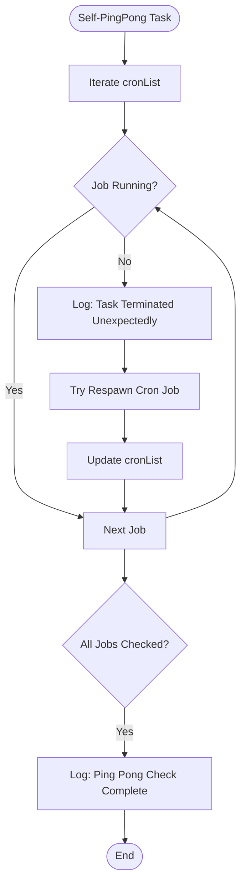

**Diagram sources**
- [base.ts](file://src/service/hunterArsenal/base.ts#L27-L42)
- [mercari.ts](file://src/service/hunterArsenal/mercari.ts#L35-L38)
- [surugaya.ts](file://src/service/hunterArsenal/surugaya.ts#L42-L45)
- [yahoo.ts](file://src/service/hunterArsenal/yahoo.ts#L56-L59)

## Search Condition Structure

### Platform-Specific Search Conditions
Each marketplace has its own search condition structure that extends the base requirements with platform-specific parameters.

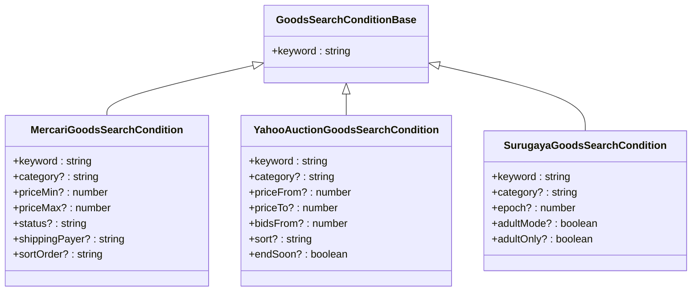

**Diagram sources**
- [types.ts](file://src/api/site/types.ts#L5-L7)
- [mercari/types.ts](file://src/api/site/mercari/types.ts)
- [yahoo/types.ts](file://src/api/site/yahoo/types.ts)
- [surugaya/types.ts](file://src/api/site/surugaya/types.ts#L14-L19)

## Data Persistence and TypeORM Decorators

### Entity Model Configuration
The hunter models use TypeORM decorators to define database schema and relationships, ensuring proper data persistence and retrieval.

```mermaid
classDiagram
class EntityModel {
<<Decorator>>
}
class ManyToOne {
<<Decorator>>
}
class Column {
<<Decorator>>
}
class CreateDateColumn {
<<Decorator>>
}
class UpdateDateColumn {
<<Decorator>>
}
class OneToMany {
<<Decorator>>
}
class PrimaryColumn {
<<Decorator>>
}
class MercariHunter {
+@EntityModel()
+@ManyToOne()
+@Column("varchar", { primary : true })
+@Column("datetime", { default : null })
+@Column("time", { default : null })
+@Column("varchar")
+@Column("longtext")
+@CreateDateColumn()
+@UpdateDateColumn()
}
EntityModel --> MercariHunter : Applied to
ManyToOne --> MercariHunter : Applied to user
Column --> MercariHunter : Applied to multiple fields
CreateDateColumn --> MercariHunter : Applied to createdAt
UpdateDateColumn --> MercariHunter : Applied to updatedAt
```

**Diagram sources**
- [mercariHunter.ts](file://src/model/mercariHunter.ts#L6-L42)
- [surugaya.ts](file://src/model/surugaya.ts#L7-L41)
- [yahooHunter.ts](file://src/model/yahooHunter.ts#L7-L43)

## Polymorphic Handling in Service Layer

### Hunter Route Service
The HunterRouteService provides a polymorphic interface for handling operations across different hunter types, routing requests to the appropriate service implementation.

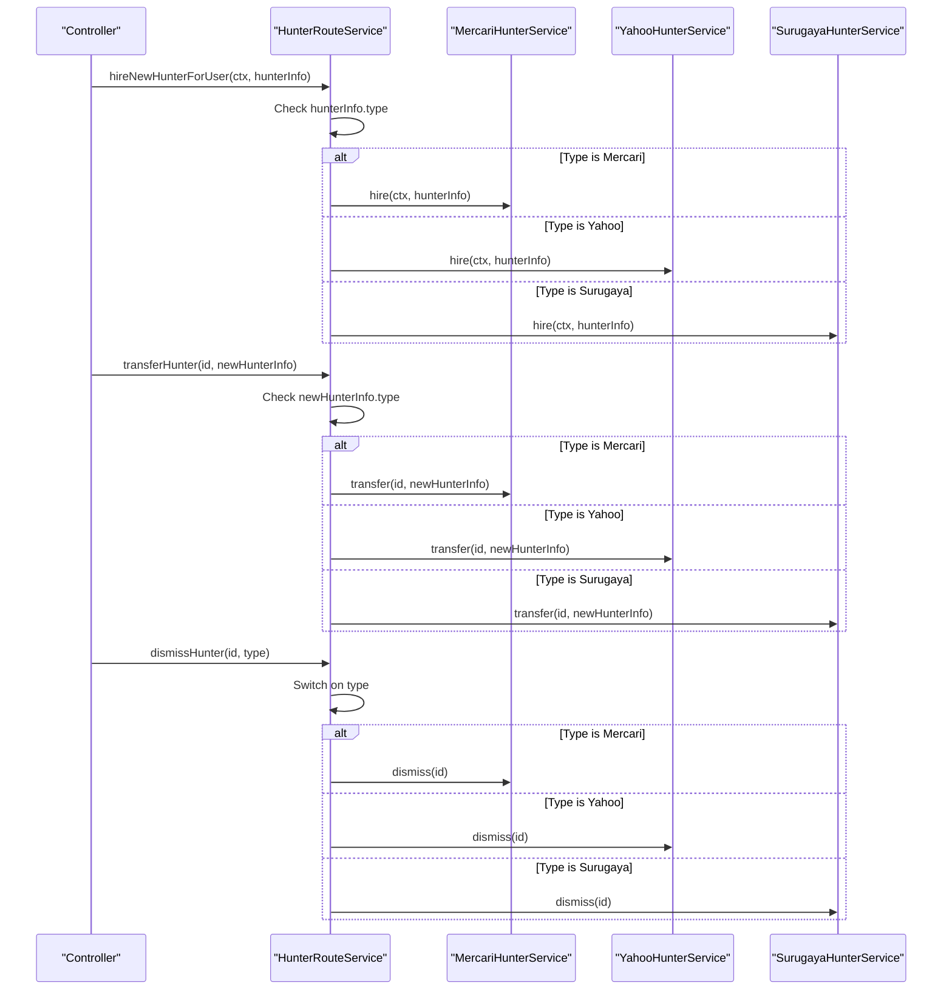

**Diagram sources**
- [hunterRouteService.ts](file://src/service/hunterRouteService.ts#L85-L144)

## Real-World Configuration Examples

### Mercari Hunter Configuration
A typical Mercari hunter configuration includes keyword search, price range filtering, and scheduling parameters.

```json
{
  "type": "Mercari",
  "user": {
    "email": "user@example.com"
  },
  "searchCondition": {
    "keyword": "vintage camera",
    "priceMin": 1000,
    "priceMax": 5000,
    "category": "electronics",
    "status": "excellent"
  },
  "schedule": "0 */30 * * * *",
  "freezingRange": {
    "start": "23:00",
    "end": "07:00"
  },
  "createdAt": "2023-01-01T00:00:00Z"
}
```

**Section sources**
- [mercariHunter.ts](file://src/model/mercariHunter.ts#L7-L42)
- [types.ts](file://src/types.ts#L24-L26)

### Yahoo Auction Hunter Configuration
A Yahoo Auction hunter configuration includes keyword search, bid filtering, and scheduling for monitoring auction items.

```json
{
  "type": "Yahoo",
  "user": {
    "email": "user@example.com"
  },
  "searchCondition": {
    "keyword": "antique doll",
    "priceFrom": 2000,
    "priceTo": 10000,
    "bidsFrom": 0,
    "endSoon": true
  },
  "schedule": "0 */15 * * * *",
  "freezingRange": {
    "start": "22:00",
    "end": "06:00"
  },
  "createdAt": "2023-01-01T00:00:00Z"
}
```

**Section sources**
- [yahooHunter.ts](file://src/model/yahooHunter.ts#L8-L43)
- [types.ts](file://src/types.ts#L28-L30)

### Surugaya Hunter Configuration
A Surugaya hunter configuration includes keyword search, category filtering, and adult content preferences.

```json
{
  "type": "Surugaya",
  "user": {
    "email": "user@example.com"
  },
  "searchCondition": {
    "keyword": "rare book",
    "category": "books",
    "adultMode": true,
    "adultOnly": false
  },
  "schedule": "0 */45 * * * *",
  "freezingRange": {
    "start": "23:30",
    "end": "05:30"
  },
  "createdAt": "2023-01-01T00:00:00Z"
}
```

**Section sources**
- [surugaya.ts](file://src/model/surugaya.ts#L8-L41)
- [types.ts](file://src/types.ts#L32-L34)

## Configuration Propagation and Updates

### Hunter Configuration Update Flow
When a hunter configuration is updated, the system propagates changes to the active monitoring task, potentially restarting the cron job if the schedule has changed.

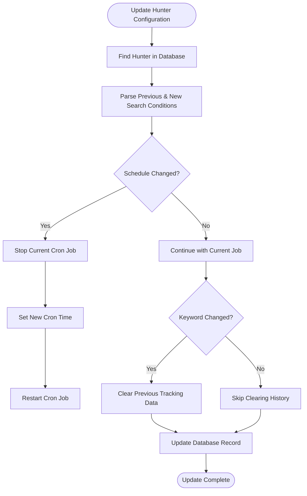

**Diagram sources**
- [mercari.ts](file://src/service/hunterArsenal/mercari.ts#L246-L304)
- [surugaya.ts](file://src/service/hunterArsenal/surugaya.ts#L251-L310)
- [yahoo.ts](file://src/service/hunterArsenal/yahoo.ts#L269-L324)

## Field-Level Descriptions and Constraints

### Common Field Descriptions
The following table describes the common fields across all hunter models, including their data types, constraints, and default values.

| Field | Type | Constraints | Default Value | Description |
|-------|------|-------------|---------------|-------------|
| hunterInstanceId | string | Primary key, not null | None | Unique identifier for the hunter instance |
| freezingStart | string | Time format (HH:MM) | null | Start time for daily freezing period |
| freezingEnd | string | Time format (HH:MM) | null | End time for daily freezing period |
| schedule | string | Cron expression format | None | Scheduling pattern for the monitoring task |
| searchConditionSchema | string | JSON string, not null | None | Serialized search conditions for the marketplace |
| createdAt | string | DateTime format | None | Timestamp when the hunter was created |
| updatedAt | string | DateTime format | None | Timestamp when the hunter was last updated |

**Section sources**
- [types.ts](file://src/model/types.ts#L3-L19)
- [mercariHunter.ts](file://src/model/mercariHunter.ts#L7-L42)
- [surugaya.ts](file://src/model/surugaya.ts#L8-L41)
- [yahooHunter.ts](file://src/model/yahooHunter.ts#L8-L43)

### Platform-Specific Field Descriptions
Additional fields specific to each hunter type provide platform-appropriate configuration options.

| Hunter Type | Field | Type | Constraints | Default Value | Description |
|-------------|-------|------|-------------|---------------|-------------|
| MercariHunter | lastShotAt | string | DateTime format | null | Timestamp of the last successful monitoring run |
| SurugayaHunter | surugayaGoodsRecords | SurugayaGoodsRecord[] | One-to-many relationship | None | Historical records of monitored goods |
| YahooHunter | yahooAuctionRecords | YahooAuctionRecord[] | One-to-many relationship | None | Historical records of monitored auctions |

**Section sources**
- [mercariHunter.ts](file://src/model/mercariHunter.ts#L17-L18)
- [surugaya.ts](file://src/model/surugaya.ts#L37-L39)
- [yahooHunter.ts](file://src/model/yahooHunter.ts#L37-L39)