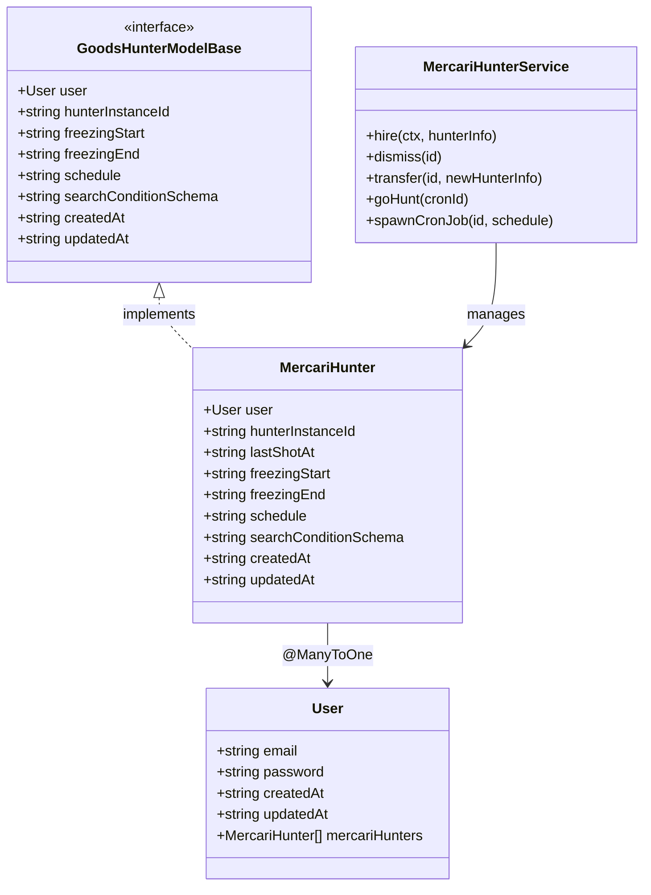
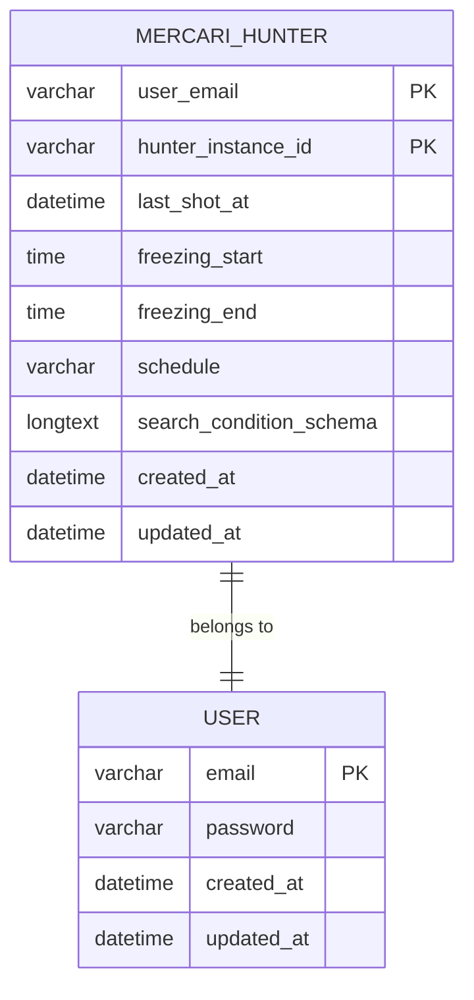
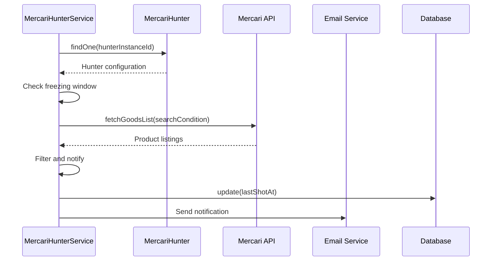
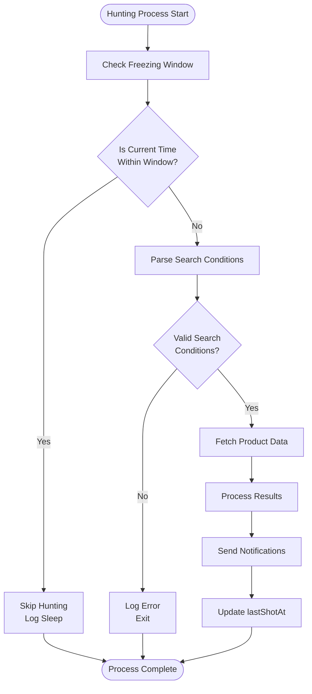

# MercariHunter Model Documentation

<cite>
**Referenced Files in This Document**
- [mercariHunter.ts](file://src/model/mercariHunter.ts)
- [user.ts](file://src/model/user.ts)
- [types.ts](file://src/model/types.ts)
- [mercari.ts](file://src/service/hunterArsenal/mercari.ts)
- [base.ts](file://src/service/hunterArsenal/base.ts)
- [isBetweenDayTime.ts](file://src/utils/isBetweenDayTime.ts)
- [types.ts](file://src/api/site/types.ts)
- [mercari/types.ts](file://src/api/site/mercari/types.ts)
</cite>

## Table of Contents
1. [Introduction](#introduction)
2. [Model Architecture](#model-architecture)
3. [TypeORM Implementation](#typeorm-implementation)
4. [Interface Implementation](#interface-implementation)
5. [Field Specifications](#field-specifications)
6. [Relationships](#relationships)
7. [Integration with Hunter Arsenal](#integration-with-hunter-arsenal)
8. [Freezing Window Mechanism](#freezing-window-mechanism)
9. [Real-World Example](#real-world-example)
10. [Monitoring and Updates](#monitoring-and-updates)
11. [Constraints and Validation](#constraints-and-validation)
12. [Conclusion](#conclusion)

## Introduction

The MercariHunter model represents a sophisticated data entity that implements the GoodsHunterModelBase interface for managing automated scraping tasks on the Mercari marketplace. This model serves as the core persistence layer for tracking user-configured search hunters that automatically monitor product listings based on customizable criteria.

The model leverages TypeORM decorators for database persistence while maintaining strong typing through TypeScript interfaces. It integrates seamlessly with the hunterArsenal service to orchestrate periodic scraping operations, manage search conditions, and handle time-based restrictions through a sophisticated freezing window mechanism.

## Model Architecture

The MercariHunter model follows a hierarchical architecture that combines database persistence with business logic integration:



**Diagram sources**
- [mercariHunter.ts](file://src/model/mercariHunter.ts#L6-L40)
- [types.ts](file://src/model/types.ts#L3-L19)
- [user.ts](file://src/model/user.ts#L14-L39)
- [mercari.ts](file://src/service/hunterArsenal/mercari.ts#L23-L339)

**Section sources**
- [mercariHunter.ts](file://src/model/mercariHunter.ts#L1-L42)
- [types.ts](file://src/model/types.ts#L1-L21)

## TypeORM Implementation

The MercariHunter model utilizes TypeORM decorators to define database schema and relationships. The implementation demonstrates several key patterns:

### Entity Definition
The model is decorated with `@EntityModel()` to mark it as a TypeORM entity, enabling automatic database table generation and ORM capabilities.

### Composite Primary Key
The model implements a composite primary key consisting of:
- `user`: References the owning User entity
- `hunterInstanceId`: Unique identifier for this specific hunting instance

### Column Decorators
Each field is annotated with appropriate column types and constraints:



**Diagram sources**
- [mercariHunter.ts](file://src/model/mercariHunter.ts#L8-L39)
- [user.ts](file://src/model/user.ts#L14-L39)

**Section sources**
- [mercariHunter.ts](file://src/model/mercariHunter.ts#L6-L40)

## Interface Implementation

The MercariHunter class implements the GoodsHunterModelBase interface, ensuring consistent behavior across different hunter types. This interface-based design enables polymorphic handling of various marketplace hunters while maintaining type safety.

### Interface Contract Compliance
The model satisfies all interface requirements:
- **User Relationship**: Maintains the @ManyToOne relationship with User
- **Instance Identification**: Provides unique hunterInstanceId for task management
- **Temporal Fields**: Implements freezingStart and freezingEnd for scheduling
- **Execution Control**: Manages schedule and searchConditionSchema for automation
- **Lifecycle Tracking**: Includes createdAt and updatedAt for audit purposes

**Section sources**
- [types.ts](file://src/model/types.ts#L3-L19)
- [mercariHunter.ts](file://src/model/mercariHunter.ts#L7-L40)

## Field Specifications

Each field in the MercariHunter model serves a specific purpose in the hunting and monitoring system:

### Core Identification Fields

| Field | Type | Purpose | Constraints |
|-------|------|---------|-------------|
| `user` | User | Owner relationship | Primary key, @ManyToOne |
| `hunterInstanceId` | string | Unique identifier | Primary key, varchar |

### Execution Tracking Fields

| Field | Type | Purpose | Default Behavior |
|-------|------|---------|------------------|
| `lastShotAt` | datetime | Last execution timestamp | Nullable, defaults to null |
| `createdAt` | datetime | Record creation time | Auto-generated |
| `updatedAt` | datetime | Last modification time | Auto-updated |

### Scheduling and Restriction Fields

| Field | Type | Purpose | Format Expectations |
|-------|------|---------|-------------------|
| `schedule` | varchar | Cron expression for timing | Valid cron syntax required |
| `freezingStart` | time | Start of restriction window | HH:mm format |
| `freezingEnd` | time | End of restriction window | HH:mm format |

### Configuration Storage Field

| Field | Type | Purpose | Data Format |
|-------|------|---------|-------------|
| `searchConditionSchema` | longtext | Serialized search configuration | JSON string |

**Section sources**
- [mercariHunter.ts](file://src/model/mercariHunter.ts#L14-L33)

## Relationships

The MercariHunter model establishes several important relationships within the system:

### User Relationship
The @ManyToOne relationship with the User model creates a one-to-many association where each user can own multiple hunting instances. This relationship is marked as primary, establishing the composite primary key structure.

### Cascade Operations
The relationship supports cascade operations, ensuring that when a user is deleted, all associated hunting instances are automatically removed, maintaining referential integrity.

### Lazy Loading
The relationship is configured for lazy loading, optimizing performance by only loading related user data when explicitly accessed.

**Section sources**
- [mercariHunter.ts](file://src/model/mercariHunter.ts#L8-L12)
- [user.ts](file://src/model/user.ts#L31-L31)

## Integration with Hunter Arsenal

The MercariHunter model integrates deeply with the hunterArsenal service, specifically the MercariHunterService, to provide automated scraping capabilities:

### Initialization and Management
The service initializes all existing hunters during startup, parsing their schedules and creating corresponding cron jobs. This ensures continuous operation across application restarts.

### Hunting Workflow
The goHunt method orchestrates the complete hunting process:
1. **Validation**: Checks freezing windows and validates search conditions
2. **Execution**: Performs API calls to fetch product listings
3. **Filtering**: Applies user preferences and ignores lists
4. **Notification**: Sends email alerts for new listings
5. **Persistence**: Updates lastShotAt timestamps

### Dynamic Updates
The transfer method enables real-time updates to running hunters, including schedule changes and search condition modifications, triggering immediate system adjustments.



**Diagram sources**
- [mercari.ts](file://src/service/hunterArsenal/mercari.ts#L102-L233)

**Section sources**
- [mercari.ts](file://src/service/hunterArsenal/mercari.ts#L40-L64)
- [mercari.ts](file://src/service/hunterArsenal/mercari.ts#L102-L233)

## Freezing Window Mechanism

The freezing window mechanism provides sophisticated time-based control over hunting operations:

### Time Window Logic
The system uses the isBetweenDayTime utility to evaluate whether current time falls within specified freezing periods. This mechanism handles both same-day and cross-day windows.

### Cross-Day Support
The implementation supports freezing windows that span midnight, automatically adjusting date calculations to handle overnight periods correctly.

### Preventive Operation
During freezing windows, the hunting process is gracefully skipped, preventing unnecessary API calls and respecting user-defined time restrictions.

### Configuration Format
Freezing times must follow HH:mm format, ensuring consistent parsing and validation across the system.



**Diagram sources**
- [mercari.ts](file://src/service/hunterArsenal/mercari.ts#L112-L119)
- [isBetweenDayTime.ts](file://src/utils/isBetweenDayTime.ts#L3-L13)

**Section sources**
- [mercari.ts](file://src/service/hunterArsenal/mercari.ts#L112-L119)
- [isBetweenDayTime.ts](file://src/utils/isBetweenDayTime.ts#L1-L14)

## Real-World Example

Consider a user configuring a MercariHunter instance for monitoring vintage camera equipment:

### Configuration Setup
```typescript
// User configuration example
const hunterInfo = {
  type: "Mercari",
  user: { email: "collector@example.com" },
  searchCondition: {
    keyword: "vintage camera",
    excludeKeyword: "broken, damaged",
    status: ["STATUS_ON_SALE"],
    categoryId: ["camera_film", "camera_digital"],
    priceMin: 100,
    priceMax: 1000,
    itemConditionId: [1, 2, 3],
    shippingPayerId: [1],
    pageSize: 50
  },
  schedule: "0 */6 * * *", // Every 6 hours
  freezingRange: {
    start: "22:00",
    end: "06:00"
  }
};
```

### Database Representation
The serialized searchConditionSchema would contain:
```json
{
  "keyword": "vintage camera",
  "excludeKeyword": "broken, damaged",
  "status": ["STATUS_ON_SALE"],
  "categoryId": ["camera_film", "camera_digital"],
  "priceMin": 100,
  "priceMax": 1000,
  "itemConditionId": [1, 2, 3],
  "shippingPayerId": [1],
  "pageSize": 50
}
```

### Operational Behavior
- **Scheduling**: Runs every 6 hours according to the cron expression
- **Freezing**: Skips operations between 10 PM and 6 AM daily
- **Search**: Monitors for new listings matching exact criteria
- **Notifications**: Emails the user when new matching items appear

**Section sources**
- [mercari.ts](file://src/service/hunterArsenal/mercari.ts#L66-L98)
- [types.ts](file://src/api/site/types.ts#L5-L8)

## Monitoring and Updates

The system provides comprehensive monitoring and update capabilities:

### Real-Time Updates
Changes to schedule or search conditions trigger immediate system updates:
- **Schedule Changes**: New cron jobs replace existing ones
- **Search Modifications**: Updated conditions apply to next execution
- **Freezing Adjustments**: Window changes take effect immediately

### Health Monitoring
The pingpongTask mechanism continuously monitors running cron jobs, automatically restarting any that become unresponsive.

### Audit Trail
All changes are tracked through createdAt and updatedAt timestamps, providing complete audit history for each hunting instance.

### Error Handling
Robust error handling ensures that individual hunter failures don't impact the overall system, with detailed logging for troubleshooting.

**Section sources**
- [mercari.ts](file://src/service/hunterArsenal/mercari.ts#L36-L38)
- [mercari.ts](file://src/service/hunterArsenal/mercari.ts#L246-L304)

## Constraints and Validation

The MercariHunter model enforces several important constraints:

### Database Constraints
- **Primary Key**: Composite key (user + hunterInstanceId) ensures uniqueness
- **NotNull Fields**: All primary key fields are non-nullable
- **Type Safety**: Proper column types prevent data corruption

### Business Logic Constraints
- **Cron Syntax**: Schedule field must contain valid cron expressions
- **Time Format**: FreezingStart and freezingEnd must follow HH:mm format
- **JSON Validity**: searchConditionSchema must contain valid JSON

### Runtime Validation
The system performs runtime validation:
- **Search Condition Parsing**: Validates JSON structure and required fields
- **Cron Expression Validation**: Ensures scheduled jobs are properly formatted
- **Time Window Logic**: Validates freezing window boundaries

**Section sources**
- [mercari.ts](file://src/service/hunterArsenal/mercari.ts#L120-L131)
- [mercari.ts](file://src/service/hunterArsenal/mercari.ts#L306-L328)

## Conclusion

The MercariHunter model represents a sophisticated implementation of automated marketplace monitoring with robust database persistence, flexible configuration options, and intelligent time-based controls. Its integration with the hunterArsenal service provides a scalable foundation for managing complex scraping operations while maintaining data integrity and operational reliability.

The model's design demonstrates excellent separation of concerns, with clear boundaries between data persistence, business logic, and external integrations. The use of TypeScript interfaces ensures type safety across the system, while the composite primary key structure provides efficient indexing and relationship management.

Key strengths of this implementation include:
- **Flexibility**: Comprehensive search condition support with JSON serialization
- **Reliability**: Robust error handling and health monitoring
- **Scalability**: Efficient database design supporting large-scale operations
- **Maintainability**: Clean architecture with clear separation of responsibilities

This model serves as an excellent example of how modern web applications can leverage TypeORM and TypeScript to build sophisticated, maintainable data models that integrate seamlessly with business logic and external services.