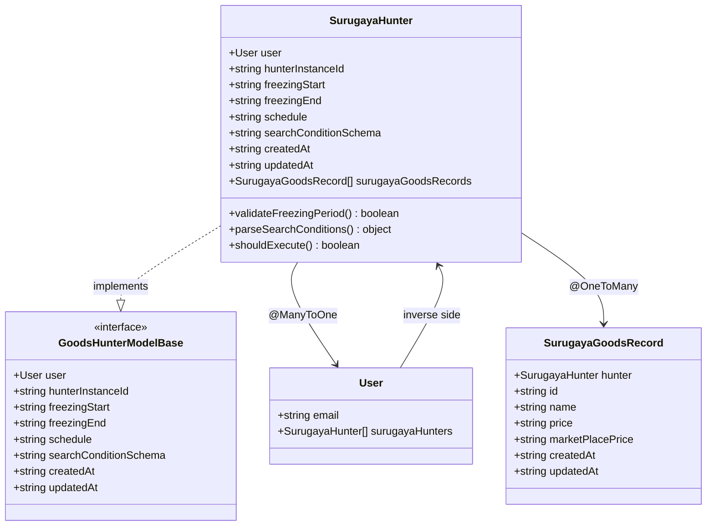
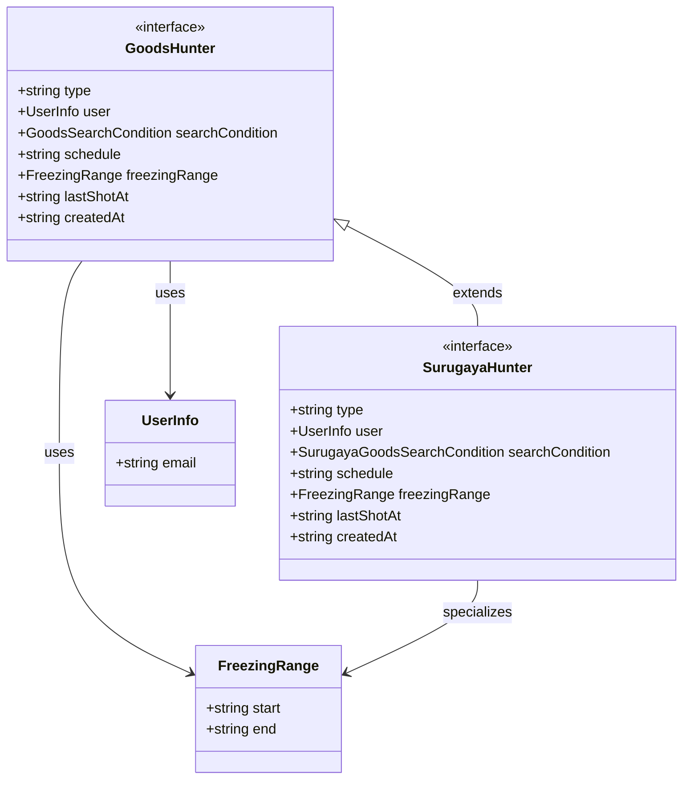
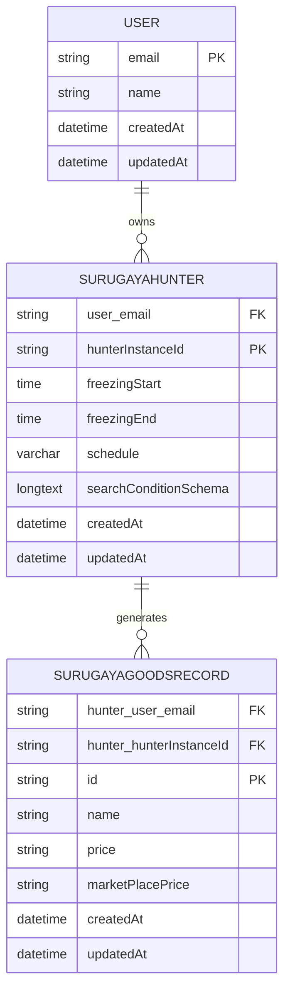
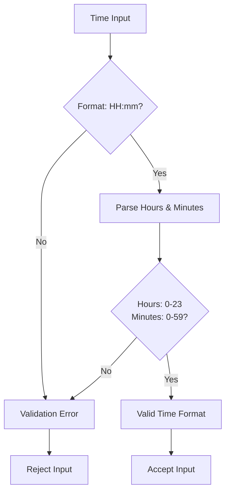
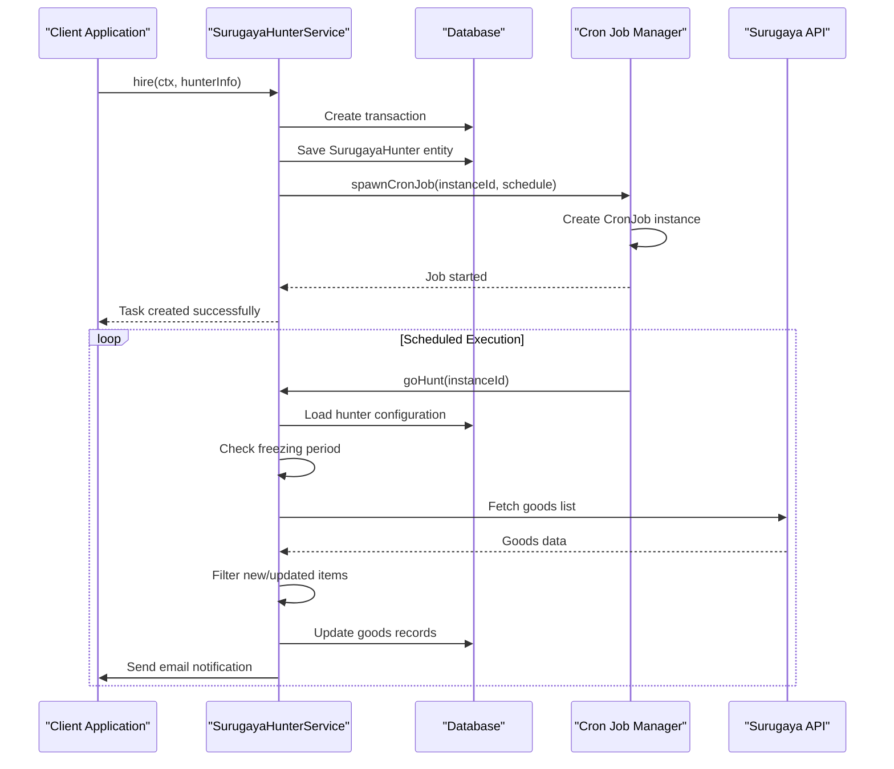
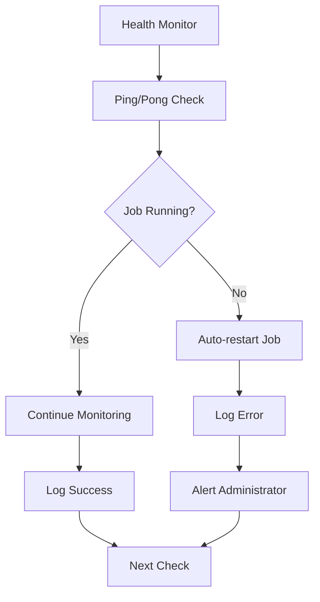

# SurugayaHunter Model Documentation

<cite>
**Referenced Files in This Document**
- [src/model/surugaya.ts](file://src/model/surugaya.ts)
- [src/model/types.ts](file://src/model/types.ts)
- [src/model/surugayaGoodsRecord.ts](file://src/model/surugayaGoodsRecord.ts)
- [src/service/hunterArsenal/surugaya.ts](file://src/service/hunterArsenal/surugaya.ts)
- [src/service/hunterArsenal/base.ts](file://src/service/hunterArsenal/base.ts)
- [src/types.ts](file://src/types.ts)
- [src/api/site/surugaya/types.ts](file://src/api/site/surugaya/types.ts)
- [src/utils/isBetweenDayTime.ts](file://src/utils/isBetweenDayTime.ts)
- [src/controller/goods.ts](file://src/controller/goods.ts)
</cite>

## Table of Contents
1. [Introduction](#introduction)
2. [Entity Structure](#entity-structure)
3. [TypeScript Interfaces](#typescript-interfaces)
4. [Database Schema](#database-schema)
5. [Relationships](#relationships)
6. [Field Specifications](#field-specifications)
7. [Constraints and Validation](#constraints-and-validation)
8. [Service Layer Integration](#service-layer-integration)
9. [Usage Examples](#usage-examples)
10. [Monitoring and Maintenance](#monitoring-and-maintenance)
11. [Troubleshooting](#troubleshooting)

## Introduction

The SurugayaHunter entity serves as a core component in the Goods Hunter system, specifically designed to manage automated web scraping tasks for Surugaya auction websites. This TypeORM entity implements shared patterns through base interfaces while providing specialized functionality for Surugaya-specific monitoring requirements.

The entity acts as a bridge between user configuration and the actual scraping logic, maintaining persistent state for monitoring tasks and enabling real-time updates through the hunterArsenal service layer.

## Entity Structure

The SurugayaHunter entity is implemented as a TypeORM entity that adheres to the GoodsHunterModelBase interface, establishing a standardized pattern for all goods hunting entities in the system.



**Diagram sources**
- [src/model/surugaya.ts](file://src/model/surugaya.ts#L7-L40)
- [src/model/types.ts](file://src/model/types.ts#L3-L20)
- [src/model/surugayaGoodsRecord.ts](file://src/model/surugayaGoodsRecord.ts#L5-L28)

**Section sources**
- [src/model/surugaya.ts](file://src/model/surugaya.ts#L7-L40)
- [src/model/types.ts](file://src/model/types.ts#L3-L20)

## TypeScript Interfaces

The SurugayaHunter entity integrates with several TypeScript interfaces that define the contract for goods hunting operations across different platforms.

### Core Interface Definitions

The system defines a hierarchical interface structure where SurugayaHunter extends the base GoodsHunter interface:



**Diagram sources**
- [src/types.ts](file://src/types.ts#L14-L34)
- [src/types.ts](file://src/types.ts#L9-L12)

**Section sources**
- [src/types.ts](file://src/types.ts#L14-L34)
- [src/types.ts](file://src/types.ts#L9-L12)

## Database Schema

The SurugayaHunter entity creates a comprehensive database schema that supports persistent storage of monitoring configurations and execution history.

### Table Structure

| Column | Type | Constraints | Description |
|--------|------|-------------|-------------|
| `user_email` | varchar(255) | PRIMARY KEY, FOREIGN KEY | User identifier linking to User entity |
| `hunterInstanceId` | varchar(255) | PRIMARY KEY | Unique identifier for this monitoring instance |
| `freezingStart` | time | DEFAULT NULL | Daily start time for task suspension |
| `freezingEnd` | time | DEFAULT NULL | Daily end time for task suspension |
| `schedule` | varchar(255) | NOT NULL | Cron expression for task scheduling |
| `searchConditionSchema` | longtext | NOT NULL | JSON-serialized search parameters |
| `createdAt` | datetime | NOT NULL | Record creation timestamp |
| `updatedAt` | datetime | NOT NULL | Last modification timestamp |

### Indexes and Relationships

The entity establishes several important database relationships:

- **Composite Primary Key**: (`user_email`, `hunterInstanceId`) ensures uniqueness across users
- **Foreign Key Constraint**: Links to User entity through email field
- **Cascade Relationship**: Automatic deletion of associated SurugayaGoodsRecord entries when hunter is deleted

**Section sources**
- [src/model/surugaya.ts](file://src/model/surugaya.ts#L7-L40)

## Relationships

The SurugayaHunter entity participates in several critical relationships that enable the system's functionality:

### User Relationship (@ManyToOne)

The entity maintains a mandatory many-to-one relationship with the User entity, establishing ownership and access control:



**Diagram sources**
- [src/model/surugaya.ts](file://src/model/surugaya.ts#L9-L10)
- [src/model/surugayaGoodsRecord.ts](file://src/model/surugayaGoodsRecord.ts#L7-L8)

### Goods Record Relationship (@OneToMany)

Each SurugayaHunter maintains a one-to-many relationship with SurugayaGoodsRecord entities, tracking historical search results and preventing duplicate notifications.

**Section sources**
- [src/model/surugaya.ts](file://src/model/surugaya.ts#L9-L10)
- [src/model/surugaya.ts](file://src/model/surugaya.ts#L37-L38)

## Field Specifications

Each field in the SurugayaHunter entity serves a specific purpose in managing the monitoring lifecycle and search configuration.

### Primary Key Composition

The entity uses a composite primary key consisting of:
- **user**: Foreign key reference to the owning user
- **hunterInstanceId**: Generated UUID serving as the unique identifier

### Freezing Period Fields

The freezingStart and freezingEnd fields implement daily time-based execution limits:

- **Format**: HH:mm (24-hour format)
- **Validation**: Must conform to time format standards
- **Purpose**: Temporarily suspend task execution during specified periods
- **Default**: NULL (no freezing period)

### Schedule Field

The schedule field stores cron expressions that determine task execution frequency:

- **Type**: VARCHAR(255)
- **Format**: Standard cron syntax
- **Examples**: `"0 */1 * * * *"`, `"0 0 */3 * * *"`
- **Validation**: Must be valid cron expression

### Search Condition Schema

The searchConditionSchema field contains JSON-serialized search parameters:

- **Type**: LONGTEXT
- **Content**: JSON object containing search criteria
- **Example Structure**: `{ "keyword": "anime figure", "category": "figma", "minPrice": 5000, "maxPrice": 15000 }`
- **Purpose**: Stores complex search parameters for Surugaya API queries

**Section sources**
- [src/model/surugaya.ts](file://src/model/surugaya.ts#L12-L29)

## Constraints and Validation

The system implements multiple layers of validation to ensure data integrity and proper operation.

### Time Format Validation

The freezingStart and freezingEnd fields undergo strict validation:



**Diagram sources**
- [src/controller/goods.ts](file://src/controller/goods.ts#L47-L61)

### Cron Expression Validation

The schedule field requires valid cron syntax:

- **Pattern**: `/^\d{2}:\d{2}$/` for time format validation
- **Library**: Uses cron library for parsing and validation
- **Fallback**: Invalid schedules prevent task creation

### Search Condition Validation

The searchConditionSchema field undergoes JSON parsing validation:

- **Parsing**: Attempts JSON.parse() conversion
- **Required Fields**: Validates presence of essential search parameters
- **Error Handling**: Graceful degradation on invalid configurations

**Section sources**
- [src/controller/goods.ts](file://src/controller/goods.ts#L47-L61)
- [src/service/hunterArsenal/surugaya.ts](file://src/service/hunterArsenal/surugaya.ts#L116-L137)

## Service Layer Integration

The SurugayaHunter entity integrates seamlessly with the hunterArsenal service layer, providing comprehensive task management capabilities.

### Initialization and Lifecycle Management

The SurugayaHunterService handles entity lifecycle through several key operations:



**Diagram sources**
- [src/service/hunterArsenal/surugaya.ts](file://src/service/hunterArsenal/surugaya.ts#L73-L106)
- [src/service/hunterArsenal/surugaya.ts](file://src/service/hunterArsenal/surugaya.ts#L108-L238)

### Task Scheduling and Execution

The service layer manages task scheduling through the cron job system:

- **Initialization**: Loads existing hunters during service startup
- **Dynamic Creation**: Supports runtime task addition
- **Configuration Updates**: Handles schedule and search parameter changes
- **Resource Management**: Manages cron job lifecycle and cleanup

### Real-time Configuration Updates

The system supports dynamic configuration updates through the transfer method:

- **Atomic Updates**: Uses database transactions for consistency
- **Cron Job Restart**: Automatically restarts jobs when schedules change
- **State Preservation**: Maintains search history across updates

**Section sources**
- [src/service/hunterArsenal/surugaya.ts](file://src/service/hunterArsenal/surugaya.ts#L47-L71)
- [src/service/hunterArsenal/surugaya.ts](file://src/service/hunterArsenal/surugaya.ts#L251-L310)

## Usage Examples

### Typical Configuration Example

Here's a comprehensive example of a SurugayaHunter configuration for monitoring anime figures:

```typescript
// Example configuration object
const surugayaHunterConfig = {
  type: "Surugaya",
  user: { email: "user@example.com" },
  searchCondition: {
    keyword: "anime figure",
    category: "figma",
    minPrice: 5000,
    maxPrice: 15000,
    condition: "new",
    region: "tokyo",
    adultMode: false
  },
  schedule: "0 */1 * * * *", // Every minute
  freezingRange: {
    start: "02:00",
    end: "06:00"
  },
  createdAt: "2024-01-15T10:30:00Z"
};
```

### Regional Restrictions Implementation

The searchConditionSchema supports various filtering options:

- **Category Filtering**: Restricts searches to specific product categories
- **Price Range**: Sets minimum and maximum price boundaries
- **Item Condition**: Filters by new, used, or other condition types
- **Geographic Location**: Limits searches to specific regions

### Item Condition Preferences

The system supports sophisticated item condition filtering:

- **New Items Only**: Excludes used or refurbished items
- **Condition Ratings**: Filters by specific condition scores
- **Quality Standards**: Enforces minimum quality thresholds

**Section sources**
- [src/types.ts](file://src/types.ts#L14-L34)
- [src/api/site/surugaya/types.ts](file://src/api/site/surugaya/types.ts#L14-L19)

## Monitoring and Maintenance

### Health Check and Status Tracking

The system implements comprehensive monitoring capabilities:



**Diagram sources**
- [src/service/hunterArsenal/base.ts](file://src/service/hunterArsenal/base.ts#L27-L41)

### Performance Metrics

Key performance indicators tracked include:

- **Execution Frequency**: Number of successful task executions
- **Error Rates**: Percentage of failed task attempts
- **Response Times**: Average time for API requests
- **Memory Usage**: Resource consumption patterns

### Maintenance Operations

The system supports several maintenance operations:

- **Task Dismissal**: Removes inactive or unwanted monitoring tasks
- **Configuration Updates**: Applies new search parameters and schedules
- **Data Cleanup**: Removes outdated search records and logs
- **Backup Operations**: Creates snapshots of current configurations

**Section sources**
- [src/service/hunterArsenal/base.ts](file://src/service/hunterArsenal/base.ts#L27-L41)
- [src/service/hunterArsenal/surugaya.ts](file://src/service/hunterArsenal/surugaya.ts#L239-L249)

## Troubleshooting

### Common Issues and Solutions

#### Invalid Time Format Errors

**Problem**: Freezing period validation fails
**Cause**: Time format doesn't match HH:mm pattern
**Solution**: Ensure time values follow 24-hour format with leading zeros

#### Cron Expression Validation Failures

**Problem**: Task scheduling fails to initialize
**Cause**: Invalid cron syntax in schedule field
**Solution**: Verify cron expression format using online validators

#### Search Condition Parsing Errors

**Problem**: JSON parsing failures in search conditions
**Cause**: Malformed JSON in searchConditionSchema
**Solution**: Validate JSON structure and ensure required fields are present

#### Memory Leaks in Long-running Tasks

**Problem**: Increasing memory usage over time
**Cause**: Unclosed database connections or event listeners
**Solution**: Implement proper resource cleanup in task execution

### Debugging Tools

The system provides several debugging capabilities:

- **Logging**: Comprehensive logging of all operations and errors
- **Metrics Collection**: Performance metrics for analysis
- **Health Checks**: Automated health monitoring
- **Error Reporting**: Detailed error messages with stack traces

**Section sources**
- [src/service/hunterArsenal/surugaya.ts](file://src/service/hunterArsenal/surugaya.ts#L116-L137)
- [src/service/hunterArsenal/surugaya.ts](file://src/service/hunterArsenal/surugaya.ts#L231-L237)