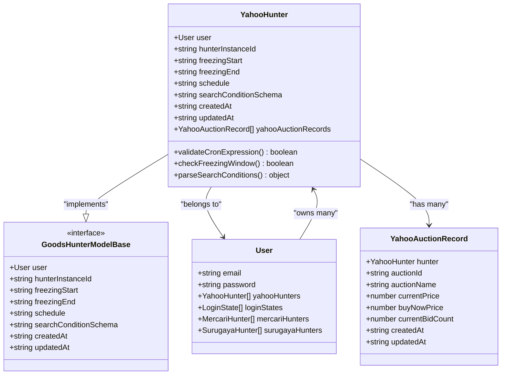
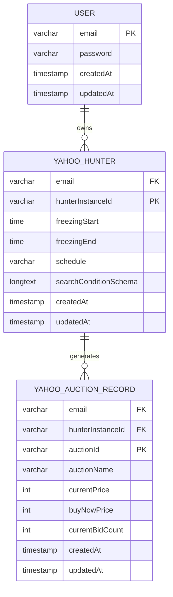
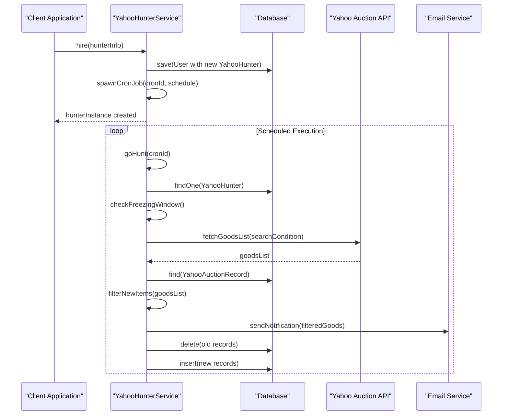
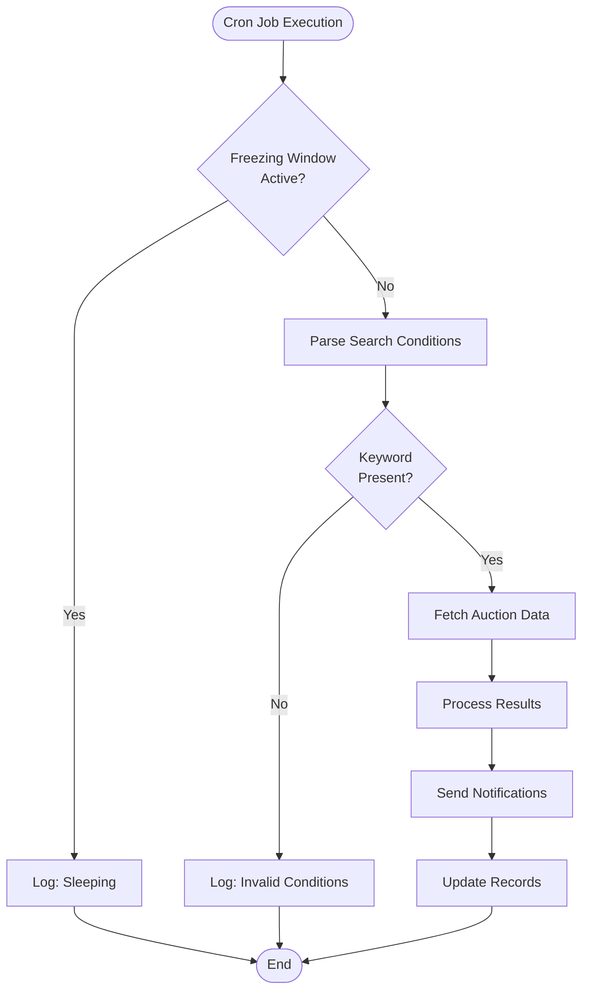

# YahooHunter Model Documentation

<cite>
**Referenced Files in This Document**
- [src/model/yahooHunter.ts](file://src/model/yahooHunter.ts)
- [src/model/yahooAuctionRecord.ts](file://src/model/yahooAuctionRecord.ts)
- [src/model/user.ts](file://src/model/user.ts)
- [src/model/types.ts](file://src/model/types.ts)
- [src/service/hunterArsenal/yahoo.ts](file://src/service/hunterArsenal/yahoo.ts)
- [src/types.ts](file://src/types.ts)
- [src/api/site/types.ts](file://src/api/site/types.ts)
- [src/api/site/yahoo/types.ts](file://src/api/site/yahoo/types.ts)
- [src/utils/isBetweenDayTime.ts](file://src/utils/isBetweenDayTime.ts)
- [src/const.ts](file://src/const.ts)
</cite>

## Table of Contents
1. [Introduction](#introduction)
2. [Entity Architecture](#entity-architecture)
3. [Core Data Model](#core-data-model)
4. [Relationships and Associations](#relationships-and-associations)
5. [Field Specifications](#field-specifications)
6. [Cascade Behavior and Data Integrity](#cascade-behavior-and-data-integrity)
7. [Integration with Yahoo Service](#integration-with-yahoo-service)
8. [Freezing Window Mechanism](#freezing-window-mechanism)
9. [Search Condition Schema](#search-condition-schema)
10. [Practical Implementation Example](#practical-implementation-example)
11. [Constraints and Validation](#constraints-and-validation)
12. [Performance Considerations](#performance-considerations)
13. [Troubleshooting Guide](#troubleshooting-guide)
14. [Conclusion](#conclusion)

## Introduction

The YahooHunter entity serves as a critical component in the Goods Hunter system, specifically designed to manage automated scraping operations for Yahoo Auctions. As a TypeORM-managed entity, it orchestrates the collection of auction data through scheduled scraping jobs while maintaining data integrity and user-specific configurations.

This entity acts as the central hub for managing Yahoo Auction search operations, storing user preferences, scheduling information, and maintaining historical records of scraped auction data. It implements sophisticated relationship patterns with both User and YahooAuctionRecord entities, enabling comprehensive tracking and management of auction hunting activities.

## Entity Architecture

The YahooHunter entity follows a hierarchical architecture pattern within the TypeORM framework, inheriting from the GoodsHunterModelBase interface and establishing clear relationships with related entities.



**Diagram sources**
- [src/model/yahooHunter.ts](file://src/model/yahooHunter.ts#L7-L43)
- [src/model/user.ts](file://src/model/user.ts#L14-L42)
- [src/model/yahooAuctionRecord.ts](file://src/model/yahooAuctionRecord.ts#L5-L32)
- [src/model/types.ts](file://src/model/types.ts#L3-L20)

**Section sources**
- [src/model/yahooHunter.ts](file://src/model/yahooHunter.ts#L7-L43)
- [src/model/types.ts](file://src/model/types.ts#L3-L20)

## Core Data Model

The YahooHunter entity implements a comprehensive data model designed to support sophisticated auction monitoring capabilities. The entity structure is built around several key principles: user ownership, temporal scheduling, flexible search conditions, and historical record keeping.

### Primary Key Design

The entity employs a composite primary key strategy using the `hunterInstanceId` field as the main identifier. This approach ensures uniqueness across the system while allowing for efficient indexing and relationship management. The `hunterInstanceId` serves as a UUID-based identifier that provides both uniqueness and traceability for each hunting operation.

### Temporal Management

The entity incorporates robust temporal management through creation and update timestamps, enabling comprehensive audit trails and operational monitoring. These timestamps facilitate system maintenance, performance analysis, and compliance reporting requirements.

**Section sources**
- [src/model/yahooHunter.ts](file://src/model/yahooHunter.ts#L12-L35)

## Relationships and Associations

The YahooHunter entity establishes two critical relationships that define its operational scope and data integrity constraints.

### @ManyToOne Relationship with User

The entity maintains a mandatory @ManyToOne relationship with the User entity, establishing ownership and access control boundaries. This relationship ensures that each YahooHunter instance is exclusively associated with a specific user account, enabling personalized search configurations and maintaining data isolation between users.



**Diagram sources**
- [src/model/yahooHunter.ts](file://src/model/yahooHunter.ts#L9-L10)
- [src/model/user.ts](file://src/model/user.ts#L34-L35)

### @OneToMany Relationship with YahooAuctionRecord

The entity establishes a @OneToMany relationship with YahooAuctionRecord, implementing cascading behavior that automatically manages related records. This relationship enables comprehensive tracking of all auction discoveries made by each hunting instance, facilitating historical analysis and trend identification.

**Section sources**
- [src/model/yahooHunter.ts](file://src/model/yahooHunter.ts#L9-L10)
- [src/model/yahooHunter.ts](file://src/model/yahooHunter.ts#L37-L38)

## Field Specifications

Each field in the YahooHunter entity serves a specific purpose in managing the auction hunting lifecycle and maintaining operational integrity.

### hunterInstanceId (Primary Key)

The `hunterInstanceId` field serves as the primary identifier for each YahooHunter instance. This UUID-based identifier ensures global uniqueness and provides a stable reference point for all related operations. The field is marked as primary and is automatically generated during entity creation.

### freezingStart and freezingEnd (Time-Based Execution Windows)

These fields define the time-based execution windows that prevent scraping operations during specified periods. The time format follows HH:mm convention, enabling precise scheduling of operational pauses. During these windows, the system automatically suspends scraping activities to avoid interference with user preferences or rate limiting restrictions.

### schedule (Cron Expression)

The `schedule` field stores cron expressions that define the timing for scraping operations. This field accepts standard cron syntax, enabling flexible scheduling patterns from simple periodic runs to complex multi-timeframe operations. The system validates these expressions to ensure operational reliability.

### searchConditionSchema (Serialized Search Criteria)

The `searchConditionSchema` field contains serialized JSON data representing the complete search configuration. This field stores complex search parameters including keywords, price bounds, seller ratings, and category filters. The serialization approach enables flexible search condition management while maintaining data integrity.

**Section sources**
- [src/model/yahooHunter.ts](file://src/model/yahooHunter.ts#L12-L29)

## Cascade Behavior and Data Integrity

The YahooHunter entity implements sophisticated cascade behavior that ensures data integrity across the relationship hierarchy. The cascading operations are configured to automatically handle related record management during entity lifecycle events.

### Automatic Record Management

When a YahooHunter instance is deleted, the cascading behavior automatically removes all associated YahooAuctionRecord entries. This cleanup mechanism prevents orphaned records and maintains database consistency. The cascade operation is transactionally managed to ensure atomicity and prevent partial updates.

### Transactional Integrity

All relationship operations are wrapped in database transactions, ensuring that either all operations succeed or none are applied. This approach maintains data consistency even in the face of concurrent operations or system failures.

**Section sources**
- [src/model/yahooHunter.ts](file://src/model/yahooHunter.ts#L37-L38)

## Integration with Yahoo Service

The YahooHunter entity integrates seamlessly with the Yahoo-specific service in hunterArsenal, providing a comprehensive framework for auction monitoring and notification delivery.

### Service Initialization and Management

The YahooHunterService class manages the complete lifecycle of YahooHunter instances, from initial creation through ongoing operation to eventual termination. The service handles cron job scheduling, search execution, and result processing.



**Diagram sources**
- [src/service/hunterArsenal/yahoo.ts](file://src/service/hunterArsenal/yahoo.ts#L87-L119)
- [src/service/hunterArsenal/yahoo.ts](file://src/service/hunterArsenal/yahoo.ts#L123-L255)

### Dynamic Search Condition Updates

The service supports dynamic updates to search conditions without requiring system restarts. When search conditions change, the system automatically adjusts the filtering logic and may trigger immediate reprocessing of historical data if necessary.

**Section sources**
- [src/service/hunterArsenal/yahoo.ts](file://src/service/hunterArsenal/yahoo.ts#L87-L119)
- [src/service/hunterArsenal/yahoo.ts](file://src/service/hunterArsenal/yahoo.ts#L269-L328)

## Freezing Window Mechanism

The freezing window mechanism provides intelligent scheduling control that prevents scraping operations during specified time periods. This feature is crucial for avoiding conflicts with user activity and respecting rate limiting policies.

### Time Window Validation

The system uses the `isBetweenDayTime` utility function to validate whether the current time falls within the specified freezing window. The validation considers both forward and backward time spans, accommodating overnight freezing periods.

### Operational Suspension

During freezing windows, the system automatically suspends scraping operations while maintaining all other operational capabilities. This suspension prevents unnecessary API calls and reduces system load during critical periods.



**Diagram sources**
- [src/service/hunterArsenal/yahoo.ts](file://src/service/hunterArsenal/yahoo.ts#L133-L140)
- [src/utils/isBetweenDayTime.ts](file://src/utils/isBetweenDayTime.ts#L3-L13)

**Section sources**
- [src/service/hunterArsenal/yahoo.ts](file://src/service/hunterArsenal/yahoo.ts#L133-L140)
- [src/utils/isBetweenDayTime.ts](file://src/utils/isBetweenDayTime.ts#L3-L13)

## Search Condition Schema

The search condition schema represents a sophisticated configuration system that enables flexible and powerful auction search capabilities. The schema structure accommodates various search parameters while maintaining backward compatibility and extensibility.

### Schema Structure and Content

The search condition schema stores serialized JSON data containing comprehensive search parameters. The schema includes keyword-based searches, price filtering, category specifications, and temporal constraints. Each parameter is carefully validated to ensure operational reliability.

### Dynamic Filter Application

The system applies search conditions dynamically during each scraping operation, enabling real-time adaptation to changing market conditions. The filtering logic distinguishes between new listings and price changes in existing listings, optimizing notification delivery.

**Section sources**
- [src/service/hunterArsenal/yahoo.ts](file://src/service/hunterArsenal/yahoo.ts#L141-L152)
- [src/service/hunterArsenal/yahoo.ts](file://src/service/hunterArsenal/yahoo.ts#L180-L196)

## Practical Implementation Example

A typical YahooHunter configuration demonstrates the entity's capability to handle complex search scenarios with sophisticated filtering and scheduling requirements.

### Configuration Example

Consider a user configuring a YahooHunter for monitoring vintage camera auctions with specific price and quality constraints:

```typescript
// Example configuration structure
const hunterConfig = {
  type: "Yahoo",
  user: { email: "collector@example.com" },
  searchCondition: {
    keyword: "vintage camera",
    minPrice: 100,
    maxPrice: 1000,
    category: "camera_photography",
    condition: "used",
    sellerRating: "gold"
  },
  schedule: "0 */6 * * *", // Every 6 hours
  freezingRange: {
    start: "22:00",
    end: "06:00"
  }
};
```

### Operational Workflow

The configured YahooHunter operates according to the specified parameters, executing searches at the defined intervals while respecting the freezing window constraints. The system maintains detailed records of all auction discoveries and delivers notifications for qualifying items.

**Section sources**
- [src/service/hunterArsenal/yahoo.ts](file://src/service/hunterArsenal/yahoo.ts#L87-L119)

## Constraints and Validation

The YahooHunter entity implements comprehensive constraint validation to ensure operational reliability and data integrity.

### Cron Expression Validation

The system validates cron expressions during entity creation and updates, preventing malformed schedules that could cause operational failures. The validation process ensures compatibility with the underlying cron library implementation.

### Time Format Validation

Time-based fields undergo strict validation to ensure proper HH:mm format compliance. The validation process prevents runtime errors and maintains consistent behavior across the system.

### Search Condition Validation

Search conditions are validated to ensure essential parameters are present and properly formatted. The validation process prevents search failures and maintains system stability.

**Section sources**
- [src/service/hunterArsenal/yahoo.ts](file://src/service/hunterArsenal/yahoo.ts#L141-L152)

## Performance Considerations

The YahooHunter entity is designed with performance optimization in mind, incorporating several strategies to minimize resource consumption and maximize operational efficiency.

### Indexing Strategy

The entity utilizes appropriate indexing strategies to optimize query performance, particularly for user-based lookups and temporal queries. The composite primary key design facilitates efficient record retrieval and relationship navigation.

### Memory Management

The system implements efficient memory management practices, particularly in the handling of large result sets and concurrent operations. The cascading deletion mechanism prevents memory leaks and maintains optimal performance.

### Scalability Design

The entity architecture supports horizontal scaling through proper separation of concerns and modular design. The service layer abstraction enables easy scaling of operational capacity.

## Troubleshooting Guide

Common issues and resolution strategies for YahooHunter entity operations.

### Cron Job Issues

Cron job failures typically stem from invalid cron expressions or scheduling conflicts. The system provides detailed logging to assist in diagnosis and resolution.

### Search Condition Problems

Search condition validation failures require careful review of the serialized schema format and parameter completeness. The validation process provides specific error messages for troubleshooting.

### Freezing Window Conflicts

Freezing window conflicts occur when operational schedules overlap with user-defined pause periods. The system logs these conflicts for monitoring and adjustment.

**Section sources**
- [src/service/hunterArsenal/yahoo.ts](file://src/service/hunterArsenal/yahoo.ts#L148-L152)
- [src/service/hunterArsenal/yahoo.ts](file://src/service/hunterArsenal/yahoo.ts#L256-L258)

## Conclusion

The YahooHunter entity represents a sophisticated and well-designed solution for managing automated auction monitoring operations. Its comprehensive feature set, robust relationship management, and flexible configuration options make it an essential component of the Goods Hunter system.

The entity's integration with the Yahoo service demonstrates successful implementation of complex business logic while maintaining clean architectural boundaries. The cascading behavior, freezing window mechanism, and dynamic search condition management provide users with powerful tools for effective auction monitoring.

Future enhancements could include expanded search condition capabilities, enhanced filtering options, and improved performance optimization strategies. The current design provides a solid foundation for these potential improvements while maintaining operational stability and reliability.