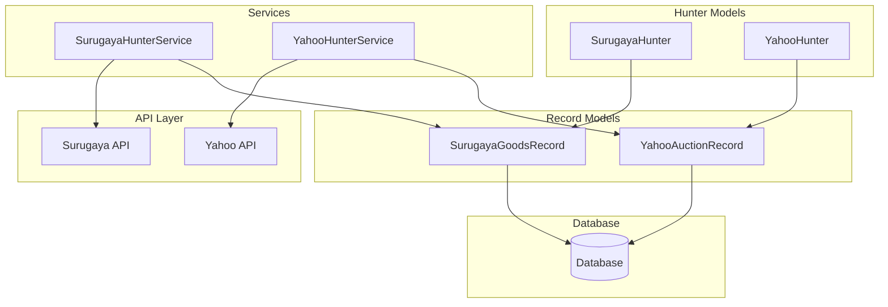
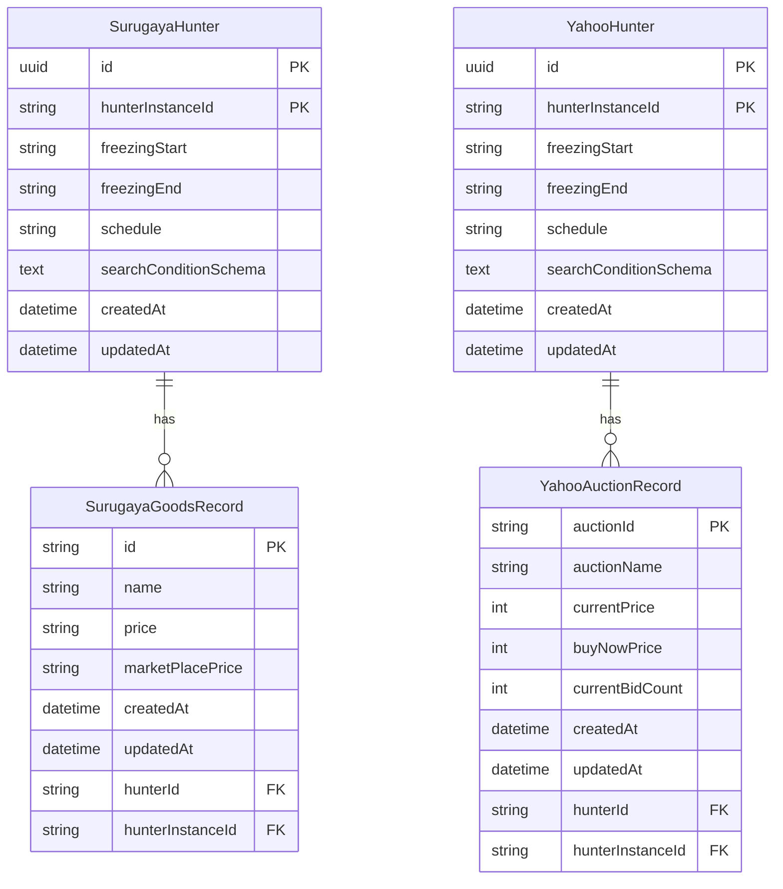
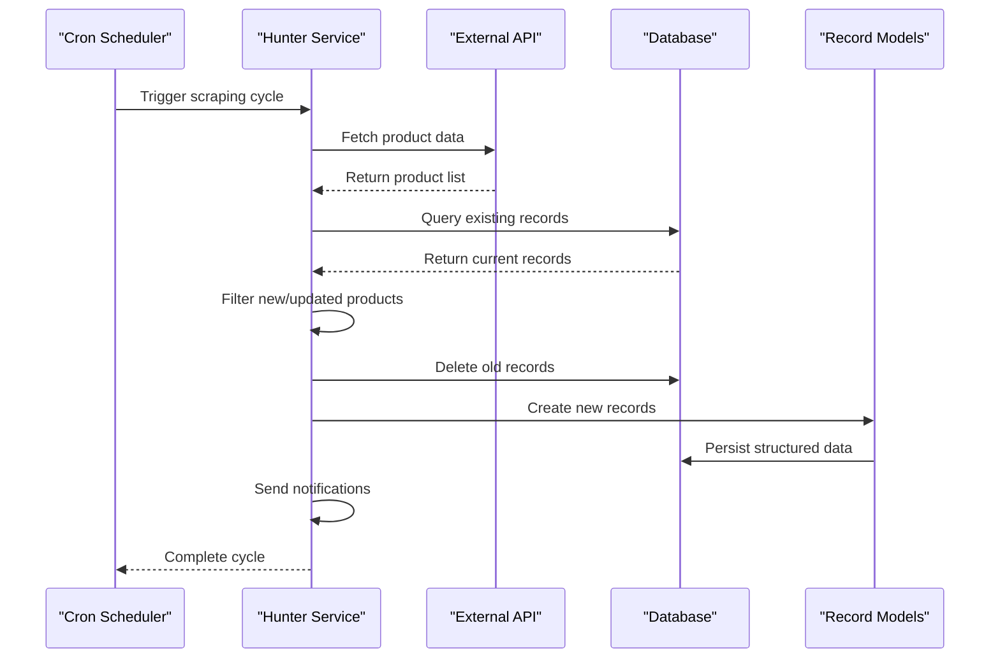
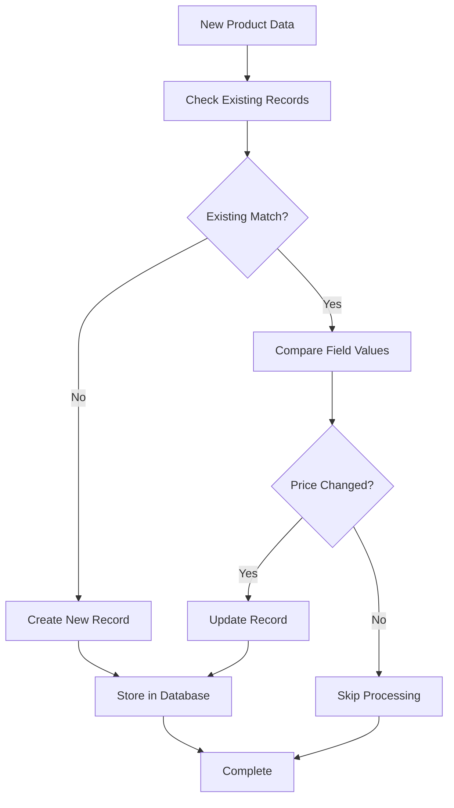
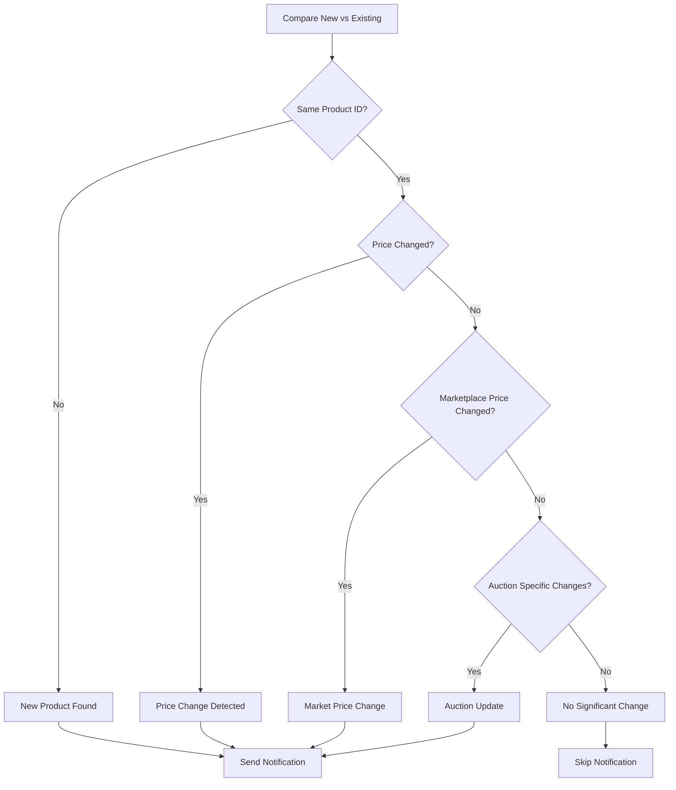
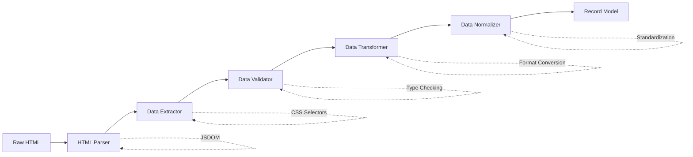

# Scraping Record Models

<cite>
**Referenced Files in This Document**
- [surugayaGoodsRecord.ts](file://src/model/surugayaGoodsRecord.ts)
- [yahooAuctionRecord.ts](file://src/model/yahooAuctionRecord.ts)
- [surugaya.ts](file://src/model/surugaya.ts)
- [yahooHunter.ts](file://src/model/yahooHunter.ts)
- [types.ts](file://src/model/types.ts)
- [surugaya.ts](file://src/service/hunterArsenal/surugaya.ts)
- [yahoo.ts](file://src/service/hunterArsenal/yahoo.ts)
- [base.ts](file://src/service/hunterArsenal/base.ts)
- [types.ts](file://src/api/site/surugaya/types.ts)
- [types.ts](file://src/api/site/yahoo/types.ts)
</cite>

## Table of Contents
1. [Introduction](#introduction)
2. [Architecture Overview](#architecture-overview)
3. [SurugayaGoodsRecord Model](#surugayagoodsrecord-model)
4. [YahooAuctionRecord Model](#yahoiauctionrecord-model)
5. [Relationship Architecture](#relationship-architecture)
6. [Data Creation and Update Process](#data-creation-and-update-process)
7. [Data Normalization Strategies](#data-normalization-strategies)
8. [Duplicate Handling and Retention Policies](#duplicate-handling-and-retention-policies)
9. [Performance Optimization](#performance-optimization)
10. [Change Detection and Notification Logic](#change-detection-and-notification-logic)
11. [HTML Parsing to Structured Data](#html-parsing-to-structured-data)
12. [Query Patterns for Analysis](#query-patterns-for-analysis)
13. [Troubleshooting Guide](#troubleshooting-guide)
14. [Conclusion](#conclusion)

## Introduction

The Goods Hunter system employs specialized record models to store and track scraped product data from e-commerce platforms. These models serve as the foundation for monitoring price trends, availability changes, and maintaining historical tracking data. The system currently supports two major Japanese e-commerce platforms: Surugaya and Yahoo Auctions, each with their own specialized record models.

The record models implement a sophisticated data persistence strategy that enables efficient change detection, historical analysis, and real-time notifications. They maintain relationships with their respective hunter models while providing robust mechanisms for data normalization, duplicate handling, and performance optimization.

## Architecture Overview

The scraping record system follows a hierarchical architecture with clear separation of concerns between data models, business logic, and persistence layers.



**Diagram sources**
- [surugaya.ts](file://src/model/surugaya.ts#L7-L40)
- [yahooHunter.ts](file://src/model/yahooHunter.ts#L7-L42)
- [surugayaGoodsRecord.ts](file://src/model/surugayaGoodsRecord.ts#L5-L28)
- [yahooAuctionRecord.ts](file://src/model/yahooAuctionRecord.ts#L5-L31)

## SurugayaGoodsRecord Model

The SurugayaGoodsRecord model captures product information from the Surugaya marketplace, storing essential product attributes and pricing data.

### Field Specifications

| Field | Type | Nullable | Description |
|-------|------|----------|-------------|
| id | varchar | No | Unique product identifier from Surugaya |
| name | varchar | No | Product name/title |
| price | varchar | Yes | Current selling price (nullable for sold items) |
| marketPlacePrice | varchar | Yes | Marketplace price (if applicable) |
| createdAt | datetime | No | Record creation timestamp |
| updatedAt | datetime | No | Last update timestamp |
| hunter | SurugayaHunter | No | Relationship to parent hunter |

### Model Implementation Details

The SurugayaGoodsRecord implements a composite primary key structure combining the hunter relationship and product ID, ensuring data integrity and preventing duplicate entries for the same product under different hunters.

**Section sources**
- [surugayaGoodsRecord.ts](file://src/model/surugayaGoodsRecord.ts#L5-L28)

## YahooAuctionRecord Model

The YahooAuctionRecord model specializes in capturing auction-style product data from Yahoo Auctions, including dynamic pricing and bidding information.

### Field Specifications

| Field | Type | Nullable | Description |
|-------|------|----------|-------------|
| auctionId | varchar | No | Unique auction identifier |
| auctionName | varchar | No | Auction product name |
| currentPrice | int | No | Current highest bid price |
| buyNowPrice | int | Yes | Buy-it-now price (if available) |
| currentBidCount | int | Yes | Number of bids placed |
| createdAt | datetime | No | Record creation timestamp |
| updatedAt | datetime | No | Last update timestamp |
| hunter | YahooHunter | No | Relationship to parent hunter |

### Advanced Features

The YahooAuctionRecord model includes specialized fields for auction dynamics:
- **currentPrice**: Real-time tracking of auction prices
- **buyNowPrice**: Optional immediate purchase option tracking
- **currentBidCount**: Bid activity monitoring
- **endTime**: Auction duration tracking (from API data)

**Section sources**
- [yahooAuctionRecord.ts](file://src/model/yahooAuctionRecord.ts#L5-L31)

## Relationship Architecture

Both record models establish a @ManyToOne relationship with their respective hunter models, creating a hierarchical data structure that maintains data lineage and enables efficient querying.



**Diagram sources**
- [surugaya.ts](file://src/model/surugaya.ts#L37-L38)
- [yahooHunter.ts](file://src/model/yahooHunter.ts#L37-L38)
- [surugayaGoodsRecord.ts](file://src/model/surugayaGoodsRecord.ts#L7-L11)
- [yahooAuctionRecord.ts](file://src/model/yahooAuctionRecord.ts#L7-L11)

### Relationship Benefits

1. **Data Integrity**: Ensures records belong to valid hunters
2. **Cascade Operations**: Automatic cleanup when hunters are removed
3. **Query Efficiency**: Enables fast filtering by hunter context
4. **Historical Tracking**: Maintains complete audit trail

**Section sources**
- [surugaya.ts](file://src/model/surugaya.ts#L37-L38)
- [yahooHunter.ts](file://src/model/yahooHunter.ts#L37-L38)

## Data Creation and Update Process

The system implements a sophisticated data lifecycle management process that handles both initial record creation and subsequent updates during scraping cycles.

### Scraping Cycle Workflow



**Diagram sources**
- [surugaya.ts](file://src/service/hunterArsenal/surugaya.ts#L108-L237)
- [yahoo.ts](file://src/service/hunterArsenal/yahoo.ts#L123-L248)

### Creation Process Details

1. **Data Retrieval**: Services fetch fresh product data from external APIs
2. **Comparison Phase**: Existing records are queried and compared with new data
3. **Filtering Logic**: Only new or changed products are processed
4. **Bulk Operations**: Old records are deleted before inserting new ones
5. **Atomic Transactions**: Database operations are wrapped in transactions for consistency

**Section sources**
- [surugaya.ts](file://src/service/hunterArsenal/surugaya.ts#L108-L237)
- [yahoo.ts](file://src/service/hunterArsenal/yahoo.ts#L123-L248)

## Data Normalization Strategies

The system employs multiple normalization strategies to ensure data consistency and reduce redundancy across the record models.

### Price Normalization

- **Surugaya**: Stores prices as strings to handle various currency formats and special characters
- **Yahoo Auctions**: Uses integers for prices to simplify numerical comparisons and calculations

### Timestamp Management

Both models utilize TypeORM's built-in timestamp columns:
- **createdAt**: Automatic population with record creation time
- **updatedAt**: Automatic updates on record modifications

### Data Validation

The system implements several validation layers:
1. **TypeScript Interfaces**: Compile-time type checking
2. **Database Constraints**: Primary keys and nullability enforcement
3. **Service-Level Validation**: Business logic validation before persistence

**Section sources**
- [surugayaGoodsRecord.ts](file://src/model/surugayaGoodsRecord.ts#L16-L20)
- [yahooAuctionRecord.ts](file://src/model/yahooAuctionRecord.ts#L16-L23)

## Duplicate Handling and Retention Policies

The system implements intelligent duplicate handling and retention strategies to maintain data quality while managing storage efficiently.

### Duplicate Prevention



**Diagram sources**
- [surugaya.ts](file://src/service/hunterArsenal/surugaya.ts#L165-L174)
- [yahoo.ts](file://src/service/hunterArsenal/yahoo.ts#L180-L188)

### Retention Policies

1. **Automatic Cleanup**: Old records are deleted before new inserts
2. **Historical Preservation**: Complete history maintained through relationship tracking
3. **Memory Management**: Redis-based ignore lists prevent unnecessary processing

### Duplicate Detection Logic

The system uses product ID comparison as the primary duplicate detection mechanism:
- **Surugaya**: Compares product IDs against existing records
- **Yahoo Auctions**: Uses auction IDs for identification

**Section sources**
- [surugaya.ts](file://src/service/hunterArsenal/surugaya.ts#L165-L174)
- [yahoo.ts](file://src/service/hunterArsenal/yahoo.ts#L180-L188)

## Performance Optimization

The system implements several performance optimization strategies to handle high-volume scraping operations efficiently.

### Indexing Strategy

Key fields are indexed for optimal query performance:
- **Product ID/Index**: Primary field for record identification
- **Timestamp Fields**: For time-based queries and analytics
- **Hunter Relationship**: For efficient filtering by hunter context

### Query Optimization

1. **Batch Operations**: Bulk insert/delete operations minimize database round trips
2. **Relationship Loading**: Selective eager loading reduces memory overhead
3. **Connection Pooling**: Database connections are managed efficiently

### Memory Management

- **Streaming Processing**: Large datasets are processed in chunks
- **Garbage Collection**: Proper resource cleanup prevents memory leaks
- **Redis Caching**: Frequently accessed data cached in memory

**Section sources**
- [surugaya.ts](file://src/service/hunterArsenal/surugaya.ts#L154-L163)
- [yahoo.ts](file://src/service/hunterArsenal/yahoo.ts#L169-L178)

## Change Detection and Notification Logic

The system implements sophisticated change detection mechanisms that trigger notifications only when significant product changes occur.

### Change Detection Algorithm



**Diagram sources**
- [surugaya.ts](file://src/service/hunterArsenal/surugaya.ts#L165-L174)
- [yahoo.ts](file://src/service/hunterArsenal/yahoo.ts#L180-L188)

### Notification Triggers

1. **Price Changes**: Significant price variations detected
2. **Availability Updates**: Items becoming available or sold out
3. **Auction Dynamics**: Bid count increases or price movements
4. **New Listings**: Previously unseen products matching search criteria

### Filtering Mechanisms

The system includes multiple filtering layers:
- **Redis Ignore Lists**: Prevent notifications for user-specified products
- **Price Thresholds**: Configurable price change sensitivity
- **Category Filters**: Product type-based filtering

**Section sources**
- [surugaya.ts](file://src/service/hunterArsenal/surugaya.ts#L175-L181)
- [yahoo.ts](file://src/service/hunterArsenal/yahoo.ts#L190-L196)

## HTML Parsing to Structured Data

The transformation from raw HTML to structured record data involves multiple processing stages that extract, validate, and normalize product information.

### Surugaya Data Extraction

Raw HTML parsing extracts the following fields:
- **Product ID**: Extracted from URL parameters or DOM attributes
- **Product Name**: Retrieved from title elements
- **Price Information**: Parsed from price display elements
- **Image URLs**: Extracted from thumbnail sources
- **Marketplace Prices**: Additional pricing information if available

### Yahoo Auctions Data Extraction

Yahoo Auctions parsing handles auction-specific data:
- **Auction ID**: Unique identifier extraction
- **Current Price**: Highest bid amount
- **Buy Now Price**: Immediate purchase option
- **Bid Count**: Number of participants
- **End Time**: Auction expiration timestamp

### Data Transformation Pipeline



**Diagram sources**
- [surugaya.ts](file://src/api/site/surugaya/index.ts#L100-L150)
- [yahoo.ts](file://src/api/site/yahoo/index.ts#L100-L150)

### Error Handling

The parsing pipeline includes comprehensive error handling:
- **Network Failures**: Retry mechanisms for failed requests
- **Parsing Errors**: Graceful degradation when HTML structure changes
- **Validation Failures**: Data sanitization and fallback values

**Section sources**
- [surugaya.ts](file://src/api/site/surugaya/index.ts#L100-L150)
- [yahoo.ts](file://src/api/site/yahoo/index.ts#L100-L150)

## Query Patterns for Analysis

The record models support various query patterns for price trend analysis, availability monitoring, and historical tracking.

### Price Trend Analysis Queries

Common query patterns for analyzing price movements:

| Query Type | Purpose | Example Pattern |
|------------|---------|-----------------|
| Price History | Track price changes over time | `SELECT price, createdAt FROM records WHERE productId = ? ORDER BY createdAt DESC` |
| Price Comparison | Compare current vs historical prices | `SELECT AVG(price) FROM records WHERE productId = ? AND createdAt BETWEEN ? AND ?` |
| Availability Tracking | Monitor product availability | `SELECT COUNT(*) FROM records WHERE productId = ? AND price IS NOT NULL` |
| Price Anomalies | Detect unusual price changes | `SELECT * FROM records WHERE ABS(price - LAG(price) OVER (PARTITION BY productId ORDER BY createdAt)) > ?` |

### Availability Monitoring Queries

Queries for monitoring product availability status:

```sql
-- Products that became available
SELECT r1.productId, r1.createdAt AS availableAt
FROM records r1
LEFT JOIN records r2 ON r1.productId = r2.productId AND r2.createdAt < r1.createdAt
WHERE r1.price IS NOT NULL AND r2.price IS NULL;

-- Products that sold out
SELECT r1.productId, r1.createdAt AS soldOutAt
FROM records r1
LEFT JOIN records r2 ON r1.productId = r2.productId AND r2.createdAt < r1.createdAt
WHERE r1.price IS NULL AND r2.price IS NOT NULL;
```

### Historical Analysis Patterns

For comprehensive historical analysis, the system supports:

1. **Time Series Analysis**: Tracking changes over specific time periods
2. **Seasonal Patterns**: Identifying recurring trends
3. **Correlation Analysis**: Finding relationships between product categories
4. **Volume Analysis**: Monitoring product popularity changes

### Performance Considerations

Query performance is optimized through:
- **Indexed Fields**: Primary keys and timestamp columns are indexed
- **Partitioning**: Large datasets may be partitioned by time periods
- **Caching**: Frequently accessed data cached in memory
- **Query Optimization**: Efficient SQL patterns for large datasets

**Section sources**
- [surugaya.ts](file://src/service/hunterArsenal/surugaya.ts#L154-L163)
- [yahoo.ts](file://src/service/hunterArsenal/yahoo.ts#L169-L178)

## Troubleshooting Guide

Common issues and their solutions when working with scraping record models.

### Data Integrity Issues

**Problem**: Duplicate records appearing in database
**Solution**: Verify primary key constraints and relationship configurations

**Problem**: Missing or incorrect timestamps
**Solution**: Check database timezone settings and TypeORM configuration

### Performance Issues

**Problem**: Slow query performance
**Solution**: Add appropriate indexes and review query patterns

**Problem**: Memory consumption during large scrapes
**Solution**: Implement batch processing and optimize garbage collection

### Integration Issues

**Problem**: API parsing failures
**Solution**: Update HTML selectors and handle dynamic content changes

**Problem**: Notification delivery failures
**Solution**: Verify email service configuration and retry mechanisms

### Data Quality Issues

**Problem**: Inconsistent price formats
**Solution**: Implement data normalization and validation rules

**Problem**: Missing product images
**Solution**: Add fallback image handling and URL validation

**Section sources**
- [surugaya.ts](file://src/service/hunterArsenal/surugaya.ts#L138-L146)
- [yahoo.ts](file://src/service/hunterArsenal/yahoo.ts#L154-L161)

## Conclusion

The scraping record models provide a robust foundation for e-commerce product monitoring and analysis. Through their sophisticated architecture, these models enable efficient data capture, intelligent change detection, and comprehensive historical tracking while maintaining excellent performance characteristics.

Key strengths of the system include:

- **Scalable Architecture**: Hierarchical design supports growing data volumes
- **Intelligent Change Detection**: Sophisticated algorithms minimize unnecessary notifications
- **Data Quality Assurance**: Multiple validation layers ensure data accuracy
- **Performance Optimization**: Indexing and query optimization for large-scale operations
- **Flexible Query Support**: Rich query patterns enable diverse analytical needs

The system's design demonstrates best practices in database modeling, API integration, and performance optimization, making it suitable for production environments requiring reliable and efficient product monitoring capabilities.