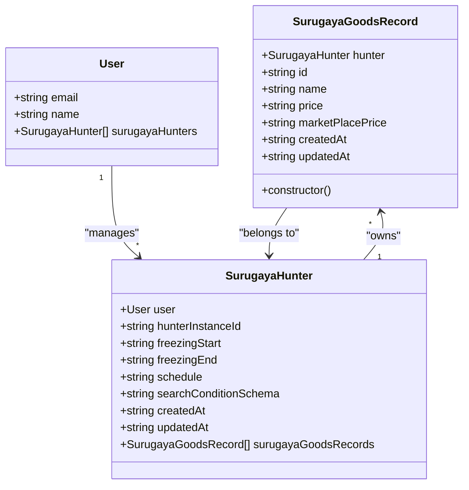
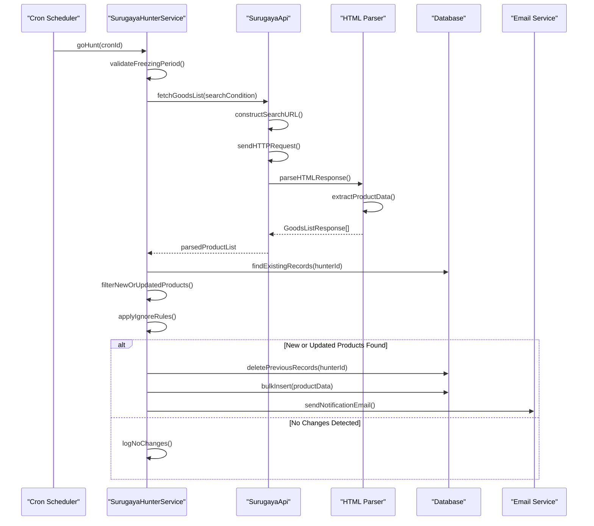
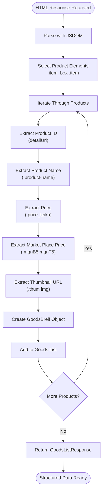
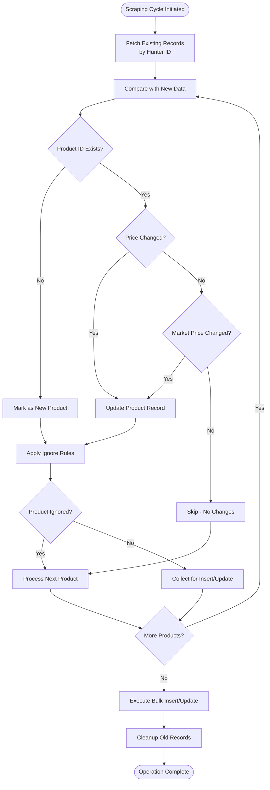
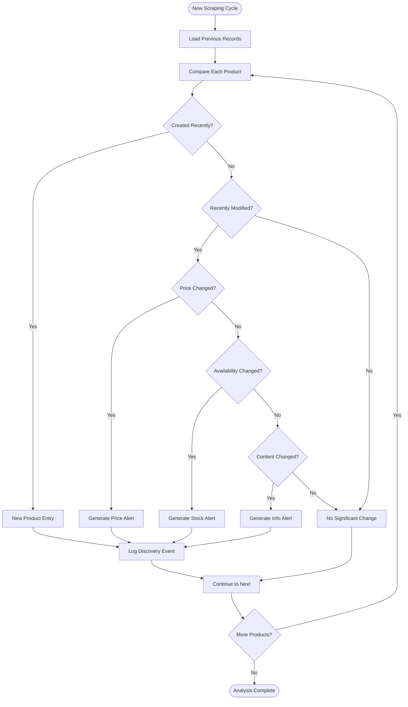
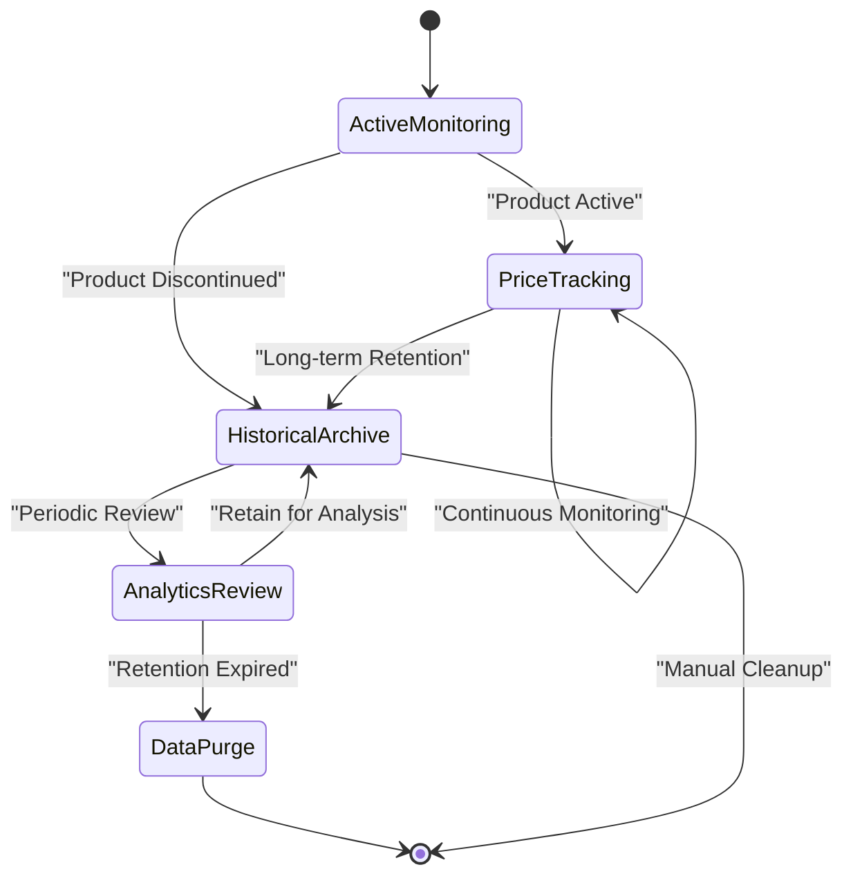

# Surugaya Goods Record Model

<cite>
**Referenced Files in This Document**
- [surugayaGoodsRecord.ts](file://src/model/surugayaGoodsRecord.ts)
- [surugaya.ts](file://src/model/surugaya.ts)
- [surugaya/index.ts](file://src/api/site/surugaya/index.ts)
- [surugaya/types.ts](file://src/api/site/surugaya/types.ts)
- [surugaya.ts](file://src/service/hunterArsenal/surugaya.ts)
- [types.ts](file://src/model/types.ts)
- [config.default.ts](file://src/config/config.default.ts)
</cite>

## Table of Contents
1. [Introduction](#introduction)
2. [Entity Architecture](#entity-architecture)
3. [Field Specifications](#field-specifications)
4. [Relationships and Composite Key](#relationships-and-composite-key)
5. [Data Scraping Workflow](#data-scraping-workflow)
6. [HTML Parsing and Data Transformation](#html-parsing-and-data-transformation)
7. [Upsert Operations and Duplicate Handling](#upsert-operations-and-duplicate-handling)
8. [Query Patterns and Performance](#query-patterns-and-performance)
9. [Change Detection and Tracking](#change-detection-and-tracking)
10. [Data Retention and Historical Records](#data-retention-and-historical-records)
11. [Troubleshooting and Best Practices](#troubleshooting-and-best-practices)

## Introduction

The SurugayaGoodsRecord entity serves as the core data storage component for capturing and tracking product listings from the Surugaya marketplace. This entity enables comprehensive monitoring of product availability, price fluctuations, and inventory changes through automated scraping cycles. The model implements a sophisticated composite key strategy combining hunter references with product identifiers to ensure data integrity while supporting efficient querying patterns for price trend analysis and availability monitoring.

## Entity Architecture

The SurugayaGoodsRecord follows a relational database design pattern with TypeORM decorators providing metadata for database persistence. The entity establishes a many-to-one relationship with the SurugayaHunter model, forming a hierarchical structure that associates products with specific monitoring campaigns.



**Diagram sources**
- [surugayaGoodsRecord.ts](file://src/model/surugayaGoodsRecord.ts#L5-L27)
- [surugaya.ts](file://src/model/surugaya.ts#L7-L38)

**Section sources**
- [surugayaGoodsRecord.ts](file://src/model/surugayaGoodsRecord.ts#L1-L29)
- [surugaya.ts](file://src/model/surugaya.ts#L1-L41)

## Field Specifications

### Primary Key Components

The SurugayaGoodsRecord implements a composite primary key strategy combining two essential components:

| Field | Type | Nullability | Description |
|-------|------|-------------|-------------|
| hunter | Many-to-One Relationship | Not Nullable | Reference to the SurugayaHunter that discovered this product |
| id | String (VARCHAR) | Not Nullable | Unique product identifier from Surugaya marketplace |

### Core Product Information Fields

| Field | Type | Nullability | Description |
|-------|------|-------------|-------------|
| name | String (VARCHAR) | Not Nullable | Human-readable product name |
| price | String (VARCHAR) | Nullable | Current selling price in Japanese Yen |
| marketPlacePrice | String (VARCHAR) | Nullable | Marketplace price if applicable |

### Timestamp Management Fields

| Field | Type | Nullability | Description |
|-------|------|-------------|-------------|
| createdAt | Date | Not Nullable | Automatic timestamp of record creation |
| updatedAt | Date | Not Nullable | Automatic timestamp of last modification |

**Section sources**
- [surugayaGoodsRecord.ts](file://src/model/surugayaGoodsRecord.ts#L7-L26)

## Relationships and Composite Key

### Many-to-One Relationship with SurugayaHunter

The entity establishes a critical many-to-one relationship with the SurugayaHunter model, enabling hierarchical data organization and query flexibility. This relationship serves multiple purposes:

1. **Ownership Tracking**: Each product record is explicitly linked to its monitoring campaign
2. **Query Optimization**: Enables efficient filtering by hunter instances
3. **Data Isolation**: Prevents cross-campaign data contamination
4. **Cascade Operations**: Supports automatic cleanup when hunters are removed

### Composite Primary Key Formation

The composite primary key consists of:
- **Hunter Reference**: Establishes the parent-child relationship
- **Product ID**: Ensures uniqueness within each monitoring campaign

This design prevents duplicate entries across different hunting campaigns while maintaining data integrity within individual monitoring contexts.

```mermaid
erDiagram
SURUGAYA_HUNTER {
string hunterInstanceId PK
string userId FK
string schedule
string searchConditionSchema
datetime createdAt
datetime updatedAt
}
SURUGAYA_GOODS_RECORD {
string hunterId FK PK
string productId PK
string name
string price
string marketPlacePrice
datetime createdAt
datetime updatedAt
}
USER {
string email PK
string name
string password
datetime createdAt
datetime updatedAt
}
USER ||--o{ SURUGAYA_HUNTER : "owns"
SURUGAYA_HUNTER ||--o{ SURUGAYA_GOODS_RECORD : "monitors"
```

**Diagram sources**
- [surugayaGoodsRecord.ts](file://src/model/surugayaGoodsRecord.ts#L7-L11)
- [surugaya.ts](file://src/model/surugaya.ts#L9-L13)

**Section sources**
- [surugayaGoodsRecord.ts](file://src/model/surugayaGoodsRecord.ts#L7-L11)
- [surugaya.ts](file://src/model/surugaya.ts#L9-L13)

## Data Scraping Workflow

### Trigger Mechanism

The SurugayaGoodsRecord creation and updates are triggered by the hunterArsenal/surugaya service through scheduled scraping cycles. These cycles operate on configurable intervals defined by user preferences and system requirements.

### Scraping Cycle Process



**Diagram sources**
- [surugaya.ts](file://src/service/hunterArsenal/surugaya.ts#L108-L238)
- [surugaya/index.ts](file://src/api/site/surugaya/index.ts#L18-L114)

**Section sources**
- [surugaya.ts](file://src/service/hunterArsenal/surugaya.ts#L108-L238)

## HTML Parsing and Data Transformation

### Raw HTML Processing Pipeline

The SurugayaApi component implements sophisticated HTML parsing capabilities to extract structured data from Surugaya's web interface. The parsing process utilizes JSDOM for DOM manipulation and CSS selectors for precise element targeting.

### Data Extraction Process



**Diagram sources**
- [surugaya/index.ts](file://src/api/site/surugaya/index.ts#L95-L109)

### Structured Data Mapping

The HTML parsing process transforms unstructured HTML data into the structured SurugayaGoodsRecord format:

| HTML Element | Target Selector | SurugayaGoodsRecord Field | Data Type |
|--------------|-----------------|---------------------------|-----------|
| Product Identifier | `a[href]` | id | String |
| Product Name | `.product-name` | name | String |
| Selling Price | `.price_teika strong` | price | String |
| Marketplace Price | `.mgnB5.mgnT5 strong` | marketPlacePrice | String |
| Thumbnail Image | `.thum img[src]` | thumbImgUrl | String |

**Section sources**
- [surugaya/index.ts](file://src/api/site/surugaya/index.ts#L95-L109)
- [surugaya/types.ts](file://src/api/site/surugaya/types.ts#L5-L10)

## Upsert Operations and Duplicate Handling

### Duplicate Detection Strategy

The system implements a sophisticated duplicate detection mechanism that prevents redundant entries while efficiently identifying new or updated products. The detection process operates at multiple levels:

1. **Product ID Matching**: Primary verification using the unique product identifier
2. **Price Change Detection**: Secondary verification for price variations
3. **Marketplace Price Monitoring**: Additional price tracking for marketplace products

### Upsert Operation Implementation



**Diagram sources**
- [surugaya.ts](file://src/service/hunterArsenal/surugaya.ts#L154-L174)

### Upsert Execution Pattern

The system employs a two-phase approach for data synchronization:

1. **Cleanup Phase**: Remove outdated records for the current hunter
2. **Insertion Phase**: Bulk insert new and updated product records

This pattern ensures data consistency while minimizing database operations and preventing orphaned records.

**Section sources**
- [surugaya.ts](file://src/service/hunterArsenal/surugaya.ts#L154-L217)

## Query Patterns and Performance

### Indexing Strategies

The SurugayaGoodsRecord entity benefits from several implicit and explicit indexing strategies that optimize query performance:

#### Implicit Indexes
- **Composite Primary Key**: Automatically creates a compound index on (hunter, id)
- **Foreign Key Index**: Implicit index on the hunter relationship
- **Timestamp Indexes**: Automatic indexes on createdAt and updatedAt fields

#### Optimized Query Patterns

| Query Type | Purpose | Performance Characteristics |
|------------|---------|---------------------------|
| By Hunter ID | Campaign-specific queries | O(log n) via composite index |
| By Product ID | Individual product lookup | O(log n) via primary key |
| Time-based Filtering | Trend analysis | O(log n) via timestamp indexes |
| Price Range Queries | Availability monitoring | O(n) with appropriate filters |

### Common Query Patterns

#### Price Trend Analysis
```typescript
// Example query pattern for price trend analysis
const priceHistory = await surugayaGoodsRecordModel.find({
    where: { 
        id: productId,
        hunter: { hunterInstanceId: hunterId }
    },
    order: { createdAt: 'ASC' },
    select: ['createdAt', 'price']
});
```

#### Availability Monitoring
```typescript
// Example query pattern for availability tracking
const recentActivity = await surugayaGoodsRecordModel.find({
    where: { 
        hunter: { hunterInstanceId: hunterId },
        updatedAt: MoreThan(thresholdDate)
    },
    order: { updatedAt: 'DESC' }
});
```

#### Change Detection Queries
```typescript
// Example query pattern for detecting changes
const changedProducts = await surugayaGoodsRecordModel.find({
    where: [
        { price: Not(oldPrice) },
        { marketPlacePrice: Not(oldMarketPrice) }
    ],
    relations: ['hunter']
});
```

**Section sources**
- [surugaya.ts](file://src/service/hunterArsenal/surugaya.ts#L156-L162)

## Change Detection and Tracking

### Timestamp-Based Change Detection

The SurugayaGoodsRecord leverages the built-in TypeORM timestamps (createdAt and updatedAt) to enable sophisticated change detection mechanisms. These timestamps serve multiple analytical purposes:

#### Creation Tracking
- **First Appearance**: Identifies when a product was first discovered
- **Campaign Attribution**: Links products to specific monitoring periods
- **Historical Analysis**: Enables trend identification over time

#### Modification Tracking
- **Price Updates**: Detects when pricing information changes
- **Availability Changes**: Monitors stock level modifications
- **Content Updates**: Tracks product description modifications

### Change Detection Algorithm



**Diagram sources**
- [surugaya.ts](file://src/service/hunterArsenal/surugaya.ts#L165-L174)

### Change Detection Features

#### Real-time Alerts
- **Price Drops**: Immediate notification of discounted products
- **Restocks**: Alerts for previously unavailable items
- **Price Increases**: Warnings for significant price hikes

#### Historical Tracking
- **Price Evolution**: Comprehensive history of price movements
- **Availability Patterns**: Long-term availability trends
- **Discovery Patterns**: Product lifecycle tracking

**Section sources**
- [surugaya.ts](file://src/service/hunterArsenal/surugaya.ts#L165-L174)

## Data Retention and Historical Records

### Retention Policy Framework

The SurugayaGoodsRecord implements a flexible data retention strategy that balances analytical value with storage efficiency. While the current implementation focuses on immediate operational needs, the architecture supports various retention policies:

#### Current Storage Approach
- **Active Monitoring**: Full retention for currently monitored products
- **Historical Archive**: Gradual archiving of inactive products
- **Analytics Purge**: Periodic cleanup for analytical purposes

#### Historical Record Benefits

| Feature | Benefit | Use Case |
|---------|---------|----------|
| Trend Analysis | Long-term price patterns | Investment decisions |
| Availability Trends | Stock prediction | Inventory management |
| Discovery Tracking | Product lifecycle | Market research |
| Performance Metrics | Campaign effectiveness | Business analytics |

### Data Lifecycle Management



### Tracking Feature Support

The historical record system enables sophisticated user-facing tracking features:

#### Personalized Dashboards
- **Wishlist Tracking**: Monitor favorite products across campaigns
- **Price Alerts**: Persistent alert history per product
- **Availability History**: Complete availability timeline

#### Advanced Analytics
- **Price Elasticity**: Demand response analysis
- **Seasonal Patterns**: Time-based availability trends
- **Market Segmentation**: Category-specific analysis

**Section sources**
- [surugaya.ts](file://src/service/hunterArsenal/surugaya.ts#L154-L162)

## Troubleshooting and Best Practices

### Common Issues and Solutions

#### Duplicate Record Prevention
- **Issue**: Multiple entries for the same product
- **Solution**: Verify composite key implementation and upsert logic
- **Prevention**: Implement proper deduplication before database operations

#### Performance Optimization
- **Issue**: Slow query performance on large datasets
- **Solution**: Utilize appropriate indexes and query optimization
- **Best Practice**: Limit query result sets and implement pagination

#### Data Integrity
- **Issue**: Orphaned records or broken relationships
- **Solution**: Implement cascade operations and cleanup procedures
- **Prevention**: Use transactional operations for bulk updates

### Monitoring and Maintenance

#### Health Checks
- **Database Connectivity**: Regular connection testing
- **Index Performance**: Monitor query execution plans
- **Storage Utilization**: Track database growth patterns

#### Operational Metrics
- **Scraping Success Rate**: Monitor extraction reliability
- **Update Frequency**: Track data freshness
- **Error Rates**: Monitor parsing and insertion failures

### Security Considerations

#### Data Protection
- **Sensitive Information**: Avoid storing personally identifiable information
- **Access Control**: Implement proper authentication and authorization
- **Audit Logging**: Maintain comprehensive operation logs

#### Privacy Compliance
- **Data Minimization**: Store only necessary information
- **Retention Policies**: Implement appropriate data lifecycle management
- **User Consent**: Ensure compliance with privacy regulations

**Section sources**
- [surugaya.ts](file://src/service/hunterArsenal/surugaya.ts#L138-L152)
- [config.default.ts](file://src/config/config.default.ts#L85-L95)