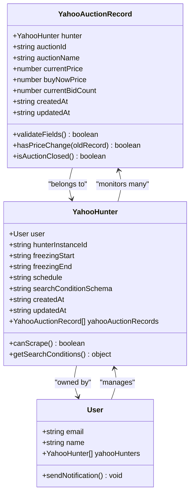
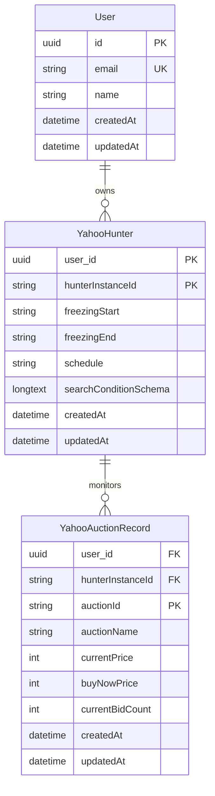
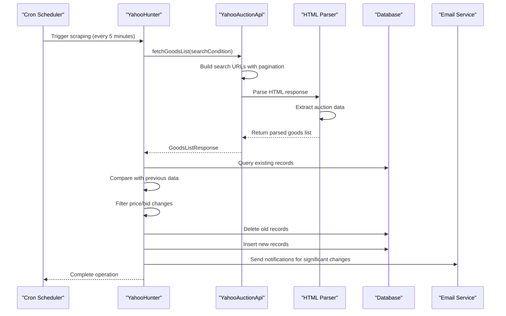
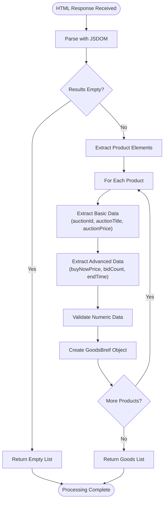
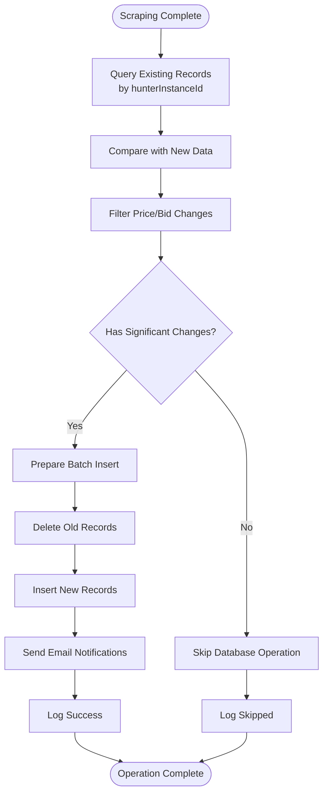
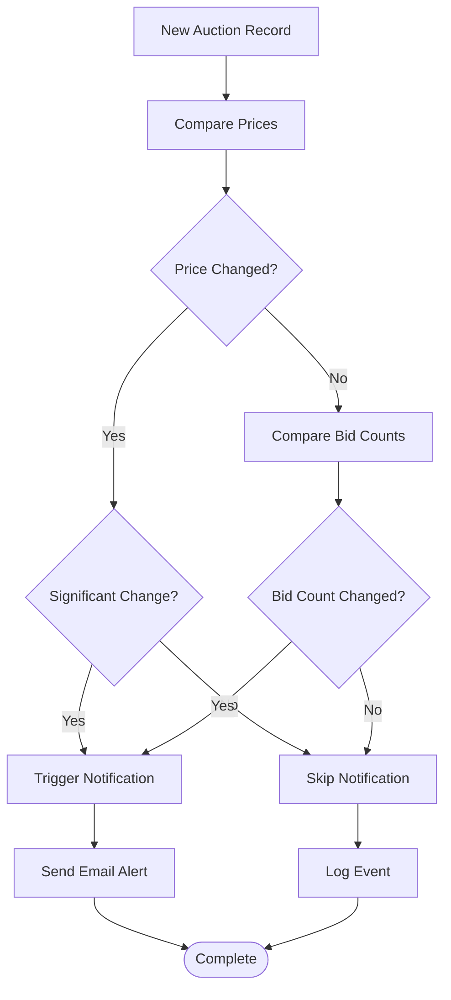

# Yahoo Auction Record Model

<cite>
**Referenced Files in This Document**
- [src/model/yahooAuctionRecord.ts](file://src/model/yahooAuctionRecord.ts)
- [src/model/yahooHunter.ts](file://src/model/yahooHunter.ts)
- [src/api/site/yahoo/index.ts](file://src/api/site/yahoo/index.ts)
- [src/service/hunterArsenal/yahoo.ts](file://src/service/hunterArsenal/yahoo.ts)
- [src/api/site/yahoo/types.ts](file://src/api/site/yahoo/types.ts)
- [src/model/types.ts](file://src/model/types.ts)
- [src/config/config.default.ts](file://src/config/config.default.ts)
- [src/service/goods.ts](file://src/service/goods.ts)
</cite>

## Table of Contents
1. [Introduction](#introduction)
2. [Entity Architecture](#entity-architecture)
3. [Field Specifications](#field-specifications)
4. [Relationships and Composite Key](#relationships-and-composite-key)
5. [Data Scraping Workflow](#data-scraping-workflow)
6. [HTML Parsing and Data Extraction](#html-parsing-and-data-extraction)
7. [Database Operations](#database-operations)
8. [Query Patterns and Monitoring](#query-patterns-and-monitoring)
9. [Indexing Strategies](#indexing-strategies)
10. [Price Change Detection](#price-change-detection)
11. [Performance Considerations](#performance-considerations)
12. [Troubleshooting Guide](#troubleshooting-guide)
13. [Conclusion](#conclusion)

## Introduction

The YahooAuctionRecord entity serves as the core data storage component for capturing and tracking product listings from Yahoo Auctions Japan. This entity enables real-time monitoring of auction prices, bid counts, and auction status changes through automated scraping processes. It forms the backbone of the auction monitoring system, providing structured data persistence for price change detection, trend analysis, and notification triggering mechanisms.

The entity implements a sophisticated composite primary key strategy combining the hunter reference and auction identifier, enabling efficient data organization and retrieval while maintaining data integrity across multiple concurrent scraping operations.

## Entity Architecture

The YahooAuctionRecord follows a relational database design pattern with TypeORM decorators for ORM mapping. The entity establishes a hierarchical relationship structure where each record belongs to a specific YahooHunter instance, creating a one-to-many relationship between hunters and their monitored auctions.



**Diagram sources**
- [src/model/yahooAuctionRecord.ts](file://src/model/yahooAuctionRecord.ts#L5-L30)
- [src/model/yahooHunter.ts](file://src/model/yahooHunter.ts#L7-L38)

**Section sources**
- [src/model/yahooAuctionRecord.ts](file://src/model/yahooAuctionRecord.ts#L1-L32)
- [src/model/yahooHunter.ts](file://src/model/yahooHunter.ts#L1-L43)

## Field Specifications

### Primary Key Components

The YahooAuctionRecord implements a composite primary key consisting of two components:

| Field | Type | Nullability | Description |
|-------|------|-------------|-------------|
| hunter | YahooHunter | Not Nullable | Reference to the owning YahooHunter instance |
| auctionId | varchar | Not Nullable | Unique identifier from Yahoo Auctions |

### Core Auction Data Fields

| Field | Type | Nullability | Constraints | Purpose |
|-------|------|-------------|-------------|---------|
| auctionName | varchar | Not Nullable | Max length unspecified | Human-readable auction title |
| currentPrice | int | Not Nullable | Positive integer | Current bid price in yen |
| buyNowPrice | int | Nullable | Positive integer | Buy-it-now price or null |
| currentBidCount | int | Nullable | Non-negative integer | Number of bids placed |

### Timestamp Fields

| Field | Type | Nullability | Purpose |
|-------|------|-------------|---------|
| createdAt | datetime | Not Nullable | Automatic creation timestamp |
| updatedAt | datetime | Not Nullable | Automatic update timestamp |

**Section sources**
- [src/model/yahooAuctionRecord.ts](file://src/model/yahooAuctionRecord.ts#L7-L29)

## Relationships and Composite Key

### @ManyToOne Relationship with YahooHunter

The YahooAuctionRecord establishes a mandatory many-to-one relationship with the YahooHunter entity, forming the first component of the composite primary key. This relationship ensures that each auction record is uniquely identifiable within the context of its monitoring hunter.



**Diagram sources**
- [src/model/yahooAuctionRecord.ts](file://src/model/yahooAuctionRecord.ts#L7-L11)
- [src/model/yahooHunter.ts](file://src/model/yahooHunter.ts#L9-L13)

### Composite Primary Key Formation

The composite primary key ensures data uniqueness across multiple hunting instances while maintaining referential integrity. The combination of hunter reference and auctionId guarantees that:

- Same auction monitored by different hunters maintains separate records
- Concurrent scraping operations don't create duplicate entries
- Efficient indexing and query performance across large datasets

**Section sources**
- [src/model/yahooAuctionRecord.ts](file://src/model/yahooAuctionRecord.ts#L7-L11)
- [src/model/yahooHunter.ts](file://src/model/yahooHunter.ts#L9-L13)

## Data Scraping Workflow

### Scheduled Scraping Operations

The YahooAuctionRecord data lifecycle begins with the hunterArsenal/yahoo service orchestrating periodic scraping operations. These operations follow a systematic workflow for data extraction, validation, and persistence.



**Diagram sources**
- [src/service/hunterArsenal/yahoo.ts](file://src/service/hunterArsenal/yahoo.ts#L123-L255)
- [src/api/site/yahoo/index.ts](file://src/api/site/yahoo/index.ts#L23-L155)

### Data Validation and Filtering

During the scraping process, the system implements intelligent filtering to minimize unnecessary database operations and email notifications. The filtering logic compares current scrape results with previously stored records to identify meaningful changes.

**Section sources**
- [src/service/hunterArsenal/yahoo.ts](file://src/service/hunterArsenal/yahoo.ts#L123-L255)
- [src/api/site/yahoo/index.ts](file://src/api/site/yahoo/index.ts#L23-L155)

## HTML Parsing and Data Extraction

### Raw HTML Processing Pipeline

The YahooAuctionApi implements sophisticated HTML parsing capabilities using JSDOM for extracting structured data from Yahoo Auctions search results. The parsing process handles various auction states and data availability scenarios.



**Diagram sources**
- [src/api/site/yahoo/index.ts](file://src/api/site/yahoo/index.ts#L105-L150)

### Data Extraction Process

The HTML parsing process extracts the following auction metadata from DOM elements:

| Data Point | Source Element | Data Type | Processing Notes |
|------------|----------------|-----------|------------------|
| auctionId | `.Product__detail .Product__titleLink` dataset | string | Extracted from data-auction-id |
| auctionName | `.Product__detail .Product__titleLink` dataset | string | Extracted from data-auctionTitle |
| currentPrice | `.Product__detail .Product__titleLink` dataset | int | Parsed from data-auctionPrice |
| buyNowPrice | `.Product__detail .Product__bonus` dataset | int | Parsed from data-auctionBuynowprice |
| currentBidCount | `.Product__detail .Product__otherInfo .Product__bid` | int | Text content conversion |
| endTime | `.Product__detail .Product__bonus` dataset | int | Multiplied by 1000 for milliseconds |

**Section sources**
- [src/api/site/yahoo/index.ts](file://src/api/site/yahoo/index.ts#L108-L150)

## Database Operations

### Record Creation and Updates

The YahooAuctionRecord persistence follows a UPSERT pattern where existing records are updated or new records are created based on the composite key. The system implements efficient batch operations to minimize database round trips.



**Diagram sources**
- [src/service/hunterArsenal/yahoo.ts](file://src/service/hunterArsenal/yahoo.ts#L208-L236)

### Transaction Management

Database operations are wrapped in transaction blocks to ensure data consistency during bulk insert/update operations. The system handles concurrent access scenarios and maintains ACID properties.

**Section sources**
- [src/service/hunterArsenal/yahoo.ts](file://src/service/hunterArsenal/yahoo.ts#L208-L236)

## Query Patterns and Monitoring

### Price Change Detection Queries

The system implements several query patterns for monitoring auction activities and detecting significant price movements:

| Query Pattern | Purpose | Example Use Case |
|---------------|---------|------------------|
| Price Change Detection | Find auctions with price reductions | Monitor competitive pricing |
| Bid Activity Tracking | Count auctions with increased bid counts | Track auction popularity |
| Auction Closure Detection | Identify ended auctions | Remove from monitoring |
| Status Change Monitoring | Detect price/bid variations | Trigger notifications |

### Historical Data Analysis

The timestamp fields enable temporal analysis of auction behavior patterns:

```sql
-- Example query patterns for monitoring
SELECT 
    auctionId, 
    auctionName, 
    currentPrice, 
    buyNowPrice, 
    TIMESTAMPDIFF(HOUR, createdAt, updatedAt) as hours_active
FROM 
    yahoo_auction_record
WHERE 
    hunter_user_id = ?
    AND createdAt >= DATE_SUB(NOW(), INTERVAL 7 DAY)
ORDER BY 
    currentPrice ASC
```

**Section sources**
- [src/service/hunterArsenal/yahoo.ts](file://src/service/hunterArsenal/yahoo.ts#L169-L189)

## Indexing Strategies

### Database Indexing Recommendations

For optimal query performance with the YahooAuctionRecord entity, the following indexing strategies are recommended:

| Index Type | Columns | Purpose | Performance Impact |
|------------|---------|---------|-------------------|
| Composite Primary Key | (hunter_user_id, hunter_instance_id, auction_id) | Fast record lookup | High |
| Hunter Reference Index | (hunter_user_id, hunter_instance_id) | Efficient hunter queries | Medium |
| Auction ID Index | (auction_id) | Quick auction lookups | Medium |
| Timestamp Indexes | (createdAt, updatedAt) | Temporal queries | Low-Medium |

### Query Optimization Patterns

The system benefits from the following query optimization approaches:

- **Composite Key Utilization**: Leverage the composite primary key for fast record identification
- **Hunter-Specific Queries**: Filter by hunter reference to reduce result sets
- **Temporal Range Queries**: Use timestamp fields for time-based analytics
- **Batch Operations**: Group related operations to minimize database overhead

## Price Change Detection

### Arithmetic Comparison Mechanisms

The numeric data types (int) enable precise arithmetic comparisons for detecting price changes and bid count variations. The system implements intelligent comparison logic to filter out insignificant fluctuations.



**Diagram sources**
- [src/service/hunterArsenal/yahoo.ts](file://src/service/hunterArsenal/yahoo.ts#L180-L190)

### Buy Now Price Monitoring

The buyNowPrice field enables specialized monitoring for price drop alerts. When this price decreases below previous values, the system triggers email notifications to alert users of potential purchasing opportunities.

**Section sources**
- [src/service/hunterArsenal/yahoo.ts](file://src/service/hunterArsenal/yahoo.ts#L180-L190)

## Performance Considerations

### Memory Management

The HTML parsing process handles large datasets efficiently through streaming and batch processing. The system implements memory-conscious data extraction techniques to handle thousands of auction listings per scrape cycle.

### Database Performance

- **Connection Pooling**: Utilize connection pooling for database operations
- **Batch Inserts**: Group multiple record inserts into single transactions
- **Index Maintenance**: Regular index optimization for query performance
- **Query Caching**: Implement caching strategies for frequently accessed data

### Scalability Factors

The composite key design and relationship structure support horizontal scaling through:

- **Partitioning**: Distribute records across multiple database partitions
- **Sharding**: Separate data by hunter instances or geographic regions
- **Caching**: Implement Redis caching for frequently accessed auction data

## Troubleshooting Guide

### Common Issues and Solutions

| Issue | Symptoms | Solution |
|-------|----------|----------|
| Duplicate Records | Multiple entries for same auction | Verify composite key implementation |
| Missing Data | Empty results from queries | Check HTML parsing logic |
| Performance Degradation | Slow query execution | Review indexing strategy |
| Notification Failures | No emails sent | Verify email service configuration |

### Debugging Techniques

1. **Enable Logging**: Activate detailed logging in the scraping service
2. **Database Monitoring**: Monitor query execution times and patterns
3. **HTML Validation**: Verify DOM structure consistency
4. **Network Diagnostics**: Check proxy and cookie configurations

**Section sources**
- [src/service/hunterArsenal/yahoo.ts](file://src/service/hunterArsenal/yahoo.ts#L43-L53)

## Conclusion

The YahooAuctionRecord entity provides a robust foundation for auction monitoring and price tracking systems. Its composite key design, relationship structure, and comprehensive field coverage enable efficient data management and real-time monitoring capabilities. The integration with the YahooHunter model and automated scraping processes creates a powerful system for tracking market dynamics and delivering timely notifications to users.

The entity's design prioritizes data integrity through proper relationships and composite keys while maintaining performance through strategic indexing and batch operations. The numeric data types facilitate precise arithmetic operations essential for price change detection and trend analysis.

Future enhancements could include additional monitoring fields, enhanced notification mechanisms, and expanded analytical capabilities to support more sophisticated auction tracking and market analysis workflows.