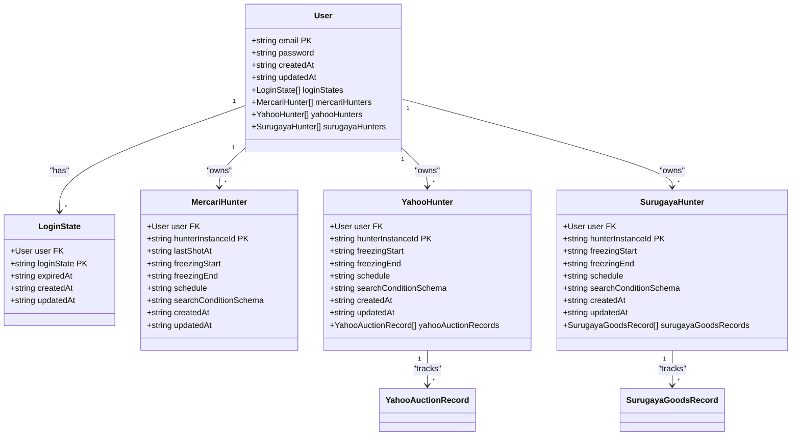
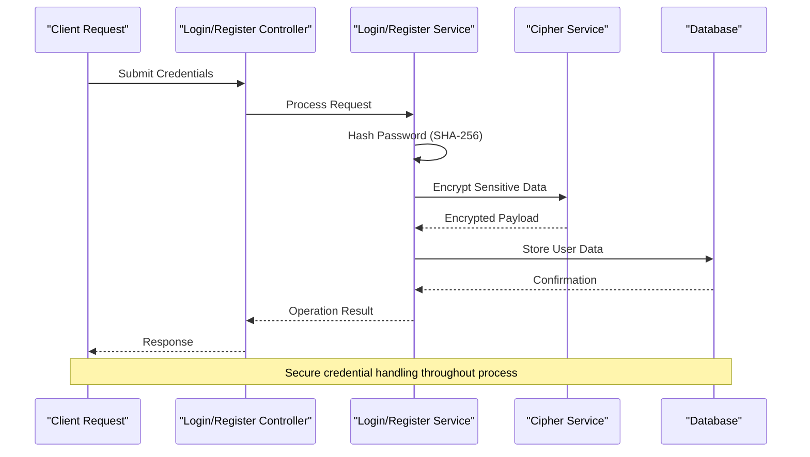
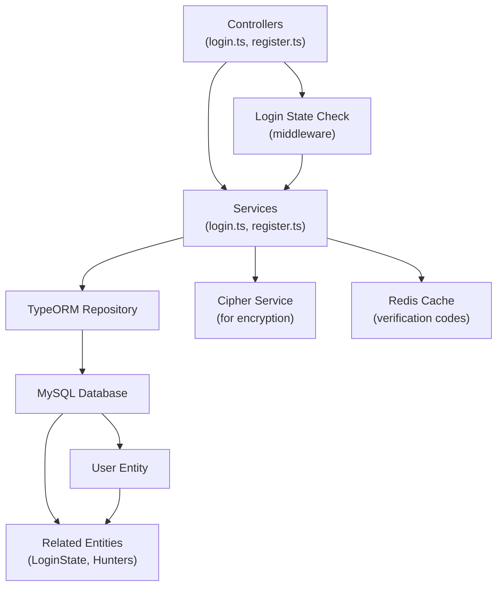
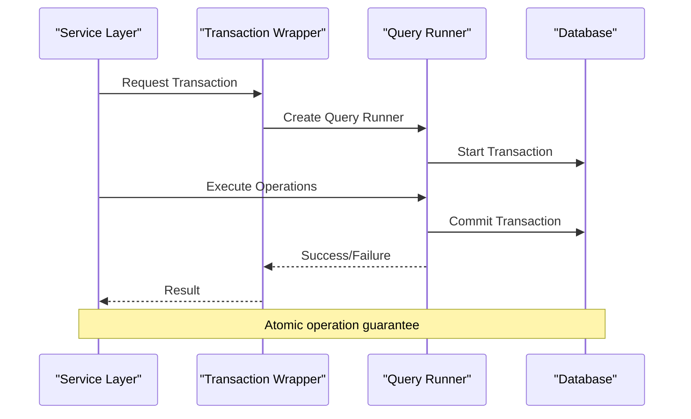

# User Model Documentation

<cite>
**Referenced Files in This Document**
- [src/model/user.ts](file://src/model/user.ts)
- [src/model/loginState.ts](file://src/model/loginState.ts)
- [src/model/mercariHunter.ts](file://src/model/mercariHunter.ts)
- [src/model/yahooHunter.ts](file://src/model/yahooHunter.ts)
- [src/model/surugaya.ts](file://src/model/surugaya.ts)
- [src/service/cipher.ts](file://src/service/cipher.ts)
- [src/service/login.ts](file://src/service/login.ts)
- [src/service/register.ts](file://src/service/register.ts)
- [src/controller/login.ts](file://src/controller/login.ts)
- [src/controller/register.ts](file://src/controller/register.ts)
- [src/types.ts](file://src/types.ts)
- [src/const.ts](file://src/const.ts)
- [src/errorCode.ts](file://src/errorCode.ts)
- [src/config/config.default.ts](file://src/config/config.default.ts)
- [src/utils/databaseTransactionWrapper.ts](file://src/utils/databaseTransactionWrapper.ts)
</cite>

## Table of Contents
1. [Introduction](#introduction)
2. [User Entity Structure](#user-entity-structure)
3. [TypeORM Decorators and Configuration](#typeorm-decorators-and-configuration)
4. [Relationships with Other Models](#relationships-with-other-models)
5. [Security Implementation](#security-implementation)
6. [Data Access Patterns](#data-access-patterns)
7. [Common Queries and Operations](#common-queries-and-operations)
8. [Data Lifecycle Management](#data-lifecycle-management)
9. [Integration with Services](#integration-with-services)
10. [Best Practices and Security Considerations](#best-practices-and-security-considerations)

## Introduction

The User model serves as the central entity in the goods_hunter application, representing registered users who can utilize various hunting functionalities across different marketplaces. This comprehensive model implements robust security measures, maintains relationships with hunting-related entities, and follows modern TypeORM patterns for database persistence.

The User entity is designed to support the application's core functionality while maintaining data integrity, security, and scalability. It integrates seamlessly with the application's authentication system and provides a foundation for user-specific data management.

## User Entity Structure

The User model is implemented as a TypeORM entity with the following core fields and their characteristics:

### Core Fields

| Field | Type | Constraints | Description |
|-------|------|-------------|-------------|
| `email` | `string` | Primary Key, varchar | Unique user identifier and login credential |
| `password` | `string` | Not null, unique | Hashed password stored securely |
| `createdAt` | `string` | Auto-generated | Timestamp of user registration |
| `updatedAt` | `string` | Auto-updated | Last modification timestamp |

### Field Specifications

The User entity utilizes several TypeORM decorators to define field properties and constraints:

- **Primary Key**: The `email` field serves as the primary key, ensuring uniqueness and serving as the user identifier
- **Password Storage**: Passwords are stored as SHA-256 hashes for security
- **Timestamp Management**: Automatic creation and update timestamps track user lifecycle
- **Unique Constraints**: Both email and password fields have unique constraints to prevent duplicates

**Section sources**
- [src/model/user.ts](file://src/model/user.ts#L14-L38)

## TypeORM Decorators and Configuration

The User model employs a comprehensive set of TypeORM decorators to define its database schema and relationships:

### Entity Definition



**Diagram sources**
- [src/model/user.ts](file://src/model/user.ts#L14-L38)
- [src/model/loginState.ts](file://src/model/loginState.ts#L6-L21)
- [src/model/mercariHunter.ts](file://src/model/mercariHunter.ts#L7-L41)
- [src/model/yahooHunter.ts](file://src/model/yahooHunter.ts#L8-L42)
- [src/model/surugaya.ts](file://src/model/surugaya.ts#L7-L40)

### Decorator Analysis

#### Entity-Level Decorators
- `@EntityModel()`: Marks the class as a TypeORM entity
- `@PrimaryColumn("varchar")`: Defines email as primary key with varchar type

#### Field-Level Decorators
- `@Column("varchar", { nullable: false, unique: true })`: Password field with uniqueness constraint
- `@CreateDateColumn()`: Automatically manages creation timestamp
- `@UpdateDateColumn()`: Automatically updates modification timestamp

#### Relationship Decorators
- `@OneToMany(() => EntityType, "user", { cascade: true })`: Establishes one-to-many relationships with cascading delete capabilities

**Section sources**
- [src/model/user.ts](file://src/model/user.ts#L14-L38)

## Relationships with Other Models

The User entity maintains four distinct one-to-many relationships, each serving specific functional purposes:

### LoginState Relationship

The LoginState relationship manages user authentication sessions with automatic cleanup capabilities:

- **Cascade Behavior**: Automatic deletion of login states when user is removed
- **Primary Key Composition**: Composite primary key with user reference
- **Expiration Tracking**: Built-in expiration mechanism for session management

### MercariHunter Relationship

The MercariHunter relationship enables user-specific mercari marketplace hunting configurations:

- **Instance Management**: Individual hunting instances per user
- **Schedule Configuration**: Flexible scheduling capabilities
- **Search Conditions**: Customizable search criteria storage

### YahooHunter Relationship

The YahooHunter relationship provides Yahoo Auction marketplace hunting functionality:

- **Bid Tracking**: Integration with auction record management
- **Freezing Mechanisms**: Time-based hunting restrictions
- **Search Schema**: Structured search condition storage

### SurugayaHunter Relationship

The SurugayaHunter relationship supports Surugaya marketplace hunting operations:

- **Goods Monitoring**: Track purchased and monitored items
- **Freezing Controls**: Hunting pause mechanisms
- **Search Persistence**: Stored search conditions for future reference

**Section sources**
- [src/model/user.ts](file://src/model/user.ts#L28-L38)
- [src/model/loginState.ts](file://src/model/loginState.ts#L7-L11)
- [src/model/mercariHunter.ts](file://src/model/mercariHunter.ts#L8-L12)
- [src/model/yahooHunter.ts](file://src/model/yahooHunter.ts#L9-L13)
- [src/model/surugaya.ts](file://src/model/surugaya.ts#L9-L13)

## Security Implementation

The User model implements multiple layers of security to protect sensitive user data and maintain system integrity:

### Password Security

#### Hashing Implementation
- **Algorithm**: SHA-256 hashing using crypto-js library
- **Storage Format**: Plain hashed strings stored in database
- **Security Level**: Industry-standard cryptographic hash function

#### Encryption Service Integration
The application includes a sophisticated encryption service for additional security layers:



**Diagram sources**
- [src/service/login.ts](file://src/service/login.ts#L20-L35)
- [src/service/register.ts](file://src/service/register.ts#L38-L67)
- [src/service/cipher.ts](file://src/service/cipher.ts#L69-L116)

### Data Protection Measures

#### Validation and Sanitization
- **Input Validation**: Controllers validate required fields before processing
- **Error Handling**: Comprehensive error codes for security-related failures
- **Rate Limiting**: Implicit protection through verification code expiration

#### Secure Transmission
- **HTTPS Requirement**: Configuration assumes secure transport layer
- **Cookie Security**: Session cookies with appropriate security attributes
- **Redis Encryption**: Additional encryption for temporary data storage

**Section sources**
- [src/service/login.ts](file://src/service/login.ts#L20-L35)
- [src/service/register.ts](file://src/service/register.ts#L38-L67)
- [src/service/cipher.ts](file://src/service/cipher.ts#L69-L116)
- [src/errorCode.ts](file://src/errorCode.ts#L44-L46)

## Data Access Patterns

The User model follows established patterns for data access through dedicated service layers:

### Service Layer Architecture



**Diagram sources**
- [src/controller/login.ts](file://src/controller/login.ts#L15-L37)
- [src/controller/register.ts](file://src/controller/register.ts#L15-L43)
- [src/service/login.ts](file://src/service/login.ts#L12-L47)
- [src/service/register.ts](file://src/service/register.ts#L13-L76)

### Access Methods

#### Authentication Flow
1. **Credential Validation**: Controllers validate email/password presence
2. **Hash Verification**: Login service computes SHA-256 hash for comparison
3. **Session Creation**: Login state generation with UUID and expiration
4. **Persistence**: User entity updated with new login state

#### Registration Flow
1. **Verification Generation**: Random code generation for email confirmation
2. **Temporary Storage**: Redis storage with 12-hour expiration
3. **Email Notification**: System email with confirmation link
4. **Finalization**: User creation upon successful verification

**Section sources**
- [src/controller/login.ts](file://src/controller/login.ts#L22-L35)
- [src/controller/register.ts](file://src/controller/register.ts#L23-L42)
- [src/service/login.ts](file://src/service/login.ts#L20-L47)
- [src/service/register.ts](file://src/service/register.ts#L38-L67)

## Common Queries and Operations

The User model supports various query patterns essential for application functionality:

### Authentication Queries

#### Login Validation
```typescript
// Example query pattern from login service
const record = await this.userModel.findOne({
  email,
  password: digest,
}, {
  relations: ["loginStates"],
});
```

#### User Existence Check
```typescript
// Registration validation pattern
const record = await this.userModel.findAndCount({
  email,
  password: digest,
});
```

### Relationship Queries

#### User with Related Data
```typescript
// Load user with hunting configurations
const userWithHunters = await this.userModel.findOne(userId, {
  relations: [
    "mercariHunters", 
    "yahooHunters", 
    "surugayaHunters",
    "loginStates"
  ],
});
```

### Transaction Management

The application implements database transaction patterns for data consistency:



**Diagram sources**
- [src/utils/databaseTransactionWrapper.ts](file://src/utils/databaseTransactionWrapper.ts#L15-L49)

**Section sources**
- [src/service/login.ts](file://src/service/login.ts#L21-L31)
- [src/service/register.ts](file://src/service/register.ts#L54-L61)
- [src/utils/databaseTransactionWrapper.ts](file://src/utils/databaseTransactionWrapper.ts#L28-L40)

## Data Lifecycle Management

The User model implements comprehensive lifecycle management with automatic timestamp handling and cascading operations:

### Timestamp Management

#### Automatic Timestamps
- **Creation Tracking**: `createdAt` automatically populated on user creation
- **Modification Tracking**: `updatedAt` automatically updated on record modifications
- **Precision**: DateTime format ensures accurate temporal tracking

#### Cascade Operations
- **Delete Cascades**: Related entities automatically deleted when user is removed
- **Update Cascades**: Related entities inherit user updates when configured
- **Consistency**: Maintains referential integrity across the application

### Soft Delete Patterns

While the current implementation doesn't show explicit soft delete functionality, the architecture supports extension:

#### Extension Points
- **Deleted Flag**: Could add `isDeleted` boolean field
- **Soft Deletion**: Implement soft delete with cascade filtering
- **Recovery Mechanism**: Enable user restoration from deleted state

### Retention Policies

#### Temporary Data Management
- **Verification Codes**: 12-hour expiration in Redis cache
- **Login States**: Automatic cleanup through cascade deletion
- **Session Expiration**: Configurable login state expiration

**Section sources**
- [src/model/user.ts](file://src/model/user.ts#L22-L26)
- [src/service/register.ts](file://src/service/register.ts#L40-L44)
- [src/service/login.ts](file://src/service/login.ts#L37-L46)

## Integration with Services

The User model integrates deeply with various application services to provide comprehensive functionality:

### Service Integration Matrix

| Service | Purpose | Integration Pattern |
|---------|---------|-------------------|
| LoginService | Authentication | Direct entity queries, session management |
| RegisterService | User Registration | Verification codes, email notifications |
| CipherService | Data Encryption | Password hashing, sensitive data protection |
| EmailService | Communication | Registration confirmations, notifications |
| RedisService | Temporary Storage | Verification codes, caching |

### Controller Integration

#### Login Controller
- **Input Validation**: Validates email and password presence
- **Service Orchestration**: Delegates authentication to LoginService
- **Response Management**: Sets secure cookies for session persistence

#### Register Controller
- **Registration Flow**: Manages complete registration lifecycle
- **Verification Handling**: Processes confirmation codes
- **Error Management**: Provides meaningful error responses

### Middleware Integration

#### Login State Validation
- **Automatic Checking**: Middleware validates login state on protected routes
- **Error Handling**: Graceful handling of expired or invalid sessions
- **Security Enforcement**: Prevents unauthorized access attempts

**Section sources**
- [src/controller/login.ts](file://src/controller/login.ts#L15-L37)
- [src/controller/register.ts](file://src/controller/register.ts#L15-L43)
- [src/service/login.ts](file://src/service/login.ts#L12-L47)
- [src/service/register.ts](file://src/service/register.ts#L13-L76)

## Best Practices and Security Considerations

The User model implementation demonstrates several best practices for secure and efficient data management:

### Security Best Practices

#### Credential Protection
- **Hash-Based Storage**: Never store plain-text passwords
- **Cryptographic Hashing**: SHA-256 provides strong collision resistance
- **Salt Implementation**: Future enhancement could include salt for additional security

#### Data Integrity
- **Unique Constraints**: Prevent duplicate user registrations
- **Validation Layers**: Multiple validation points throughout the application
- **Error Handling**: Consistent error reporting without information leakage

### Performance Considerations

#### Indexing Strategies
- **Primary Key Indexing**: Automatic indexing on email field
- **Foreign Key Optimization**: Efficient relationship queries
- **Composite Key Usage**: Optimal for relationship tables

#### Query Optimization
- **Selective Loading**: Use relations parameter for targeted data loading
- **Batch Operations**: Leverage TypeORM's bulk operations where appropriate
- **Connection Pooling**: Database configuration supports concurrent connections

### Scalability Patterns

#### Horizontal Scaling
- **Stateless Design**: No user state stored in memory
- **Database Independence**: Clear separation between data and business logic
- **Caching Integration**: Redis provides efficient temporary data storage

#### Vertical Scaling
- **Memory Efficiency**: Minimal memory footprint for entity objects
- **Network Optimization**: Efficient serialization for API responses
- **Resource Management**: Proper cleanup of database connections

### Maintenance and Monitoring

#### Logging and Auditing
- **Operation Tracking**: Automatic timestamp management
- **Error Reporting**: Comprehensive error codes for debugging
- **Performance Metrics**: Database logging enabled for monitoring

#### Data Migration
- **Schema Evolution**: TypeORM's synchronize option for development
- **Backward Compatibility**: Careful consideration for production migrations
- **Data Preservation**: Cascade operations maintain referential integrity

**Section sources**
- [src/config/config.default.ts](file://src/config/config.default.ts#L85-L95)
- [src/errorCode.ts](file://src/errorCode.ts#L44-L68)
- [src/utils/databaseTransactionWrapper.ts](file://src/utils/databaseTransactionWrapper.ts#L28-L40)