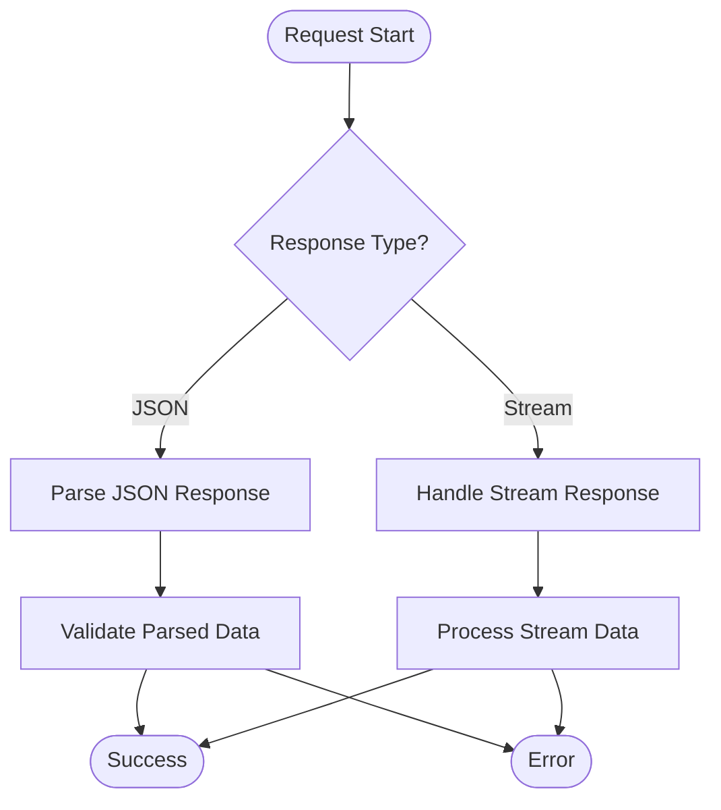

# Base API Structure

<cite>
**Referenced Files in This Document**
- [src/api/site/base.ts](file://src/api/site/base.ts)
- [src/api/request/index.ts](file://src/api/request/index.ts)
- [src/api/site/types.ts](file://src/api/site/types.ts)
- [src/api/site/mercari/index.ts](file://src/api/site/mercari/index.ts)
- [src/api/site/mercari/types.ts](file://src/api/site/mercari/types.ts)
- [src/api/site/surugaya/index.ts](file://src/api/site/surugaya/index.ts)
- [src/api/site/surugaya/types.ts](file://src/api/site/surugaya/types.ts)
- [src/service/hunterArsenal/base.ts](file://src/service/hunterArsenal/base.ts)
- [src/service/hunterArsenal/mercari.ts](file://src/service/hunterArsenal/mercari.ts)
- [src/service/hunterArsenal/surugaya.ts](file://src/service/hunterArsenal/surugaya.ts)
- [src/api/const.ts](file://src/api/const.ts)
- [src/utils/doThisUntilResolve.ts](file://src/utils/doThisUntilResolve.ts)
- [src/configuration.ts](file://src/configuration.ts)
</cite>

## Table of Contents
1. [Introduction](#introduction)
2. [Architecture Overview](#architecture-overview)
3. [Core Base Classes](#core-base-classes)
4. [HTTP Communication Layer](#http-communication-layer)
5. [Marketplace API Implementations](#marketplace-api-implementations)
6. [Dependency Injection and Lifecycle Management](#dependency-injection-and-lifecycle-management)
7. [Error Handling and Logging](#error-handling-and-logging)
8. [Implementation Examples](#implementation-examples)
9. [Performance Considerations](#performance-considerations)
10. [Conclusion](#conclusion)

## Introduction

The Goods Hunter project implements a sophisticated base API structure that provides a unified interface for integrating with multiple marketplace platforms. This architecture enables consistent error handling, logging, and proxy usage across diverse marketplace APIs while supporting both JSON-based APIs (like Mercari) and HTML scraping approaches (like Surugaya).

The system is built on the Midway.js framework and leverages dependency injection, request/response streaming, and robust error handling mechanisms to create a scalable and maintainable solution for marketplace data aggregation.

## Architecture Overview

The base API structure follows a layered architecture pattern with clear separation of concerns:

**Diagram sources**
- [src/service/hunterArsenal/base.ts](file://src/service/hunterArsenal/base.ts#L16-L88)
- [src/api/site/base.ts](file://src/api/site/base.ts#L8-L33)
- [src/api/request/index.ts](file://src/api/request/index.ts#L12-L87)

The architecture consists of four primary layers:

1. **Service Layer**: Contains business logic and orchestration
2. **API Layer**: Implements platform-specific API integrations
3. **Communication Layer**: Handles HTTP requests with proxy support
4. **Infrastructure**: Provides cross-cutting concerns like logging and dependency injection

## Core Base Classes

### ApiBase Abstract Class

The `ApiBase` class serves as the foundation for all marketplace API implementations, providing essential shared functionality:

**Diagram sources**
- [src/api/site/base.ts](file://src/api/site/base.ts#L8-L33)
- [src/api/site/mercari/index.ts](file://src/api/site/mercari/index.ts#L13-L47)
- [src/api/site/surugaya/index.ts](file://src/api/site/surugaya/index.ts#L9-L117)

The `ApiBase` class provides:

- **Dependency Injection**: Uses Midway.js decorators for automatic dependency resolution
- **Shared Logging**: Integrated logging capabilities through the `@Logger()` decorator
- **Standardized Error Handling**: Consistent error patterns across implementations
- **Thumbnail Streaming**: Built-in support for image streaming via `fetchThumbNail()`

**Section sources**
- [src/api/site/base.ts](file://src/api/site/base.ts#L8-L33)

### HunterBase Abstract Class

The `HunterBase` class provides the foundation for marketplace hunting services:

**Diagram sources**
- [src/service/hunterArsenal/base.ts](file://src/service/hunterArsenal/base.ts#L16-L88)
- [src/service/hunterArsenal/mercari.ts](file://src/service/hunterArsenal/mercari.ts#L23-L339)
- [src/service/hunterArsenal/surugaya.ts](file://src/service/hunterArsenal/surugaya.ts#L24-L345)

**Section sources**
- [src/service/hunterArsenal/base.ts](file://src/service/hunterArsenal/base.ts#L16-L88)

## HTTP Communication Layer

### ProxyGet and ProxyPost Services

The HTTP communication layer abstracts network operations with comprehensive proxy support and retry logic:

**Diagram sources**
- [src/api/request/index.ts](file://src/api/request/index.ts#L19-L36)
- [src/utils/doThisUntilResolve.ts](file://src/utils/doThisUntilResolve.ts#L1-L18)

The proxy services provide:

- **Proxy Chaining**: Automatic proxy agent configuration for outbound requests
- **Retry Logic**: Configurable retry attempts with exponential backoff
- **Request Customization**: Flexible request options including timeouts and headers
- **Error Recovery**: Intelligent error handling with fallback mechanisms

**Section sources**
- [src/api/request/index.ts](file://src/api/request/index.ts#L12-L87)
- [src/utils/doThisUntilResolve.ts](file://src/utils/doThisUntilResolve.ts#L1-L18)

### Response Type Handling

The system supports different response types, particularly stream-based responses for image thumbnails:

**Diagram sources**
- [src/api/site/base.ts](file://src/api/site/base.ts#L19-L26)
- [src/api/request/index.ts](file://src/api/request/index.ts#L25-L36)

**Section sources**
- [src/api/site/base.ts](file://src/api/site/base.ts#L19-L26)

## Marketplace API Implementations

### Mercari Implementation (JSON API)

Mercari integration demonstrates a modern JSON API approach:

**Diagram sources**
- [src/api/site/mercari/index.ts](file://src/api/site/mercari/index.ts#L21-L47)
- [src/api/site/mercari/types.ts](file://src/api/site/mercari/types.ts#L1-L42)

Key characteristics:
- **JSON-based API**: Direct REST API consumption
- **JWT Authentication**: Secure API access with dynamic tokens
- **Structured Responses**: Well-defined data models
- **Pagination Support**: Configurable page sizes and search parameters

**Section sources**
- [src/api/site/mercari/index.ts](file://src/api/site/mercari/index.ts#L13-L47)
- [src/api/site/mercari/types.ts](file://src/api/site/mercari/types.ts#L1-L42)

### Surugaya Implementation (HTML Scraping)

Surugaya integration showcases HTML scraping capabilities:

**Diagram sources**
- [src/api/site/surugaya/index.ts](file://src/api/site/surugaya/index.ts#L18-L117)
- [src/api/site/surugaya/types.ts](file://src/api/site/surugaya/types.ts#L1-L25)

Key characteristics:
- **HTML Scraping**: DOM parsing for dynamic content extraction
- **Flexible Search**: Multi-page search with configurable epochs
- **Adult Content Handling**: Specialized filtering for mature content
- **Robust Error Handling**: Retry logic with fallback mechanisms

**Section sources**
- [src/api/site/surugaya/index.ts](file://src/api/site/surugaya/index.ts#L9-L117)
- [src/api/site/surugaya/types.ts](file://src/api/site/surugaya/types.ts#L1-L25)

## Dependency Injection and Lifecycle Management

### Midway.js Integration

The system leverages Midway.js for comprehensive dependency injection:

**Diagram sources**
- [src/configuration.ts](file://src/configuration.ts#L13-L26)
- [src/api/request/index.ts](file://src/api/request/index.ts#L68-L82)

### ScopeEnum.Request Usage

The `ScopeEnum.Request` ensures proper instance lifecycle management:

| Scope Level | Lifetime | Use Case |
|-------------|----------|----------|
| Singleton | Application lifetime | Stateless services, utilities |
| Request | Request lifetime | HTTP clients, database connections |
| Prototype | New instance per resolve | Mutable objects, temporary data |

**Section sources**
- [src/api/site/base.ts](file://src/api/site/base.ts#L8-L10)
- [src/api/site/mercari/index.ts](file://src/api/site/mercari/index.ts#L9-L12)
- [src/api/site/surugaya/index.ts](file://src/api/site/surugaya/index.ts#L9-L12)

## Error Handling and Logging

### Centralized Error Management

The system implements comprehensive error handling across all layers:

**Diagram sources**
- [src/service/hunterArsenal/mercari.ts](file://src/service/hunterArsenal/mercari.ts#L132-L140)
- [src/service/hunterArsenal/surugaya.ts](file://src/service/hunterArsenal/surugaya.ts#L138-L146)

### Logging Strategy

The logging system provides comprehensive monitoring and debugging capabilities:

| Log Level | Purpose | Example Usage |
|-----------|---------|---------------|
| ERROR | Critical failures | API connection errors, authentication failures |
| WARN | Recoverable issues | Rate limiting, temporary failures |
| INFO | Operational events | Successful operations, state changes |
| DEBUG | Detailed debugging | Request/response details, internal state |

**Section sources**
- [src/api/site/base.ts](file://src/api/site/base.ts#L14-L15)
- [src/service/hunterArsenal/mercari.ts](file://src/service/hunterArsenal/mercari.ts#L136-L140)
- [src/service/hunterArsenal/surugaya.ts](file://src/service/hunterArsenal/surugaya.ts#L142-L146)

## Implementation Examples

### Unified Interface Pattern

Both Mercari and Surugaya implement the same interface while handling different protocols:

**Diagram sources**
- [src/api/site/types.ts](file://src/api/site/types.ts#L5-L16)
- [src/api/site/mercari/types.ts](file://src/api/site/mercari/types.ts#L30-L39)
- [src/api/site/surugaya/types.ts](file://src/api/site/surugaya/types.ts#L14-L19)

### Thumbnail Streaming Implementation

The `fetchThumbNail` method demonstrates advanced streaming capabilities:

**Diagram sources**
- [src/api/site/base.ts](file://src/api/site/base.ts#L19-L26)

**Section sources**
- [src/api/site/base.ts](file://src/api/site/base.ts#L19-L26)
- [src/api/site/types.ts](file://src/api/site/types.ts#L1-L16)

## Performance Considerations

### Caching Strategies

The system implements multiple caching layers:

| Cache Type | Scope | Duration | Purpose |
|------------|-------|----------|---------|
| Redis | Session | Variable | User preferences, ignored items |
| Database | Persistent | Long-term | Historical data, user settings |
| Memory | Request | Short-term | Temporary calculations, intermediate results |

### Concurrency Management

The architecture handles concurrent requests efficiently:

- **Request-scoped services**: Isolated instances per request
- **Connection pooling**: Efficient HTTP connection reuse
- **Rate limiting**: Prevents overwhelming external APIs
- **Timeout management**: Prevents hanging requests

### Resource Optimization

Key optimization strategies include:

- **Lazy loading**: Services loaded only when needed
- **Streaming responses**: Reduced memory footprint for large data
- **Selective processing**: Only process changed data
- **Batch operations**: Group related operations for efficiency

## Conclusion

The base API structure provides a robust foundation for marketplace integration with several key advantages:

### Architectural Benefits

- **Unified Interface**: Consistent API patterns across different platforms
- **Scalable Design**: Modular architecture supporting easy extension
- **Resilient Operations**: Comprehensive error handling and retry logic
- **Maintainable Code**: Clear separation of concerns and dependency injection

### Technical Excellence

- **Modern Patterns**: Leverages latest JavaScript/TypeScript features
- **Performance**: Optimized for high-throughput, low-latency operations
- **Reliability**: Built-in fault tolerance and recovery mechanisms
- **Security**: Proper authentication, encryption, and proxy management

### Extensibility

The architecture supports easy addition of new marketplace integrations while maintaining consistency in:
- Error handling patterns
- Logging standards
- Request/response formats
- Authentication mechanisms

This base API structure demonstrates how modern web applications can effectively integrate with diverse external systems while maintaining code quality, reliability, and scalability.