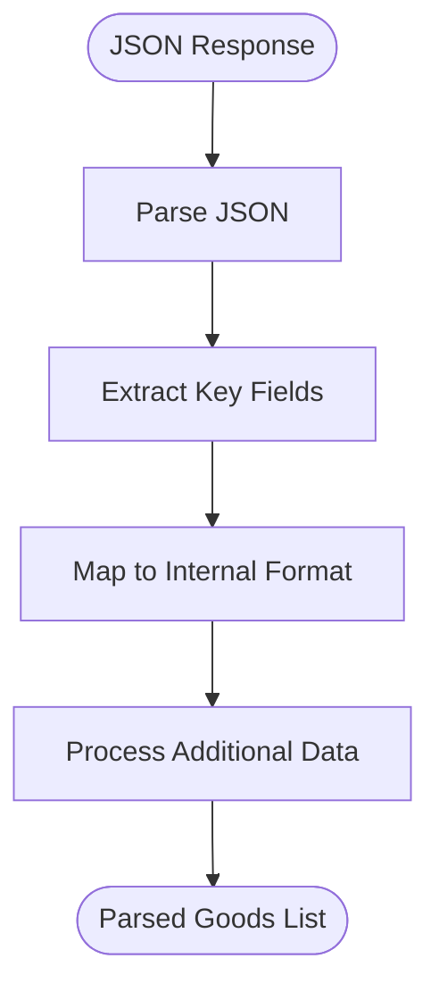

# External Integrations

<cite>
**Referenced Files in This Document**   
- [base.ts](file://src/api/site/base.ts)
- [types.ts](file://src/api/site/types.ts)
- [mercari/index.ts](file://src/api/site/mercari/index.ts)
- [surugaya/index.ts](file://src/api/site/surugaya/index.ts)
- [yahoo/index.ts](file://src/api/site/yahoo/index.ts)
- [request/index.ts](file://src/api/request/index.ts)
- [mercari/types.ts](file://src/api/site/mercari/types.ts)
- [surugaya/types.ts](file://src/api/site/surugaya/types.ts)
- [yahoo/types.ts](file://src/api/site/yahoo/types.ts)
- [mercari/mock/goodsList.json](file://src/api/site/mercari/mock/goodsList.json)
- [surugaya/mock/goodsList.html](file://src/api/site/surugaya/mock/goodsList.html)
- [lashinbang/mock/goodsList.txt](file://src/api/site/lashinbang/mock/goodsList.txt)
- [mandarake/mock/goodsList.html](file://src/api/site/mandarake/mock/goodsList.html)
</cite>

## Table of Contents
1. [Introduction](#introduction)
2. [Architecture Overview](#architecture-overview)
3. [Core Components](#core-components)
4. [Site-Specific Implementation Details](#site-specific-implementation-details)
5. [Request Abstraction and Error Handling](#request-abstraction-and-error-handling)
6. [Mocking System for Development and Testing](#mocking-system-for-development-and-testing)
7. [Parsing Strategies and Data Extraction](#parsing-strategies-and-data-extraction)
8. [Challenges and Anti-Bot Measures](#challenges-and-anti-bot-measures)
9. [Adding New Marketplace Integrations](#adding-new-marketplace-integrations)
10. [Conclusion](#conclusion)

## Introduction

The External Integrations system provides a unified interface for scraping product data from multiple Japanese marketplaces including Mercari, Surugaya, Yahoo Auctions, Lashinbang, and Mandarake. This documentation details the architecture, implementation patterns, and operational considerations for these integrations. The system uses Axios for HTTP requests and JSDOM for HTML parsing, with a consistent pattern across all marketplace implementations. Each site-specific integration follows a standardized structure while accommodating the unique response formats and authentication requirements of each marketplace.

## Architecture Overview

The external marketplace integrations follow a modular, class-based architecture with shared base functionality and site-specific implementations. The system is organized around a base class that provides common functionality, with concrete implementations for each marketplace that handle their specific APIs and HTML structures.


**Diagram sources**
- [base.ts](file://src/api/site/base.ts)
- [request/index.ts](file://src/api/request/index.ts)
- [types.ts](file://src/api/site/types.ts)

**Section sources**
- [base.ts](file://src/api/site/base.ts)
- [types.ts](file://src/api/site/types.ts)

## Core Components

The external integrations system is built around several core components that provide the foundation for all marketplace interactions. The `ApiBase` class serves as the foundation for all site-specific implementations, providing shared functionality like HTTP request handling and logging. The request abstraction layer standardizes HTTP operations across all integrations, while the type system ensures consistent data structures regardless of the source marketplace. Each site-specific integration extends the base class and implements the `fetchGoodsList` method according to the particular requirements of that marketplace.

**Section sources**
- [base.ts](file://src/api/site/base.ts)
- [types.ts](file://src/api/site/types.ts)
- [request/index.ts](file://src/api/request/index.ts)

## Site-Specific Implementation Details

Each marketplace integration follows a consistent pattern while adapting to the specific characteristics of the target site. The implementations are organized in the `src/api/site/` directory, with each marketplace having its own subdirectory containing the implementation files. The system handles different response formats (JSON, HTML) and authentication requirements through site-specific adaptations of the common pattern.

### Mercari Integration

The Mercari integration uses a JSON API with JWT authentication. It makes POST requests to Mercari's search endpoint with a dynamically generated JWT token. The implementation constructs the request payload according to Mercari's API requirements, including search parameters and dataset preferences.


**Diagram sources**
- [mercari/index.ts](file://src/api/site/mercari/index.ts)
- [mercari/types.ts](file://src/api/site/mercari/types.ts)

**Section sources**
- [mercari/index.ts](file://src/api/site/mercari/index.ts)
- [mercari/types.ts](file://src/api/site/mercari/types.ts)

### Surugaya Integration

The Surugaya integration scrapes HTML content using JSDOM. It constructs GET requests with search parameters in the query string and parses the resulting HTML to extract product information. The implementation handles pagination by generating multiple URLs and processing them in parallel.


**Diagram sources**
- [surugaya/index.ts](file://src/api/site/surugaya/index.ts)
- [surugaya/types.ts](file://src/api/site/surugaya/types.ts)

**Section sources**
- [surugaya/index.ts](file://src/api/site/surugaya/index.ts)
- [surugaya/types.ts](file://src/api/site/surugaya/types.ts)

### Yahoo Auctions Integration

The Yahoo Auctions integration scrapes HTML content and requires cookie-based authentication. It constructs GET requests with search parameters and uses the cookie for authentication. The implementation includes a heartbeat check to verify the validity of the authentication cookie.


**Diagram sources**
- [yahoo/index.ts](file://src/api/site/yahoo/index.ts)
- [yahoo/types.ts](file://src/api/site/yahoo/types.ts)

**Section sources**
- [yahoo/index.ts](file://src/api/site/yahoo/index.ts)
- [yahoo/types.ts](file://src/api/site/yahoo/types.ts)

## Request Abstraction and Error Handling

The request abstraction layer provides a consistent interface for HTTP operations across all marketplace integrations. It uses Axios as the underlying HTTP client with proxy support and implements retry logic for handling network failures. The system handles different response formats and error conditions according to the requirements of each marketplace.

### Request Abstraction Layer

The request abstraction is implemented in `api/request/index.ts` and provides two main interfaces: `ProxyGet` and `ProxyPost`. These interfaces wrap Axios operations with additional functionality like proxy support, retry logic, and timeout handling.


**Diagram sources**
- [request/index.ts](file://src/api/request/index.ts)

**Section sources**
- [request/index.ts](file://src/api/request/index.ts)

### Error Handling Strategy

The system implements comprehensive error handling for network failures and site structure changes. Each integration includes retry logic with configurable retry counts and conditions for breaking the retry loop. The error handling strategy accommodates the different reliability characteristics of each marketplace.


**Section sources**
- [request/index.ts](file://src/api/request/index.ts)
- [surugaya/index.ts](file://src/api/site/surugaya/index.ts)
- [yahoo/index.ts](file://src/api/site/yahoo/index.ts)

## Mocking System for Development and Testing

The system includes a comprehensive mocking framework that enables development and testing without making actual requests to the external marketplaces. Each site integration has a corresponding mock directory containing sample responses in the appropriate format (JSON, HTML, TXT).

### Mock Directory Structure

The mock system follows a consistent pattern across all marketplace integrations:

```
src/api/site/
├── mercari/
│   └── mock/
│       └── goodsList.json
├── surugaya/
│   └── mock/
│       └── goodsList.html
├── yahoo/
│   └── mock/
│       └── goodsList.html
├── lashinbang/
│   └── mock/
│       └── goodsList.txt
└── mandarake/
    └── mock/
        └── goodsList.html
```

The mock files contain representative samples of the actual responses from each marketplace, allowing developers to test the parsing logic without network dependencies.

**Section sources**
- [mercari/mock/goodsList.json](file://src/api/site/mercari/mock/goodsList.json)
- [surugaya/mock/goodsList.html](file://src/api/site/surugaya/mock/goodsList.html)
- [lashinbang/mock/goodsList.txt](file://src/api/site/lashinbang/mock/goodsList.txt)
- [mandarake/mock/goodsList.html](file://src/api/site/mandarake/mock/goodsList.html)

## Parsing Strategies and Data Extraction

The system employs different parsing strategies depending on the response format of each marketplace. JSON responses are processed directly, while HTML responses are parsed using JSDOM to extract the required information.

### JSON Response Parsing (Mercari)

For marketplaces that provide JSON APIs like Mercari, the system uses direct JSON parsing with TypeScript interfaces to ensure type safety. The response structure is mapped to a consistent internal format regardless of the source.



**Section sources**
- [mercari/index.ts](file://src/api/site/mercari/index.ts)
- [mercari/types.ts](file://src/api/site/mercari/types.ts)
- [mercari/mock/goodsList.json](file://src/api/site/mercari/mock/goodsList.json)

### HTML Response Parsing (Surugaya, Yahoo, Mandarake)

For marketplaces that require HTML scraping, the system uses JSDOM to create a DOM environment for parsing. The implementation uses CSS selectors to locate and extract the required information from the HTML structure.


**Section sources**
- [surugaya/index.ts](file://src/api/site/surugaya/index.ts)
- [yahoo/index.ts](file://src/api/site/yahoo/index.ts)
- [surugaya/mock/goodsList.html](file://src/api/site/surugaya/mock/goodsList.html)

## Challenges and Anti-Bot Measures

The external integrations face several challenges related to anti-bot measures, rate limiting, and HTML structure volatility. The system implements various strategies to address these challenges and maintain reliable data extraction.

### Anti-Bot and Rate Limiting Challenges

Each marketplace employs different anti-bot measures that the system must accommodate:

- **Mercari**: Requires JWT authentication with dynamically generated tokens
- **Surugaya**: Uses cookie-based safe search settings for adult content
- **Yahoo Auctions**: Requires valid authentication cookies and session management
- **Rate Limiting**: All marketplaces have rate limits that must be respected

The system addresses these challenges through:

- Proper authentication and session management
- Configurable retry logic with exponential backoff
- Parallel request processing with controlled concurrency
- User agent rotation and other header manipulation

### HTML Structure Volatility

Marketplace websites frequently change their HTML structure, which can break scraping logic. The system mitigates this risk through:

- Modular parsing logic that isolates selector changes
- Comprehensive testing with mock responses
- Monitoring for parsing failures
- Graceful error handling when selectors don't match


**Section sources**
- [surugaya/index.ts](file://src/api/site/surugaya/index.ts)
- [yahoo/index.ts](file://src/api/site/yahoo/index.ts)
- [base.ts](file://src/api/site/base.ts)

## Adding New Marketplace Integrations

Adding a new marketplace integration follows a standardized pattern that ensures consistency across all implementations. The process involves creating the necessary files and implementing the required functionality according to the site's characteristics.

### Implementation Pattern

To add a new marketplace integration, follow these steps:

1. Create a new directory under `src/api/site/` for the marketplace
2. Implement a site-specific `index.ts` file that extends `ApiBase`
3. Define TypeScript interfaces for the response format in `types.ts`
4. Create a mock directory with sample responses
5. Implement the `fetchGoodsList` method according to the site's API or HTML structure

### Required Components

Each new integration must include the following components:


The new integration should follow the same patterns as existing implementations, using JSON parsing for API-based marketplaces and JSDOM for HTML scraping. The request abstraction layer should be used for all HTTP operations to ensure consistent error handling and retry logic.

**Section sources**
- [base.ts](file://src/api/site/base.ts)
- [types.ts](file://src/api/site/types.ts)
- [request/index.ts](file://src/api/request/index.ts)

## Conclusion

The external marketplace integrations system provides a robust and maintainable framework for scraping product data from multiple Japanese marketplaces. By following a consistent pattern of base class inheritance, shared request abstraction, and standardized type definitions, the system enables reliable data extraction while accommodating the unique characteristics of each marketplace. The inclusion of a comprehensive mocking system facilitates development and testing, while the modular architecture makes it straightforward to add new marketplace integrations. The system effectively addresses challenges related to anti-bot measures, rate limiting, and HTML structure volatility through careful implementation of authentication, retry logic, and error handling strategies.