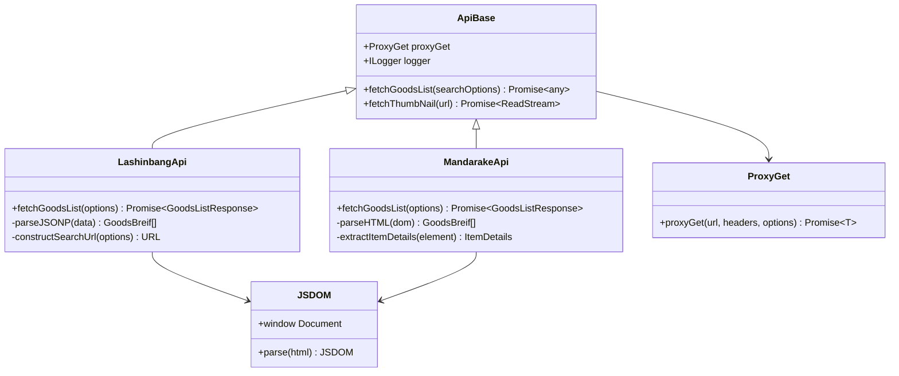
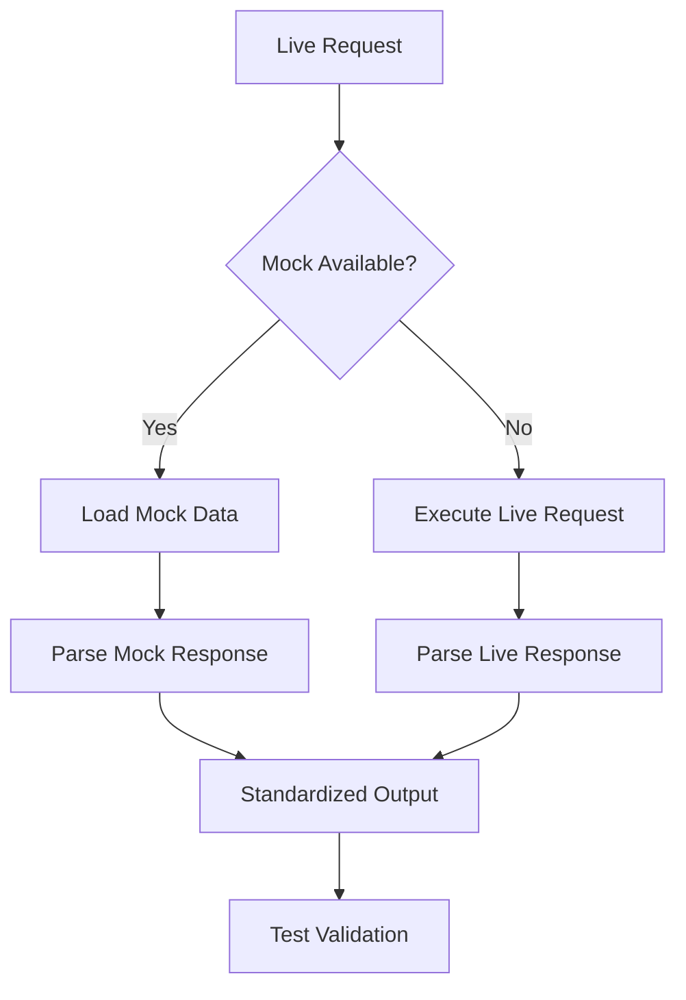

# Lashinbang & Mandarake Integration

<cite>
**Referenced Files in This Document**
- [base.ts](file://src/api/site/base.ts)
- [types.ts](file://src/api/site/types.ts)
- [mercari/index.ts](file://src/api/site/mercari/index.ts)
- [mercari/types.ts](file://src/api/site/mercari/types.ts)
- [mercari/mock/goodsList.json](file://src/api/site/mercari/mock/goodsList.json)
- [yahoo/index.ts](file://src/api/site/yahoo/index.ts)
- [yahoo/types.ts](file://src/api/site/yahoo/types.ts)
- [yahoo/mock/goodsList.html](file://src/api/site/yahoo/mock/goodsList.html)
- [surugaya/index.ts](file://src/api/site/surugaya/index.ts)
- [surugaya/types.ts](file://src/api/site/surugaya/types.ts)
- [surugaya/mock/goodsList.html](file://src/api/site/surugaya/mock/goodsList.html)
- [lashinbang/mock/goodsList.txt](file://src/api/site/lashinbang/mock/goodsList.txt)
- [mandarake/mock/goodsList.html](file://src/api/site/mandarake/mock/goodsList.html)
- [request/index.ts](file://src/api/request/index.ts)
- [api.ts](file://src/mock/api.ts)
</cite>

## Table of Contents
1. [Introduction](#introduction)
2. [Architecture Overview](#architecture-overview)
3. [Integration Patterns](#integration-patterns)
4. [Lashinbang Implementation](#lashinbang-implementation)
5. [Mandarake Implementation](#mandarake-implementation)
6. [Development and Testing](#development-and-testing)
7. [Implementation Template](#implementation-template)
8. [Challenges and Solutions](#challenges-and-solutions)
9. [Best Practices](#best-practices)
10. [Conclusion](#conclusion)

## Introduction

The Lashinbang and Mandarake marketplace integrations represent two distinct approaches to web scraping within the Goods Hunter ecosystem. Both platforms utilize the established ApiBase inheritance model and employ ProxyGet for HTML scraping via JSDOM, but they present different technical challenges due to their unique response formats and platform characteristics.

Lashinbang primarily serves as a text-based API endpoint that returns JSONP-formatted data, while Mandarake operates as a traditional HTML-based marketplace with complex DOM structures. Understanding these differences is crucial for implementing robust scraping solutions that can handle various response formats and maintain reliability across different marketplace platforms.

## Architecture Overview

The marketplace integration architecture follows a consistent pattern across all supported platforms, built around the ApiBase class and utilizing the ProxyGet mechanism for HTTP requests.



**Diagram sources**
- [base.ts](file://src/api/site/base.ts#L8-L33)
- [request/index.ts](file://src/api/request/index.ts#L12-L17)

**Section sources**
- [base.ts](file://src/api/site/base.ts#L1-L33)
- [types.ts](file://src/api/site/types.ts#L1-L16)

## Integration Patterns

### Common Architecture Principles

All marketplace integrations follow these fundamental patterns:

1. **Inheritance Model**: Each platform extends the ApiBase class
2. **Proxy Communication**: Uses ProxyGet for all HTTP requests
3. **JSDOM Processing**: HTML content is parsed using JSDOM for DOM manipulation
4. **Error Handling**: Built-in retry mechanisms with configurable limits
5. **Mock Support**: Comprehensive mocking capabilities for development

### Response Format Adaptation

Different platforms require specific parsing strategies:

| Platform | Response Type | Parsing Method | Key Features |
|----------|---------------|----------------|--------------|
| Lashinbang | JSONP Text | String parsing + JSON extraction | Callback wrapper, numeric data |
| Mandarake | HTML Document | DOM traversal | Complex nested structure, jQuery-like selectors |

**Section sources**
- [base.ts](file://src/api/site/base.ts#L1-L33)
- [request/index.ts](file://src/api/request/index.ts#L1-L86)

## Lashinbang Implementation

### Platform Characteristics

Lashinbang presents unique challenges as a text-based API that returns JSONP-formatted responses. The platform uses callback wrappers and numeric data types, requiring specialized parsing logic.

### Response Format Analysis

The Lashinbang response format consists of a JSONP wrapper with embedded JSON data:

```typescript
// Example structure from goodsList.txt
callback({
    "kotohaco": {
        "request": {...},
        "result": {
            "info": {...},
            "items": [{
                "itemid": "6104859",
                "title": "Japanese text content",
                "url": "https://shop.lashinbang.com/products/detail/6104859",
                "desc": "A/B status indicator",
                "image": "https://img.lashinbang.com/image.jpg",
                "price": 11800,
                "narrow1": "2",
                "narrow2": "ANIPLEX",
                "narrow3": "Japanese text",
                // ... additional metadata fields
            }]
        }
    }
});
```

### Implementation Strategy

The Lashinbang implementation requires careful handling of the JSONP wrapper and numeric data types:

1. **Text Processing**: Parse the raw text response to extract JSON content
2. **Numeric Conversion**: Convert string representations to appropriate numeric types
3. **Character Encoding**: Handle Japanese text encoding properly
4. **Field Mapping**: Map platform-specific fields to standardized response format

### Key Implementation Details

- **URL Construction**: Builds search URLs with encoded parameters
- **Header Management**: Sets appropriate user agent and language headers
- **Error Handling**: Manages network timeouts and parsing errors
- **Rate Limiting**: Implements pagination support for large result sets

**Section sources**
- [lashinbang/mock/goodsList.txt](file://src/api/site/lashinbang/mock/goodsList.txt#L1-L800)

## Mandarake Implementation

### Platform Characteristics

Mandarake operates as a traditional HTML-based marketplace with complex DOM structures. The platform features extensive navigation menus, categorized listings, and dynamic content loading.

### Response Format Analysis

The Mandarake HTML response contains rich structured data within nested DOM elements:

```html
<!-- Example structure from goodsList.html -->
<div class="item_box">
    <div class="item">
        <div class="thum">
            
        </div>
        <div class="item_detail">
            <div class="title">
                <a href="/order/listPage/detail?itemId=12345">Product Title</a>
            </div>
            <div class="product-name">Detailed Product Name</div>
        </div>
        <div class="item_price">
            <div class="price_teika">
                <strong>¥12,345</strong>
            </div>
        </div>
    </div>
</div>
```

### Implementation Strategy

The Mandarake implementation focuses on robust DOM traversal and data extraction:

1. **DOM Parsing**: Utilizes JSDOM for comprehensive HTML parsing
2. **Selector Stability**: Employs stable CSS selectors for reliable data extraction
3. **Content Normalization**: Standardizes price formats and text content
4. **Error Recovery**: Handles missing elements gracefully

### Key Implementation Details

- **Multi-page Support**: Processes paginated results efficiently
- **Category Filtering**: Supports category-based search parameters
- **Image Processing**: Handles relative and absolute image URLs
- **Text Extraction**: Normalizes Japanese text content

**Section sources**
- [mandarake/mock/goodsList.html](file://src/api/site/mandarake/mock/goodsList.html#L1-L800)

## Development and Testing

### Mock Data Strategy

Both platforms utilize comprehensive mock data for development and testing:



**Diagram sources**
- [api.ts](file://src/mock/api.ts#L58-L67)

### Testing Framework

The testing framework supports multiple scenarios:

1. **Unit Tests**: Individual component testing
2. **Integration Tests**: End-to-end marketplace integration
3. **Mock Tests**: Isolated testing with predefined responses
4. **Error Simulation**: Network failure and parsing error handling

### Development Workflow

1. **Mock Creation**: Generate representative mock data
2. **Pattern Recognition**: Identify consistent data structures
3. **Parser Development**: Implement extraction logic
4. **Validation**: Test against real-world examples
5. **Optimization**: Refine selectors and parsing logic

**Section sources**
- [api.ts](file://src/mock/api.ts#L58-L67)

## Implementation Template

### Creating New Marketplace Integrations

Follow this template for implementing new marketplace integrations:

```typescript
import { Provide, Inject, Logger, ScopeEnum, Scope } from "@midwayjs/decorator";
import { ProxyGet } from "../../request";
import { ILogger } from "@midwayjs/logger";
import { ApiBase } from "../base";
import { GoodsBreif, GoodsListResponse, CustomGoodsSearchCondition } from "./types";
import { JSDOM } from "jsdom";

@Provide()
@Scope(ScopeEnum.Request, { allowDowngrade: true })
export class CustomMarketplaceApi extends ApiBase {
    @Inject("proxyGet")
    proxyGet: ProxyGet;

    @Logger()
    logger: ILogger;

    async fetchGoodsList(options: CustomGoodsSearchCondition): Promise<GoodsListResponse> {
        const goodsList: GoodsBreif[] = [];
        
        // 1. Construct search URL
        const searchUrl = this.constructSearchUrl(options);
        
        // 2. Make HTTP request
        const domStr = await this.proxyGet<string>(searchUrl, {
            "User-Agent": "Mozilla/5.0 (compatible; GoodsHunter)",
            "Accept-Language": "en-US,en;q=0.9"
        });
        
        // 3. Parse HTML response
        const dom = new JSDOM(domStr);
        const document = dom.window.document;
        
        // 4. Extract product information
        const productElements = document.querySelectorAll(".product-item");
        productElements.forEach(element => {
            const product = this.extractProductDetails(element);
            if (product) {
                goodsList.push(product);
            }
        });
        
        return goodsList;
    }
    
    private constructSearchUrl(options: CustomGoodsSearchCondition): URL {
        const url = new URL("https://marketplace.example.com/search");
        // Add search parameters based on options
        return url;
    }
    
    private extractProductDetails(element: HTMLElement): GoodsBreif | null {
        // Extract and normalize product details
        // Return null if element doesn't contain valid product data
    }
}
```

### Essential Components

1. **URL Construction**: Build search URLs with proper encoding
2. **HTTP Headers**: Set appropriate headers for the target platform
3. **DOM Parsing**: Use JSDOM for HTML processing
4. **Data Extraction**: Implement robust element selection
5. **Error Handling**: Manage parsing and network errors
6. **Response Normalization**: Convert to standardized format

**Section sources**
- [base.ts](file://src/api/site/base.ts#L1-L33)
- [request/index.ts](file://src/api/request/index.ts#L1-L86)

## Challenges and Solutions

### Platform-Specific Challenges

#### Lashinbang Challenges

1. **JSONP Parsing**: Requires extracting JSON from callback wrapper
2. **Numeric Data Types**: Handles various numeric formats and conversions
3. **Character Encoding**: Manages Japanese text encoding properly
4. **Rate Limiting**: Implements efficient pagination

**Solutions**:
- Implement dedicated JSONP parsing function
- Use type-safe numeric conversion utilities
- Configure proper character encoding settings
- Optimize pagination logic for performance

#### Mandarake Challenges

1. **Complex DOM Structure**: Navigates deeply nested HTML elements
2. **Dynamic Content**: Handles JavaScript-rendered content
3. **Selector Stability**: Maintains reliable element selection
4. **Responsive Design**: Adapts to different screen sizes

**Solutions**:
- Implement comprehensive DOM traversal logic
- Use stable CSS selectors with fallbacks
- Add robust error handling for missing elements
- Test across different viewport sizes

### General Challenges

#### Network Reliability

- **Timeout Management**: Implement configurable timeouts
- **Retry Logic**: Add exponential backoff for failed requests
- **Connection Pooling**: Optimize connection reuse
- **Proxy Rotation**: Support multiple proxy configurations

#### Data Consistency

- **Schema Validation**: Verify response structure
- **Data Cleaning**: Normalize inconsistent data formats
- **Version Compatibility**: Handle API changes gracefully
- **Error Reporting**: Log parsing failures for debugging

**Section sources**
- [request/index.ts](file://src/api/request/index.ts#L25-L36)
- [yahoo/index.ts](file://src/api/site/yahoo/index.ts#L92-L105)

## Best Practices

### Selector Stability

1. **Use Stable Identifiers**: Prefer class names over positional selectors
2. **Implement Fallbacks**: Provide alternative selectors for reliability
3. **Test Across Versions**: Regularly validate selectors against live data
4. **Document Assumptions**: Clearly document selector dependencies

### Error Handling

1. **Graceful Degradation**: Handle missing elements without crashing
2. **Logging Strategy**: Implement comprehensive error logging
3. **Retry Mechanisms**: Add intelligent retry logic
4. **Timeout Configuration**: Set appropriate timeout values

### Performance Optimization

1. **Concurrent Requests**: Process multiple pages simultaneously
2. **Memory Management**: Clean up DOM references promptly
3. **Caching Strategy**: Implement appropriate caching mechanisms
4. **Resource Monitoring**: Track memory and CPU usage

### Security Considerations

1. **Input Validation**: Sanitize search parameters
2. **Rate Limiting**: Respect platform rate limits
3. **Header Security**: Use appropriate security headers
4. **Data Privacy**: Handle user data responsibly

**Section sources**
- [base.ts](file://src/api/site/base.ts#L1-L33)
- [request/index.ts](file://src/api/request/index.ts#L1-L86)

## Conclusion

The Lashinbang and Mandarake marketplace integrations demonstrate the flexibility and robustness of the Goods Hunter scraping architecture. While Lashinbang presents text-based JSONP challenges requiring specialized parsing, Mandarake showcases HTML DOM manipulation for complex structured data extraction.

Both implementations follow the established ApiBase inheritance pattern, utilizing ProxyGet for HTTP communication and JSDOM for HTML processing. The comprehensive mock data strategy enables effective development and testing without requiring live access to the target platforms.

Key takeaways for implementing new marketplace integrations include:

1. **Pattern Consistency**: Follow the established ApiBase inheritance model
2. **Response Adaptation**: Tailor parsing strategies to platform-specific formats
3. **Robust Error Handling**: Implement comprehensive error management
4. **Testing Strategy**: Utilize mock data for reliable development
5. **Performance Optimization**: Balance speed with reliability

The modular architecture ensures that new marketplace integrations can be developed efficiently while maintaining consistency with existing implementations. As marketplace platforms evolve, the established patterns provide a solid foundation for adapting to changing requirements and response formats.