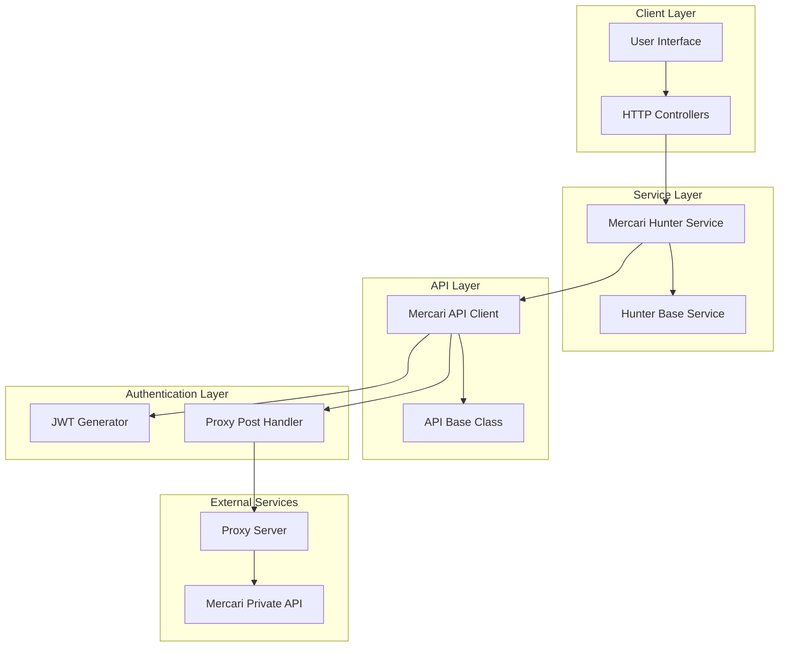
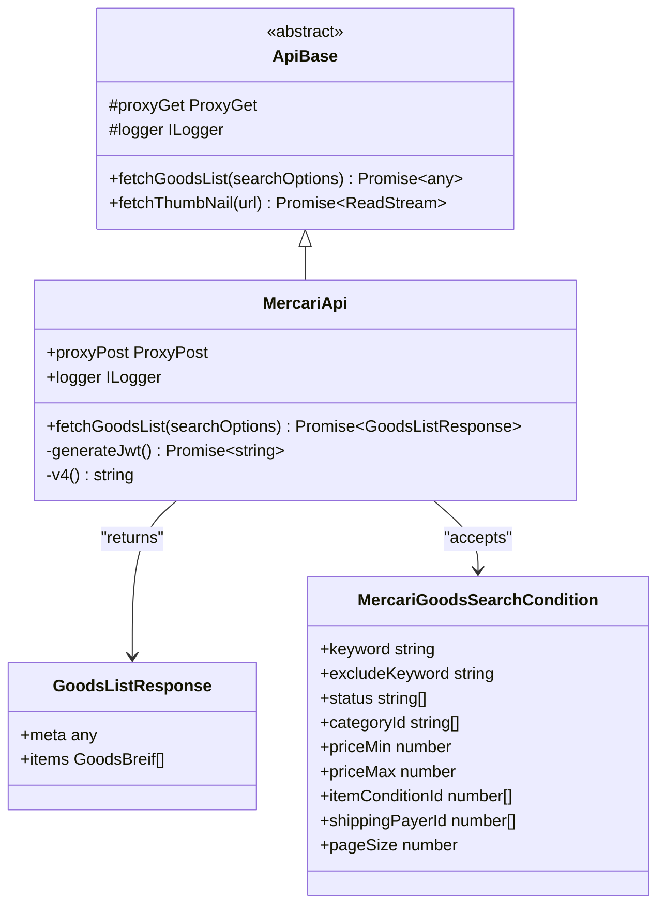
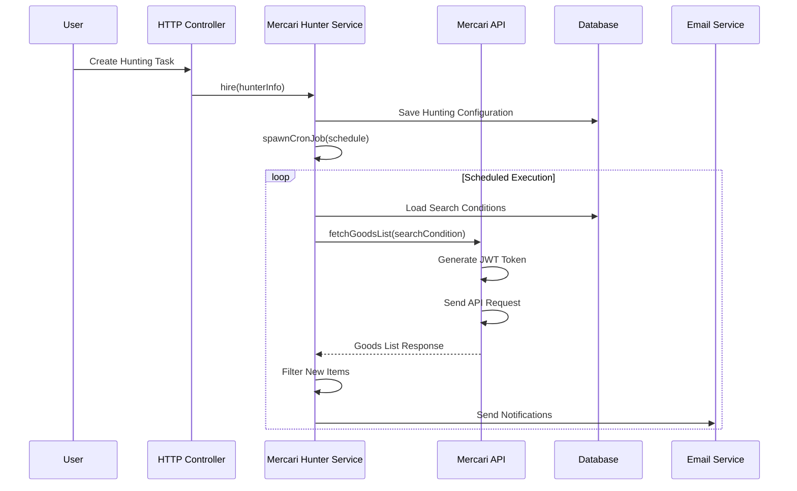
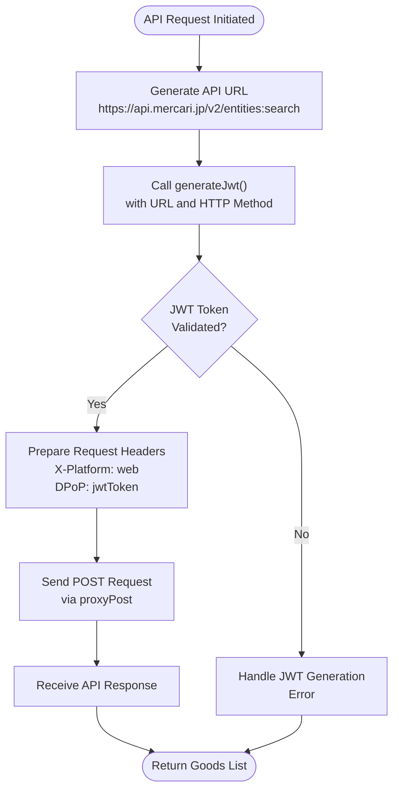
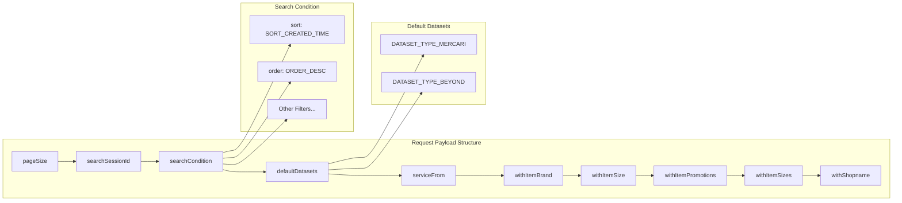
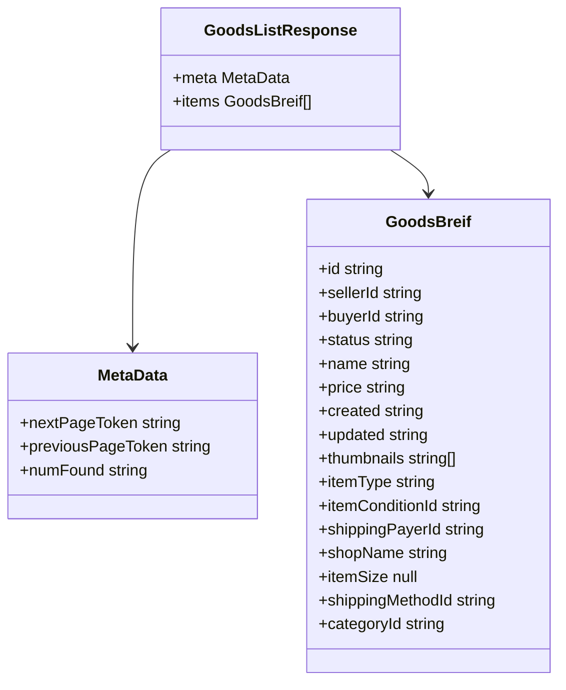
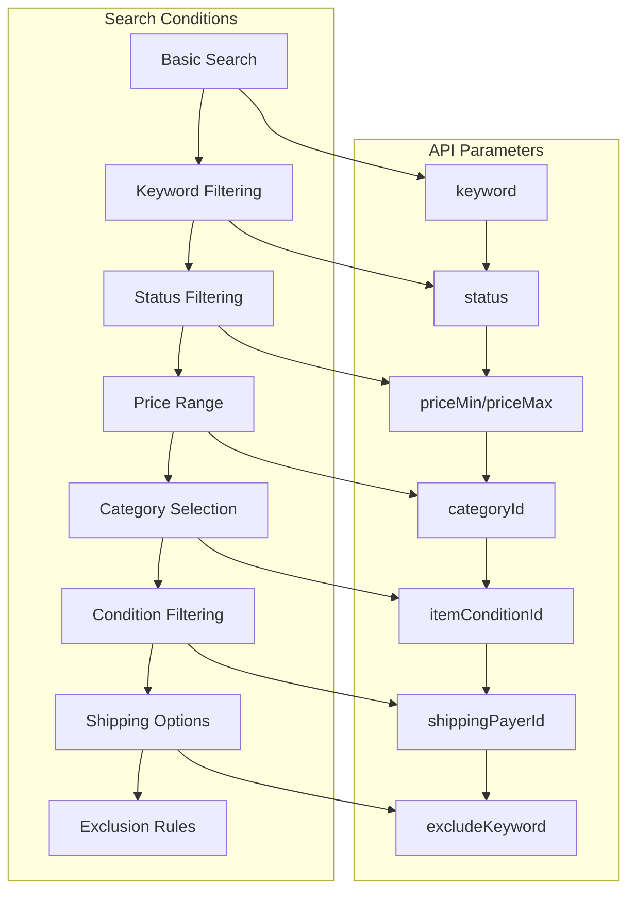
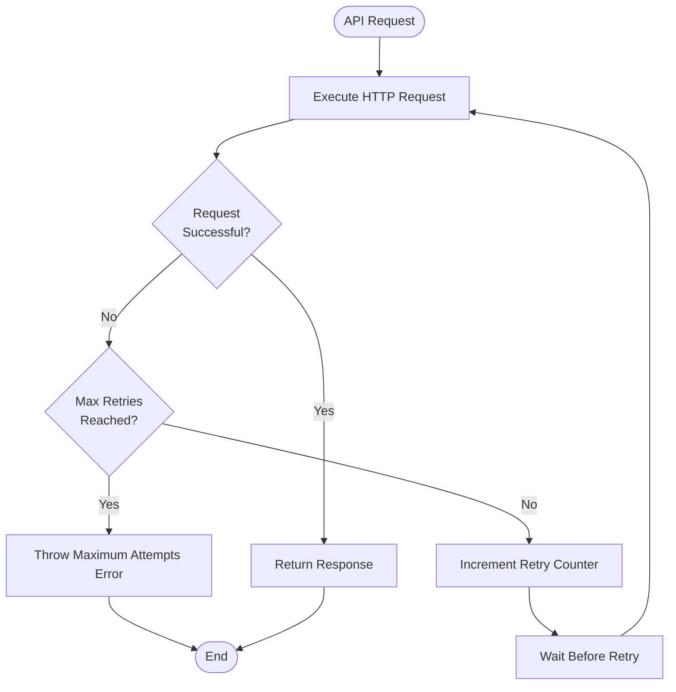
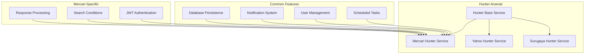
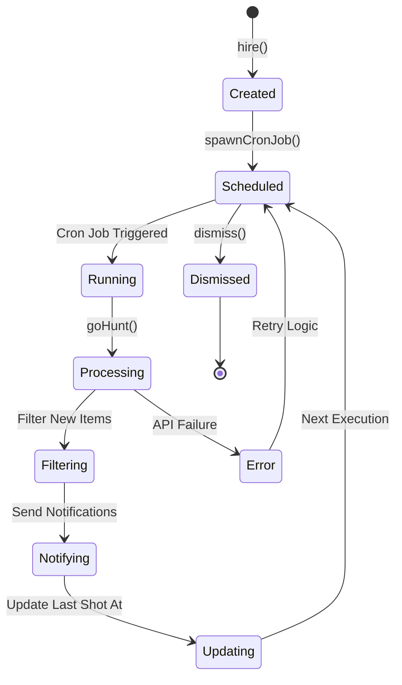

# Mercari Integration

<cite>
**Referenced Files in This Document**
- [src/api/site/mercari/index.ts](file://src/api/site/mercari/index.ts)
- [src/api/site/mercari/types.ts](file://src/api/site/mercari/types.ts)
- [src/api/site/mercari/mock/goodsList.json](file://src/api/site/mercari/mock/goodsList.json)
- [src/service/hunterArsenal/mercari.ts](file://src/service/hunterArsenal/mercari.ts)
- [src/api/site/base.ts](file://src/api/site/base.ts)
- [src/api/request/index.ts](file://src/api/request/index.ts)
- [src/model/mercariHunter.ts](file://src/model/mercariHunter.ts)
- [src/service/hunterArsenal/base.ts](file://src/service/hunterArsenal/base.ts)
- [src/utils/doThisUntilResolve.ts](file://src/utils/doThisUntilResolve.ts)
- [src/const.ts](file://src/const.ts)
- [src/api/const.ts](file://src/api/const.ts)
- [src/api/site/types.ts](file://src/api/site/types.ts)
- [src/types.ts](file://src/types.ts)
</cite>

## Table of Contents
1. [Introduction](#introduction)
2. [System Architecture](#system-architecture)
3. [Core Components](#core-components)
4. [JWT Authentication Implementation](#jwt-authentication-implementation)
5. [API Request Structure](#api-request-structure)
6. [Response Handling](#response-handling)
7. [Search Condition Mapping](#search-condition-mapping)
8. [Error Handling and Retry Logic](#error-handling-and-retry-logic)
9. [Integration with Hunter Arsenal](#integration-with-hunter-arsenal)
10. [Scheduled Monitoring Tasks](#scheduled-monitoring-tasks)
11. [Troubleshooting Guide](#troubleshooting-guide)
12. [Best Practices](#best-practices)

## Introduction

The Mercari integration serves as a critical component of the goods hunting system, enabling automated monitoring and notification of new listings on Mercari's marketplace. This integration extends the `ApiBase` class to interact with Mercari's private API endpoint (`https://api.mercari.jp/v2/entities:search`) using JWT authentication and sophisticated search capabilities.

The system operates as part of a larger hunter arsenal that manages multiple marketplace integrations, providing real-time notifications for users interested in specific product categories and keywords. The implementation emphasizes reliability through robust error handling, retry mechanisms, and scheduled monitoring tasks.

## System Architecture

The Mercari integration follows a layered architecture pattern that separates concerns between API communication, authentication, data processing, and business logic.

**Diagram sources**
- [src/service/hunterArsenal/mercari.ts](file://src/service/hunterArsenal/mercari.ts#L18-L339)
- [src/api/site/mercari/index.ts](file://src/api/site/mercari/index.ts#L13-L51)
- [src/api/site/base.ts](file://src/api/site/base.ts#L8-L33)

## Core Components

### MercariApi Class

The `MercariApi` class serves as the primary interface for interacting with Mercari's API, extending the `ApiBase` class to inherit common functionality while implementing Mercari-specific features.

**Diagram sources**
- [src/api/site/mercari/index.ts](file://src/api/site/mercari/index.ts#L13-L51)
- [src/api/site/mercari/types.ts](file://src/api/site/mercari/types.ts#L1-L42)
- [src/api/site/base.ts](file://src/api/site/base.ts#L8-L33)

**Section sources**
- [src/api/site/mercari/index.ts](file://src/api/site/mercari/index.ts#L13-L51)
- [src/api/site/base.ts](file://src/api/site/base.ts#L8-L33)

### Hunter Arsenal Service

The `MercariHunterService` class orchestrates the complete hunting workflow, managing scheduled tasks, user preferences, and notification delivery.

**Diagram sources**
- [src/service/hunterArsenal/mercari.ts](file://src/service/hunterArsenal/mercari.ts#L66-L233)
- [src/api/site/mercari/index.ts](file://src/api/site/mercari/index.ts#L21-L47)

**Section sources**
- [src/service/hunterArsenal/mercari.ts](file://src/service/hunterArsenal/mercari.ts#L23-L339)

## JWT Authentication Implementation

The Mercari integration utilizes JWT (JSON Web Token) authentication through the `generateJwt` library to authenticate requests to Mercari's private API. This implementation ensures secure communication with Mercari's servers.

### JWT Generation Process

The JWT generation occurs within the `fetchGoodsList` method, utilizing the `generateJwt` function to create authentication tokens for API requests.

**Diagram sources**
- [src/api/site/mercari/index.ts](file://src/api/site/mercari/index.ts#L22-L23)

The JWT generation process involves:
- **URL Specification**: Using the Mercari search API endpoint
- **HTTP Method**: Specifying "POST" as the request method
- **Token Validation**: Ensuring the generated JWT is valid before use
- **Header Preparation**: Including the JWT in the DPoP header field

**Section sources**
- [src/api/site/mercari/index.ts](file://src/api/site/mercari/index.ts#L22-L23)

## API Request Structure

The Mercari API requests follow a structured format that includes specific headers, payload fields, and configuration options tailored for Mercari's search functionality.

### Request Headers

The API requests utilize two critical headers for authentication and platform identification:

| Header | Value | Purpose |
|--------|-------|---------|
| `X-Platform` | `"web"` | Identifies the request origin as a web client |
| `DPoP` | `jwtToken` | Contains the generated JWT for authentication |

### Payload Structure

The request payload contains multiple configuration sections that define search parameters and response options:

**Diagram sources**
- [src/api/site/mercari/index.ts](file://src/api/site/mercari/index.ts#L25-L46)

### Key Payload Fields

| Field | Type | Description | Default Value |
|-------|------|-------------|---------------|
| `pageSize` | number | Number of results per page | 20 |
| `searchSessionId` | string | Unique session identifier | UUID v4 |
| `sort` | string | Sorting criteria | `"SORT_CREATED_TIME"` |
| `order` | string | Sort direction | `"ORDER_DESC"` |
| `serviceFrom` | string | Source service identifier | `"suruga"` |
| `withItemBrand` | boolean | Include brand information | `true` |
| `withItemPromotions` | boolean | Include promotional data | `true` |

**Section sources**
- [src/api/site/mercari/index.ts](file://src/api/site/mercari/index.ts#L25-L46)

## Response Handling

The Mercari integration processes API responses through a structured `GoodsListResponse` type that extracts relevant information for further processing.

### Response Structure

**Diagram sources**
- [src/api/site/mercari/types.ts](file://src/api/site/mercari/types.ts#L4-L28)

### Mock Data Analysis

The mock data demonstrates typical Mercari API response patterns with various item types and conditions:

**Sample Item Structure**:
- **ID**: Unique identifier (e.g., "m17062751809")
- **Status**: Listing status (e.g., "ITEM_STATUS_ON_SALE")
- **Price**: String representation of price
- **Thumbnails**: Array of image URLs
- **Category**: Product category ID
- **Seller Information**: Seller ID and shop name

**Section sources**
- [src/api/site/mercari/types.ts](file://src/api/site/mercari/types.ts#L4-L28)
- [src/api/site/mercari/mock/goodsList.json](file://src/api/site/mercari/mock/goodsList.json#L1-L800)

## Search Condition Mapping

The Mercari integration maps user-defined search conditions to Mercari's API parameters through the `MercariGoodsSearchCondition` interface.

### Search Condition Types

**Diagram sources**
- [src/api/site/mercari/types.ts](file://src/api/site/mercari/types.ts#L30-L38)
- [src/api/site/types.ts](file://src/api/site/types.ts#L5-L9)

### Status Values

The system supports filtering by item status through the following values:
- `"STATUS_ON_SALE"`: Items currently available for purchase
- `"STATUS_TRADING"`: Items currently being traded
- `"STATUS_SOLD_OUT"`: Items that have been sold

### Price and Category Filtering

Search conditions support:
- **Price Range**: Minimum and maximum price filters
- **Category Selection**: Array of category IDs for targeted searches
- **Condition Filtering**: Item condition preferences
- **Shipping Options**: Shipping payer preferences

**Section sources**
- [src/api/site/mercari/types.ts](file://src/api/site/mercari/types.ts#L30-L38)
- [src/api/site/types.ts](file://src/api/site/types.ts#L5-L9)

## Error Handling and Retry Logic

The Mercari integration implements comprehensive error handling and retry mechanisms to ensure reliable operation under various network and API conditions.

### Retry Mechanism Implementation

**Diagram sources**
- [src/utils/doThisUntilResolve.ts](file://src/utils/doThisUntilResolve.ts#L1-L18)

### Error Handling Strategies

The system employs multiple error handling strategies:

1. **Request-Level Retry**: Automatic retry with exponential backoff
2. **Validation Checks**: Input validation before API calls
3. **Graceful Degradation**: Continue operation despite individual failures
4. **Logging and Monitoring**: Comprehensive error logging for debugging

### Retry Configuration

| Parameter | Value | Purpose |
|-----------|-------|---------|
| Max Retries | 5 (POST requests) | Maximum retry attempts |
| Timeout | 5 seconds | Request timeout threshold |
| Break Condition | Custom | Early termination conditions |

**Section sources**
- [src/api/request/index.ts](file://src/api/request/index.ts#L57-L64)
- [src/utils/doThisUntilResolve.ts](file://src/utils/doThisUntilResolve.ts#L1-L18)

## Integration with Hunter Arsenal

The Mercari integration seamlessly integrates with the broader hunter arsenal service, providing coordinated monitoring across multiple marketplace platforms.

### Service Coordination

**Diagram sources**
- [src/service/hunterArsenal/base.ts](file://src/service/hunterArsenal/base.ts#L16-L88)
- [src/service/hunterArsenal/mercari.ts](file://src/service/hunterArsenal/mercari.ts#L23-L339)

### Database Integration

The system maintains persistent storage of hunting configurations through the `MercariHunter` model, which tracks:
- **User Associations**: Link to user accounts
- **Search Preferences**: Stored search conditions
- **Execution History**: Last successful execution timestamps
- **Freezing Periods**: Maintenance windows for the service

**Section sources**
- [src/service/hunterArsenal/mercari.ts](file://src/service/hunterArsenal/mercari.ts#L23-L339)
- [src/model/mercariHunter.ts](file://src/model/mercariHunter.ts#L1-L42)

## Scheduled Monitoring Tasks

The Mercari integration operates through a sophisticated scheduling system that enables periodic monitoring of marketplace listings.

### Task Lifecycle Management

**Diagram sources**
- [src/service/hunterArsenal/mercari.ts](file://src/service/hunterArsenal/mercari.ts#L306-L328)

### Cron Job Management

The system supports dynamic cron job management with the following capabilities:
- **Creation**: New hunting tasks with custom schedules
- **Modification**: Real-time updates to existing tasks
- **Suspension**: Temporary freezing during maintenance periods
- **Termination**: Graceful shutdown of tasks

### Task Configuration

Each hunting task maintains comprehensive configuration:
- **Schedule**: Cron expression for timing
- **Search Conditions**: Complete search parameter set
- **Freezing Range**: Maintenance window specifications
- **Execution History**: Timestamp tracking

**Section sources**
- [src/service/hunterArsenal/mercari.ts](file://src/service/hunterArsenal/mercari.ts#L306-L339)

## Troubleshooting Guide

This section provides comprehensive guidance for diagnosing and resolving common issues with the Mercari integration.

### Common Issues and Solutions

#### JWT Expiration Issues

**Symptoms**: Authentication failures, 401 Unauthorized responses
**Causes**: Expired JWT tokens, incorrect token generation
**Solutions**:
- Verify JWT generation library version
- Check token validity duration
- Implement token refresh mechanism

#### Rate Limiting Problems

**Symptoms**: 429 Too Many Requests responses
**Causes**: Excessive API calls within time limits
**Solutions**:
- Implement request throttling
- Add exponential backoff
- Monitor API usage patterns

#### API Response Changes

**Symptoms**: Parsing errors, missing data fields
**Causes**: API schema modifications by Mercari
**Solutions**:
- Implement flexible response parsing
- Add schema validation
- Maintain mock data for testing

#### Network Connectivity Issues

**Symptoms**: Timeout errors, connection failures
**Causes**: Proxy configuration, network instability
**Solutions**:
- Verify proxy server connectivity
- Implement circuit breaker pattern
- Add health check endpoints

### Debugging Procedures

#### Enable Debug Logging

Configure logging levels to capture detailed execution traces:
- **API Calls**: Request/response logging
- **Authentication**: JWT generation and validation
- **Error Handling**: Exception stack traces
- **Performance**: Timing metrics

#### Test with Mock Data

Utilize the provided mock data to validate response processing:
- Verify data structure parsing
- Test filtering logic
- Validate notification generation

#### Monitor Resource Usage

Track system resources during operation:
- Memory consumption during large responses
- CPU usage during processing
- Network bandwidth utilization

**Section sources**
- [src/api/site/mercari/index.ts](file://src/api/site/mercari/index.ts#L21-L47)
- [src/service/hunterArsenal/mercari.ts](file://src/service/hunterArsenal/mercari.ts#L132-L140)

## Best Practices

### Security Considerations

1. **JWT Management**: Secure storage and rotation of authentication tokens
2. **Proxy Configuration**: Proper proxy server setup for API communication
3. **Rate Limiting**: Respect API rate limits to avoid service disruption
4. **Input Validation**: Thorough validation of search parameters

### Performance Optimization

1. **Connection Pooling**: Reuse HTTP connections for multiple requests
2. **Caching Strategy**: Implement intelligent caching for frequently accessed data
3. **Batch Processing**: Process multiple items efficiently
4. **Resource Cleanup**: Proper cleanup of temporary resources

### Monitoring and Maintenance

1. **Health Checks**: Regular monitoring of service availability
2. **Error Tracking**: Comprehensive error logging and alerting
3. **Performance Metrics**: Track response times and success rates
4. **Documentation Updates**: Keep integration documentation current

### Scalability Planning

1. **Horizontal Scaling**: Design for multiple concurrent instances
2. **Load Distribution**: Implement load balancing for high-volume scenarios
3. **Resource Allocation**: Optimize memory and CPU usage
4. **Capacity Planning**: Monitor growth patterns and scale accordingly