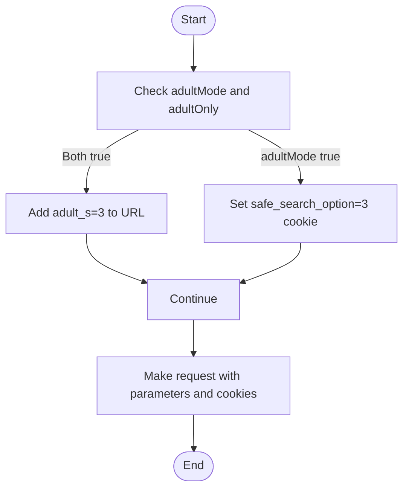

# Surugaya Integration

<cite>
**Referenced Files in This Document**   
- [src/api/site/surugaya/index.ts](file://src/api/site/surugaya/index.ts)
- [src/api/site/surugaya/types.ts](file://src/api/site/surugaya/types.ts)
- [src/api/site/base.ts](file://src/api/site/base.ts)
- [src/api/site/surugaya/mock/goodsList.html](file://src/api/site/surugaya/mock/goodsList.html)
- [src/api/request/index.ts](file://src/api/request/index.ts)
</cite>

## Table of Contents
1. [Introduction](#introduction)
2. [Architecture Overview](#architecture-overview)
3. [Core Components](#core-components)
4. [Detailed Component Analysis](#detailed-component-analysis)
5. [Data Extraction and Parsing](#data-extraction-and-parsing)
6. [Pagination and Retry Mechanisms](#pagination-and-retry-mechanisms)
7. [Adult Content Filtering](#adult-content-filtering)
8. [Performance Considerations](#performance-considerations)
9. [Best Practices](#best-practices)

## Introduction
The Surugaya integration implementation provides a robust web scraping solution for extracting product data from the Surugaya e-commerce platform. This document details the technical architecture and implementation specifics of the SurugayaApi class, which extends the ApiBase class to perform web scraping operations through a proxy service. The implementation focuses on extracting product information from HTML search results using JSDOM for DOM parsing and manipulation.

**Section sources**
- [src/api/site/surugaya/index.ts](file://src/api/site/surugaya/index.ts#L1-L123)

## Architecture Overview
The Surugaya integration follows a layered architecture pattern where the SurugayaApi class extends the base ApiBase class, inheriting core functionality while implementing site-specific scraping logic. The architecture leverages dependency injection for the proxyGet service, which handles HTTP requests through a proxy server, and utilizes JSDOM for server-side DOM parsing of HTML responses.

**Diagram sources**
- [src/api/site/base.ts](file://src/api/site/base.ts#L10-L28)
- [src/api/site/surugaya/index.ts](file://src/api/site/surugaya/index.ts#L11-L13)
- [src/api/request/index.ts](file://src/api/request/index.ts#L12-L18)

## Core Components
The core components of the Surugaya integration include the SurugayaApi class, which implements the fetchGoodsList method to retrieve and parse product data from Surugaya's search results. The implementation extends ApiBase, inheriting proxy request capabilities and logging functionality. The system uses JSDOM to parse HTML responses and extract product information using CSS selectors.

**Section sources**
- [src/api/site/surugaya/index.ts](file://src/api/site/surugaya/index.ts#L11-L123)
- [src/api/site/base.ts](file://src/api/site/base.ts#L10-L28)

## Detailed Component Analysis

### SurugayaApi Implementation
The SurugayaApi class implements the fetchGoodsList method to retrieve product data from Surugaya's search results. The implementation constructs search URLs with dynamic parameters including keyword, category, pagination (epoch), and adult content filtering options.

**Diagram sources**
- [src/api/site/surugaya/index.ts](file://src/api/site/surugaya/index.ts#L18-L113)

### Search URL Construction
The implementation constructs search URLs with dynamic parameters based on the provided search options. The URL construction includes base parameters such as category, search keyword, marketplace status, and sorting criteria, with additional parameters for pagination and adult content filtering.

**Diagram sources**
- [src/api/site/surugaya/index.ts](file://src/api/site/surugaya/index.ts#L24-L63)

## Data Extraction and Parsing
The data extraction process uses JSDOM to parse HTML responses and extract product information from specific CSS selectors. The implementation targets the #search_result .item_box .item selector to identify individual product items and extracts key information including title, price, thumbnail URL, and marketplace price.

**Diagram sources**
- [src/api/site/surugaya/types.ts](file://src/api/site/surugaya/types.ts#L5-L11)
- [src/api/site/surugaya/index.ts](file://src/api/site/surugaya/index.ts#L95-L108)

The parsing logic in the mock goodsList.html file confirms the accuracy of the CSS selectors used in the implementation. The HTML structure shows product items within the #search_result container with the .item_box .item structure, validating the selector approach used in the code.

**Section sources**
- [src/api/site/surugaya/index.ts](file://src/api/site/surugaya/index.ts#L93-L108)
- [src/api/site/surugaya/mock/goodsList.html](file://src/api/site/surugaya/mock/goodsList.html#L1058-L1200)

## Pagination and Retry Mechanisms
The implementation includes robust pagination and retry mechanisms to handle multi-page scraping and partial failures. The system creates multiple URLs for pagination based on the epoch parameter and uses a retry mechanism with breakOnCondition to handle partial failures.

**Diagram sources**
- [src/api/site/surugaya/index.ts](file://src/api/site/surugaya/index.ts#L48-L113)

## Adult Content Filtering
The implementation includes adult content filtering using both URL parameters and cookies. When adultMode and adultOnly are enabled, the system adds the adult_s=3 parameter to the search URL and sets the safe_search_option=3 cookie in the request headers.

**Diagram sources**
- [src/api/site/surugaya/index.ts](file://src/api/site/surugaya/index.ts#L44-L46)
- [src/api/site/surugaya/index.ts](file://src/api/site/surugaya/index.ts#L75-L76)

## Performance Considerations
The implementation faces several performance considerations related to HTML structure volatility, bot detection, and concurrent DOM parsing. The use of JSDOM for parsing large HTML responses can be resource-intensive, and the system must handle potential rate limiting and bot detection mechanisms employed by the Surugaya website.

The concurrent processing of multiple pages using Promise.all can lead to increased memory usage and potential performance bottlenecks. The retry mechanism with a configurable maxRetry count helps mitigate transient failures but may increase overall execution time.

**Section sources**
- [src/api/site/surugaya/index.ts](file://src/api/site/surugaya/index.ts#L67-L86)

## Best Practices
To maintain selector robustness and adapt to site layout changes, the following best practices are recommended:

1. **Selector Validation**: Regularly validate CSS selectors against the target website to ensure they continue to match the expected elements.
2. **Error Handling**: Implement comprehensive error handling for cases where expected elements are not found in the HTML.
3. **Rate Limiting**: Respect rate limits and implement appropriate delays between requests to avoid being blocked.
4. **Selector Fallbacks**: Implement fallback selectors for critical data points to handle minor layout changes.
5. **Monitoring**: Monitor the scraping process for failures and adjust selectors as needed when site layouts change.

The implementation should also consider adding additional validation for extracted data and implementing more sophisticated error recovery mechanisms to handle partial failures gracefully.

**Section sources**
- [src/api/site/surugaya/index.ts](file://src/api/site/surugaya/index.ts#L93-L108)
- [src/api/site/surugaya/mock/goodsList.html](file://src/api/site/surugaya/mock/goodsList.html#L1058-L1200)