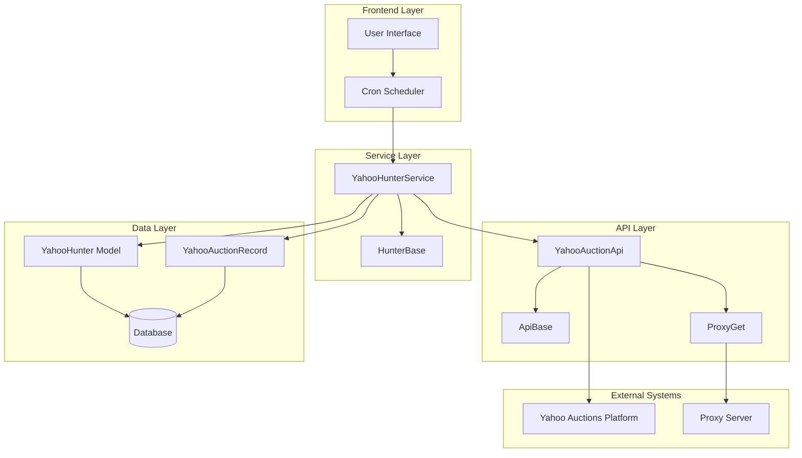
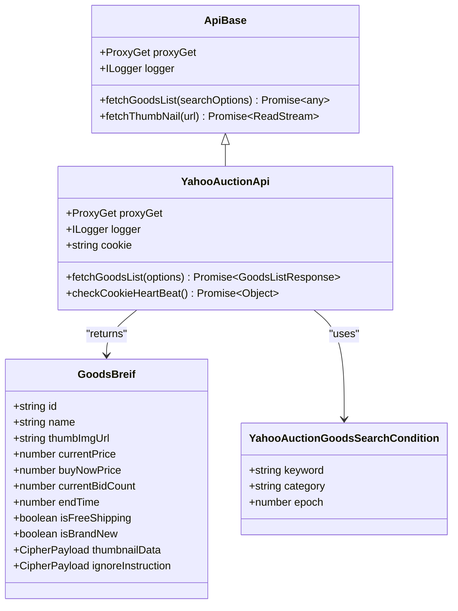
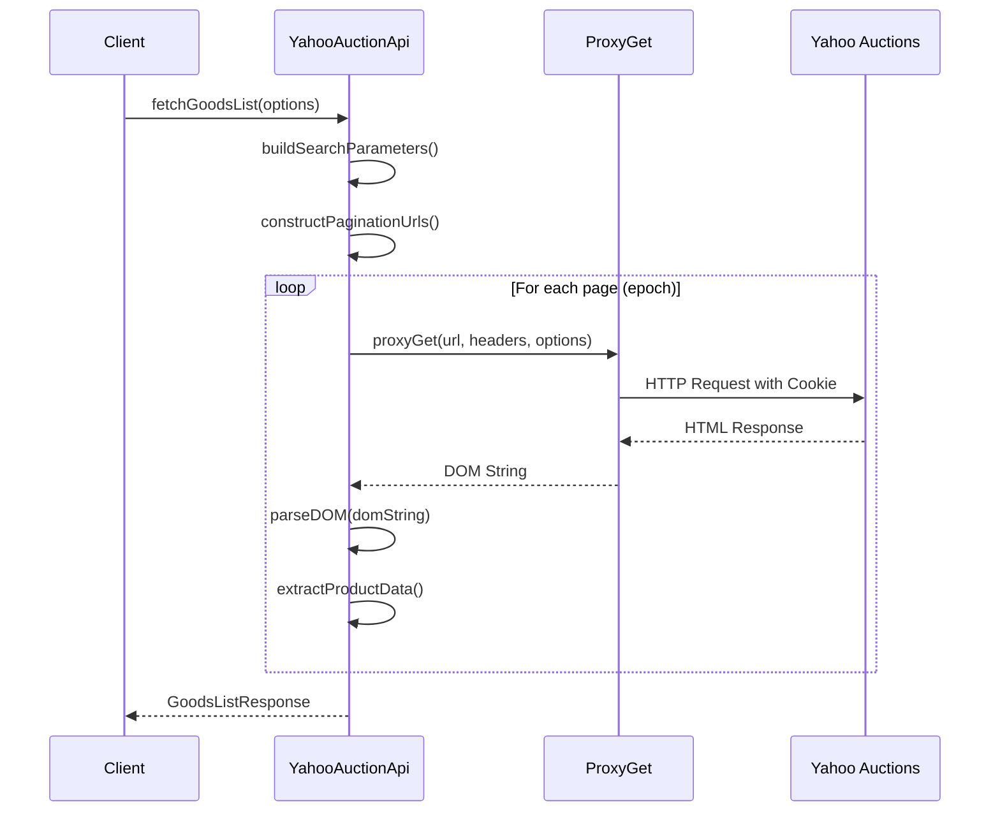
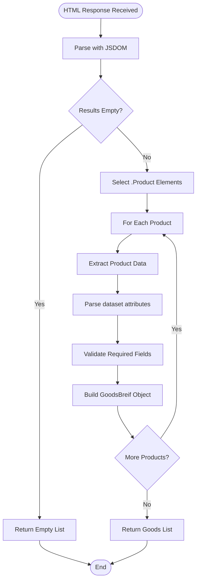
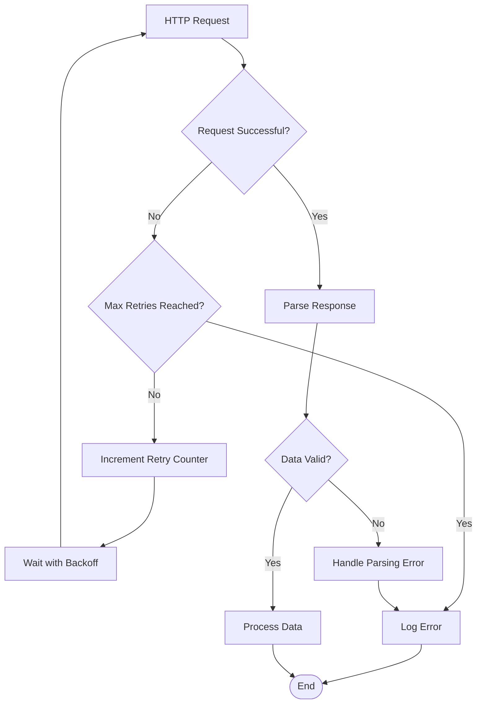
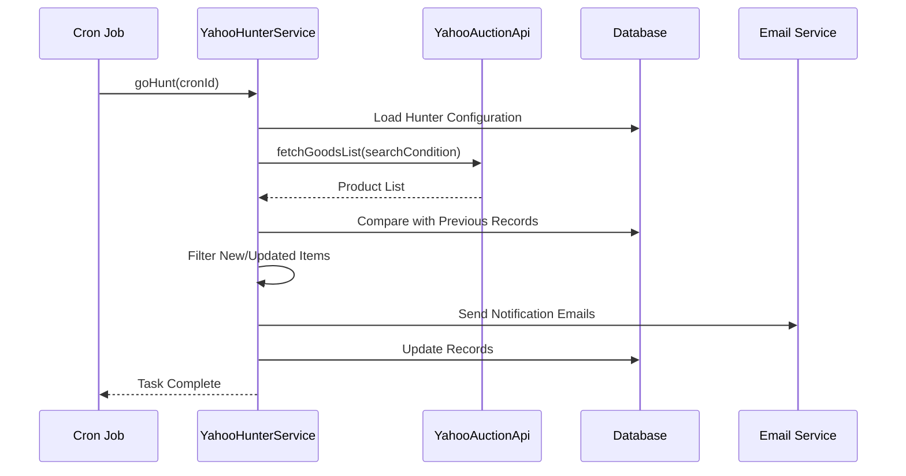

# Yahoo Auctions Integration

<cite>
**Referenced Files in This Document**
- [src/api/site/yahoo/index.ts](file://src/api/site/yahoo/index.ts)
- [src/api/site/yahoo/types.ts](file://src/api/site/yahoo/types.ts)
- [src/api/site/yahoo/mock/goodsList.html](file://src/api/site/yahoo/mock/goodsList.html)
- [src/api/site/base.ts](file://src/api/site/base.ts)
- [src/api/site/types.ts](file://src/api/site/types.ts)
- [src/model/yahooHunter.ts](file://src/model/yahooHunter.ts)
- [src/model/yahooAuctionRecord.ts](file://src/model/yahooAuctionRecord.ts)
- [src/service/hunterArsenal/yahoo.ts](file://src/service/hunterArsenal/yahoo.ts)
- [src/api/request/index.ts](file://src/api/request/index.ts)
- [src/utils/doThisUntilResolve.ts](file://src/utils/doThisUntilResolve.ts)
- [src/config/config.default.ts](file://src/config/config.default.ts)
</cite>

## Table of Contents
1. [Introduction](#introduction)
2. [Architecture Overview](#architecture-overview)
3. [Core Components](#core-components)
4. [YahooApi Implementation](#yahooapi-implementation)
5. [Data Extraction and Parsing](#data-extraction-and-parsing)
6. [Error Handling and Retry Strategies](#error-handling-and-retry-strategies)
7. [Integration with Cron System](#integration-with-cron-system)
8. [Site-Specific Challenges](#site-specific-challenges)
9. [Debugging and Maintenance](#debuging-and-maintenance)
10. [Best Practices](#best-practices)

## Introduction

The Yahoo Auctions integration is a sophisticated web scraping system designed to monitor and track product listings on Japan's Yahoo Auctions platform. Built as part of the Goods Hunter system, it extends the `ApiBase` class to provide specialized functionality for extracting auction data using proxy-based requests and DOM manipulation.

This integration handles the complexities of scraping a dynamic Japanese e-commerce platform while implementing robust error handling, retry mechanisms, and anti-detection measures to maintain reliable operation over extended periods.

## Architecture Overview

The Yahoo Auctions integration follows a layered architecture that separates concerns between API communication, data extraction, and task scheduling:

**Diagram sources**
- [src/service/hunterArsenal/yahoo.ts](file://src/service/hunterArsenal/yahoo.ts#L1-L50)
- [src/api/site/yahoo/index.ts](file://src/api/site/yahoo/index.ts#L1-L30)
- [src/api/site/base.ts](file://src/api/site/base.ts#L1-L33)

## Core Components

### YahooAuctionApi Class

The `YahooAuctionApi` class serves as the primary interface for interacting with Yahoo Auctions, extending the `ApiBase` class to inherit common functionality while implementing Yahoo-specific scraping logic.

**Diagram sources**
- [src/api/site/base.ts](file://src/api/site/base.ts#L8-L33)
- [src/api/site/yahoo/index.ts](file://src/api/site/yahoo/index.ts#L11-L181)
- [src/api/site/yahoo/types.ts](file://src/api/site/yahoo/types.ts#L3-L26)

**Section sources**
- [src/api/site/yahoo/index.ts](file://src/api/site/yahoo/index.ts#L11-L181)
- [src/api/site/base.ts](file://src/api/site/base.ts#L8-L33)

### YahooHunter Model

The `YahooHunter` model represents the persistent storage for monitoring tasks, maintaining search conditions and scheduling information.

**Section sources**
- [src/model/yahooHunter.ts](file://src/model/yahooHunter.ts#L1-L43)

### YahooAuctionRecord Model

The `YahooAuctionRecord` model stores historical auction data for comparison and notification purposes.

**Section sources**
- [src/model/yahooAuctionRecord.ts](file://src/model/yahooAuctionRecord.ts#L1-L32)

## YahooApi Implementation

### URL Construction and Search Parameters

The YahooAuctionApi constructs search URLs dynamically based on provided search conditions, implementing pagination support through epoch-based page iteration.

**Diagram sources**
- [src/api/site/yahoo/index.ts](file://src/api/site/yahoo/index.ts#L23-L155)
- [src/api/request/index.ts](file://src/api/request/index.ts#L19-L36)

The search parameters include essential filters for Japanese market compliance:
- Postal shipping enabled (`is_postage_mode=1`)
- Tokyo Prefecture destination (`dest_pref_code=13`)
- Exclude non-auction items (`exflg=1`)
- New items only (`s1=new`)
- Descending price order (`o1=d`)
- Category filtering support

**Section sources**
- [src/api/site/yahoo/index.ts](file://src/api/site/yahoo/index.ts#L29-L74)

### ProxyGet Implementation

The integration utilizes a sophisticated proxy system for request obfuscation and reliability:

**Section sources**
- [src/api/request/index.ts](file://src/api/request/index.ts#L19-L36)

## Data Extraction and Parsing

### DOM Traversal and Selector Patterns

The YahooAuctionApi employs JSDOM for server-side DOM manipulation, targeting specific CSS selectors to extract product information:

**Diagram sources**
- [src/api/site/yahoo/index.ts](file://src/api/site/yahoo/index.ts#L101-L151)

### Key Selector Patterns

The implementation targets specific DOM elements using carefully chosen CSS selectors:

| Selector Pattern | Purpose | Data Extracted |
|------------------|---------|----------------|
| `.Result__body .Products .Notice` | Empty results detection | "一致する商品はありません" text |
| `.Result__body .Products__items .Product` | Product list container | Individual product elements |
| `.Product__detail .Product__bonus` | Auction metadata | Buy-now price, end time, category |
| `.Product__detail .Product__titleLink` | Product identification | Title, image URL, auction ID |
| `.Product__detail .Product__otherInfo .Product__bidWrap .Product__bid` | Bid information | Current bid count |
| `.Product__detail .Product__icons .Product__icon--unused` | Brand new indicator | New/unused item flag |

**Section sources**
- [src/api/site/yahoo/index.ts](file://src/api/site/yahoo/index.ts#L103-L151)

### Data Field Extraction

The extraction process transforms raw DOM data into structured product information:

**Section sources**
- [src/api/site/yahoo/index.ts](file://src/api/site/yahoo/index.ts#L109-L150)

## Error Handling and Retry Strategies

### Network Failure Recovery

The integration implements comprehensive error handling through multiple layers:

**Diagram sources**
- [src/utils/doThisUntilResolve.ts](file://src/utils/doThisUntilResolve.ts#L1-L18)
- [src/api/request/index.ts](file://src/api/request/index.ts#L28-L35)

### Retry Configuration

The system implements exponential backoff with configurable retry limits:

**Section sources**
- [src/api/request/index.ts](file://src/api/request/index.ts#L28-L35)
- [src/utils/doThisUntilResolve.ts](file://src/utils/doThisUntilResolve.ts#L1-L18)

### Cookie Validation

The `checkCookieHeartBeat` method ensures session validity through periodic health checks:

**Section sources**
- [src/api/site/yahoo/index.ts](file://src/api/site/yahoo/index.ts#L159-L174)

## Integration with Cron System

### Task Scheduling Architecture

The YahooHunterService integrates with a cron-based monitoring system for automated data collection:

**Diagram sources**
- [src/service/hunterArsenal/yahoo.ts](file://src/service/hunterArsenal/yahoo.ts#L123-L255)

### Task Lifecycle Management

The service manages the complete lifecycle of monitoring tasks:

**Section sources**
- [src/service/hunterArsenal/yahoo.ts](file://src/service/hunterArsenal/yahoo.ts#L61-L85)
- [src/service/hunterArsenal/yahoo.ts](file://src/service/hunterArsenal/yahoo.ts#L123-L255)

## Site-Specific Challenges

### Anti-Bot Measures

Yahoo Auctions implements several anti-scraping mechanisms that the integration addresses:

#### Dynamic Content Loading
- **Challenge**: Some product information loads asynchronously
- **Solution**: JSDOM handles static HTML parsing effectively
- **Limitation**: May miss dynamically loaded content

#### Session Management
- **Challenge**: Requires valid cookies for access
- **Solution**: Persistent cookie storage with heartbeat validation
- **Maintenance**: Regular cookie renewal notifications

#### Rate Limiting
- **Challenge**: Multiple concurrent requests may trigger blocks
- **Solution**: Configurable retry delays and proxy rotation
- **Monitoring**: Automatic failure detection and reporting

### Frontend Changes Adaptation

The integration includes mechanisms to handle website structure changes:

**Section sources**
- [src/api/site/yahoo/index.ts](file://src/api/site/yahoo/index.ts#L103-L105)
- [src/api/site/yahoo/mock/goodsList.html](file://src/api/site/yahoo/mock/goodsList.html#L1-L50)

## Debugging and Maintenance

### Selector Debugging

When Yahoo's frontend changes, selectors may become outdated. The system provides several debugging approaches:

#### Mock Data Testing
The integration includes comprehensive mock HTML files for testing selector logic without hitting the live site.

**Section sources**
- [src/api/site/yahoo/mock/goodsList.html](file://src/api/site/yahoo/mock/goodsList.html#L1-L800)

#### Logging and Monitoring
Extensive logging captures request/response cycles and parsing errors for troubleshooting.

**Section sources**
- [src/api/site/yahoo/index.ts](file://src/api/site/yahoo/index.ts#L95-L100)
- [src/service/hunterArsenal/yahoo.ts](file://src/service/hunterArsenal/yahoo.ts#L157-L159)

### Configuration Management

The system maintains Yahoo-specific configurations through centralized configuration files:

**Section sources**
- [src/config/config.default.ts](file://src/config/config.default.ts#L74-L78)

## Best Practices

### Development Guidelines

1. **Selector Robustness**: Use specific CSS selectors that are less likely to change
2. **Graceful Degradation**: Implement fallbacks for missing data fields
3. **Error Boundaries**: Wrap parsing logic in try-catch blocks
4. **Resource Management**: Properly dispose of JSDOM instances
5. **Testing Strategy**: Maintain comprehensive mock data sets

### Operational Considerations

1. **Monitoring**: Implement health checks for cookie validity
2. **Alerting**: Configure notifications for scraping failures
3. **Rate Control**: Respect website terms of service
4. **Data Validation**: Verify extracted data integrity
5. **Backup Strategies**: Maintain data backups for historical analysis

### Security and Privacy

1. **Cookie Protection**: Secure storage of authentication credentials
2. **Data Encryption**: Encrypt sensitive data in transit and at rest
3. **Access Control**: Implement proper authentication for administrative functions
4. **Audit Logging**: Track all system interactions for security analysis

The Yahoo Auctions integration demonstrates sophisticated web scraping capabilities while maintaining reliability and adaptability to changing website structures. Its modular design facilitates maintenance and extension while providing robust error handling and monitoring capabilities essential for production systems.