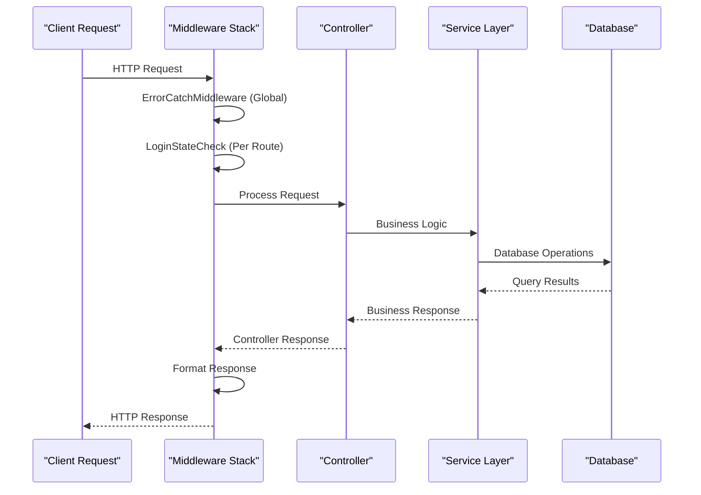
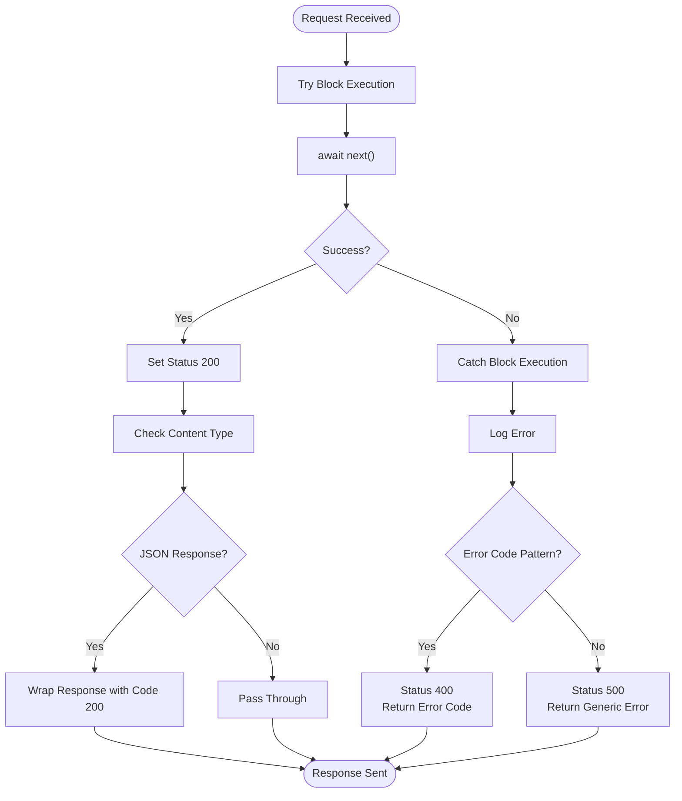
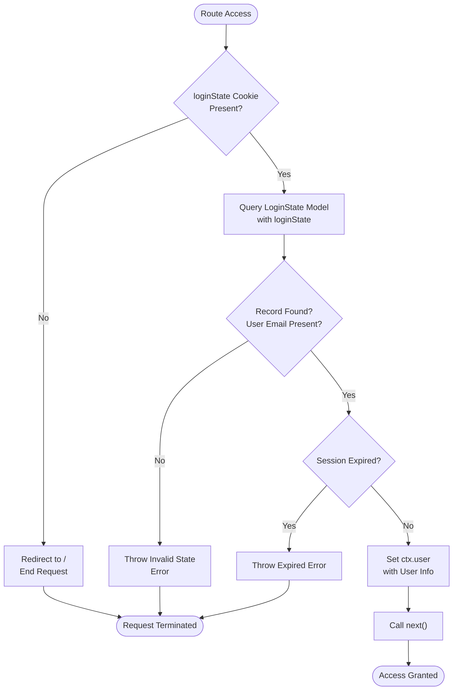
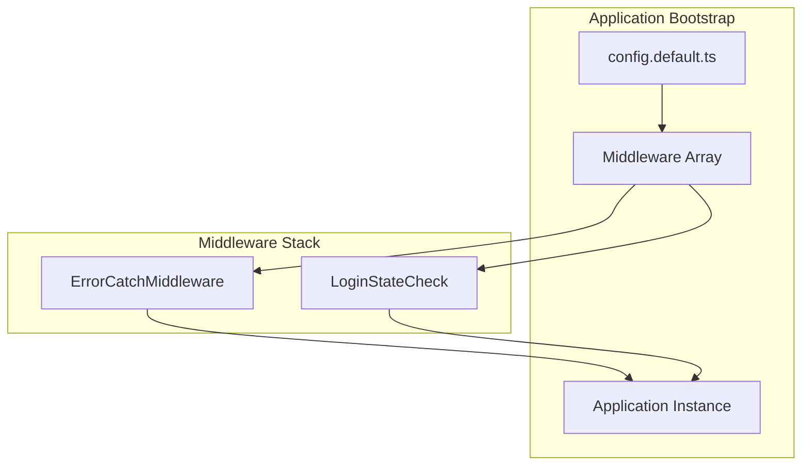
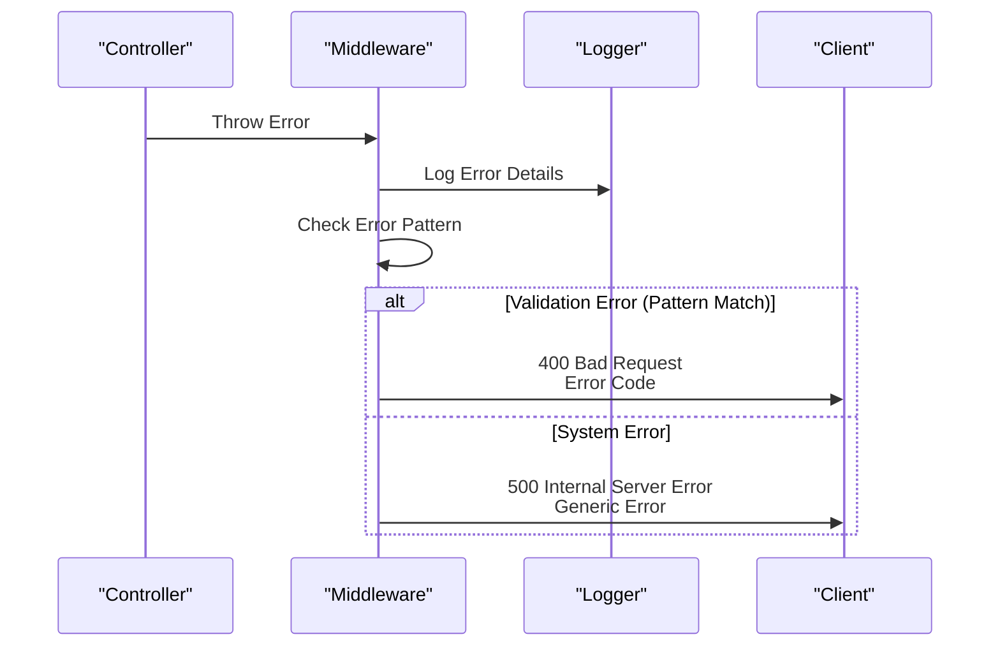

# Middleware & Interceptors

<cite>
**Referenced Files in This Document**
- [errorCatch.ts](file://src/middleware/errorCatch.ts)
- [loginStateCheck.ts](file://src/middleware/loginStateCheck.ts)
- [errorCode.ts](file://src/errorCode.ts)
- [loginState.ts](file://src/model/loginState.ts)
- [config.default.ts](file://src/config/config.default.ts)
- [configuration.ts](file://src/configuration.ts)
- [types.ts](file://src/types.ts)
- [login.ts](file://src/controller/login.ts)
- [register.ts](file://src/controller/register.ts)
- [home.ts](file://src/controller/home.ts)
</cite>

## Table of Contents
1. [Introduction](#introduction)
2. [Midway.js Middleware Architecture](#midwayjs-middleware-architecture)
3. [Error Handling Middleware](#error-handling-middleware)
4. [Authentication Middleware](#authentication-middleware)
5. [Middleware Registration and Configuration](#middleware-registration-and-configuration)
6. [Error Handling Flow](#error-handling-flow)
7. [Authentication Check Process](#authentication-check-process)
8. [Custom Middleware Development](#custom-middleware-development)
9. [Performance and Best Practices](#performance-and-best-practices)
10. [Troubleshooting Guide](#troubleshooting-guide)

## Introduction

The goods_hunter application implements a robust middleware system built on the Midway.js framework, providing essential cross-cutting concerns including error handling, authentication, and request processing. The middleware architecture follows the request lifecycle pattern, intercepting requests at various stages to enforce security policies, handle errors gracefully, and maintain consistent response formats.

The application features two primary middleware components: `ErrorCatchMiddleware` for comprehensive error handling and `LoginStateCheck` for user authentication verification. These middlewares work together to provide a secure, reliable foundation for the application's API endpoints.

## Midway.js Middleware Architecture

Midway.js middleware operates as part of the request lifecycle, intercepting incoming HTTP requests and outgoing responses. The framework provides a structured approach to middleware development through decorators and interfaces that ensure type safety and consistent behavior.



**Diagram sources**
- [errorCatch.ts](file://src/middleware/errorCatch.ts#L14-L47)
- [loginStateCheck.ts](file://src/middleware/loginStateCheck.ts#L25-L49)

The middleware system in Midway.js follows a stack-based execution model where each middleware component can either process the request and call `next()`, modify the request/response, or terminate the request processing chain.

**Section sources**
- [errorCatch.ts](file://src/middleware/errorCatch.ts#L1-L51)
- [loginStateCheck.ts](file://src/middleware/loginStateCheck.ts#L1-L54)

## Error Handling Middleware

The `ErrorCatchMiddleware` serves as the global error handler for the application, intercepting uncaught exceptions and providing standardized error responses. This middleware ensures consistent error reporting and maintains the application's reliability under unexpected conditions.

### Implementation Details

The error catch middleware implements a try-catch pattern around the entire request processing pipeline. It captures both synchronous and asynchronous errors, logs them appropriately, and returns structured error responses based on the error type.



**Diagram sources**
- [errorCatch.ts](file://src/middleware/errorCatch.ts#L15-L46)

### Error Classification and Response Formatting

The middleware implements intelligent error classification based on error message patterns. It distinguishes between client-side errors (validation failures) and server-side errors (unexpected exceptions).

| Error Type | Status Code | Pattern Match | Response Format |
|------------|-------------|---------------|-----------------|
| Validation Error | 400 | `/\\d{6}/` pattern | `{code: errorMessage}` |
| System Exception | 500 | Default case | `{code: "000000", msg: "系统异常"}` |
| Successful Response | 200 | No error | `{code: "200", data: originalBody}` |

### Standardized Response Format

The middleware enforces a consistent response format across all API endpoints, wrapping successful responses with a standardized structure while preserving the original payload data.

**Section sources**
- [errorCatch.ts](file://src/middleware/errorCatch.ts#L14-L47)
- [errorCode.ts](file://src/errorCode.ts#L38-L42)

## Authentication Middleware

The `LoginStateCheck` middleware provides user authentication verification by checking Redis-backed session data against the LoginState model. This middleware protects sensitive routes by ensuring users have valid authentication tokens before granting access.

### Authentication Flow

The authentication middleware implements a multi-stage verification process that validates the presence of authentication cookies, checks their validity against the database, and ensures sessions haven't expired.



**Diagram sources**
- [loginStateCheck.ts](file://src/middleware/loginStateCheck.ts#L26-L49)

### Session Validation Process

The middleware performs comprehensive session validation including cookie presence, database record verification, and expiration date checking. It uses the TypeORM repository pattern to query the LoginState entity with eager loading of associated user data.

### Ignored Routes

The authentication middleware includes a configurable ignore mechanism that allows certain routes to bypass authentication checks. This feature is useful for public endpoints like registration, login, and proxy services.

| Ignored Path | Purpose |
|--------------|---------|
| `/ignoreGood` | Good ignoring functionality |
| `/cancelGoodIgnore` | Cancel good ignoring |
| `/proxy` | Proxy service endpoints |

### User Context Injection

Upon successful authentication, the middleware injects user information into the request context (`ctx.user`), making authenticated user data available to subsequent middleware and controllers.

**Section sources**
- [loginStateCheck.ts](file://src/middleware/loginStateCheck.ts#L21-L49)
- [loginState.ts](file://src/model/loginState.ts#L1-L22)

## Middleware Registration and Configuration

Middleware registration in the goods_hunter application follows Midway.js conventions, with global middleware configured in the application configuration and route-specific middleware handled through controller decorators.

### Global Middleware Configuration

The application configures the `ErrorCatchMiddleware` as a global middleware that processes all requests. This ensures comprehensive error handling across the entire application.



**Diagram sources**
- [config.default.ts](file://src/config/config.default.ts#L97-L97)
- [configuration.ts](file://src/configuration.ts#L13-L25)

### Middleware Decorators

Both middleware components utilize appropriate decorators for proper framework integration:

- `ErrorCatchMiddleware`: Uses `@Middleware()` decorator for global middleware registration
- `LoginStateCheck`: Uses `@Provide()` decorator for dependency injection container registration

### Execution Order

The middleware execution order follows the registration sequence in the configuration file. Global middleware executes first, followed by route-specific middleware as defined by controller decorators.

**Section sources**
- [config.default.ts](file://src/config/config.default.ts#L97-L97)
- [errorCatch.ts](file://src/middleware/errorCatch.ts#L7-L7)
- [loginStateCheck.ts](file://src/middleware/loginStateCheck.ts#L13-L13)

## Error Handling Flow

The error handling system implements a comprehensive flow that captures, categorizes, and responds to various types of errors encountered during request processing.

### Error Categories

The application defines specific error categories with unique error codes for precise error identification and handling:

| Category | Prefix | Description |
|----------|--------|-------------|
| Middleware | 01xx | Authentication and error handling |
| Controller | 02xx | Route-level errors |
| Service | 03xx | Business logic errors |
| Common | 04xx | General application errors |
| Misc | 05xx | Utility and helper errors |
| Manager | 06xx | Administrative functions |

### Error Propagation

Errors propagate through the middleware stack according to the established execution order. Unhandled exceptions in controllers or services bubble up to the global error handler, which provides standardized responses.



**Diagram sources**
- [errorCatch.ts](file://src/middleware/errorCatch.ts#L32-L45)
- [errorCode.ts](file://src/errorCode.ts#L38-L42)

**Section sources**
- [errorCatch.ts](file://src/middleware/errorCatch.ts#L32-L45)
- [errorCode.ts](file://src/errorCode.ts#L1-L75)

## Authentication Check Process

The authentication middleware implements a robust verification process that ensures user sessions are valid and authorized before granting access to protected resources.

### Session Verification Steps

The authentication process follows a strict validation sequence:

1. **Cookie Presence Check**: Verify the presence of the `loginState` cookie
2. **Database Lookup**: Query the LoginState model with the cookie value
3. **User Association**: Confirm the associated user record exists
4. **Expiration Check**: Validate that the session hasn't expired
5. **Context Injection**: Attach user information to the request context

### Database Integration

The middleware integrates with the TypeORM entity system to query the LoginState model with eager loading of the associated User entity. This ensures efficient database access patterns and reduces the number of queries required for authentication verification.

### Error Responses

The authentication middleware uses specific error codes for different failure scenarios:

| Error Scenario | Error Code | Description |
|----------------|------------|-------------|
| Missing Cookie | 010101 | No loginState cookie present |
| Invalid State | 010102 | Invalid or corrupted session data |
| Expired Session | 010103 | Session has exceeded expiration time |

**Section sources**
- [loginStateCheck.ts](file://src/middleware/loginStateCheck.ts#L26-L49)
- [errorCode.ts](file://src/errorCode.ts#L38-L42)

## Custom Middleware Development

The goods_hunter application demonstrates several patterns for developing custom middleware components. These patterns can be adapted for logging, rate limiting, input validation, and other cross-cutting concerns.

### Logging Middleware Pattern

Custom logging middleware can be developed following the authentication middleware pattern, utilizing the `@Provide()` decorator and implementing the `IMiddleware` interface.

```typescript
// Example pattern for custom middleware development
@Provide()
export class CustomLoggingMiddleware implements IMiddleware<Context, NextFunction> {
  @Logger()
  logger: ILogger;

  resolve() {
    return async (ctx: Context, next: NextFunction) => {
      // Pre-processing logic
      this.logger.info(`Request: ${ctx.method} ${ctx.url}`);
      
      try {
        await next();
        // Post-processing logic
        this.logger.info(`Response: ${ctx.status}`);
      } catch (error) {
        // Error handling logic
        this.logger.error(`Error: ${error.message}`);
        throw error;
      }
    };
  }
}
```

### Rate Limiting Middleware

Rate limiting middleware can be implemented using Redis counters to track request frequencies and implement sliding window algorithms for sophisticated rate limiting.

### Input Validation Middleware

Input validation middleware can leverage schema validation libraries to automatically validate request bodies, query parameters, and headers against predefined schemas.

### Performance Monitoring

Custom middleware can integrate with performance monitoring tools to track request durations, memory usage, and other metrics for application optimization.

## Performance and Best Practices

### Middleware Execution Order

The order of middleware execution significantly impacts application performance and functionality. Global middleware should be placed early in the stack to handle errors quickly, while authentication middleware should be positioned after logging but before business logic.

### Memory Management

Middleware components should avoid memory leaks by properly managing resources and avoiding closures that capture unnecessary data. The current implementation demonstrates good practices by using dependency injection and avoiding excessive state retention.

### Error Handling Efficiency

The error handling middleware is designed for efficiency by using pattern matching for error classification rather than complex conditional logic. This approach minimizes processing overhead while maintaining comprehensive error coverage.

### Security Considerations

Authentication middleware implements several security best practices:

- **Cookie-based Authentication**: Uses HTTP-only cookies for secure session management
- **Database Validation**: Validates sessions against persistent storage
- **Expiration Checking**: Implements time-based session expiration
- **Error Information Sanitization**: Prevents information disclosure through error messages

### Testing Strategies

Middleware components should be tested independently and as part of the complete request lifecycle. The current implementation provides good separation of concerns that facilitates unit testing and integration testing.

**Section sources**
- [errorCatch.ts](file://src/middleware/errorCatch.ts#L14-L47)
- [loginStateCheck.ts](file://src/middleware/loginStateCheck.ts#L25-L49)

## Troubleshooting Guide

### Common Issues and Solutions

#### Authentication Failures

**Problem**: Users receive 401 Unauthorized errors despite having valid credentials
**Solution**: Check cookie configuration, verify database connectivity, and ensure session expiration settings are appropriate

#### Error Handling Not Working

**Problem**: Exceptions are not caught by the error handling middleware
**Solution**: Verify middleware registration order and ensure the `ErrorCatchMiddleware` is properly decorated with `@Middleware()`

#### Performance Degradation

**Problem**: Application response times increase with middleware enabled
**Solution**: Profile middleware execution, optimize database queries, and consider caching frequently accessed data

### Debugging Techniques

1. **Enable Logging**: Use the built-in logger to trace middleware execution
2. **Monitor Database Queries**: Track ORM queries to identify performance bottlenecks
3. **Check Cookie Settings**: Verify cookie configuration for proper session handling
4. **Validate Error Codes**: Ensure error codes are properly formatted and documented

### Monitoring and Observability

The middleware components include logging capabilities that can be extended for production monitoring:

- **Request Tracing**: Log request IDs for correlation across middleware components
- **Performance Metrics**: Track middleware execution times
- **Error Rates**: Monitor error frequencies and patterns
- **Authentication Success Rates**: Track login and session validation rates

**Section sources**
- [errorCatch.ts](file://src/middleware/errorCatch.ts#L32-L33)
- [loginStateCheck.ts](file://src/middleware/loginStateCheck.ts#L18-L18)