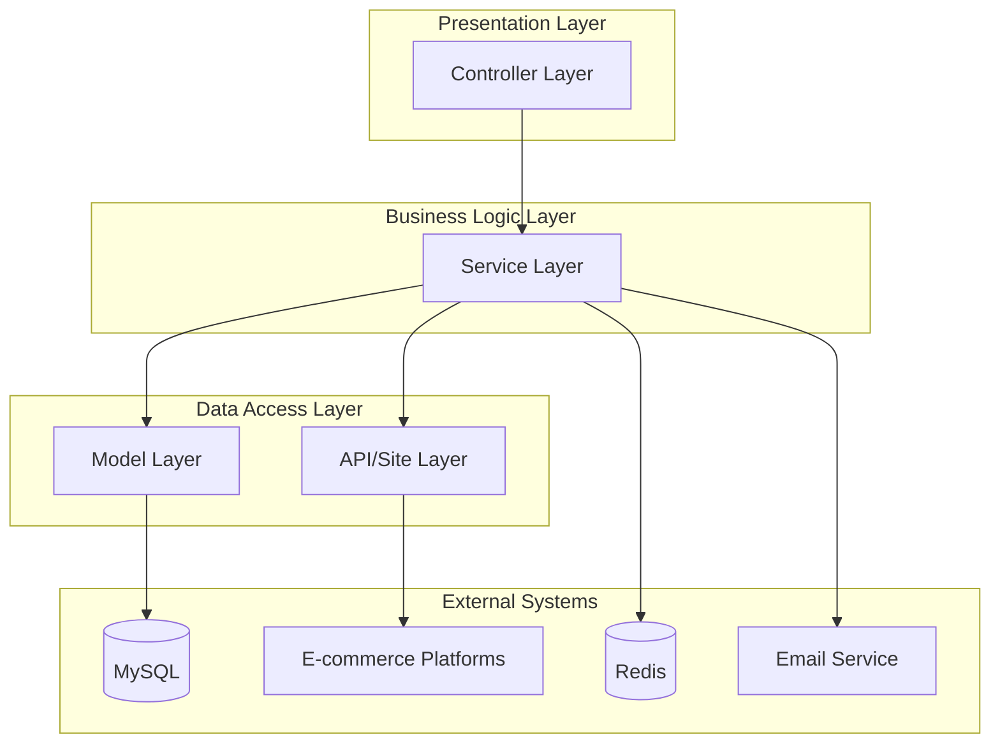

# Project Overview

<cite>
**Referenced Files in This Document**   
- [README.md](file://README.md)
- [package.json](file://package.json)
- [configuration.ts](file://src/configuration.ts)
- [const.ts](file://src/const.ts)
- [types.ts](file://src/types.ts)
- [goods.ts](file://src/controller/goods.ts)
- [goods.ts](file://src/service/goods.ts)
- [types.ts](file://src/model/types.ts)
- [base.ts](file://src/api/site/base.ts)
- [mercari/index.ts](file://src/api/site/mercari/index.ts)
- [yahoo/index.ts](file://src/api/site/yahoo/index.ts)
- [surugaya/index.ts](file://src/api/site/surugaya/index.ts)
- [config.default.ts](file://src/config/config.default.ts)
- [email.ts](file://src/service/email.ts)
</cite>

## Table of Contents
1. [Introduction](#introduction)
2. [Core Functionality](#core-functionality)
3. [Technology Stack](#technology-stack)
4. [Architectural Layers](#architectural-layers)
5. [Development and Deployment](#development-and-deployment)

## Introduction

The goods_hunter application is a backend monitoring system designed to track goods, prices, and availability across multiple Japanese e-commerce platforms including Mercari, Surugaya, Yahoo Auctions, Lashinbang, and Mandarake. The system enables users to automate product monitoring by setting up search conditions and schedules to detect new listings that match their criteria. When relevant items are found, the system can send email notifications to registered users. This tool is particularly useful for collectors, resellers, and enthusiasts who want to stay updated on specific products without manually checking multiple marketplaces.

**Section sources**
- [README.md](file://README.md#L1-L5)

## Core Functionality

The primary use cases of goods_hunter include automated product monitoring, scheduled scraping via cron jobs, proxy support for geo-restricted access, email notifications, and user authentication. Users can register watchers for specific products by defining search conditions such as keywords, categories, and price ranges. These watchers are scheduled using cron expressions, allowing flexible timing configurations. The system supports freezing periods during which no notifications are sent, useful for avoiding alerts during specific hours. Proxy support enables access to region-locked content, while email notifications keep users informed of new matches. User authentication ensures that each user's monitoring tasks are isolated and secure.

The application interacts with various e-commerce platforms through dedicated API modules that handle platform-specific request formats and response parsing. For example, the Mercari integration uses JWT authentication to access its search API, while Yahoo Auctions and Surugaya are scraped using HTML parsing with JSDOM due to the lack of public APIs. This modular approach allows for easy extension to additional platforms.

**Section sources**
- [const.ts](file://src/const.ts#L1-L12)
- [types.ts](file://src/types.ts#L1-L51)
- [goods.ts](file://src/controller/goods.ts#L1-L153)
- [goods.ts](file://src/service/goods.ts#L1-L66)

## Technology Stack

goods_hunter is built using a modern TypeScript stack centered around Midway.js, an Egg.js-based framework that provides dependency injection and modular architecture. The backend uses TypeORM for database operations with MySQL as the primary data store, while Redis is utilized for task scheduling and caching. HTTP requests are managed through Axios, with JSDOM enabling server-side DOM manipulation for scraping HTML-based marketplaces. Email notifications are delivered via Nodemailer, and cryptographic operations use CryptoJS. The system leverages cron for scheduling tasks, with configuration managed through environment-specific files. Testing is supported by Jest, and deployment is typically handled behind an nginx reverse proxy.

**Section sources**
- [package.json](file://package.json#L1-L92)
- [configuration.ts](file://src/configuration.ts#L1-L26)

## Architectural Layers

The application follows a clean architectural pattern with distinct layers: controller for HTTP request handling, service for business logic, model for data entities, and api/site for marketplace-specific scraping implementations. Controllers like GoodsController handle incoming HTTP requests and validate parameters before delegating to service classes. Services such as GoodsService and HunterRouteService contain the core business logic, coordinating between different components and enforcing access controls. Data models represent database entities using TypeORM decorators, with base interfaces defining common properties across different marketplace hunters. The api/site layer contains platform-specific implementations that extend a common base class, ensuring consistent interfaces while accommodating individual platform requirements.

This layered architecture promotes separation of concerns, making the codebase maintainable and extensible. Each marketplace (Mercari, Yahoo, Surugaya) has its own dedicated module within the api/site directory, containing both the scraping logic and type definitions. The service layer abstracts away the differences between platforms, providing a unified interface for the controllers to interact with.

**Diagram sources**
- [goods.ts](file://src/controller/goods.ts#L1-L153)
- [goods.ts](file://src/service/goods.ts#L1-L66)
- [types.ts](file://src/model/types.ts#L1-L21)
- [base.ts](file://src/api/site/base.ts#L1-L33)

**Section sources**
- [goods.ts](file://src/controller/goods.ts#L1-L153)
- [goods.ts](file://src/service/goods.ts#L1-L66)
- [types.ts](file://src/model/types.ts#L1-L21)
- [base.ts](file://src/api/site/base.ts#L1-L33)

## Development and Deployment

The development workflow for goods_hunter is configured with standard npm scripts for building, testing, and running the application. The project uses TypeScript with Midway.js decorators and follows a configuration-driven approach with environment-specific settings in config.default.ts, config.local.ts, and config.unittest.ts. Sensitive configuration data such as email credentials and API keys are stored in separate private JSON files that are excluded from version control. Testing is set up with Jest, and the project includes mock data for various marketplaces to facilitate testing without making actual HTTP requests.

Deployment typically involves building the TypeScript code and running it behind an nginx reverse proxy, which handles SSL termination and request routing. The application is designed to run as a long-lived service, with cron jobs persisting across restarts through Redis storage. The configuration includes default settings for Redis and MySQL connections, which can be overridden based on the deployment environment. Email notifications are configured through a dedicated email.json file that contains SMTP settings and sender information.

**Section sources**
- [config.default.ts](file://src/config/config.default.ts#L1-L103)
- [email.ts](file://src/service/email.ts#L1-L30)