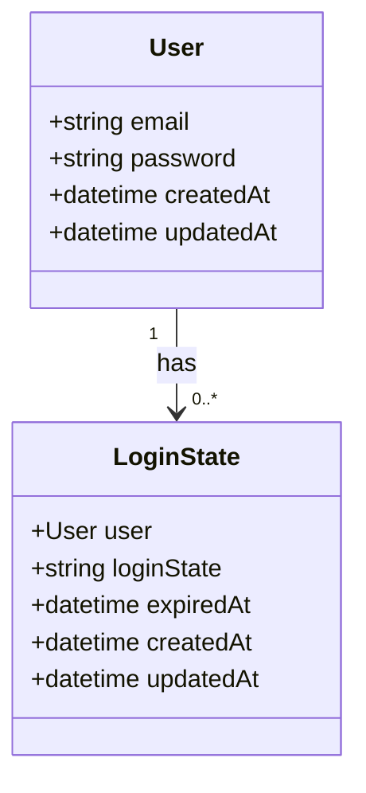
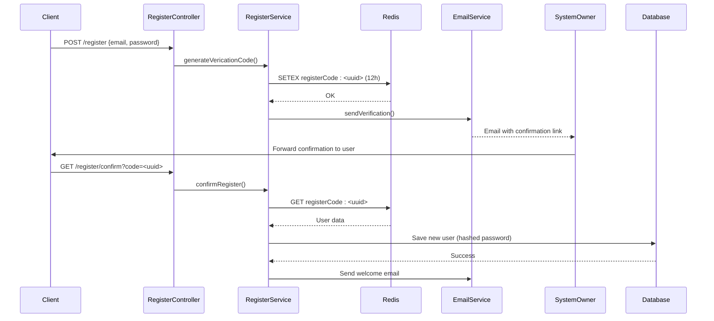
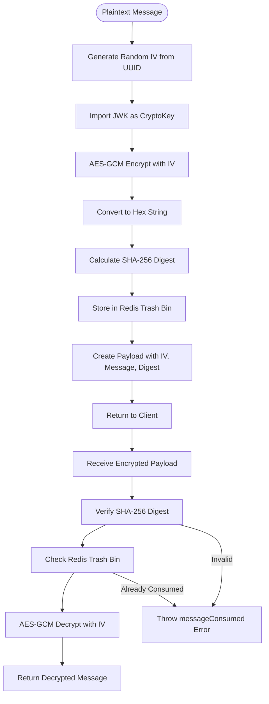
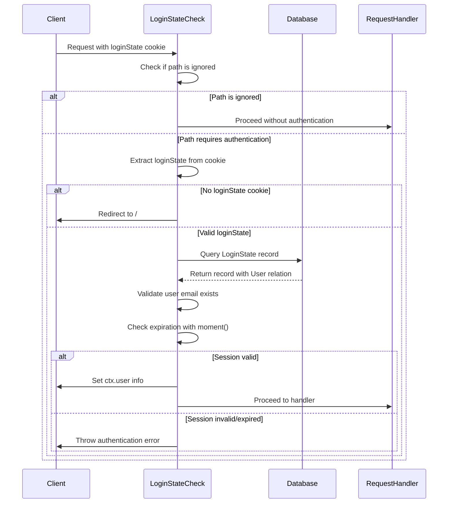

# Security Considerations

<cite>
**Referenced Files in This Document**   
- [cipher.ts](file://src/service/cipher.ts)
- [loginStateCheck.ts](file://src/middleware/loginStateCheck.ts)
- [loginState.ts](file://src/model/loginState.ts)
- [login.ts](file://src/service/login.ts)
- [register.ts](file://src/service/register.ts)
- [user.ts](file://src/model/user.ts)
- [config.default.ts](file://src/config/config.default.ts)
- [email.ts](file://src/service/email.ts)
- [errorCatch.ts](file://src/middleware/errorCatch.ts)
- [const.ts](file://src/const.ts)
- [errorCode.ts](file://src/errorCode.ts)
- [nginx.conf](file://external/nginx.conf)
</cite>

## Table of Contents
1. [Authentication Flow](#authentication-flow)
2. [Session Management](#session-management)
3. [Password Hashing and User Registration](#password-hashing-and-user-registration)
4. [Data Encryption and Secure Payload Handling](#data-encryption-and-secure-payload-handling)
5. [Secure Cookie Handling and Middleware Protection](#secure-cookie-handling-and-middleware-protection)
6. [Redis-Based Session State Storage](#redis-based-session-state-storage)
7. [External API Security and Input Validation](#external-api-security-and-input-validation)
8. [Error Handling and Information Leakage Prevention](#error-handling-and-information-leakage-prevention)
9. [Production Security Recommendations](#production-security-recommendations)

## Authentication Flow

The goods_hunter application implements a multi-step authentication flow that begins with user registration, proceeds through email verification, and concludes with secure login using session tokens. The process is orchestrated through dedicated controllers and services that enforce validation at each stage. During registration, user credentials are collected via the RegisterController and processed by the RegisterService, which generates a time-limited verification code stored in Redis. Upon successful verification, the user's password is hashed using SHA-256 before being persisted to the database. The login process, managed by LoginController and LoginService, validates credentials against the hashed password and generates a cryptographically secure login state token that is stored both in the database and returned to the client as a cookie.

**Section sources**
- [register.ts](file://src/service/register.ts#L1-L77)
- [login.ts](file://src/service/login.ts#L1-L48)
- [loginController.ts](file://src/controller/login.ts#L1-L38)
- [registerController.ts](file://src/controller/register.ts#L1-L44)

## Session Management

The application employs a robust session management system using a combination of database persistence and Redis caching. The LoginState model serves as the primary session store, maintaining a one-to-many relationship with the User entity. Each login session is represented by a unique UUID-based loginState token that is stored in the database with an expiration timestamp set to one week from creation. This token is transmitted to the client via HTTP-only cookies, preventing client-side JavaScript access. The system validates session integrity on each protected request by checking both the existence of the loginState in the database and its expiration status using moment.js for date comparison. This dual-layer validation ensures that expired sessions are promptly invalidated and cannot be reused.

**Diagram sources**
- [user.ts](file://src/model/user.ts#L1-L42)
- [loginState.ts](file://src/model/loginState.ts#L1-L22)

**Section sources**
- [loginState.ts](file://src/model/loginState.ts#L1-L22)
- [login.ts](file://src/service/login.ts#L1-L48)

## Password Hashing and User Registration

The application implements secure password hashing using the Crypto-JS library's SHA-256 algorithm, as evidenced in the login service implementation. During both registration and login, passwords are hashed client-side before transmission and re-hashed server-side for storage, providing an additional layer of security. The registration process incorporates a two-step verification mechanism where new users must confirm their email address through a time-limited verification code. These verification codes are generated using UUID v4 and stored in Redis with a 12-hour expiration period, preventing long-term exposure of registration tokens. The system also prevents duplicate accounts by checking for existing email addresses before creating new user records, with appropriate error handling to avoid information leakage about existing accounts.

**Diagram sources**
- [register.ts](file://src/service/register.ts#L1-L77)
- [login.ts](file://src/service/login.ts#L20-L35)

**Section sources**
- [register.ts](file://src/service/register.ts#L1-L77)
- [login.ts](file://src/service/login.ts#L20-L35)
- [email.ts](file://src/service/email.ts#L1-L30)

## Data Encryption and Secure Payload Handling

The application implements advanced data encryption using modern cryptographic standards through the CipherService. This service leverages the Web Crypto API's AES-GCM (Galois/Counter Mode) algorithm for symmetric encryption, providing both confidentiality and integrity protection. The encryption process uses a JWK (JSON Web Key) stored in a private configuration file, which is loaded at application startup and imported as a CryptoKey object. Each encryption operation generates a unique 12-byte initialization vector (IV) derived from UUID data, ensuring that identical plaintext messages produce different ciphertexts. The system also implements message integrity verification by calculating a SHA-256 hash of the encrypted payload data, which is compared during decryption to detect any tampering. Additionally, the service maintains a "trash bin" in Redis to track consumed messages and prevent replay attacks by rejecting previously processed encrypted payloads.

**Diagram sources**
- [cipher.ts](file://src/service/cipher.ts#L1-L117)

**Section sources**
- [cipher.ts](file://src/service/cipher.ts#L1-L117)
- [config.default.ts](file://src/config/config.default.ts#L70-L70)

## Secure Cookie Handling and Middleware Protection

The application implements comprehensive middleware-based authentication checks through the LoginStateCheck middleware, which protects all routes except for explicitly ignored paths. This middleware intercepts incoming requests and validates the presence and integrity of the loginState cookie before allowing access to protected resources. The system uses HTTP-only cookies to prevent client-side JavaScript access, reducing the risk of cross-site scripting (XSS) attacks. The middleware specifically excludes certain paths like "/proxy" and "/ignoreGood" from authentication checks, allowing for necessary functionality while maintaining security for sensitive operations. Error handling within the middleware is designed to provide minimal information to potential attackers, throwing generic error messages that are mapped to specific error codes without revealing implementation details. The system also automatically redirects unauthenticated users to the home page, ensuring a consistent user experience while enforcing access control.

**Diagram sources**
- [loginStateCheck.ts](file://src/middleware/loginStateCheck.ts#L1-L54)

**Section sources**
- [loginStateCheck.ts](file://src/middleware/loginStateCheck.ts#L1-L54)
- [const.ts](file://src/const.ts#L1-L12)

## Redis-Based Session State Storage

Redis plays a critical role in the application's security architecture by providing temporary, high-performance storage for time-sensitive data. The system uses Redis to store registration verification codes with a 12-hour expiration period, ensuring that these sensitive tokens are automatically removed from memory after their validity period. Additionally, Redis maintains a "cipher trash bin" set that tracks previously consumed encrypted messages, preventing replay attacks by rejecting duplicate message processing. The Redis configuration includes password authentication ("honmameiko") and is bound to localhost, minimizing the attack surface. The application establishes separate Redis connections for different features (general use and task scheduling), following the principle of least privilege. This strategic use of Redis enhances security by providing ephemeral storage for sensitive operations while keeping persistent session data in the primary database.

**Section sources**
- [register.ts](file://src/service/register.ts#L40-L44)
- [cipher.ts](file://src/service/cipher.ts#L60-L67)
- [config.default.ts](file://src/config/config.default.ts#L40-L47)

## External API Security and Input Validation

The application implements several security measures to protect against vulnerabilities in external API interactions and user input. While the current implementation disables CSRF protection (potentially acceptable for API-only applications), it compensates with strict input validation in both controller and service layers. All incoming requests are validated for required parameters, with appropriate error codes returned for invalid request bodies. The proxy functionality, which appears to handle image requests, includes validation for image URLs to prevent SSRF (Server-Side Request Forgery) attacks. The nginx configuration provides an additional security layer with gzip compression and proxy caching, while listening on a specific port (7070) and forwarding requests to the application server. The system also implements proper error handling that avoids leaking sensitive stack traces to clients, instead returning structured error responses with generic messages for production safety.

**Section sources**
- [errorCatch.ts](file://src/middleware/errorCatch.ts#L1-L51)
- [nginx.conf](file://external/nginx.conf#L72-L87)
- [errorCode.ts](file://src/errorCode.ts#L1-L75)

## Production Security Recommendations

For secure production deployment, several critical recommendations should be implemented beyond the current security measures. First, HTTPS enforcement is essential and should be configured at the nginx level with proper SSL/TLS certificates, ideally using modern protocols like TLS 1.2 or 1.3. The current configuration should be updated to include secure cookie attributes such as Secure, HttpOnly, and SameSite flags to protect against man-in-the-middle and cross-site request forgery attacks. Secret management should be improved by using environment variables or a dedicated secrets management service rather than file-based configuration, especially for sensitive credentials like database passwords and email service keys. Regular dependency audits should be conducted using tools like npm audit to identify and remediate known vulnerabilities in third-party packages. Additionally, the application should implement rate limiting to prevent brute force attacks on authentication endpoints, and consider adding multi-factor authentication for enhanced security. Finally, the hardcoded Redis password and other credentials in the configuration files should be moved to environment-specific configuration with proper access controls.

**Section sources**
- [config.default.ts](file://src/config/config.default.ts#L40-L47)
- [nginx.conf](file://external/nginx.conf#L1-L88)
- [config.default.ts](file://src/config/config.default.ts#L68-L72)