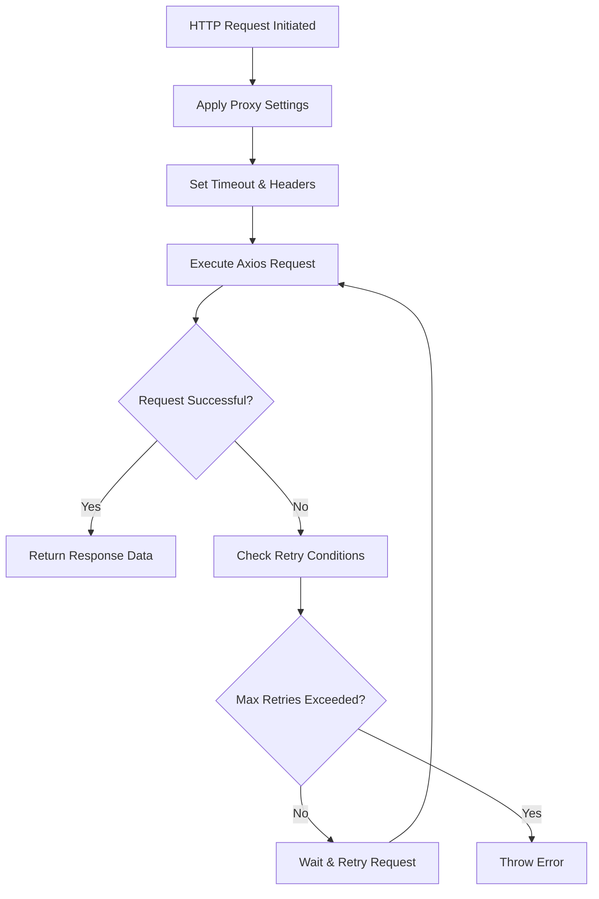
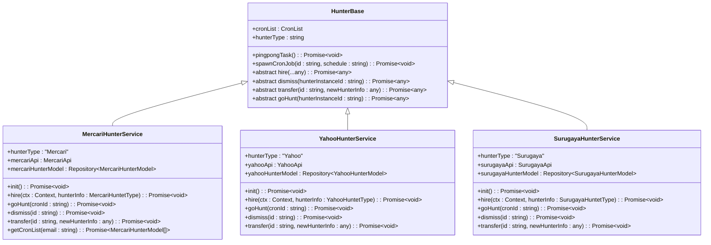

# Technology Stack & Dependencies

<cite>
**Referenced Files in This Document**   
- [package.json](file://package.json)
- [tsconfig.json](file://tsconfig.json)
- [configuration.ts](file://src/configuration.ts)
- [config.default.ts](file://src/config/config.default.ts)
- [config.local.ts](file://src/config/config.local.ts)
- [plugin.ts](file://src/config/plugin.ts)
- [goods.ts](file://src/service/goods.ts)
- [email.ts](file://src/service/email.ts)
- [base.ts](file://src/service/hunterArsenal/base.ts)
- [mercari.ts](file://src/service/hunterArsenal/mercari.ts)
- [index.ts](file://src/api/request/index.ts)
- [user.ts](file://src/model/user.ts)
- [jest.config.js](file://jest.config.js)
</cite>

## Table of Contents
1. [Core Frameworks](#core-frameworks)
2. [ORM & Database Integration](#orm--database-integration)
3. [Caching & Session Management](#caching--session-management)
4. [HTTP Client & Web Scraping](#http-client--web-scraping)
5. [Email Notification System](#email-notification-system)
6. [Task Scheduling](#task-scheduling)
7. [TypeScript & Code Quality](#typescript--code-quality)
8. [Environment Configuration](#environment-configuration)
9. [Testing Infrastructure](#testing-infrastructure)
10. [Dependency Management & Versioning](#dependency-management--versioning)

## Core Frameworks

The goods_hunter application is built on the Midway.js framework, a Node.js serverless-first solution developed by Alibaba Cloud. Midway.js provides a modular architecture with dependency injection, enabling clean separation of concerns and testable code. The framework leverages TypeScript decorators extensively for configuration and service registration.

Midway.js components such as `@midwayjs/web`, `@midwayjs/core`, and `@midwayjs/decorator` form the foundation of the application's backend structure. The framework's dependency injection system allows services to be injected into controllers and other services using the `@Inject()` decorator, promoting loose coupling and easier testing.

The application also integrates with Egg.js through `@midwayjs/bootstrap`, combining Midway's modern TypeScript features with Egg's robust middleware ecosystem. This hybrid approach enables the use of Egg's extensive plugin system while benefiting from Midway's type safety and modular design.

**Section sources**
- [package.json](file://package.json#L6-L14)
- [configuration.ts](file://src/configuration.ts#L4-L14)
- [plugin.ts](file://src/config/plugin.ts)

## ORM & Database Integration

The application uses TypeORM as its Object-Relational Mapping (ORM) solution, integrated through the `@midwayjs/orm` package. TypeORM provides a powerful and flexible way to interact with the MySQL database, allowing developers to work with database entities as TypeScript classes.

The configuration in `config.default.ts` specifies MySQL as the database type with connection details including host, port, username, password, and database name. TypeORM is configured to automatically synchronize the database schema with the entity definitions when `synchronize: true`, which is useful during development but should be carefully managed in production environments.

Entity models such as `User`, `MercariHunter`, `YahooHunter`, and others are defined using TypeORM decorators like `@EntityModel`, `@Column`, `@PrimaryColumn`, and `@OneToMany`. These decorators map class properties to database columns and define relationships between entities, enabling complex queries and data retrieval through the repository pattern.

**Section sources**
- [package.json](file://package.json#L11)
- [config.default.ts](file://src/config/config.default.ts#L85-L95)
- [user.ts](file://src/model/user.ts)
- [goods.ts](file://src/service/goods.ts#L6-L8)

## Caching & Session Management

Redis is used extensively throughout the application for caching and session management via the `@midwayjs/redis` package. The Redis configuration in `config.default.ts` specifies the connection details including port, host, password, and database index.

Redis serves multiple purposes in the application:
- Session storage for user authentication states
- Caching of frequently accessed data to improve performance
- Storage of user ignore lists (items users have marked to ignore)
- Coordination of distributed tasks and cron jobs

The application uses Redis sets (`smembers`) to store and retrieve user-specific ignore lists, allowing users to filter out items they're no longer interested in. The Redis service is injected into various components using the `@Inject("redis:redisService")` decorator, providing a consistent interface for Redis operations.

**Section sources**
- [package.json](file://package.json#L12)
- [config.default.ts](file://src/config/config.default.ts#L40-L47)
- [base.ts](file://src/service/hunterArsenal/base.ts#L3-L4)
- [mercari.ts](file://src/service/hunterArsenal/mercari.ts#L24-L25)

## HTTP Client & Web Scraping

The application uses Axios for HTTP requests, integrated through the `@midwayjs/axios` package. A custom HTTP client is implemented in `src/api/request/index.ts` that wraps Axios with additional functionality including proxy support, retry logic, and error handling.

Key features of the HTTP client implementation:
- Proxy support through `https-proxy-agent` for routing requests through specified proxies
- Retry mechanism using the `doThisUntilResolve` utility function for handling transient network failures
- Configurable timeout settings (5 seconds) to prevent hanging requests
- Support for both GET and POST requests with customizable headers and options

For web scraping functionality, the application uses JSDOM to parse HTML content from external sites like Mercari, Yahoo Auctions, and Surugaya. JSDOM provides a server-side DOM environment that allows the application to extract data from HTML pages using familiar DOM manipulation techniques.

**Diagram sources**
- [index.ts](file://src/api/request/index.ts)
- [package.json](file://package.json#L7)
- [doThisUntilResolve.ts](file://src/utils/doThisUntilResolve.ts)

**Section sources**
- [package.json](file://package.json#L7)
- [index.ts](file://src/api/request/index.ts)
- [doThisUntilResolve.ts](file://src/utils/doThisUntilResolve.ts)

## Email Notification System

The application uses Nodemailer for sending email alerts to users when new items matching their search criteria are found. The `EmailService` class implements a singleton pattern and is responsible for creating and managing the SMTP transport connection.

Email configuration is loaded from a JSON file (`email.json`) and includes credentials for the SMTP server, sender information, and recipient details. The service creates a pooled SMTP connection using the `smtps://` protocol for secure email transmission.

When a new item is found, the application renders an HTML email template using EJS, populates it with the relevant item data, and sends it to the user's registered email address. The email includes direct links to the items and instructions for ignoring specific items in the future.

**Section sources**
- [package.json](file://package.json#L28)
- [email.ts](file://src/service/email.ts)
- [config.default.ts](file://src/config/config.default.ts#L68)

## Task Scheduling

The application uses the `cron` package to schedule periodic tasks for monitoring e-commerce sites. The cron configuration in `config.default.ts` specifies Redis as the backend for storing job metadata, enabling persistence and coordination across application restarts.

Each user's search tasks are implemented as cron jobs with configurable schedules (e.g., "0 */1 * * * *" for every minute). The `HunterBase` class provides a foundation for all hunter services, including methods for spawning, stopping, and monitoring cron jobs.

The application implements a self-healing mechanism through the `pingpongTask` method, which periodically checks the status of all running cron jobs and restarts any that have terminated unexpectedly. This ensures reliable monitoring even in the face of temporary failures.

**Diagram sources**
- [base.ts](file://src/service/hunterArsenal/base.ts)
- [mercari.ts](file://src/service/hunterArsenal/mercari.ts)

**Section sources**
- [package.json](file://package.json#L15)
- [base.ts](file://src/service/hunterArsenal/base.ts)
- [mercari.ts](file://src/service/hunterArsenal/mercari.ts)

## TypeScript & Code Quality

The application is built with TypeScript, leveraging its strict typing system to enhance code quality and maintainability. The `tsconfig.json` file configures the TypeScript compiler with several strict options:

- `"noImplicitAny": true` - Prevents implicit any types, requiring explicit type declarations
- `"noImplicitThis": true` - Ensures this is properly typed in all contexts
- `"strictNullChecks": true` - Enables strict null checking
- `"experimentalDecorators": true` - Allows the use of decorators for dependency injection
- `"emitDecoratorMetadata": true` - Emits metadata for decorators, required for dependency injection

These strict settings help catch type-related errors at compile time rather than runtime, reducing bugs and improving code reliability. The application also uses TypeScript interfaces and types extensively to define data structures and API contracts.

**Section sources**
- [tsconfig.json](file://tsconfig.json)
- [types.ts](file://src/types.ts)

## Environment Configuration

The application uses Midway's configuration system to manage environment-specific settings through multiple configuration files: `config.default.ts`, `config.local.ts`, and `config.unittest.ts`. This layered approach allows for default settings to be overridden based on the current environment.

The `configuration.ts` file imports these configuration files and registers them with the Midway framework using the `importConfigs` option. This enables the application to load the appropriate configuration based on the `NODE_ENV` environment variable.

Key configuration aspects:
- Database connection settings
- Redis connection details
- Email server credentials
- Server host information
- Security settings (CSRF protection disabled in local environment)
- CORS configuration allowing all origins

The configuration system also loads sensitive information (email credentials, API keys, etc.) from external JSON files stored in the `private` directory, keeping secrets out of version control.

**Section sources**
- [configuration.ts](file://src/configuration.ts#L1-L19)
- [config.default.ts](file://src/config/config.default.ts)
- [config.local.ts](file://src/config/config.local.ts)

## Testing Infrastructure

The application uses Jest as its testing framework, configured through `jest.config.js`. The testing setup includes:
- `ts-jest` for compiling TypeScript files during testing
- Node.js test environment
- Setup files configured in `setupFilesAfterEnv`
- Code coverage reporting

Development dependencies include `@midwayjs/mock` for testing Midway.js applications, `@types/jest` for TypeScript type definitions, and `ts-jest` for TypeScript support in Jest. The application also includes test files for controllers, such as `api.test.ts` and `home.test.ts`, demonstrating a commitment to test-driven development.

The testing infrastructure supports both unit and integration testing, allowing developers to verify the correctness of individual components as well as their interactions within the larger system.

**Section sources**
- [package.json](file://package.json#L33-L57)
- [jest.config.js](file://jest.config.js)

## Dependency Management & Versioning

The application's dependencies are carefully managed through npm, with clear separation between production and development dependencies. Key considerations for dependency management include:

- **Version Compatibility**: Most Midway.js components use version 3.0.0, ensuring compatibility across the framework
- **Security**: Sensitive packages like `crypto-js` are used for encryption and data protection
- **Utility Libraries**: Lodash is used for common data manipulation tasks
- **Date/Time Handling**: Moment.js is used for date formatting and manipulation
- **Unique Identifiers**: UUID is used for generating unique identifiers for cron jobs and other entities

When updating dependencies, special attention should be paid to:
- Breaking changes in major version updates
- Compatibility between Midway.js components
- Potential security vulnerabilities in transitive dependencies
- Impact on TypeScript type definitions

The application's use of semantic versioning (with caret ranges) allows for safe updates to patch and minor versions while preventing unexpected breaking changes from major version updates.

**Section sources**
- [package.json](file://package.json)
- [tsconfig.json](file://tsconfig.json)
- [configuration.ts](file://src/configuration.ts)